# Règles de présentation{#presentation-rules}

## Création d&#39;une règle de présentation {#creating-a-presentation-rule}

Dans votre base, vous disposez de plusieurs offres de voyages pour l&#39;Europe, l&#39;Afrique, les Etats-Unis et le Canada. Vous souhaitez proposer des offres de voyage pour le Canada mais si un destinataire devait refuser ce type d&#39;offre, vous ne voulez pas lui reproposer.

Vous allez donc paramétrer votre règle de façon à ne proposer de voyages au Canada qu&#39;une seule fois à un destinataire et à ne pas lui reproposer s&#39;il l&#39;a déjà refusé.

1. Dans l&#39;arborescence Adobe Campaign, positionnez-vous au niveau du noeud **[!UICONTROL Administration]** > **[!UICONTROL Gestion de campagnes]** > **[!UICONTROL Gestion des typologies]** > **[!UICONTROL Règles de typologie]**.
1. Créez une nouvelle règle de type **[!UICONTROL Présentation des offres]**.

   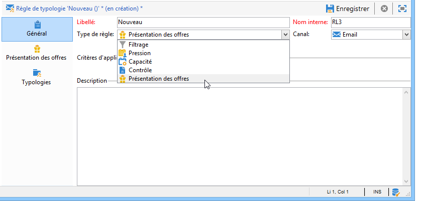

1. Modifiez son libellé et sa description si nécessaire.

   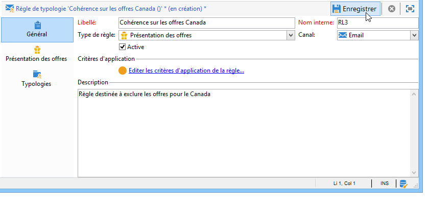

1. Sélectionnez l&#39;option **[!UICONTROL Tous les canaux]** afin que la règle ne se limite pas à un seul canal.

   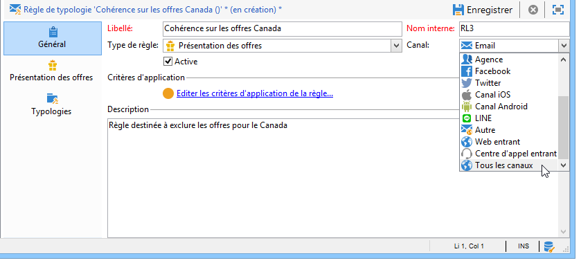

1. Cliquez sur le lien **[!UICONTROL Critères d&#39;application de la règle]** et choisissez le noeud **[!UICONTROL Catégorie]** comme expression.

   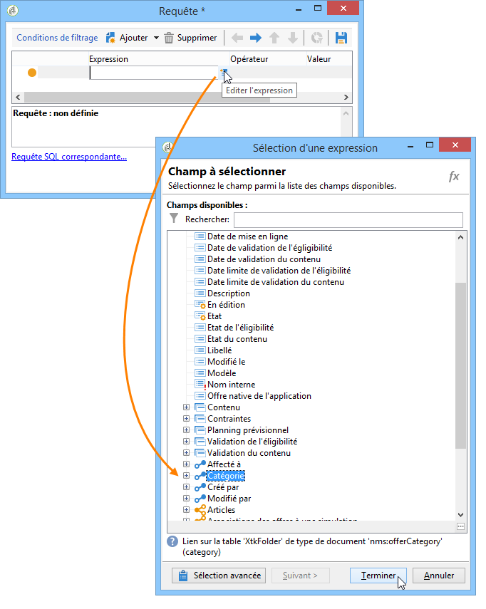

1. Sélectionnez la catégorie correspondant à vos offres de voyage pour le Canada puis cliquez sur **[!UICONTROL OK]** pour fermer la fenêtre de requête.

   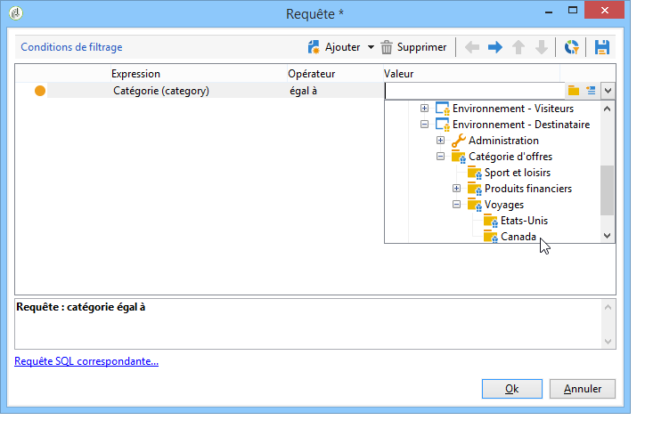

1. Dans l&#39;onglet **[!UICONTROL Présentation des offres]**, sélectionnez les mêmes dimensions que celles paramétrées au niveau de l&#39;environnement.

   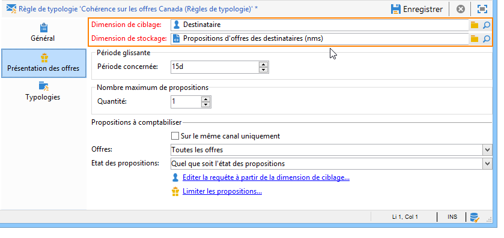

1. Indiquez la période pendant laquelle la règle doit s&#39;appliquer.

   

1. Limitez la proposition à une occurrence afin que les destinataires qui ont déjà refusé un voyage au Canada ne reçoivent pas à nouveau une proposition similaire.

   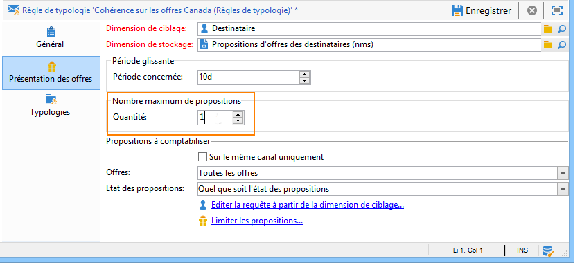

1. Sélectionnez le filtre **[!UICONTROL Les offres de la même catégorie]** afin d&#39;exclure toute offre provenant de la catégorie **Canada**.

   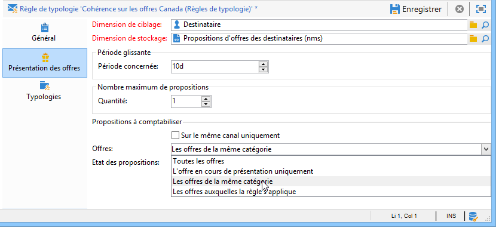

1. Sélectionnez le filtre **[!UICONTROL Propositions refusées]** afin de ne prendre en compte que les propositions refusées par le destinataire.

   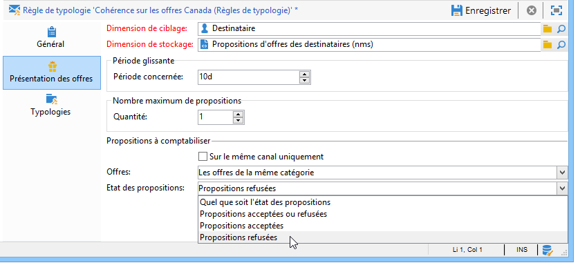

1. Choisissez les destinataires pour lesquels la règle doit s&#39;appliquer.

   Dans notre exemple, nous choisissons les destinataires **Grands voyageurs**.

   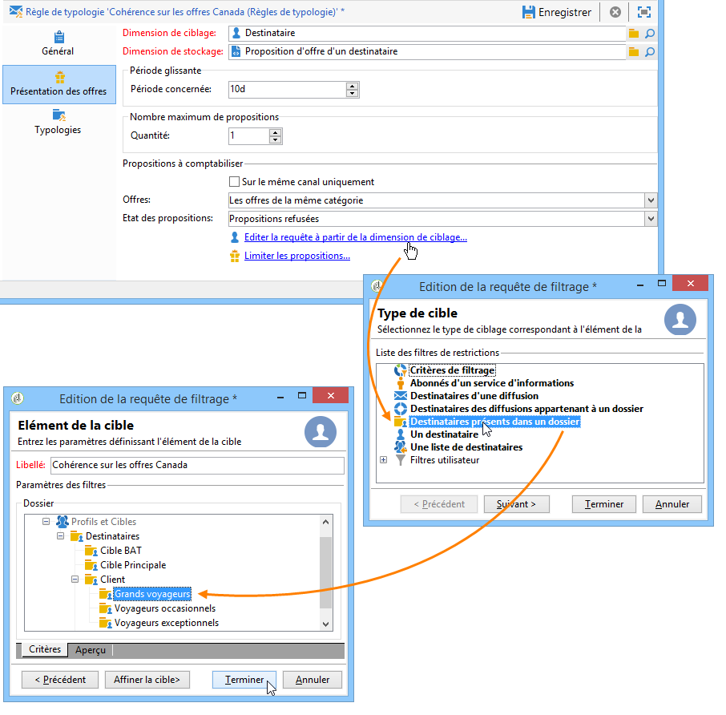

1. Référencez votre règle dans une typologie propre aux offres.

   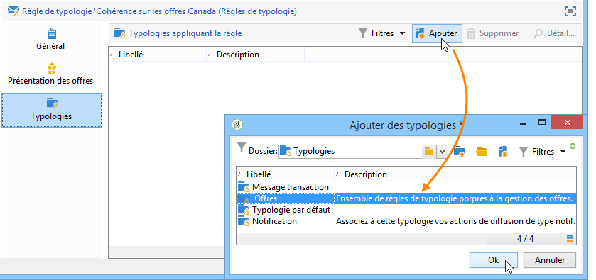

1. Positionnez-vous au niveau de votre environnement d&#39;offres, soit **Environnement - Destinataire** dans notre exemple, et référencez la typologie que vous venez de créer à l&#39;aide de la liste déroulante de l&#39;onglet **[!UICONTROL Eligibilité]**.

   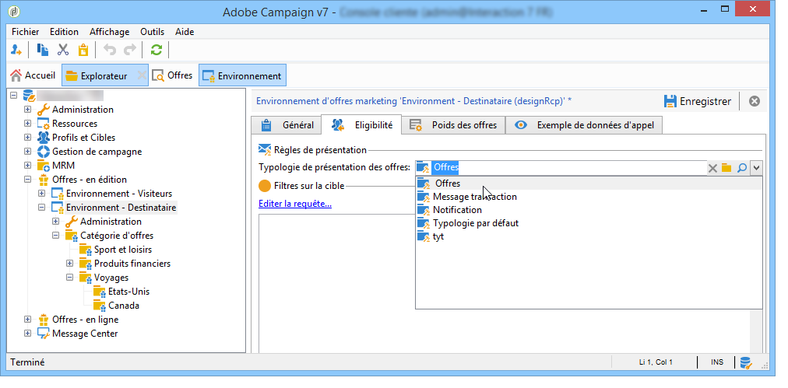

## Application de la règle de présentation {#applying-the-presentation-rule}

Voici un exemple d&#39;application de la règle de typologie créée précédemment.

Vous allez faire une première proposition d&#39;offre appartenant, entre autre, à la catégorie de voyages pour le Canada. Si l&#39;offre est refusée par un des destinataires une première fois, elle n&#39;est pas reproposée au destinataire qui l&#39;a refusée.

1. Dans le dossier de destinataires **Grands voyageurs**, sélectionnez un des profils pour vérifier les offres auxquelles il est éligible : cliquez sur l&#39;onglet **[!UICONTROL Propositions]**, puis le sous-onglet **[!UICONTROL Prévisualisation]**.

   Dans notre exemple, le destinataire **Nicolas Lumos** est éligible à une offre qui fait partie de la catégorie **Canada**.

   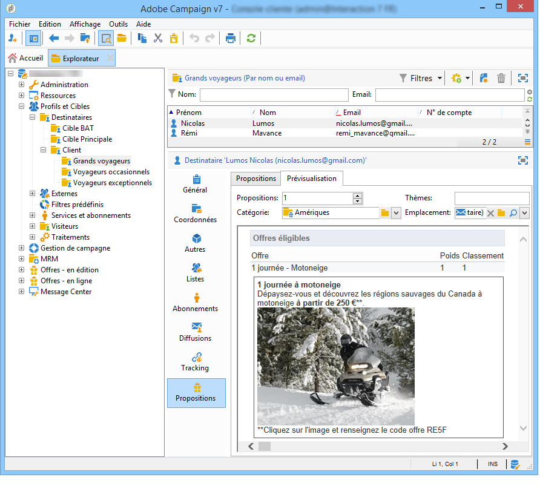

1. Créez une première diffusion email destinée à cibler vos destinataires **Grands voyageurs** avec des offres.
1. Choisissez les paramètres d&#39;appels au moteur d&#39;offres.

   Dans notre exemple la catégorie **Amériques** est choisie, sachant qu&#39;elle contient les sous-catégories **Canada** et **Etats-Unis**.

   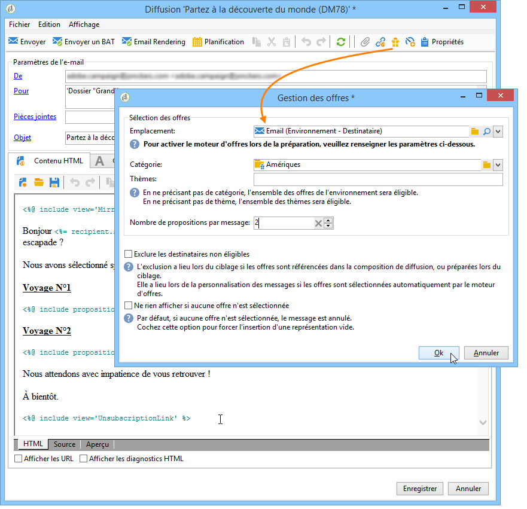

1. Insérez vos offres dans le corps du message et envoyez la diffusion. Voir à ce sujet la section [À propos des canaux sortants](../../interaction/using/about-outbound-channels.md).

   Votre destinataire a bien reçu l&#39;offre pour laquelle il est éligible.

1. Le destinataire a refusé l&#39;offre pour le Canada, comme indiqué dans l&#39;historique de ses propositions.

   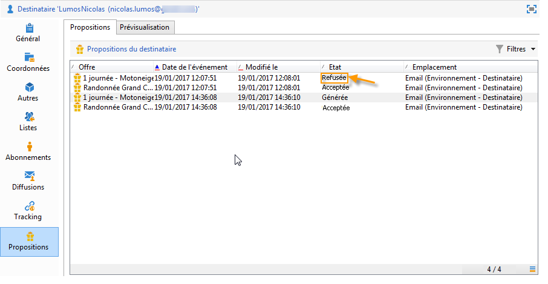

1. Vérifiez les offres auxquelles il est désormais éligible.

   Vous constatez qu&#39;aucune offre sur le Canada n&#39;est retenue.

   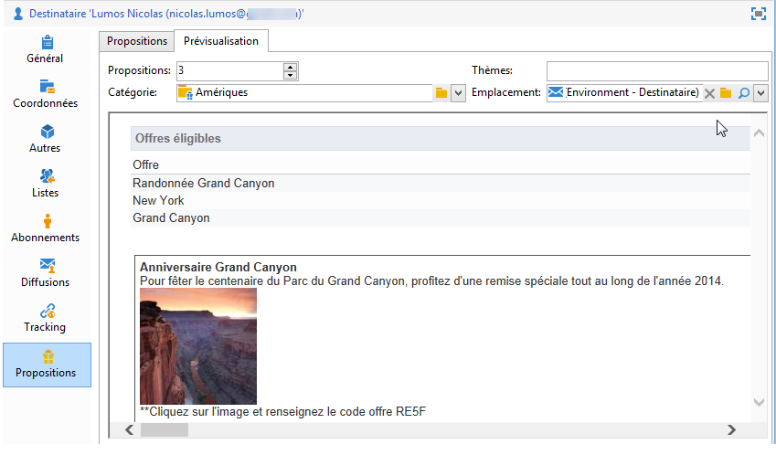
