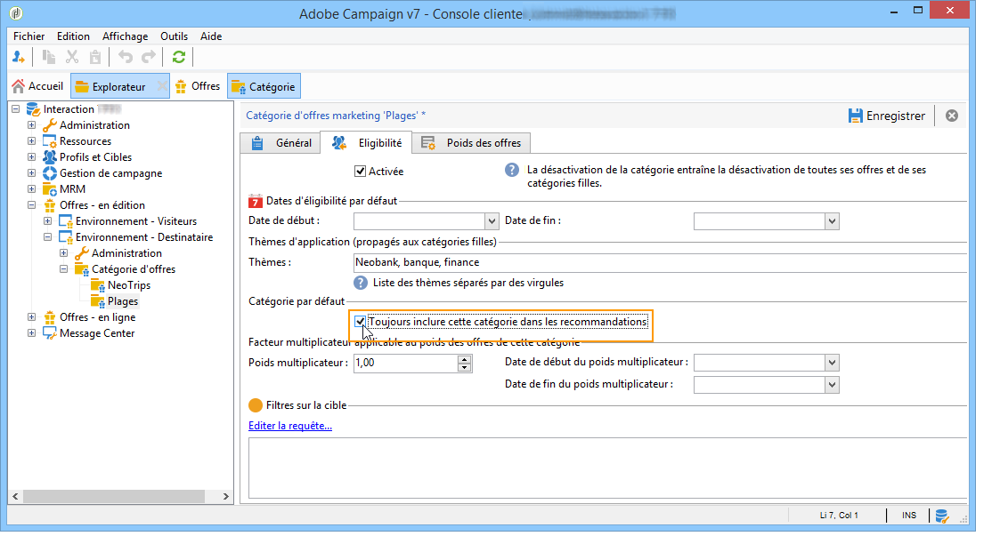

# Recommandation d&#39;une catégorie{#recommending-a-category}

Il peut arriver qu&#39;un destinataire soit considéré comme non éligible à toutes les offres. Afin de s&#39;assurer que tous les destinataires reçoivent une proposition d&#39;offre, il est possible d&#39;ajouter systématiquement une ou plusieurs catégories d&#39;offres dans les recommandations. Contrairement aux offres principales, ces offres de &quot;secours&quot; doivent avoir un poids faible (mais non nul), pour n&#39;être prises en compte qu&#39;en cas de non éligibilité aux offres de poids fort. De plus, aucune règle de présentation ne doit s&#39;appliquer à ces offres afin qu&#39;elles soient toujours incluses dans les recommandations. Lors d&#39;une proposition, si aucune offre de poids fort n&#39;est éligible, le destinataire se verra proposer au moins une offre issue de cette catégorie.

Pour toujours inclure une catégorie dans les recommandations, suivez les étapes ci-dessous :

1. Ouvrez l&#39;explorateur et cliquez sur un catalogue d&#39;offres de votre arborescence.
1. Cliquez sur l&#39;onglet **[!UICONTROL Eligibilité]** et cochez la case **[!UICONTROL Toujours inclure cette catégorie dans les recommandations]**.
1. Validez en cliquant sur **[!UICONTROL Enregistrer]**.

   
