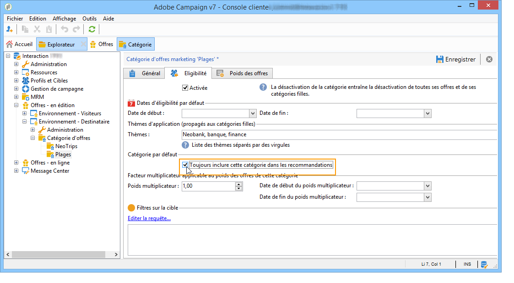

# Recommandation d&#39;une catégorie{#recommending-a-category}

Il se peut qu’un destinataire ne soit pas considéré comme éligible à toutes les offres. Afin de s&#39;assurer que tous les destinataires reçoivent une proposition d&#39;offre, il est possible d&#39;ajouter systématiquement une ou plusieurs catégories d&#39;offres dans les recommandations. Contrairement aux offres principales, ces offres « secondaires » doivent avoir un poids faible (mais pas nul), de sorte qu’elles ne sont prises en compte que si aucune offre de poids élevé n’est éligible. En outre, aucune règle de présentation ne doit être appliquée à ces offres pour assurer qu&#39;elles sont toujours incluses dans les recommandations. Cela signifie que, lors d&#39;une proposition, si aucune offre de poids élevé n&#39;est disponible, le destinataire recevra au moins une offre de cette catégorie.

Pour toujours inclure une catégorie dans les recommandations, suivez les étapes ci-dessous :

1. Ouvrez l&#39;explorateur et cliquez sur un catalogue d&#39;offres de votre arborescence.
1. Cliquez sur l&#39;onglet **[!UICONTROL Eligibilité]** et cochez la case **[!UICONTROL Toujours inclure cette catégorie dans les recommandations]**.
1. Validez en cliquant sur **[!UICONTROL Enregistrer]**.

   
