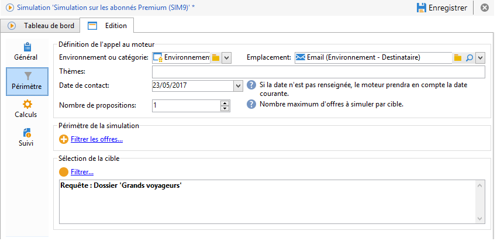
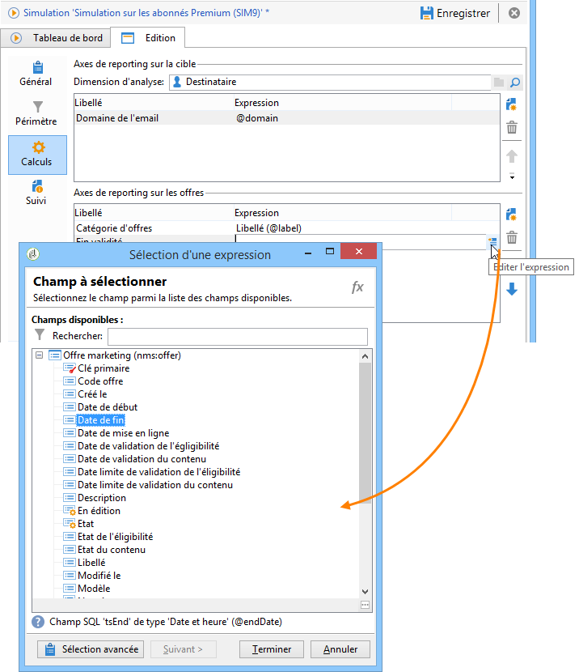

# Périmètre de la simulation{#simulation-scope}

## Définition du périmètre {#definition-of-the-scope}

Positionnez-vous dans l&#39;onglet **[!UICONTROL Périmètre]** pour choisir vos paramètres.

Vous devez définir obligatoirement :

* Un environnement ou une catégorie d&#39;offres.
* Un emplacement.
* Une date de contact. Les offres non éligigibles à la date de contact spécifiée ne sont pas prises en compte.
* Une population cible.

   Si vous ne précisez pas de filtre sur votre cible, la totalité de la table des destinataires sera prise en compte dans la simulation.

* Le nombre de propositions à simuler par cible.

   Le destinataire recevra autant de propositions que le nombre fixé. Par exemple, si le chiffre est de 5, chaque personne ciblée recevra au plus 5 propositions d&#39;offre.

   

Pour affiner les offres à prendre en compte pour la simulation, vous pouvez ajouter un ou plusieurs thèmes (définis préalablement au niveau des catégories).

Vous pouvez également choisir d&#39;effectuer la simulation sur toutes les offres ou seulement sur celles en ligne. Des filtres vous permettent d&#39;ajuster votre sélection si vous le souhaitez.

>[!NOTE]
>
>Vous devez obligatoirement spécifier une date de contact. Ceci permet au moteur d&#39;interaction d&#39;effectuer un premier tri parmi la totalité des offres contenues dans l&#39;environnement ou la catégorie sélectionné(e). Si aucune date n&#39;est paramétrée, la simulation se termine en erreur.

## Ajout d&#39;axes de reporting {#adding-reporting-axes}

Vous pouvez enrichir l&#39;analyse de la simulation en ajoutant des axes de reporting sur la cible ou les offres elles-mêmes depuis l&#39;onglet **[!UICONTROL Calculs]**.

Pour cela, cliquez sur le bouton **[!UICONTROL Ajouter]** et sélectionnez les champs voulus. Les axes seront utilisés pour le calcul de la simulation et apparaîtront dans le rapport d&#39;analyse. Pour plus d’informations, consultez [Enregistrement du tracking](../../interaction/using/simulation-tracking.md).

