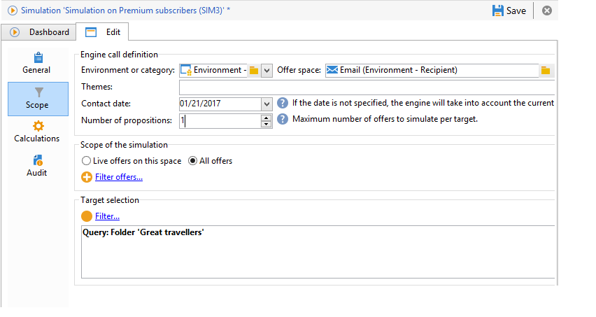
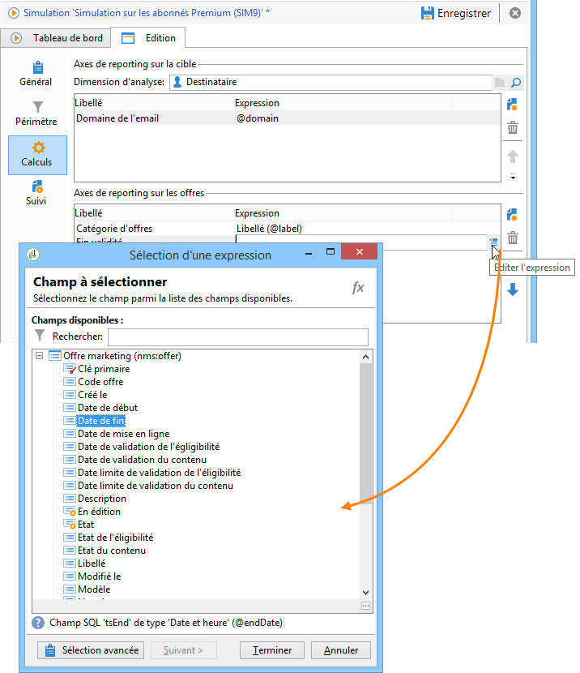

# Périmètre de la simulation{#simulation-scope}

## Définition du périmètre {#definition-of-the-scope}

Positionnez-vous dans l&#39;onglet **[!UICONTROL Périmètre]** pour choisir vos paramètres.

Vous devez définir obligatoirement :

* Un environnement ou une catégorie d&#39;offres.
* Un emplacement.
* Date de contact. Les offres non éligibles à la date de contact ne sont pas prises en compte.
* Une population cible.

  Si vous ne précisez pas de filtre sur votre cible, la totalité de la table des destinataires sera prise en compte dans la simulation.

* Le nombre de propositions à simuler par cible.

  Le destinataire recevra cette multitude de propositions. Par exemple, si vous saisissez 5, chaque destinataire recevra un maximum de 5 propositions d&#39;offre.

  

Pour affiner les offres à prendre en compte pour la simulation, vous pouvez ajouter un ou plusieurs thèmes (définis préalablement au niveau des catégories).

Vous pouvez également choisir d&#39;effectuer la simulation sur toutes les offres ou uniquement celles qui sont en ligne. Certains filtres vous permettent de modifier votre sélection si vous le souhaitez.

>[!NOTE]
>
>Vous devez indiquer une date de contact. Cela permet au moteur d&#39;interaction de trier les offres dans l&#39;environnement ou la catégorie sélectionnée. Si aucune date n’est configurée, la simulation génère une erreur.

## Ajout d&#39;axes de reporting {#adding-reporting-axes}

Vous pouvez enrichir l&#39;analyse de la simulation en ajoutant des axes de reporting sur la cible ou les offres elles-mêmes depuis l&#39;onglet **[!UICONTROL Calculs]**.

Pour cela, cliquez sur le bouton **[!UICONTROL Ajouter]** et choisissez les champs adéquats. Les axes seront utilisés pour calculer la simulation et seront affichés dans le rapport d&#39;analyse. Pour plus d&#39;informations, consultez la section [Suivi des simulations](../../interaction/using/simulation-tracking.md).

