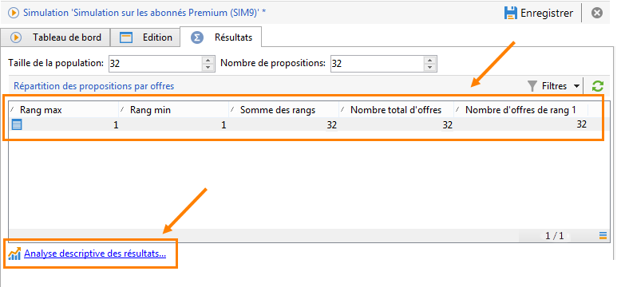
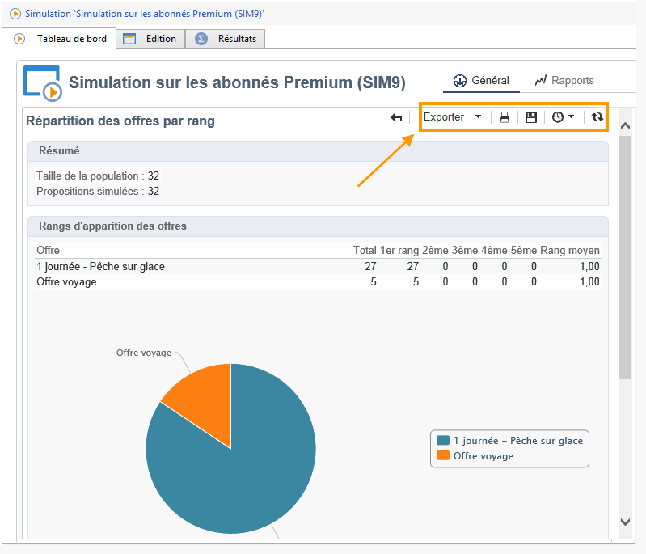

# Suivi des simulations{#simulation-tracking}

Une fois la simulation effectuée, vous pouvez analyser son résultat depuis l&#39;onglet **[!UICONTROL Résultats]** qui s&#39;ajoute dans la fenêtre de simulation et le rapport **[!UICONTROL Répartition des offres par rang]** disponible depuis le tableau de bord de la simulation.

Les résultats de la simulation consistent en la répartition des propositions par rang et par personnes ciblées. S&#39;ils ont été paramétrés, les axes de reporting sont également pris en compte et affichés dans cet onglet.

Vous pouvez conserver ces résultats et les exporter si nécessaire en créant un rapport d&#39;analyse descriptive. Pour cela, cliquez sur le lien disponible dans la fenêtre des résultats.

Pour plus d’informations sur l’assistant d’analyse descriptive, reportez-vous à [cette section](../../reporting/using/about-descriptive-analysis.md) .

D&#39;autre part, un tableau croisé dynamique permet de visualiser rapidement la répartition des offres par rang. Comme tout rapport dans Adobe Campaign, il peut être exporté, imprimé, historisé ou affiché dans un navigateur web.

Voir à ce propos [cette section](../../reporting/using/actions-on-reports.md).

