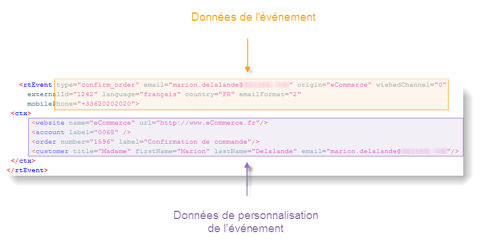
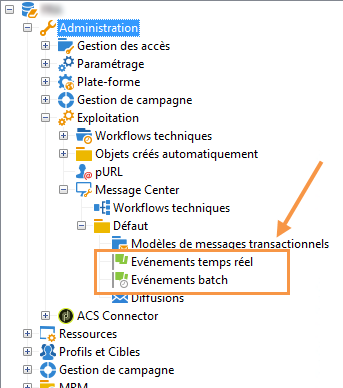
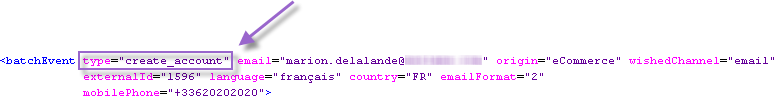
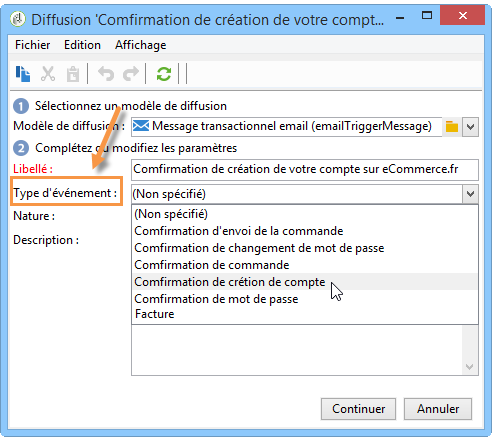

# Traitement des événements {#about-event-processing}

Dans le contexte des messages transactionnels, un événement est généré par un système d&#39;informations externe et envoyé à Adobe Campaign via les méthodes **[!UICONTROL PushEvent]** et **[!UICONTROL PushEvents]** (voir [Description des événements](../../message-center/using/event-description.md)).

Cet événement contient des données liées à l&#39;événement, telles que son [type](../../message-center/using/creating-event-types.md) (confirmation de commande, création de compte sur un site web, etc.), son adresse e-mail ou son numéro de mobile, ainsi que d&#39;autres informations permettant d&#39;enrichir et de personnaliser le message transactionnel avant sa diffusion (informations de contact du client, langue du message, format de l&#39;e-mail, etc.).

Exemple de données d&#39;un événement :

## Étapes de traitement des événements {#event-processing}

Pour traiter les événements de message transactionnel, les étapes suivantes sont appliquées sur la ou les instances d&#39;exécution :

1. [Collecte des événements](#event-collection)
1. [Acheminement de l&#39;événement vers un modèle de message](#routing-towards-a-template)
1. Enrichissement de l&#39;événement avec des données de personnalisation
1. [Exécution de la diffusion](../../message-center/using/delivery-execution.md)
1. [Recyclage des événements](#event-recycling) dont la diffusion associée a échoué (via un workflow Adobe Campaign)

Une fois toutes les étapes ci-dessus effectuées via l&#39;instance d&#39;exécution, chaque destinataire ciblé reçoit un message personnalisé.

>[!NOTE]
>
>Pour plus d&#39;informations sur les instances de message transactionnel, voir [Architecture des messages transactionnels](../../message-center/using/transactional-messaging-architecture.md).

## Collecte des événements {#event-collection}

Les événements générés par le système d&#39;information peuvent être collectés selon deux modes :

* Les appels aux méthodes SOAP vous permettent d&#39;effectuer une transmission de type push des événements dans Adobe Campaign : la méthode PushEvent permet d&#39;envoyer un événement à la fois, la méthode PushEvents, plusieurs événements à la fois. Voir à ce propos [Description des événements](../../message-center/using/event-description.md).

* La réalisation d&#39;un workflow permet de récupérer les événements par import de fichier ou via une passerelle SQL (avec l&#39;option [Federated Data Access](../../installation/using/about-fda.md)).

Une fois collectés, les événements sont scindés par workflows techniques entre les files d&#39;attente en temps réel et par lot de la ou des instances d&#39;exécution, tout en attentant d&#39;être associés à un modèle de message.

>[!NOTE]
>
>Sur les instances d&#39;exécution, les dossiers **[!UICONTROL Événements en temps réel]** ou **[!UICONTROL Événements par lots]** ne doivent pas être définis comme des vues, car cela pourrait entraîner des problèmes de droit d&#39;accès. Pour plus d&#39;informations sur la définition d&#39;un dossier en tant que vue, consultez [cette section](../../platform/using/access-management-folders.md).

## Acheminement vers un modèle {#routing-towards-a-template}

Une fois le modèle de message publié sur la ou les instances d&#39;exécution, deux modèles sont automatiquement générés : l&#39;un à associer à un événement temps réel, l&#39;autre à un événement batch.

L&#39;étape de routage consiste à associer un événement au modèle de message approprié, en fonction des éléments suivants :

* Type d&#39;événement spécifié dans les propriétés de l&#39;événement lui-même :

  

* Type d&#39;événement spécifié dans les propriétés du modèle de message :

  

Par défaut, le routage s&#39;appuie sur les informations suivantes :

* Le type d&#39;événement
* Le canal à utiliser (email par défaut)
* Le modèle de diffusion le plus récent, selon la date de publication

## Statuts des événements {#event-statuses}

La variable **Historique des événements**, sous **[!UICONTROL Message Center]** > **[!UICONTROL Historique des événements]** , regroupe tous les événements traités dans une seule vue. Ils peuvent être classés par type d’événement ou par **status**. Ces états sont les suivants :

* **En attente** : l&#39;événement peut être :

   * Un événement qui vient d’être collecté et qui n’a pas encore été traité. La colonne **[!UICONTROL Nombre d’erreurs]** affiche la valeur 0. Le modèle d’e-mail n’a pas encore été lié.
   * Un événement traité, mais dont la confirmation est erronée. La colonne **[!UICONTROL Nombre d’erreurs]** affiche une valeur différente de 0. Pour savoir quand cet événement sera traité à nouveau, consultez la colonne **[!UICONTROL Traitement demandé le]**.

* **En attente de diffusion** : l&#39;événement a été traité et le modèle de diffusion est associé. L&#39;e-mail est en attente de diffusion et le processus de diffusion classique est appliqué. Pour plus d&#39;informations, vous pouvez ouvrir la diffusion.
* **Envoyé**, **Ignoré** et **Erreur de diffusion** : ces statuts de diffusion sont récupérés par le workflow **updateEventsStatus** qui collecte les statuts des diffusions. Pour plus de détails, vous pouvez ouvrir la diffusion concernée.
* **Événement non pris en charge** : la phase de routage des messages transactionnels a échoué. Par exemple, Adobe Campaign n&#39;a pas trouvé l&#39;e-mail qui sert de modèle pour l&#39;événement.
* **Evénement expiré** : le nombre maximum de tentatives d&#39;envoi a été atteint. L&#39;événement est considéré comme nul.

## Recyclage de l&#39;événement {#event-recycling}

Si l&#39;envoi d&#39;un message sur un canal spécifique échoue, Adobe Campaign peut renvoyer le message en utilisant un autre canal. Par exemple, si l&#39;envoi d&#39;un message sur le canal SMS échoue, le message est renvoyé en utilisant le canal email.

Pour cela, vous devez paramétrer un workflow qui recrée tous les événements dont le statut est **Erreur de diffusion**, et leur assigner un canal différent de celui utilisé précédemment.

>[!CAUTION]
>
>Cette étape ne peut être réalisée qu&#39;à l&#39;aide d&#39;un workflow et est donc réservée à des utilisateurs experts. Pour plus d&#39;informations, veuillez contacter votre chargé de compte Adobe.