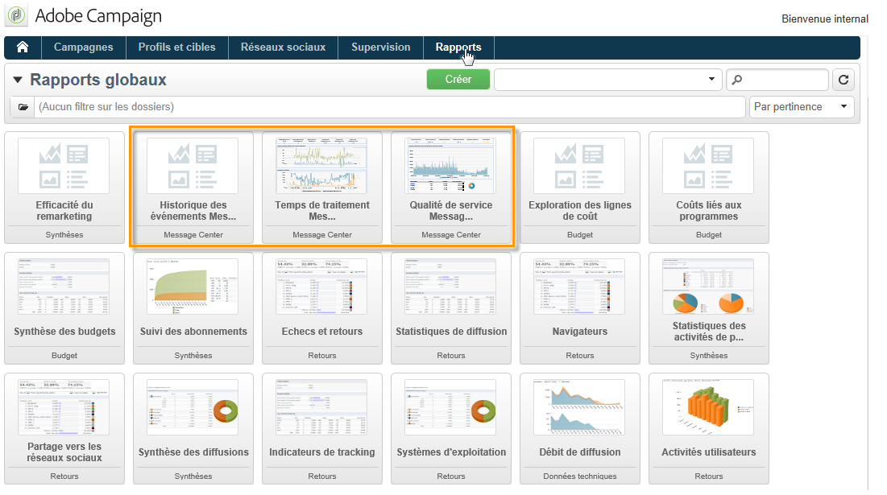

# A propos des rapports des messages transactionnels{#about-transactional-messaging-reports}

Adobe Campaign propose plusieurs rapports qui vous permettent de contrôler l’activité et le bon fonctionnement des instances d’exécution. Ces rapports du Centre de messages sont accessibles à partir de l’ **[!UICONTROL Reports]** onglet de l’instance de contrôle.

