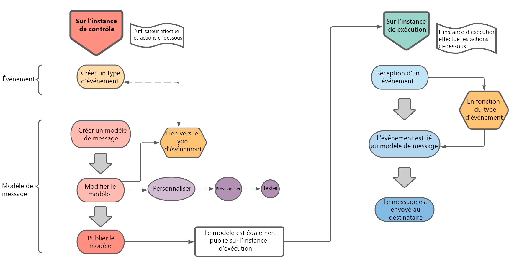

# Prise en main des messages transactionnels {#about-transactional-messaging}

## Vue d&#39;ensemble {#overview}

**Messages transactionnels** (Message Center) est un module de Campaign conçu pour gérer les notifications de trigger personnalisées générées à partir d&#39;événements envoyés par un système d&#39;informations externe.

Un message transactionnel est une communication individuelle et unique envoyée en temps réel à un utilisateur par un prestataire tel qu&#39;un site web. Il est particulièrement attendu, car il contient des informations importantes que le destinataire souhaite vérifier ou confirmer.

Les fonctionnalités des messages transactionnels sont conçues pour prendre en charge l&#39;évolutivité et fournir un service 24h/24 et 7j/7.

* **Quand doit-il être envoyé ?** Ce message contenant des informations importantes, l&#39;utilisateur s&#39;attend à ce qu&#39;il soit envoyé en temps réel. Le délai entre le déclenchement de l&#39;événement et l&#39;arrivée du message doit donc être très court.

* **Pourquoi est-ce important ?** En général, un message transactionnel bénéficie d&#39;un taux d&#39;ouverture élevé. Il doit donc être soigneusement conçu, car il peut avoir un impact important sur le comportement des clients dans la mesure où il définit la relation client.

* **Par exemple ?** Il peut s&#39;agir d&#39;un message de bienvenue après la création d&#39;un compte, d&#39;une confirmation qu&#39;une commande a été expédiée, d&#39;une facture, d&#39;un message confirmant un changement de mot de passe ou d&#39;une notification après qu&#39;un client a consulté votre site web, d&#39;une communication sur l&#39;indisponibilité de produits, d&#39;un relevé de compte, etc.

>[!IMPORTANT]
>
>Les messages transactionnels nécessitent une licence spécifique. Veuillez vérifier votre contrat de licence.

<!--Before starting with transactional messaging, make sure you read the corresponding [best practices and limitations]().-->

## Principe de fonctionnement des messages transactionnels {#transactional-messaging-operating-principle}

Le module de messages transactionnels Adobe Campaign s&#39;intègre dans un système d&#39;informations qui renvoie les événements à transformer en messages transactionnels personnalisés. Ces messages peuvent être envoyés individuellement ou par lots via e-mail, SMS ou notifications push.

Cette fonctionnalité repose sur une architecture spécifique, où l&#39;**instance d&#39;exécution** est séparée de l&#39;**instance de pilotage**. Cette distribution garantit une disponibilité accrue et une meilleure gestion de la charge. Voir à ce propos [Architecture des messages transactionnels](../../message-center/using/transactional-messaging-architecture.md).

>[!NOTE]
>
>Pour créer des utilisateurs pour les instances d&#39;exécution Message Center hébergées sur Adobe Cloud, vous devez contacter l&#39;[Assistance clientèle d&#39;Adobe](https://helpx.adobe.com/fr/enterprise/admin-guide.html/enterprise/using/support-for-experience-cloud.ug.html). Les utilisateurs de Message Center sont des opérateurs spécifiques qui ont besoin d&#39;autorisations dédiées pour accéder aux dossiers **[!UICONTROL Evénements temps réel (nmsRtEvent)]**.

Le processus global de messagerie transactionnelle peut être décrit comme suit :

Par exemple, imaginez que vous êtes une société disposant d&#39;un site web sur lequel vos clients peuvent acheter des produits.

Adobe Campaign vous permet d’envoyer un email de notification aux clients qui ont ajouté des produits à leur panier. Lorsque l&#39;un d&#39;eux quitte votre site web sans passer par ses achats (événement externe qui déclenche un événement Campaign), un email d&#39;abandon de panier lui est automatiquement envoyé (diffusion de message transactionnel).

Les principales étapes de mise en place de ce système sont décrites ci-dessous dans [cette section](#key-steps).

>[!NOTE]
>
>Adobe Campaign donne la priorité au traitement des messages transactionnels par rapport à toute autre diffusion.

## Principales étapes {#key-steps}

Les principales étapes de création et de gestion des messages transactionnels personnalisés dans Adobe Campaign sont résumées ci-dessous.

### Étapes à effectuer sur l&#39;instance de pilotage

Sur l’**instance de pilotage**, vous devez effectuer les actions suivantes :

1. [Créer un type d&#39;événement](../../message-center/using/creating-event-types.md).
1. [Créer et concevoir le modèle de message](../../message-center/using/creating-the-message-template.md). Vous devez associer un événement à votre message au cours de cette étape.
1. [Tester le message](../../message-center/using/testing-message-templates.md).
1. [Publier le modèle de message](../../message-center/using/publishing-message-templates.md).

>[!NOTE]
>
>Toutes les étapes ci-dessus sont effectuées sur l&#39;**instance de pilotage**. La publication du modèle sur l&#39;instance de pilotage le publiera également sur toutes les **instances d&#39;exécution**. Pour plus d&#39;informations sur les instances de message transactionnel, voir [Architecture des messages transactionnels](../../message-center/using/transactional-messaging-architecture.md).

### Traitement des événements sur l&#39;instance d&#39;exécution

Une fois que vous avez conçu et publié le modèle de message transactionnel, si un événement correspondant est déclenché, les principales étapes ci-dessous sont effectuées sur l&#39;**instance d&#39;exécution** :

1. Lorsque l&#39;événement est généré par le système d&#39;informations externe, les données pertinentes sont envoyées à Campaign via les méthodes **PushEvent** et **PushEvents**. Voir [Collecte des événements](../../message-center/using/about-event-processing.md#event-collection).
1. L&#39;événement est associé au modèle de message approprié. Voir [Acheminement vers un modèle](../../message-center/using/about-event-processing.md#routing-towards-a-template).
1. Une fois l&#39;étape d&#39;enrichissement terminée, la diffusion est envoyée. Voir [Exécution de la diffusion](../../message-center/using/delivery-execution.md). Chaque destinataire ciblé reçoit un message personnalisé.

## Rubriques connexes : {#related-topics}

* [Prise en main des canaux de communication](../../delivery/using/communication-channels.md)
* [Étapes clés de création de diffusion](../../delivery/using/steps-about-delivery-creation-steps.md)
* [Architecture des messages transactionnels](../../message-center/using/transactional-messaging-architecture.md)
* [Accès aux rapports des messages transactionnels](../../message-center/using/about-transactional-messaging-reports.md)
