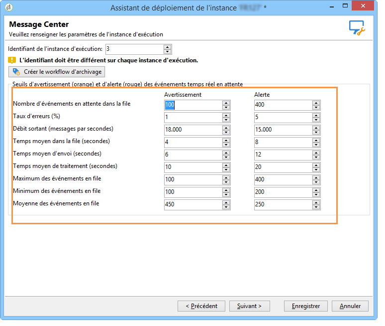
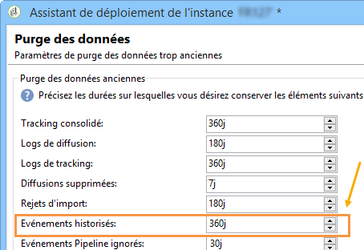
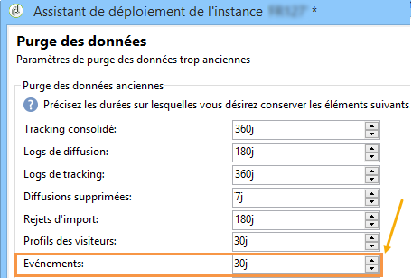
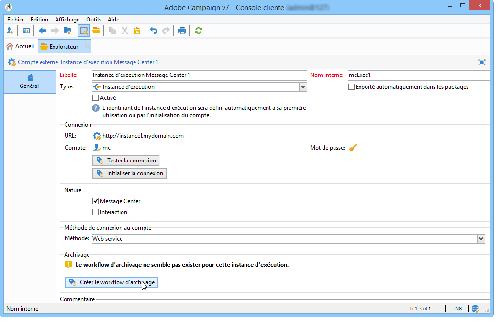
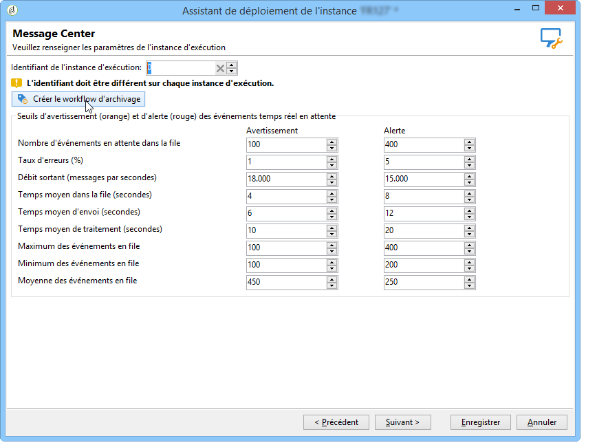

# Configurations supplémentaires {#mc-additional-configurations}


## Surveillance des seuils {#monitoring-thresholds}

Vous pouvez configurer les seuils d&#39;avertissement (orange) et d&#39;alerte (rouge) des indicateurs qui apparaissent dans les rapports **Qualité de service Message Center** et **Temps de traitement Message Center** (voir la section [Accès aux rapports des messages transactionnels](../../message-center/using/about-transactional-messaging-reports.md)).

Pour ce faire, procédez comme suit :

1. Ouvrez l&#39;assistant de déploiement sur l&#39;**instance d&#39;exécution**.

1. Accédez à la page **[!UICONTROL Message Center]**.

1. Utilisez les flèches pour modifier les seuils.

   

>[!NOTE]
>
>Le nombre d&#39;événements en attente dans la file est affiché dans la section [Indicateurs système](../../production/using/monitoring-processes.md#system-indicators) de la page de suivi des processus Adobe Campaign. Pour plus d&#39;informations sur l&#39;assistant de déploiement, consultez [cette section](../../installation/using/deploying-an-instance.md#deployment-wizard).

## Purge des événements {#purging-events}

Vous pouvez utiliser l&#39;[assistant de déploiement](../../production/using/database-cleanup-workflow.md#deployment-wizard) pour configurer la durée pendant laquelle vous souhaitez conserver les événements en base dans la base de données.

La purge des événements est effectuée automatiquement par le workflow [](../../production/using/database-cleanup-workflow.md)Nettoyage de la base. Ce workflow purge les événements reçus et stockés sur les instances d&#39;exécution et des événements archivés sur une instance de pilotage.

Pour modifier les paramètres de purge, utilisez la flèche ascendante et descendante.

Paramètres de purge des événements sur une instance de pilotage :



Paramètres de purge des événements sur une instance d&#39;exécution :



Pour plus d&#39;informations sur le workflow de nettoyage de la base, consultez [cette section](../../production/using/database-cleanup-workflow.md).


## Workflows techniques {#technical-workflows}

Vous devez vous assurer que les workflows techniques de l&#39;instance de pilotage et des différentes instances d&#39;exécution sont bien créés et démarrés avant de procéder au déploiement des modèles de messages transactionnels.

Les différents workflows techniques associés aux messages transactionnels (Message Center) sont répartis entre l&#39;instance de pilotage et la ou les instances d&#39;exécution.

### Workflows de l&#39;instance de pilotage {#control-instance-workflows}

Sur l&#39;instance de pilotage, qu&#39;une ou plusieurs instances d&#39;exécution soient enregistrées, vous devez créer un workflow d&#39;archivage pour chaque compte externe d&#39;**[!UICONTROL instance d&#39;exécution Message Center]**. Cliquez sur le bouton **[!UICONTROL Créer le workflow d&#39;archivage]** pour créer et démarrer le processus.



Ces workflows sont ensuite accessibles à partir du dossier **Administration > Production > Message Center**. Une fois créés, les workflows d&#39;archivage sont automatiquement démarrés.

<!--**Minimal architecture**

Once the control and execution modules are installed on the same instance, you must create the archiving workflow using the deployment wizard. Click the **[!UICONTROL Create the archiving workflow]** button to create and start the workflow.

-->

### Workflows de l&#39;instance d&#39;exécution {#execution-instance-workflows}

Sur la ou les instances d&#39;exécution, les workflows techniques des messages transactionnels sont accessibles depuis le dossier **Administration > Exploitation > Message Center**. Vous devez simplement les démarrer. La liste des workflows est la suivante :

* **[!UICONTROL Traitement des événements batch]** (nom interne : **[!UICONTROL batchEventsProcessing]**) : ce workflow permet de répartir les événements batch dans une file d&#39;attente avant qu&#39;ils ne soient associés à un modèle de message.
* **[!UICONTROL Traitement des événements temps réel]** (nom interne : **[!UICONTROL rtEventsProcessing]**) : ce workflow permet de répartir les événements temps réel dans une file d&#39;attente avant qu&#39;ils ne soient associés à un modèle de message.
* **[!UICONTROL Mise à jour du statut des événements]** (nom interne : **[!UICONTROL updateEventsStatus]**) : ce workflow permet d&#39;attribuer un statut à l&#39;événement.

   Les statuts d&#39;un événement sont les suivants :

   * **[!UICONTROL En attente]** : l&#39;événement se trouve dans la file d&#39;attente. Aucun modèle de message ne lui a encore été associé.
   * **[!UICONTROL En attente de diffusion]** : l&#39;événement est dans la file d&#39;attente, un modèle de message lui a été associé et il est en cours de traitement par la diffusion.
   * **[!UICONTROL Envoyé]** : ce statut est copié depuis les logs de diffusion. Il signifie que la diffusion a été envoyée.
   * **[!UICONTROL Ignoré par la diffusion]** : ce statut est copié depuis les logs de diffusion. Il signifie que la diffusion a été ignorée.
   * **[!UICONTROL Erreur de diffusion]** : ce statut est copié depuis les logs de diffusion. Il signifie que la diffusion a échoué.
   * **[!UICONTROL Evénement non pris en charge]** : l&#39;association de l&#39;événement à un modèle de message a échoué. L&#39;événement ne sera pas retraité.

## Configuration du multibranding {#configuring-multibranding}

Cette section présente une solution pour configurer le tracking et les URL de page miroir par marque pour les messages transactionnels dans Adobe Campaign.

### Conditions préalables requises {#prerequisites}

* Tous les hôtes doivent être ajoutés au fichier de configuration de l&#39;instance (`config-<instance>.xml`).
* Un sous-domaine doit être affecté à chaque marque.
* Si le tracking web est réalisé sur les pages HTTPS, vous devez disposer d&#39;un certificat HTTPS pour chacune des marques.

Pour configurer le multibranding, vous devez configurer les instances d&#39;exécution et l&#39;instance de pilotage.

### Instance d&#39;exécution {#execution-instance}

Sur la ou les instances d&#39;exécution, procédez comme suit :

1. Créez un compte externe par marque.

   >[!NOTE]
   >
   >Découvrez comment créer un compte externe de type instance d&#39;exécution dans [cette section](../../message-center/using/configuring-instances.md#control-instance).

1. Étendez le schéma nms:extAccount pour ajouter l&#39;URL de tracking :

   ```
   <attribute advanced="true" desc="URL of the tracking servers" label="Tracking server URL"
   length="100" name="trackingURL" type="string"/>
   ```

   >[!NOTE]
   >
   >Découvrez comment étendre un schéma existant dans la section [Extension d&#39;un schéma](../../configuration/using/extending-a-schema.md).

1. Modifiez le formulaire nms:extAccount :

   ```
   <container label="Message domain branding" type="frame">
        <static type="help"> These parameters are used to override the DNS alias and addresses used during message delivery. When not populated, the values of the 'NmsServer_MirrorPageUrl' and 'NmsEmail_DefaultErrorAddr' options are used.</static>
        <input xpath="@mirrorURL"/>
        <input xpath="@trackingURL"/>
        <input img="nms:sendemail.png" menuId="deliveryMenuBuilder" type="scriptEdit">
               xpath="errorAddress"/>
      </container>
   ```

1. Modifiez les options NmsTracking_OpenFormula et NmsTracking_ClickFormula afin d&#39;utiliser le compte externe au lieu d&#39;une option globale.

   Pour cela, remplacez :

   ```
   <%@ include option='NmsTracking_ServerUrl' %>
   ```

   par :

   ```
   <%@ value object="provider" xpath="@trackingURL" %>
   ```

   >[!IMPORTANT]
   >
   >Ces modifications peuvent entraîner des conflits lors de la mise à niveau. Vous devrez peut-être fusionner manuellement ces formules avec leur nouvelle version.

### Instance de pilotage {#control-instance}

Sur l&#39;instance de pilotage, vous devez lier les modèles de diffusion et les comptes externes.

Pour ce faire, procédez comme suit :

1. Créez un compte externe par marque avec le même nom interne que celui défini sur l&#39;[instance d&#39;exécution](#execution-instance) (étape 1).

1. Créez un modèle de diffusion par défaut par marque.

   >[!NOTE]
   >
   >    Découvrez comment créer un modèle de diffusion dans [cette section](../../delivery/using/creating-a-delivery-template.md#creating-a-new-template).

1. Dans les **[!UICONTROL Propriétés]** du modèle de diffusion, définissez le routage sur le compte externe de la marque.
