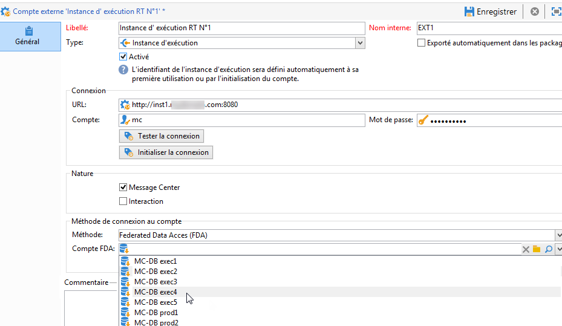
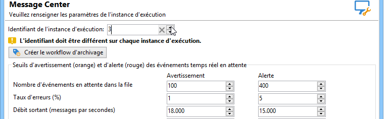
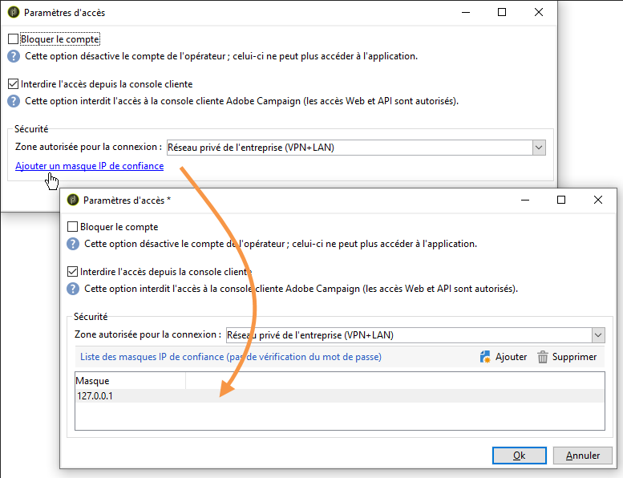
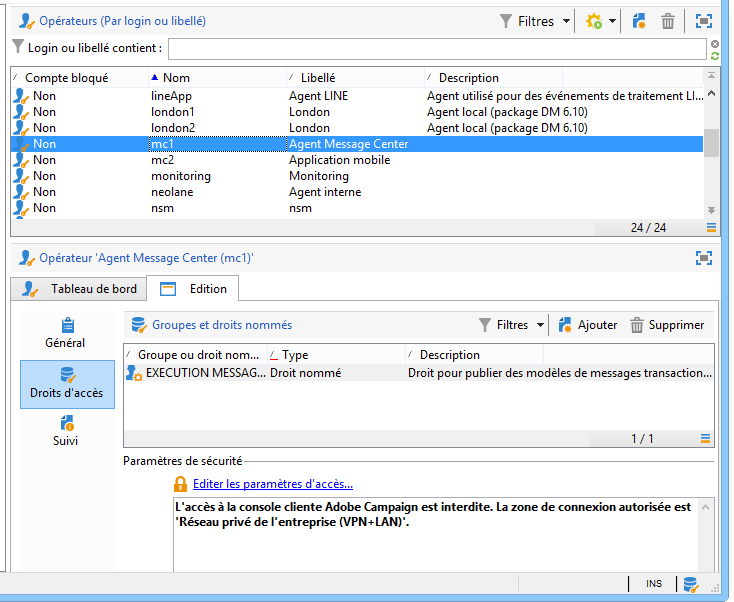

# Configuration des instances {#creating-a-shared-connection}

Pour utiliser les fonctionnalités des messages transactionnels, vous devez configurer les instances de pilotage et d&#39;exécution. Vous pouvez utiliser :
* [Une instance de pilotage](#control-instance) associée à une ou plusieurs instances d&#39;exécution
* [Plusieurs instances de pilotage](#using-several-control-instances) associées à plusieurs instances d&#39;exécution

>[!IMPORTANT]
>
>Les extensions de schéma qui ont eu un impact sur les ressources utilisés par les [workflows techniques de Message Center](../../message-center/using/additional-configurations.md#technical-workflows) sur les instances de pilotage ou d&#39;exécution doivent être dupliquées sur les autres instances utilisées par le module des messages transactionnels.

Vous devez également spécifier et connecter la ou les instances d&#39;exécution aux instances de pilotage.

Toutes les étapes nécessaires pour configurer et connecter les instances de pilotage et d&#39;exécution sont décrites dans cette section.

>[!IMPORTANT]
>
>L&#39;instance de pilotage et la ou les instance(s) d&#39;exécution doivent être installées sur des machines différentes. Elles ne peuvent pas partager la même instance Campaign.

## Configuration de l&#39;instance de pilotage {#control-instance}

Pour connecter l&#39;instance de pilotage et les instances d&#39;exécution, vous devez d&#39;abord créer et configurer un compte externe de type **[!UICONTROL Instance d&#39;exécution]** **sur l&#39;instance de pilotage**. Par conséquent, une fois [publiés](../../message-center/using/publishing-message-templates.md#template-publication), les modèles de messages transactionnels peuvent être déployés sur les instances d&#39;exécution.

Si vous utilisez plusieurs instances d&#39;exécution, vous devez créer autant de comptes externes que d&#39;instances d&#39;exécution.

>[!NOTE]
>
>Lorsque des instances d&#39;exécution sont utilisées par plusieurs instances de pilotage, les données peuvent être divisées par dossier et par opérateur. Pour plus d&#39;informations, consultez la section [Utilisation de plusieurs instances de pilotage](#using-several-control-instances).

### Créer un compte externe

>[!NOTE]
>
>Les étapes ci-dessous doivent être exécutées **sur l&#39;instance de pilotage**.

Procédez comme suit pour créer un compte externe de type **[!UICONTROL instance d&#39;exécution]** :

1. Positionnez-vous au niveau du dossier **[!UICONTROL Administration > Plateforme > Comptes externes]**.
1. Sélectionnez un des comptes externes de type instance d&#39;exécution fournis d&#39;usine par Adobe Campaign avec le bouton droit de la souris et choisissez **[!UICONTROL Dupliquer]** dans le menu contextuel .

   

1. Modifiez le libellé selon vos besoins.

   

1. Sélectionnez l&#39;option **[!UICONTROL Activé]** afin que le compte externe soit opérationnel.

   

1. Indiquez l&#39;adresse du serveur sur lequel est installée l&#39;instance d&#39;exécution.

   

1. Le compte doit correspondre à l&#39;Agent Message Center tel qu&#39;il est défini dans le dossier des opérateurs. Par défaut, le compte fourni d&#39;usine par Adobe Campaign est **[!UICONTROL mc]** .

   

1. Entrez le mot de passe du compte tel qu&#39;il a été défini dans le dossier des opérateurs.

   >[!NOTE]
   >
   >Pour ne pas avoir à saisir de mot de passe lors de la connexion à l&#39;instance, vous pouvez spécifier l&#39;adresse IP de l&#39;instance de pilotage dans l&#39;instance d&#39;exécution. Pour plus d&#39;informations, consultez la section [Configuration de la ou des instances d&#39;exécution](#execution-instance).

1. Indiquez la méthode de récupération qui doit être utilisée par l&#39;instance d&#39;exécution. Les données à récupérer sont transmises par l&#39;instance d&#39;exécution à l&#39;instance de pilotage, afin d&#39;enrichir les historiques des messages transactionnels et des événements.

   

   La collecte des données s&#39;effectue soit par un service Web qui utilise un accès en HTTP/HTTPS, soit via le module Federated Data Access (FDA).

   >[!NOTE]
   >
   >Veuillez noter que lors de l&#39;utilisation de FDA sur HTTP, seules les instances d&#39;exécution utilisant une base de données PostgreSQL sont prises en charge. Les bases de données MSSQL ou Oracle ne sont pas prises en charge.

   La seconde méthode (FDA) est recommandée si l&#39;instance de pilotage a un accès direct à la base de données des instances d&#39;exécution. Dans le cas contraire, choisissez l&#39;accès au service Web. Le compte FDA à spécifier correspond à la connexion aux bases de données des différentes instances d&#39;exécution créées sur l&#39;instance de pilotage.

   

   Pour plus d&#39;informations sur Federated Data Access (FDA), consultez [cette section](../../installation/using/about-fda.md).

1. Cliquez sur **[!UICONTROL Tester la connexion]** pour vérifier que la connexion entre l&#39;instance de pilotage et l&#39;instance d&#39;exécution est effective.

   

Lors de l&#39;utilisation de plusieurs instances d&#39;exécution, répétez ces étapes pour créer autant de comptes externes que d&#39;instances d&#39;exécution.

### Identification des instances d’exécution {#identifying-execution-instances}

Chaque instance d&#39;exécution doit être associée à un identifiant unique afin de différencier l&#39;historique de chaque instance d&#39;exécution lors de son affichage sur l&#39;instance de pilotage.

Cet identifiant peut être attribué **manuellement** sur chaque instance d&#39;exécution. Dans ce cas, cette étape doit être effectuée **sur chaque instance d&#39;exécution**. Pour cela, utilisez l&#39;assistant de déploiement comme décrit ci-dessous :

1. Ouvrez l&#39;assistant de déploiement sur une instance d&#39;exécution.
1. Accédez à la fenêtre **[!UICONTROL Message Center]**.
1. Attribuez l&#39;identifiant de votre choix à l&#39;instance.

   

1. Répétez les étapes ci-dessus sur chaque instance d&#39;exécution.

L&#39;identifiant peut également être **attribué automatiquement**. Pour ce faire, accédez à l&#39;**instance de pilotage**, puis cliquez sur le bouton **[!UICONTROL Initialiser la connexion]**.

## Configuration des instances d&#39;exécution  {#execution-instance}

>[!NOTE]
>
>Les étapes ci-dessous doivent être exécutées **sur la ou les instances d&#39;exécution**.

Pour connecter la ou les instances d&#39;exécution à l&#39;instance de pilotage, procédez comme suit.

Pour que l&#39;instance de pilotage puisse se connecter à l&#39;instance d&#39;exécution sans avoir à fournir de mot de passe, il suffit de saisir l&#39;adresse IP de l&#39;instance de pilotage dans la section relative aux droits d&#39;accès de **Message Center**. Cependant, les mots de passe vides sont interdits par défaut.

Pour utiliser un mot de passe vide, accédez aux instances d&#39;exécution et définissez une zone de sécurité limitée à l&#39;adresse IP du système d&#39;information qui diffuse les événements. Cette zone de sécurité doit autoriser les mots de passe vides et accepter les connexions de type `<identifier> / <password>`. Voir à ce propos [cette section](../../installation/using/security-zones.md).

>[!NOTE]
>
>Lorsque des instances d&#39;exécution sont utilisées par plusieurs instances de pilotage, les données peuvent être divisées par dossier et par opérateur. Pour plus d&#39;informations, consultez la section [Utilisation de plusieurs instances de pilotage](#using-several-control-instances).

1. Sur une instance d&#39;exécution, positionnez-vous au niveau du dossier de l&#39;opérateur (**[!UICONTROL Administration > Gestion des accès > Opérateurs]**).
1. Sélectionnez l&#39;agent **Message Center**.

   

1. Sélectionnez l&#39;onglet **[!UICONTROL Edition]**, cliquez sur **[!UICONTROL Droits d&#39;accès]**, et cliquez sur le lien **[!UICONTROL Editer les paramètres d&#39;accès...]**

   

1. Dans la fenêtre **[!UICONTROL Paramètres d&#39;accès]**, cliquez sur le lien **[!UICONTROL Ajouter un masque IP de confiance]**, et ajoutez l&#39;adresse IP de l&#39;instance de pilotage.

   

Lors de l&#39;utilisation de plusieurs instances d&#39;exécution, répétez ces étapes pour chaque instance d&#39;exécution.

## Utilisation de plusieurs instances de pilotage {#using-several-control-instances}

Vous pouvez mutualiser un cluster d&#39;exécution entre différentes instances de pilotage. Ce type d&#39;architecture requiert le paramétrage suivant.

Imaginez, par exemple, que votre entreprise gère deux marques, chacune disposant de sa propre instance de pilotage : **Pilotage 1** et **Pilotage 2**. Deux instances d&#39;exécution sont également utilisées. Vous devez saisir un opérateur Message Center différent pour chaque instance de pilotage : un opérateur **mc1** pour l&#39;instance **Pilotage 1** et un opérateur **mc2** pour l&#39;instance **Pilotage 2**.

Dans l&#39;arborescence de toutes les instances d&#39;exécution, créez un dossier par opérateur (**Dossier 1** et **Dossier 2**) et limitez à leur dossier l&#39;accès aux données de chaque opérateur.

### Configuration des instances de pilotage {#configuring-control-instances}

>[!NOTE]
>
>Les étapes ci-dessous doivent être exécutées **sur les instances de pilotage**.

1. Sur l&#39;instance de pilotage **Pilotage 1**, créez un compte externe par instance d&#39;exécution, puis saisissez l&#39;opérateur **mc1** dans chaque compte externe. L&#39;opérateur **mc1** sera ensuite créé pour toutes les instances d&#39;exécution (voir la section [Configuration des instances d&#39;exécution](#configuring-execution-instances)).

   

1. Sur l&#39;instance de pilotage **Pilotage 2**, créez un compte externe par instance d&#39;exécution, puis saisissez l&#39;opérateur **mc2** dans chaque compte externe. L&#39;opérateur **mc2** sera ensuite créé pour toutes les instances d&#39;exécution (voir la section [Configuration des instances d&#39;exécution](#configuring-execution-instances)).

   

   >[!NOTE]
   >
   >Pour plus d&#39;informations sur la configuration d&#39;une instance de pilotage, voir [cette section](#control-instance).

### Configuration des instances d&#39;exécution {#configuring-execution-instances}

>[!NOTE]
>
>Les étapes ci-dessous doivent être exécutées **sur les instances d&#39;exécution**.

Pour utiliser plusieurs instances de pilotage, ce paramétrage doit être réalisé sur TOUTES les instances d&#39;exécution.

1. Créez un dossier par opérateur dans le nœud **[!UICONTROL Administration > Exploitation > Message Center]** : **Dossier 1** et **Dossier 2**. Pour plus d&#39;informations sur la création de dossiers et de vues, reportez-vous à [cette page](../../platform/using/access-management-folders.md).

   

1. Créez les opérateurs **mc1** et **mc2** en dupliquant l&#39;opérateur Message Center fourni par défaut (**mc**). La création d&#39;opérateurs est présentée dans [cette section](../../platform/using/access-management-operators.md).

   

   >[!NOTE]
   >
   >Les opérateurs **mc1** et **mc2** doivent disposer des droits d’**[!UICONTROL exécution Message Center]**, et l&#39;accès à la console cliente Adobe Campaign ne doit pas leur être autorisé. Un opérateur doit toujours être associé à une zone de sécurité. Pour plus d’informations, consultez [cette section](../../installation/using/security-zones.md).

1. Pour chaque opérateur, cochez la case **[!UICONTROL Restreindre aux données présentes dans les sous-dossiers de]**, et sélectionnez le dossier correspondant (**Dossier 1** pour l&#39;opérateur **mc1** et **Dossier 2** pour l&#39;opérateur **mc2**).

   

1. Attribuez à chaque opérateur les droits en lecture et en écriture sur son dossier. Pour cela, effectuez un clic droit sur le dossier et sélectionnez **[!UICONTROL Propriétés]**. Sélectionnez ensuite l&#39;onglet **[!UICONTROL Sécurité]** et ajoutez l&#39;opérateur correspondant (**mc1** pour **Dossier 1** et **mc2** pour **Dossier 2**). Vérifiez que les cases **[!UICONTROL Lecture/Écriture des données]** sont bien cochées.

   
