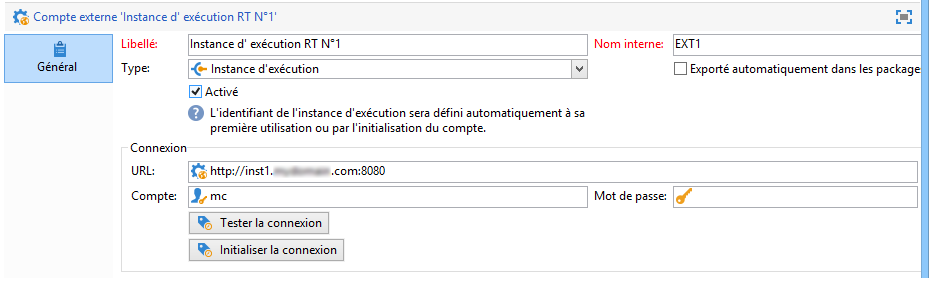
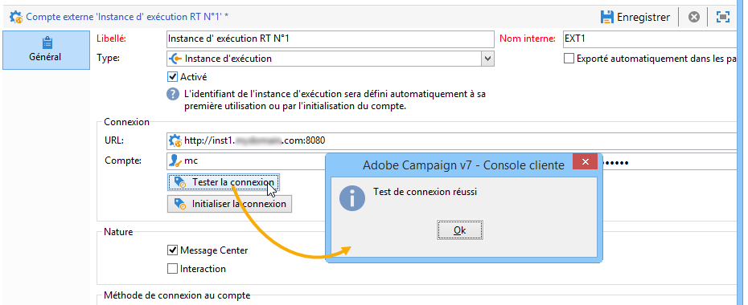
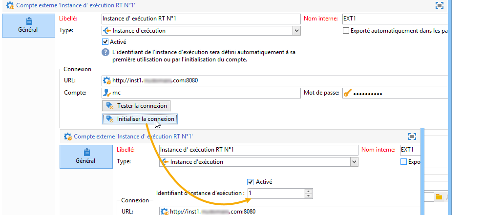
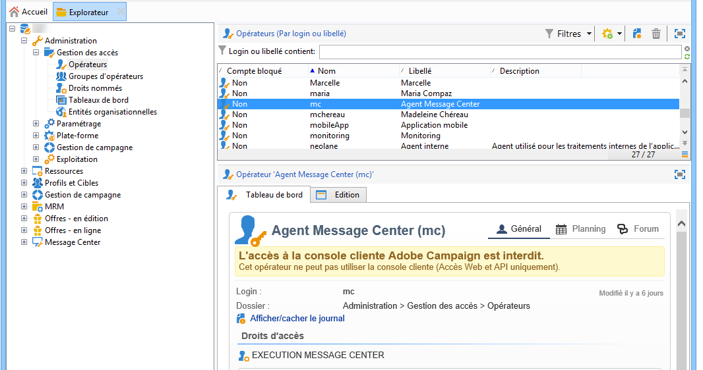
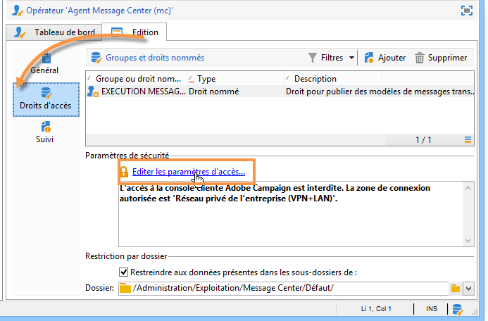
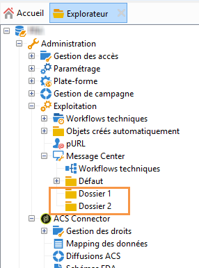
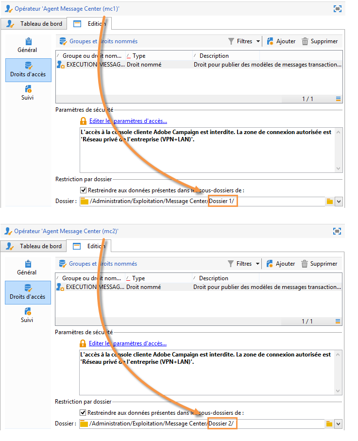
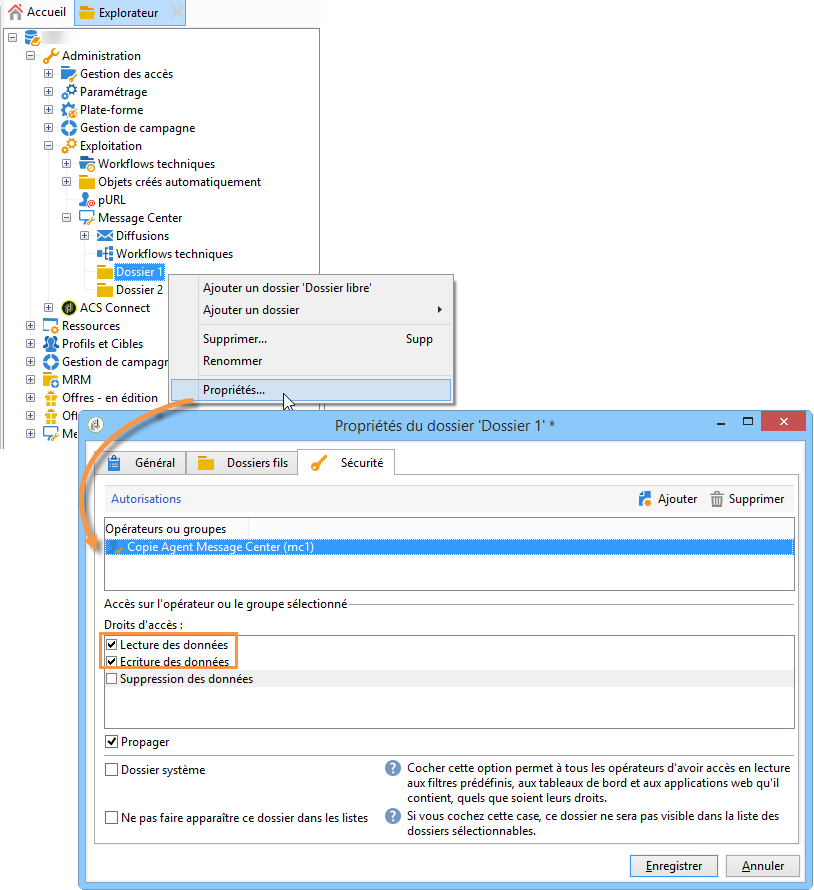

# Créer une connexion partagée{#creating-a-shared-connection}

>[!CAUTION]
>
>* Les extensions de schéma effectuées sur les schémas utilisés par les [workflows techniques de Message Center](../../message-center/using/technical-workflows.md) sur les instances de pilotage ou d&#39;exécution doivent être dupliquées sur les autres instances utilisées par le module des messages transactionnels Adobe Campaign.
>* L&#39;instance de contrôle et la ou les instances d&#39;exécution doivent être installées sur des machines différentes. Elles ne peuvent pas partager la même instance Campaign.
>

## Instance de pilotage {#control-instance}

Dans le cas d&#39;une architecture répartie, vous devez indiquer dans l&#39;instance de pilotage les instances d&#39;exécution qui lui sont reliées et établir une connexion entre elles. Ce sont vers les instances d&#39;exécution que sont déployés les modèles de message transactionnel. La connexion entre l&#39;instance de pilotage et les instances d&#39;exécution se réalise en configurant des comptes externes de type **[!UICONTROL Instance d&#39;exécution]**. Vous devez créer autant de comptes externes que d&#39;instances d&#39;exécution.

>[!NOTE]
>
>Lorsque des instances d’exécution sont utilisées par plusieurs instances de pilotage, les données peuvent être divisées par dossier et par opérateur. Pour plus d’informations, reportez-vous à la section [Utilisation de plusieurs instances de pilotage](#using-several-control-instances).

Procédez comme suit pour créer un compte externe de type instance d&#39;exécution :

1. Positionnez-vous au niveau du dossier **[!UICONTROL Administration > Plate-forme > Comptes externes]**.
1. Sélectionnez un des comptes externes de type instance d&#39;exécution fournis d&#39;usine par Adobe Campaign avec le bouton droit de la souris et choisissez **[!UICONTROL Dupliquer]** dans le menu contextuel .

   

1. Modifiez le libellé selon vos besoins.

   

1. Sélectionnez l&#39;option **[!UICONTROL Activé]** afin que le compte externe soit opérationnel.

   

1. Indiquez l&#39;adresse du serveur sur lequel est installée l&#39;instance d&#39;exécution.

   

1. Le compte doit correspondre à l&#39;Agent Message Center tel qu&#39;il est défini dans le dossier des opérateurs. Par défaut, le compte fourni d&#39;usine par Adobe Campaign est **[!UICONTROL mc]** .

   

1. Entrez le mot de passe du compte tel qu&#39;il a été défini dans le dossier des opérateurs.

   >[!NOTE]
   >
   >Pour ne pas avoir à saisir de mot de passe lors de la connexion à l’instance, vous pouvez spécifier l’adresse IP de l’instance de pilotage dans l’instance d’exécution. Voir à ce propos la section [Instance d’exécution](#execution-instance).

1. Indiquez la méthode de rapatriement qui doit être utilisée par l&#39;instance d&#39;exécution.

   Les données à récupérer sont transmises par l&#39;instance d&#39;exécution à l&#39;instance de pilotage, afin d&#39;enrichir les historiques des messages transactionnels et des événements.

   

   La collecte des données s&#39;effectue soit par un service Web qui utilise un accès en HTTP/HTTPS, soit via le module Federated Data Access (FDA).

   >[!NOTE]
   >
   >Veuillez noter que lors de l’utilisation de  sur HTTP, seules les instances d’exécution utilisant une base de données Postgres sont prises en charge. Les bases de données MSSQL ou Oracle ne sont pas prises en charge.

   La deuxième méthode est recommandée si l&#39;instance de pilotage peut avoir un accès direct aux bases de données des instances d&#39;exécution. Dans le cas contraire, choisissez l&#39;accès par service Web. Le compte FDA à spécifier correspond à la connexion vers les bases des différentes instances d&#39;exécution créée sur l&#39;instance de pilotage.

   

   Reportez-vous à la section [Accès à une base de données externe](../../platform/using/about-fda.md) pour plus d&#39;informations sur le Federated Data Access (FDA).

1. Cliquez sur **[!UICONTROL Tester la connexion]** pour vérifier que la connexion entre l&#39;instance de pilotage et l&#39;instance d&#39;exécution est effective.

   

1. Chaque instance d’exécution doit être associée à un identifiant. Cet identifiant peut être attribué pour chaque instance d’exécution soit manuellement, à l’aide de l’assistant de déploiement (voir la section [Identifier les instances d’exécution](../../message-center/using/identifying-execution-instances.md)), soit automatiquement, en cliquant sur le bouton **Initialiser la connexion** de l’instance de pilotage.

   

## Instance d&#39;exécution {#execution-instance}

Pour que l’instance de pilotage puisse se connecter à l’instance d’exécution sans avoir à fournir de mot de passe, il suffit de saisir l’adresse IP de l’instance de pilotage dans la section relative aux droits d’accès de **Message Center**. Toutefois, les mots de passe vides sont interdits par défaut.

Pour utiliser un mot de passe vide, accédez aux instances d’exécution et définissez une zone de sécurité limitée à l’adresse IP du système d’information qui diffuse les événements. Cette zone de sécurité doit autoriser les mots de passe vides et accepter les connexions de type `<identifier> / <password>`. Voir à ce propos [cette section](../../installation/using/configuring-campaign-server.md#defining-security-zones).

>[!NOTE]
>
>Lorsque des instances d’exécution sont utilisées par plusieurs instances de pilotage, les données peuvent être divisées par dossier et par opérateur. Pour plus d’informations, reportez-vous à la section [Utilisation de plusieurs instances de pilotage](#using-several-control-instances).

1. Positionnez-vous au niveau du dossier des opérateurs dans l&#39;arborescence de l&#39;instance d&#39;exécution (**[!UICONTROL Administration > Gestion des accès > Opérateurs]** ).
1. Sélectionnez l&#39;agent **Message Center**.

   

1. Sélectionnez l&#39;onglet **[!UICONTROL Edition]**, cliquez sur **[!UICONTROL Droits d&#39;accès]**, et cliquez sur le lien **[!UICONTROL Editer les paramètres d&#39;accès...]**

   

1. Dans la fenêtre **[!UICONTROL Paramètres d&#39;accès]**, cliquez sur le lien **[!UICONTROL Ajouter un masque IP de confiance]**, et ajoutez l&#39;adresse IP de l&#39;instance de pilotage.

   

## Utilisation de plusieurs instances de contrôle {#using-several-control-instances}

Vous pouvez mutualiser un cluster d&#39;exécution entre différentes instances de pilotage. Ce type d&#39;architecture requiert le paramétrage suivant.

Par exemple, si votre entreprise gère deux marques, chacune possède sa propre instance de pilotage : **Pilotage 1** et **Pilotage 2**. Deux instances d’exécution sont également utilisées. Vous devez indiquer un opérateur Message Center différent pour chaque instance de pilotage : un opérateur **mc1** pour l’instance **Pilotage 1** et un opérateur **mc2** pour l’instance **Pilotage 2**.

Dans l’arborescence de toutes les instances d’exécution, créez un dossier par opérateur (**Dossier 1** et **Dossier 2**) et limitez à leur dossier l’accès aux données de chaque opérateur.

### Paramétrage des instances de pilotage {#configuring-control-instances}

1. Dans l’instance de pilotage **Pilotage 1**, créez un compte externe par instance d’exécution, puis saisissez l’opérateur **mc1** dans chaque compte externe. L’opérateur **mc1** sera ensuite créé pour toutes les instances d’exécution (voir la section [Paramétrage des instances d’exécution](#configuring-execution-instances)).

   

1. Dans l’instance de pilotage **Pilotage 2**, créez un compte externe par instance d’exécution, puis saisissez l’opérateur **mc2** dans chaque compte externe. L’opérateur **mc2** sera ensuite créé pour toutes les instances d’exécution (voir la section [Paramétrage des instances d’exécution](#configuring-execution-instances)).

   

   >[!NOTE]
   >
   >Pour plus d’informations sur le paramétrage d’une instance de pilotage, consultez la section.[Instance de pilotage](#control-instance)

### Paramétrage des instances d&#39;exécution {#configuring-execution-instances}

Pour utiliser plusieurs instances de pilotage, ce paramétrage doit être réalisé sur TOUTES les instances d&#39;exécution.

1. Créez un dossier par opérateur dans le noeud **[!UICONTROL Administration > Exploitation > Message Center]** : **Dossier 1** et **Dossier 2**. La création de dossiers et de vues est présentée dans le guide [Platform](../../platform/using/access-management.md#folders-and-views).

   

1. Créez les opérateurs **mc1** et **mc2** en dupliquant l&#39;opérateur Message Center fourni par défaut (**mc**). La création d&#39;opérateurs est présentée dans [cette section](../../platform/using/access-management.md#operators).

   

   >[!NOTE]
   >
   >Les opérateurs **mc1** et **mc2** doivent disposer du droit **[!UICONTROL Exécution Message Center]**, et l&#39;accès à la console cliente Adobe Campaign ne doit pas leur être autorisé. Un opérateur doit toujours être associé à une zone de sécurité. Voir à ce sujet [cette section](../../installation/using/configuring-campaign-server.md#defining-security-zones).

1. Pour chaque opérateur, cochez la case **[!UICONTROL Restreindre aux données présentes dans les sous-dossiers de]**, et sélectionnez le dossier correspondant (**Dossier 1** pour l&#39;opérateur **mc1** et **Dossier 2** pour l&#39;opérateur **mc2**).

   

1. Attribuez à chaque opérateur les droits en lecture et en écriture sur son dossier. Pour cela, effectuez un clic droit sur le dossier et sélectionnez **[!UICONTROL Propriétés]**. Sélectionnez ensuite l&#39;onglet **[!UICONTROL Sécurité]** et ajoutez l&#39;opérateur correspondant (**mc1** pour le dossier **Dossier 1** et **mc2** pour le dossier **Dossier 2**). Vérifiez que les cases **[!UICONTROL Lecture/Ecriture des données]** sont bien cochées.

   

