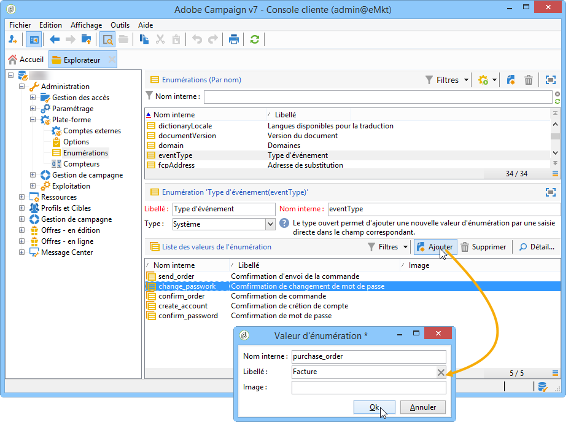

# Création de types d&#39;événements {#creating-event-types}

Pour que chaque événement puisse être transformé en message personnalisé, vous devez d&#39;abord créer des **types d&#39;événements**.

Lors de la [création d&#39;un modèle de message](../../message-center/using/creating-the-message-template.md), vous sélectionnerez le type d&#39;événement correspondant au message que vous souhaitez envoyer.

>[!IMPORTANT]
>
>Vous devez créer des types d&#39;événements avant de pouvoir les utiliser dans des modèles de message.

Pour créer des types d&#39;événements qui seront traités par Adobe Campaign, procédez comme suit :

1. Connectez-vous à l&#39;**instance de pilotage**.

1. Positionnez-vous dans l&#39;arborescence au niveau du dossier **[!UICONTROL Administration > Plateforme > Enumérations]**.

1. Sélectionnez **[!UICONTROL Type d&#39;événement]** dans la liste.

1. Cliquez sur **[!UICONTROL Ajouter]** pour créer une valeur d&#39;énumération. Il peut s&#39;agir d&#39;une confirmation de commande, d&#39;un changement de mot de passe, d&#39;un changement de livraison de commande, etc.

   

   >[!IMPORTANT]
   >
   >Chaque type d&#39;événement doit correspondre à une valeur de l&#39;énumération **[!UICONTROL Type d&#39;événement]**.

1. Une fois les valeurs de l&#39;énumération créées, vous devez vous déconnecter puis vous reconnecter à votre instance afin que la création soit effective.

>[!NOTE]
>
>Pour en savoir plus sur les énumérations, voir [Gestion des énumérations](../../platform/using/managing-enumerations.md).

