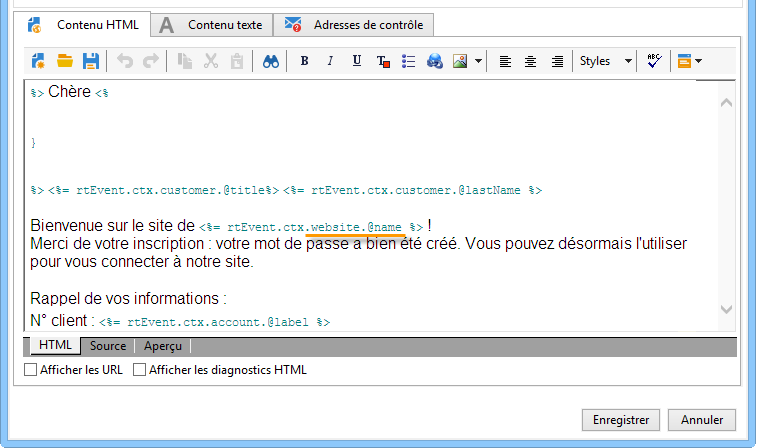

# Création du contenu du message{#creating-message-content}

La définition du contenu du message transactionnel fonctionne selon les mêmes principes que pour une diffusion classique dans Adobe Campaign. Par exemple, pour une diffusion email, vous pouvez créer un contenu au format HTML ou texte, ajouter des pièces jointes ou personnaliser l&#39;objet de la diffusion. Reportez-vous au chapitre [Diffuser par email](../../delivery/using/about-email-channel.md) pour plus d&#39;informations.

>[!IMPORTANT]
>
>Les images incluses dans le message doivent être accessibles publiquement. Adobe Campaign ne fournit pas de mécanisme de mise en ligne des images pour les messages transactionnels.\
>Contrairement à JSSP ou webApp, `<%=` n’a pas de séquence d’échappement par défaut.
>
>Dans ce cas, vous devez appliquer une séquence d’échappement correcte à toutes les données provenant de l’événement. Cette séquence d’échappement dépend de l’utilisation de ce champ. Par exemple, dans une URL, utilisez encodeURIComponent. Pour un affichage dans le code HTML, vous pouvez utiliser escapeXMLString.

Lorsque vous avez défini le contenu de votre message, vous pouvez intégrer les informations de l&#39;événement dans le corps du message et ainsi le personnaliser. Les informations de l&#39;événement sont insérées dans le corps du texte à l&#39;aide des balises de personnalisation.

* Tous les champs de personnalisation proviennent de la payload.
* Il est possible de référencer un ou plusieurs blocs de personnalisation dans un message transactionnel. Le contenu du bloc est ajouté au contenu de la diffusion au cours de la publication dans l’instance d’exécution.

Pour insérer des balises de personnalisation dans le corps d&#39;un message email, procédez comme suit :

1. Dans le modèle de message, cliquez sur l&#39;onglet correspondant au format de l&#39;email (HTML ou texte).
1. Rédigez le corps du message.
1. Dans le corps du texte, insérez la balise à l&#39;aide des menus **[!UICONTROL Evénement temps réel>XML de l&#39;événement]**.

   

1. Complétez la balise selon la syntaxe suivante : .**nom de l&#39;élément**.@**nom de l&#39;attribut** comme illustré ci-dessous.

   
