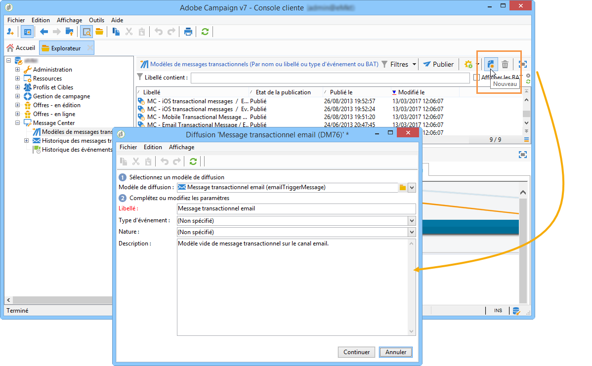
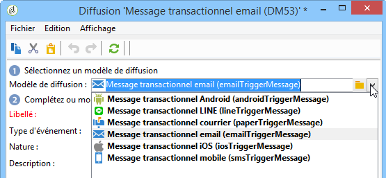
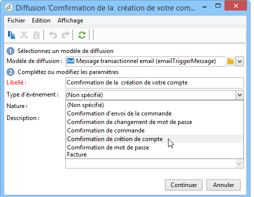
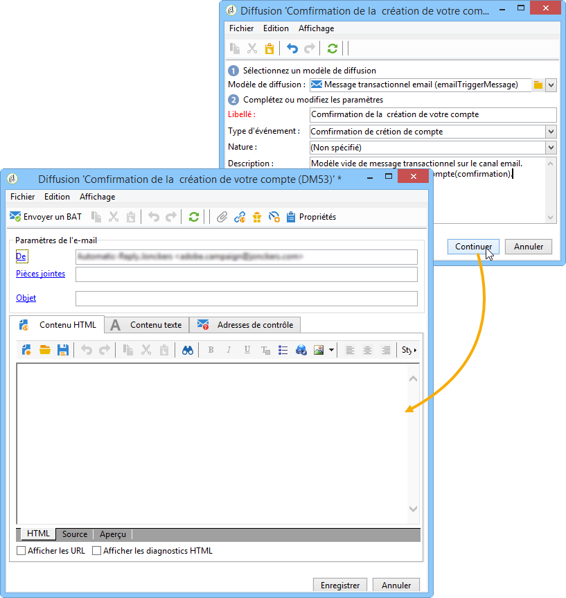
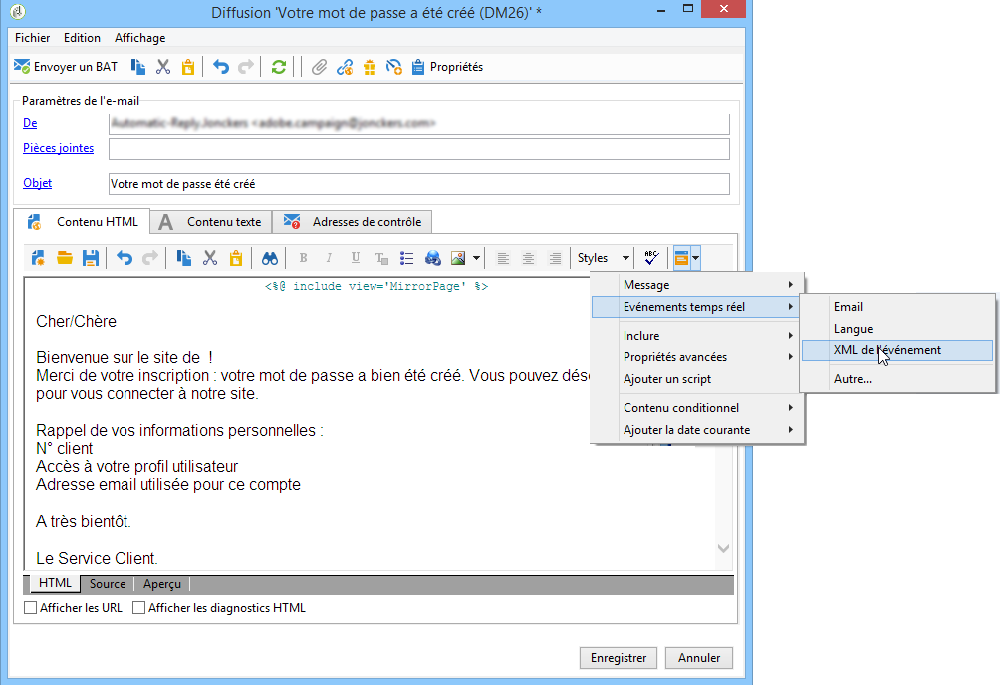
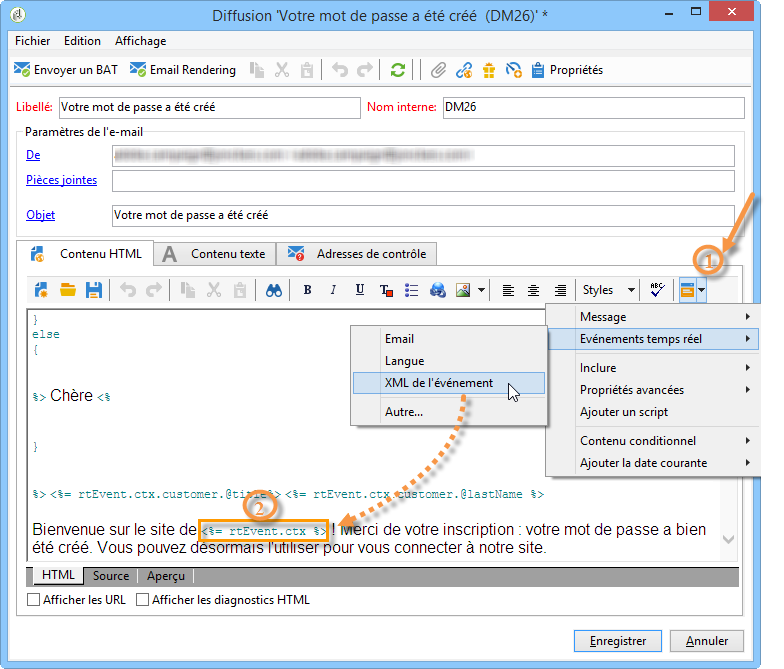
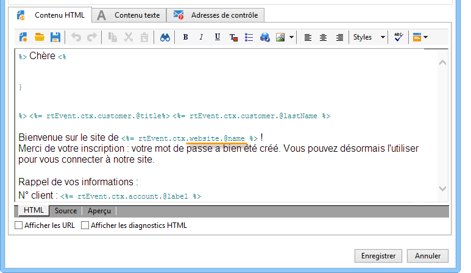

# Conception de modèles de messages transactionnels {#creating-the-message-template}

Pour que chaque événement puisse être transformé en message personnalisé, vous devez créer un modèle de message correspondant à chaque type d&#39;événement.

>[!IMPORTANT]
>
>Les types d&#39;événements doivent être créés au préalable. Voir à ce sujet la section [Création des types d&#39;événements](../../message-center/using/creating-event-types.md).

Les modèles de message transactionnel contiennent les informations nécessaires à la personnalisation du message transactionnel. Vous pouvez également utiliser des modèles pour tester la prévisualisation des messages et envoyer des BAT à l&#39;aide d&#39;adresses de contrôle avant de les diffuser à la cible finale. Pour plus d&#39;informations, consultez la section [Test des modèles de messages transactionnels](../../message-center/using/testing-message-templates.md).

## Création du modèle de message {#creating-message-template}

1. Positionnez-vous au niveau du dossier **[!UICONTROL Message Center > Modèles de messages transactionnels]** dans l&#39;arborescence Adobe Campaign.

1. Dans la liste des modèles de messages transactionnels, cliquez avec le bouton droit de la souris et sélectionnez **[!UICONTROL Nouveau]** dans le menu contextuel ou cliquez sur le bouton **[!UICONTROL Nouveau]** situé au-dessus de la liste des modèles de messages transactionnels.

   

1. Dans la fenêtre de diffusion, sélectionnez le modèle de diffusion propre au canal que vous souhaitez utiliser.

   

1. Modifiez le libellé si nécessaire.

1. Sélectionnez le type d&#39;événement correspondant au message que vous souhaitez envoyer.

   

   Les types d&#39;événements doivent être créés au préalable dans la console. Voir à ce sujet la section [Création des types d&#39;événements](../../message-center/using/creating-event-types.md).

   >[!IMPORTANT]
   >
   >Un type d&#39;événement ne peut jamais être lié à plusieurs modèles.

1. Complétez la nature et la description selon vos besoins, puis cliquez sur **[!UICONTROL Continuer]** pour créer le corps du message (voir la section [Création du contenu du message](#creating-message-content)).

   

## Création du contenu du message {#creating-message-content}

La définition du contenu du message transactionnel fonctionne selon les mêmes principes que pour une diffusion classique dans Adobe Campaign. Par exemple, pour une diffusion e-mail, vous pouvez créer un contenu au format HTML ou texte, ajouter des pièces jointes ou personnaliser l&#39;objet de la diffusion. Voir à ce sujet le chapitre [Diffuser par email](../../delivery/using/about-email-channel.md).

>[!IMPORTANT]
>
>Les images incluses dans le message doivent être accessibles publiquement. Adobe Campaign ne fournit pas de mécanisme de chargement des images pour les messages transactionnels.\
>Contrairement à JSSP ou webApp, `<%=` n&#39;a pas de séquence d&#39;échappement par défaut.
>
>Dans ce cas, vous devez appliquer une séquence d&#39;échappement correcte à toutes les données provenant de l&#39;événement. Cette séquence d&#39;échappement dépend de l&#39;utilisation de ce champ. Par exemple, dans une URL, utilisez encodeURIComponent. Pour un affichage dans le code HTML, vous pouvez utiliser escapeXMLString.

Lorsque vous avez défini le contenu de votre message, vous pouvez intégrer les informations de l&#39;événement dans le corps du message et ainsi le personnaliser. Les informations de l&#39;événement sont insérées dans le corps du texte à l&#39;aide des balises de personnalisation.

* Tous les champs de personnalisation proviennent de la payload.
* Il est possible de référencer un ou plusieurs blocs de personnalisation dans un message transactionnel. Le contenu du bloc est ajouté au contenu de la diffusion au cours de la publication dans l&#39;instance d&#39;exécution.

Pour insérer des balises de personnalisation dans le corps d&#39;un message email, procédez comme suit :

1. Dans le modèle de message, cliquez sur l&#39;onglet correspondant au format de l&#39;e-mail (HTML ou texte).

1. Rédigez le corps du message.

1. Dans le corps du texte, insérez la balise à l&#39;aide du menu **[!UICONTROL Evénements temps réel > XML de l&#39;événement]**.

   

1. Renseignez la balise en utilisant la syntaxe suivante : **nom de l’élément**.@**nom de l’attribut** comme indiqué ci-dessous.

   

1. Enregistrez votre contenu.

Votre message est maintenant prêt à être [testé](../../message-center/using/testing-message-templates.md).
