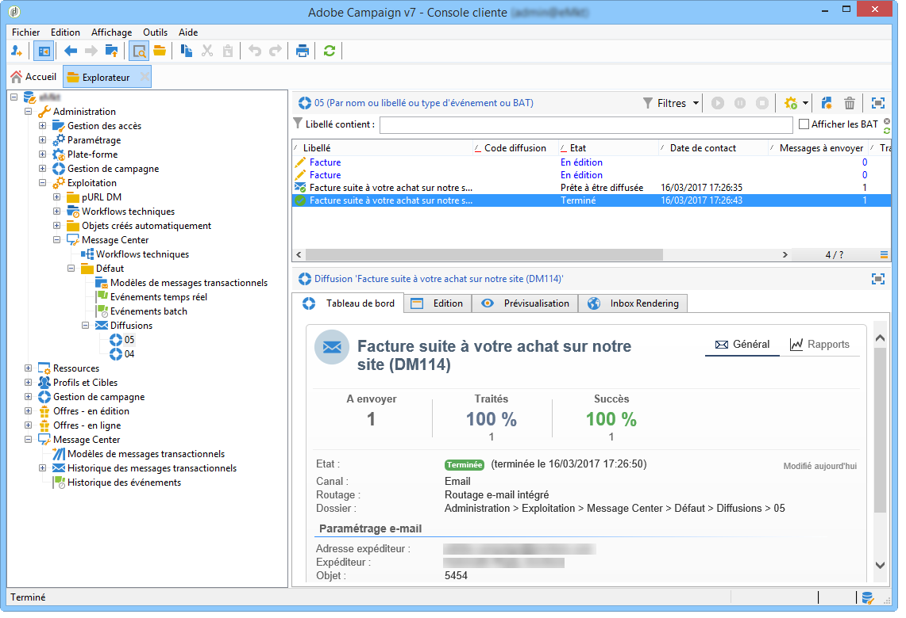
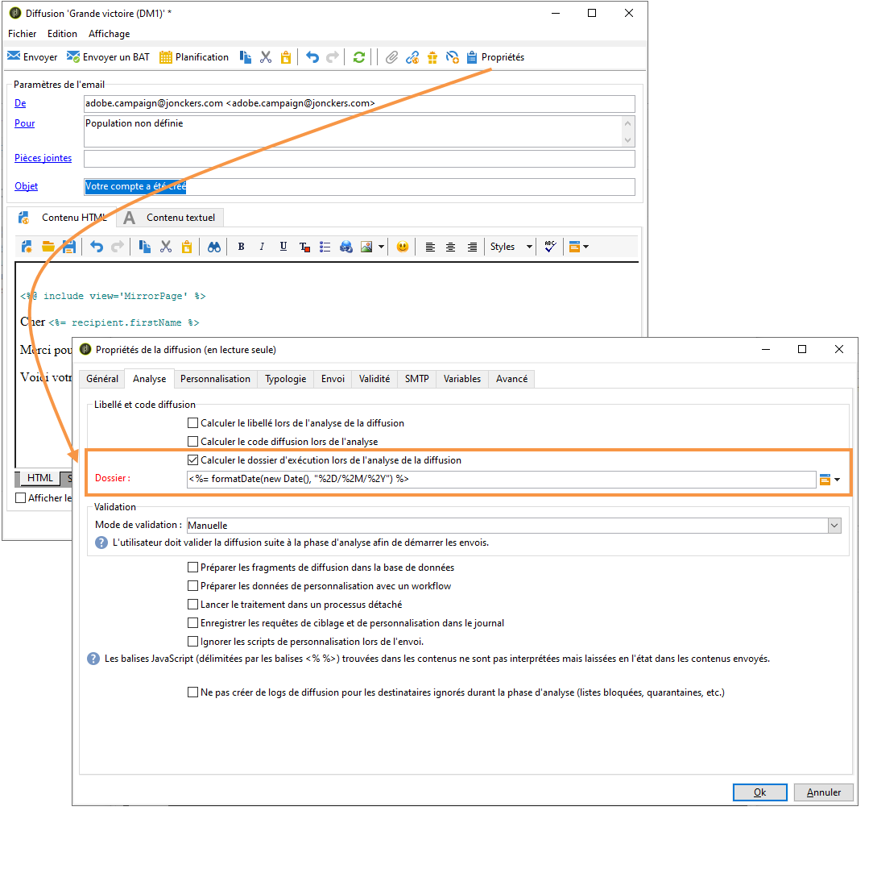

# Exécution de la diffusion {#delivery-execution}

## Envoi de message transactionnel {#transactional-message-send}

Concernant l&#39;instance d&#39;exécution, une fois que l&#39;étape d&#39;enrichissement a été effectuée et qu&#39;un modèle de diffusion a été lié à l&#39;événement, la diffusion est envoyée.

>[!NOTE]
>
>Le MTA donne la priorité au traitement des messages transactionnels par rapport à toute autre diffusion.

Toutes les diffusions sont regroupées dans le dossier **[!UICONTROL Administration > Exploitation > Message Center > Défaut > Diffusions]**.

Par défaut, elles sont classées dans un sous-dossier correspondant au mois d&#39;envoi. Ce classement peut être modifié dans les propriétés du modèle de message comme illustré ci-dessous.

>[!NOTE]
>
>Pour les installations hébergées ou hybrides, si vous avez effectué la mise à niveau vers le [MTA amélioré d&#39;Adobe Campaign](../../delivery/using/sending-with-enhanced-mta.md), tous les messages transactionnels peuvent également être envoyés avec celui-ci pour optimiser la délivrabilité, le débit et la gestion des retours. Tous les impacts sont les mêmes que pour les messages marketing standard.

## Surveillance de message transactionnel {#transactional-message-monitoring}

Pour surveiller vos messages transactionnels, vérifiez les [logs de diffusion](../../delivery/using/delivery-dashboard.md#delivery-logs-and-history).

Les diffusions transactionnelles envoyées à partir de l&#39;instance d&#39;exécution sont synchronisées à nouveau vers l&#39;instance de pilotage par le biais d&#39;un workflow technique (**[!UICONTROL instance d&#39;exécution Message Center]**) qui s&#39;exécute toutes les heures.

>[!NOTE]
>
>Les diffusions hebdomadaires accumulent les événements en fonction de la dernière mise à jour de l&#39;événement, et non de la date de création de l&#39;événement. Par conséquent, lors de l&#39;extraction de logs de diffusion de messagerie transactionnelle à partir de l&#39;instance de pilotage, l&#39;identifiant de diffusion associé à chaque identifiant de log de diffusion peut changer au fil du temps lorsque le journal est mis à jour (par exemple, lorsqu&#39;un retour entrant est reçu pour l&#39;événement).

<!--The transactional deliveries sent from the execution instance are synchronized back to the control instance as follows.

Let's take a [delivery template](../../message-center/using/introduction.md) labelled *Template_1*.

1. An event corresponding to *Template_1* is received on the execution instance.
1. The **Processing real time events** (rtEventsProcessing) workflow processes the event and searches for an existing delivery for the current month.

    >[!NOTE]
    >
    >If not found, a new delivery is created and the event is assigned to the new delivery.

1. The transactional email is sent and the delivery status changes to **[!UICONTROL Sent]**.
1. The **Message Center execution instance** (mcSync_mcExec) workflow retrieves the delivery logs from the execution instance and updates the delivery logs on the control instance.
1. The control instance searches for an existing delivery for week 40 (2020-09-28_Template_1).

    >[!NOTE]
    >
    >If not found, a new delivery is created.

1. The week after, an inbound bounce is received for the event.
1. The status of the event changes to **[!UICONTROL Delivery failed]**.
1. The **Message Center execution instance** (mcSync_mcExec) workflow retrieves the delivery logs from the execution instance and searches for a delivery for week 41 (2020-10-05_Template_1) to update the delivery logs. The delivery logs are then linked to a new delivery for the current week.

To summarize, the deliveries weekly accumulate the events based on the latest event update, and not on the event creation date.

Therefore, when extracting transactional messaging delivery logs from the control instance, the delivery ID associated with each delivery log ID changes every week.-->

Pour surveiller l&#39;activité et l&#39;exécution de la ou des instances d&#39;exécution, consultez [Rapports des messages transactionnels](../../message-center/using/about-transactional-messaging-reports.md).
