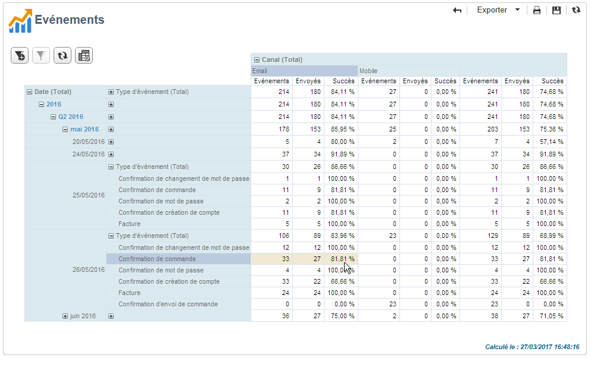

# Historique des événements de Message Center{#history-of-message-center-events}

Le rapport **[!UICONTROL Historique des événements]** vous permet d&#39;avoir un aperçu de l&#39;activité de Message Center, c&#39;est-à-dire le nombre d&#39;événements traités et envoyés sous forme de messages transactionnels.

Lors de l&#39;ouverture du rapport, les informations affichées par défaut correspondent au taux de messages transactionnels envoyés avec succès. Pour visualiser davantage de niveaux, vous pouvez déplier ou replier les différents noeuds et positionner le pointeur de la souris pour mettre en surbrillance le niveau voulu.

Pour chaque période de temps, vous pouvez visualiser les données propres à chacun des types d&#39;événements. La colonne **[!UICONTROL Evénements]** correspond au nombre d&#39;événements reçus par l&#39;instance de pilotage. Le calcul du nombre d&#39;événements transformés en message transactionnel personnalisé se trouve dans la colonne **[!UICONTROL Envoyés]**.

Le rapport **[!UICONTROL Historique des événements]** est un rapport de type Tableau croisé dynamique. Pour avoir davantage d&#39;informations à ce sujet, reportez-vous à la section [Analyser les populations](../../reporting/using/about-descriptive-analysis.md).
