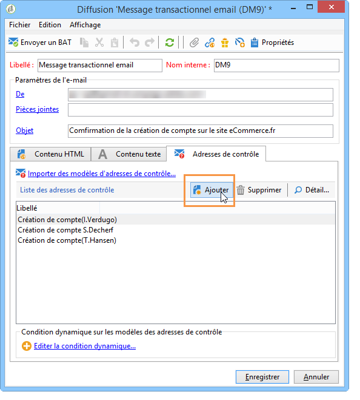

# Gestion des adresses de contrôle dans les messages transactionnels{#managing-seed-addresses-in-transactional-messages}

Une adresse de contrôle est utilisée pour afficher l&#39;aperçu de votre message, envoyer un BAT et tester la personnalisation de votre message avant qu&#39;il ne soit envoyé par email ou SMS. Les adresses de contrôle sont liées à la diffusion et ne peuvent être utilisées d&#39;une diffusion à l&#39;autre.

## Créer une adresse de contrôle {#creating-a-seed-address}

1. Dans le modèle de message transactionnel, cliquez sur l&#39;onglet **[!UICONTROL Adresses de contrôle]**.

   

1. Attribuez-lui un libellé afin de pouvoir sélectionner l&#39;adresse ultérieurement si nécessaire.

   

1. Entrez l&#39;adresse de contrôle, soit l&#39;email ou le numéro de portable selon le canal de communication de la diffusion.

   

1. Renseignez l&#39;identifiant externe : ce champ optionnel vous permet de renseigner la clé métier (identifiant unique, nom + email, etc.), commune à toutes les applications de votre site web, que vous utilisez pour identifier vos profils. Si ce champ est aussi présent dans la base marketing Adobe Campaign, vous pourrez alors réconcilier un évènement avec un profil en base.

   

1. Insérez des données de test (voir Données [de](../../message-center/using/personalization-data.md)personnalisation).

   

## Créer plusieurs adresses de contrôle {#creating-several-seed-addresses}

1. Cliquez sur le lien **[!UICONTROL Ajouter d&#39;autres adresses de contrôle]**, puis sur le bouton **[!UICONTROL Ajouter]**.

   

1. Follow the configuration steps for a seed address detailed in the [Creating a seed address](#creating-a-seed-address) section.
1. Répétez l&#39;opération pour créer le nombre d&#39;adresses voulu.

   

Une fois les adresses créées, vous pouvez afficher leur aperçu et leur personnalisation. Reportez-vous à la section Aperçu [des messages](../../message-center/using/transactional-message-preview.md)transactionnels.
