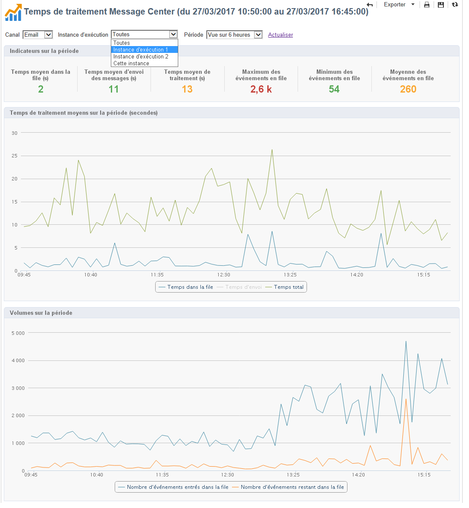

# Temps de traitement Message Center {#message-center-processing-time}

Ce rapport présente les principaux indicateurs associés à la file d&#39;attente en temps réel.

Ce rapport destiné aux administrateurs techniques est également accessible à partir de l&#39;onglet **[!UICONTROL Supervision]** de l&#39;instance de pilotage.

Comme pour le rapport **[!UICONTROL Qualité de service Message Center]**, vous pouvez choisir d&#39;afficher les statistiques globales ou relatives à une instance d&#39;exécution particulière. Vous pouvez également filtrer les données par canal et sur une période spécifique.

Les indicateurs affichés dans la section **[!UICONTROL Indicateurs sur la période]** sont calculés sur la période sélectionnée :

* **[!UICONTROL Temps moyen dans la file (s)]** : temps moyen passé dans Message Center pour les événements traités avec succès. Seul le temps de traitement est pris en compte.
* **[!UICONTROL Temps moyen d&#39;envoi des messages (s)]** : temps moyen passé dans Message Center pour les événements traités avec succès. Seul le temps d&#39;envoi par les mta est pris en compte.
* **[!UICONTROL Temps moyen de traitement (s)]** : temps moyen passé dans Message Center pour les événements traités avec succès. Ce calcul prend en compte le temps de traitement et le temps d&#39;envoi par les mta.
* **[!UICONTROL Maximum des événements en file]** : nombre maximum d&#39;événements présents dans la file Message Center à un même moment.
* **[!UICONTROL Minimum des événements en file]** : nombre minimum d&#39;événements présents dans la file Message Center à un même moment.
* **[!UICONTROL Moyenne des événements en file]** : nombre moyen d&#39;événements présents dans la file Message Center à un même moment.

>[!NOTE]
>
>Les seuils d’avertissement (orange) et d’alerte (rouge) des indicateurs sont paramétrables dans l’assistant de déploiement d’Adobe Campaign. Voir [Seuils de suivi](../../message-center/using/additional-configurations.md#monitoring-thresholds).
