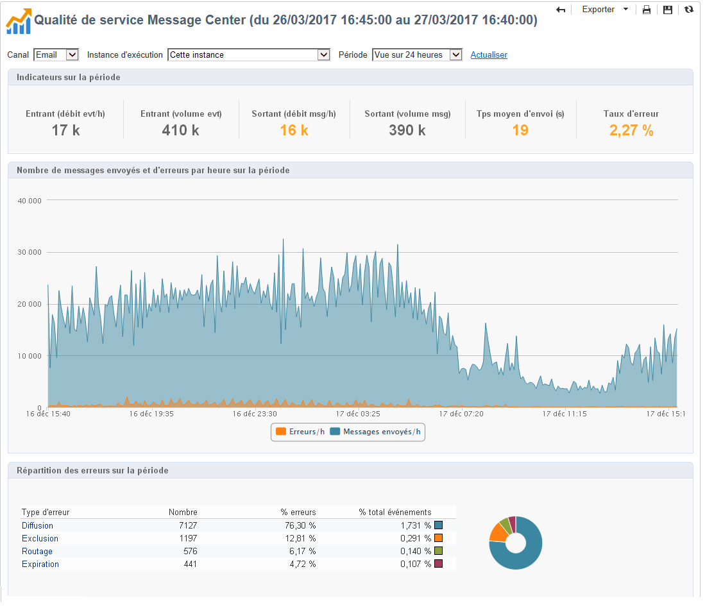

# Qualité de service Message Center {#message-center-service-level}

Ce rapport affiche les statistiques de diffusion relatives aux messages transactionnels ainsi que la répartition des erreurs. Cliquez sur un type d’erreur pour en afficher les détails.

Ce rapport destiné aux administrateurs techniques est également accessible à partir de l’onglet **[!UICONTROL Supervision]** de l’instance de pilotage.

Dans ce rapport, vous pouvez choisir d&#39;afficher les statistiques globales ou relatives à une instance d&#39;exécution particulière. Vous pouvez également filtrer les données par canal et sur une période spécifique.

Les indicateurs affichés dans la section **[!UICONTROL Indicateurs sur la période]** sont calculés sur la période sélectionnée :

* **[!UICONTROL Entrant (débit evt/h)]** : moyenne horaire du nombre d&#39;événements entrés dans la file Message Center.
* **[!UICONTROL Entrant (volume evt)]** : nombre d&#39;événements entrés dans la file Message Center.
* **[!UICONTROL Sortant (débit msg/h)]** : moyenne horaire du nombre d&#39;événements sortant avec succès de Message Center (envoyés par une diffusion).
* **[!UICONTROL Sortant (volume msg)]** : nombre d&#39;événements sortant avec succès de Message Center (envoyés par une diffusion).
* **[!UICONTROL Temps moyen d&#39;envoi (s)]** : temps moyen passé dans Message Center pour les événements traités avec succès. Ce calcul prend en compte le temps de traitement et le temps d&#39;envoi par les mta.
* **[!UICONTROL Taux d&#39;erreur]** : nombre d&#39;événements en erreur par rapport au nombre d&#39;événements entrés dans la file Message Center. Les erreurs suivantes sont prises en compte : erreur de routage, événement expiré (événement resté trop longtemps dans la file d&#39;attente), erreur de diffusion, ignoré par la diffusion (quarantaine, etc.).

>[!NOTE]
>
>Les seuils d&#39;avertissement (orange) et d&#39;alerte (rouge) des indicateurs sont paramétrables dans l&#39;assistant de déploiement. Voir [Seuils de suivi](../../message-center/using/additional-configurations.md#monitoring-thresholds).
