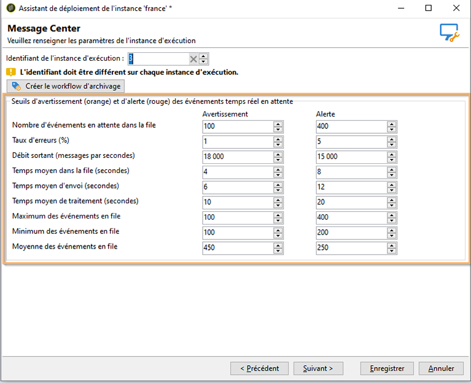

# Seuils de suivi{#monitoring-thresholds}

Vous pouvez configurer les seuils d’avertissement (orange) et d’alerte (rouge) des indicateurs qui apparaissent dans les rapports **Qualité de service Message Center** et **Temps traitement Message Center** (voir la section [A propos des rapports des messages transactionnels](../../message-center/using/about-transactional-messaging-reports.md)). Pour ce faire, ouvrez l’assistant de déploiement de l’instance d’exécution, accédez à la page **[!UICONTROL Message Center]** et utilisez les flèches pour modifier les seuils.

>[!NOTE]
>
>Le nombre d&#39;événements en attente dans la file est affiché dans la section [Indicateurs système](../../production/using/monitoring-processes.md#system-indicators) de la page de suivi des processus Adobe Campaign. Pour plus d&#39;informations sur l&#39;assistant de déploiement, consultez [cette section](../../installation/using/deploying-an-instance.md#deployment-wizard).
