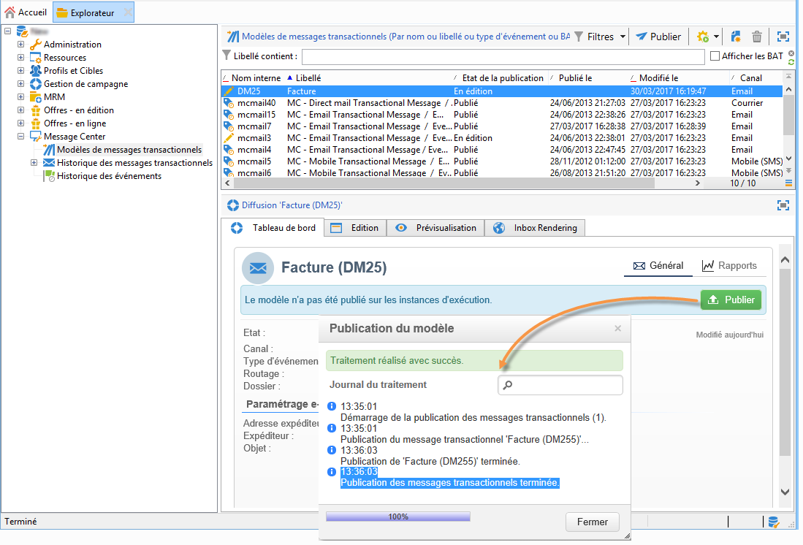
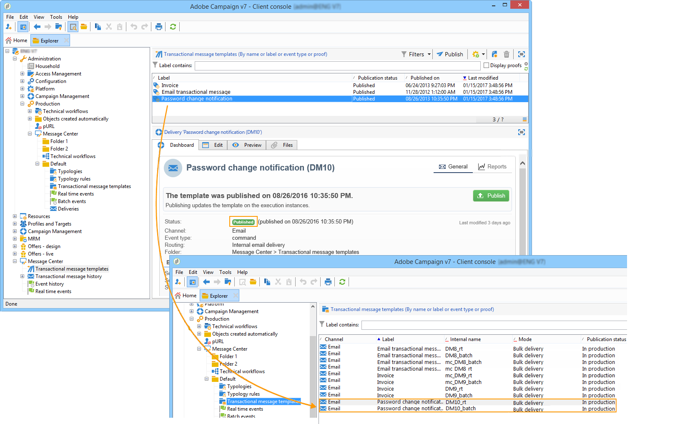
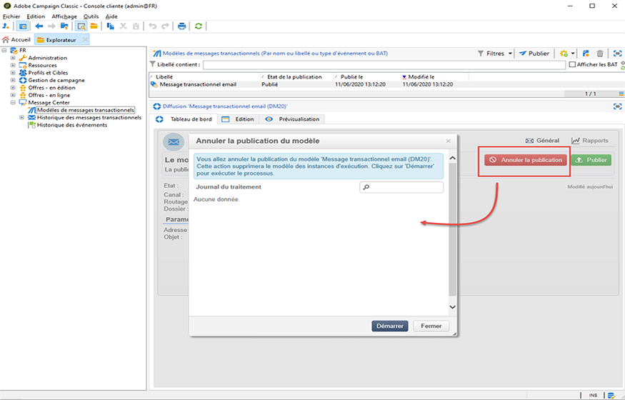

# Publication de modèles de message {#publishing-template-messages}

## Publication des modèles {#template-publication}

Lorsque le [modèle de message](../../message-center/using/creating-the-message-template.md) créé sur l&#39;instance de pilotage est terminé et que vous l&#39;avez [testé](../../message-center/using/testing-message-templates.md), vous pouvez le publier. Ce processus le publiera également sur toutes les instances d&#39;exécution.

La publication vous permet de créer automatiquement **deux modèles de messages** sur les instances d’exécution. Vous pouvez ainsi envoyer des messages liés à des **événements temps réel** et à des **événements batch**.

>[!NOTE]
>
>Lors de la publication de modèles de messages transactionnels, les règles de typologie sont également automatiquement publiées sur les instances d&#39;exécution.

>[!IMPORTANT]
>
>Chaque fois que vous apportez des modifications à un modèle, veillez à le republier pour que ces modifications soient effectives pendant la diffusion du message transactionnel.

1. Dans l&#39;instance de pilotage, positionnez-vous au niveau du dossier **[!UICONTROL Message Center > Modèle de messages transactionnels]** dans l&#39;arborescence.
1. Sélectionnez le modèle que vous souhaitez publier sur vos instances d&#39;exécution.
1. Cliquez sur **[!UICONTROL Publier]**.

   

Lorsque la publication est terminée, les deux modèles de messages destinés à être appliqués aux types d&#39;événements temps réel et par lots sont créés dans l&#39;arborescence de l&#39;instance d&#39;exploitation dans le dossier **[!UICONTROL Administration > Production > Message Center (Exécution) > Défaut > Modèles de messages transactionnels]**.

Une fois qu’un modèle est publié, si l’événement correspondant est déclenché, l’instance d&#39;exécution reçoit l’événement, le lie au modèle transactionnel et envoie le message transactionnel correspondant à chaque destinataire. Pour plus d&#39;informations, consultez la section [Traitement des événements](../../message-center/using/about-event-processing.md).

>[!NOTE]
>
>Si vous remplacez un champ existant du modèle de message transactionnel, tel que l&#39;adresse de l&#39;expéditeur, par une valeur vide, le champ correspondant sur l&#39;instance ou les instances d&#39;exécution ne sera pas mis à jour une fois le message transactionnel republié. Il contiendra toujours la valeur précédente.
>
>Cependant, si vous ajoutez une valeur non vide, le champ correspondant sera mis à jour comme d&#39;habitude après la publication suivante.

## Dépublication des modèles {#template-unpublication}

Lorsqu’un modèle de message a été publié sur les instances d’exécution, il est possible de le dépublier. Pour plus d’informations sur le processus de publication de modèles, consultez [cette section](#template-publication).

* En effet, un modèle publié peut toujours être appelé si l&#39;événement correspondant est déclenché : si vous n’utilisez plus de modèle de message, il est recommandé de le dépublier. Vous éviterez ainsi d&#39;envoyer par erreur un message transactionnel indésirable.

   Par exemple, vous avez publié un modèle de message utilisé uniquement pour les campagnes de Noël. Vous pouvez le dépublier une fois la période de Noël terminée et le publier de nouveau l&#39;année suivante.

* En outre, vous ne pouvez pas supprimer un modèle de message transactionnel dont le statut est **[!UICONTROL Publié]**. Vous devez d&#39;abord le dépublier.

>[!NOTE]
>
>Cette fonctionnalité est disponible à partir de la version Campaign 20.2.

Pour dépublier un modèle de message transactionnel, procédez comme décrit ci-dessous.

1. Dans l’instance de pilotage, positionnez-vous au niveau du dossier **[!UICONTROL Message Center > Modèle de messages transactionnels]** dans l’arborescence.
1. Sélectionnez le modèle que vous souhaitez dépublier.
1. Cliquez sur **[!UICONTROL Dépublier]**.

   <!--1. Fill in the **[!UICONTROL Log of the process]** field.-->

1. Cliquez sur **[!UICONTROL Démarrer]**.

Le statut du modèle de message transactionnel passe de **[!UICONTROL Publié]** à **[!UICONTROL En édition]**.

Une fois la publication annulée :

* Les deux modèles de message (appliqués aux types d’événements par lot et temps réel) sont supprimés de chaque instance d’exécution.

   Ils n’apparaissent plus dans le dossier **[!UICONTROL Administration > Exploitation > Message Center (Exécution) > Défaut > Modèles de messages transactionnels]** (voir [cette section](#template-publication)).

* Une fois la dépublication d’un modèle effectuée, vous pouvez le supprimer de l’instance de pilotage.

   Pour ce faire, sélectionnez-le dans la liste et cliquez sur le bouton **[!UICONTROL Supprimer]** en haut à droite de l&#39;écran.
