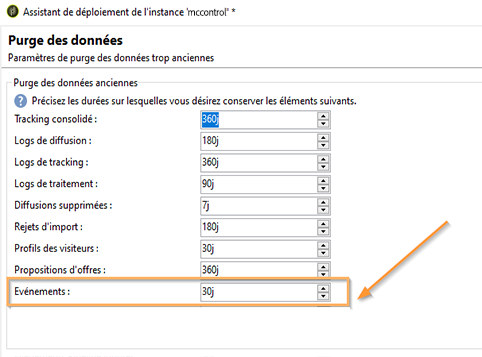

# Purge des événements{#purging-events}

Vous pouvez paramétrer la durée pendant laquelle vous souhaitez conserver les événements en base depuis l&#39;assistant de déploiement.

La purge des événements est effectuée automatiquement par le workflow **[!UICONTROL Nettoyage de la base]**. Ce workflow purge les événements reçus et stockés sur les instances d&#39;exécution et des événements archivés sur une instance de pilotage.

Pour modifier les paramètres de purge, utilisez la flèche ascendante et descendante.

Paramètres de purge des événements sur une instance de pilotage :

Paramètres de purge des événements sur une instance d&#39;exécution :

Pour plus d&#39;informations sur le workflow de nettoyage de la base, consultez [cette section](../../production/using/database-cleanup-workflow.md).
