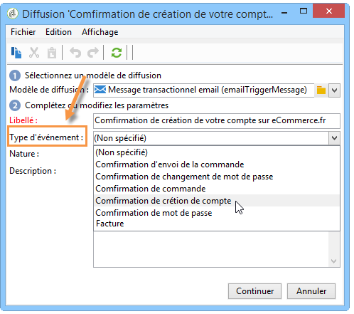

# Acheminement vers un modèle{#routing-towards-a-template}

Lorsque le modèle de message est publié sur la ou les instances d&#39;exécution, deux modèles destinés à être associés respectivement à un événement temps réel ou à un événement batch sont automatiquement générés. L&#39;étape d&#39;acheminement consiste à associer un événement avec le modèle de message qui lui correspond. L&#39;association entre l&#39;événement et le modèle de message est basée sur le type d&#39;événement spécifié dans les propriétés de l&#39;événement lui-même et dans celles du modèle.

Définition du type d&#39;événement dans les propriétés de l&#39;événement :

Définition du type d&#39;événement dans les propriétés du modèle de message :

Par défaut, l&#39;acheminement est basé sur les informations suivantes :

* Le type d&#39;événement
* Le canal à utiliser (email par défaut)
* Le modèle de diffusion le plus récent, selon la date de publication
