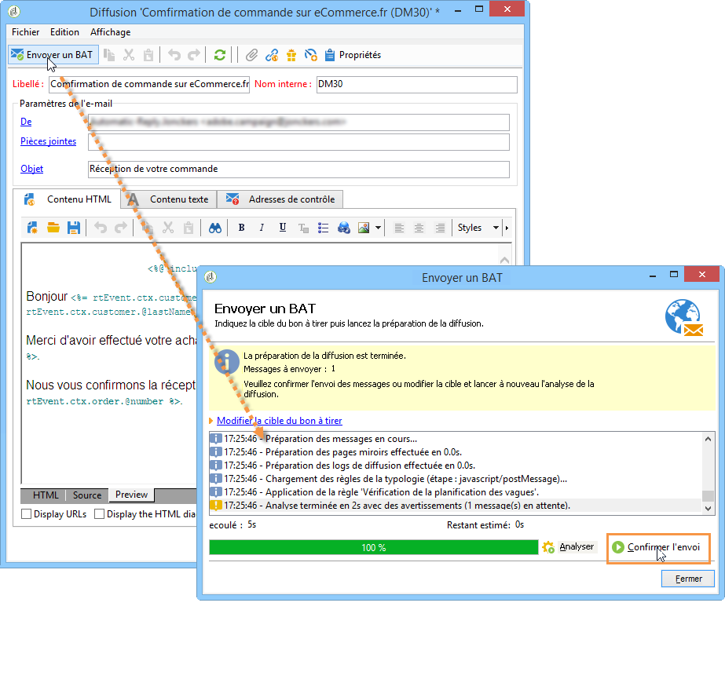

# Envoyer un bon à tirer{#sending-a-proof}

Vous pouvez tester l&#39;envoi du message en envoyant un BAT vers une adresse de contrôle créée précédemment.

L&#39;envoi d&#39;un BAT se fait selon le même principe que pour une diffusion classique (voir à ce sujet [cette section](../../delivery/using/steps-validating-the-delivery.md#sending-a-proof)). Cependant, l&#39;envoi d&#39;un BAT dans le cadre de Message Center suppose d&#39;avoir préalablement effectué les opérations suivantes :

* Créez une ou plusieurs adresses de base (voir [Gestion des adresses de contrôle dans les messages transactionnels](../../message-center/using/managing-seed-addresses-in-transactional-messages.md)) avec des données de test (voir [Données de personnalisation](../../message-center/using/personalization-data.md)).
* Créez le contenu du message (voir [Création du contenu du message](../../message-center/using/creating-message-content.md)).

Pour effectuer l&#39;envoi :

1. Cliquez sur bouton **[!UICONTROL Envoyer un BAT]** dans la fenêtre de diffusion.
1. Analysez la diffusion.
1. Corrigez les erreurs et validez la diffusion.

   

1. Vérifiez que le message est bien parvenu à l&#39;adresse de contrôle et que son contenu est conforme à ce que vous aviez paramétré.

   

Les BAT sont accessibles au niveau de chaque modèle, depuis l&#39;onglet **[!UICONTROL Suivi]**.

