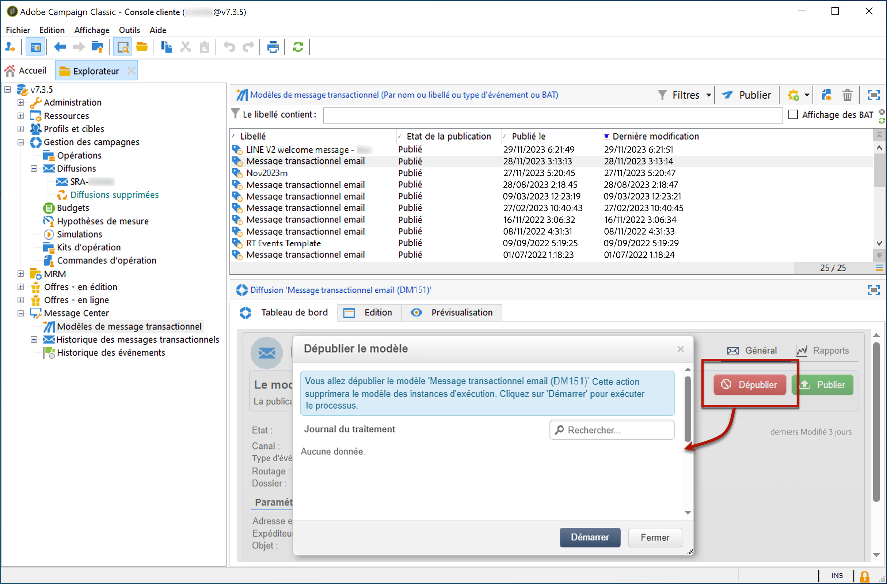

# Annulation de la publication des modèles{#template-unpublication}

Lorsqu’un modèle de message a été publié sur les instances d’exécution, il est possible d’en annuler la publication.

>[!NOTE]
>
>Cette fonctionnalité est disponible à partir de la version Campaign 20.2.

En effet, il est encore possible d’appeler un modèle publié. Dans ce cas, si vous n’utilisez plus de modèle de message, il est recommandé d’annuler sa publication. Vous éviterez ainsi d’envoyer par erreur un message transactionnel indésirable. Par exemple, vous avez publié un modèle de message utilisé uniquement pour les campagnes de Noël. Vous pouvez annuler sa publication une fois la période de Noël terminée et le publier de nouveau l’année suivante.

En outre, vous ne pouvez pas supprimer un modèle de message transactionnel dont le statut est **[!UICONTROL Publié]**. Vous devez d’abord annuler sa publication.

Pour annuler la publication d’un modèle de message transactionnel, procédez comme décrit ci-dessous.

1. Dans l’instance de pilotage, positionnez-vous au niveau du dossier **[!UICONTROL Message Center > Modèle de messages transactionnels]** dans l’arborescence.
1. Sélectionnez le modèle dont vous souhaitez annuler la publication.
1. Cliquez sur **[!UICONTROL Annuler la publication]**.

   <!--1. Fill in the **[!UICONTROL Log of the process]** field.-->

1. Cliquez sur **[!UICONTROL Démarrer]**.

Le statut du modèle de message transactionnel passe de **[!UICONTROL Publié]** à **[!UICONTROL En édition]**.

Une fois la publication annulée :

* Les deux modèles de message (appliqués aux types d’événements par lot et temps réel) sont supprimés de chaque instance d’exécution. Ils n’apparaissent plus dans le dossier **[!UICONTROL Administration > Production > Message Center (Exécution) > Défaut > Modèles de messages transactionnels]**.

* Une fois la publication d’un modèle annulée, vous pouvez le supprimer de l’instance de pilotage, si nécessaire. Pour ce faire, sélectionnez-le dans la liste et cliquez sur le bouton **[!UICONTROL Supprimer]** en haut à droite de l’écran.