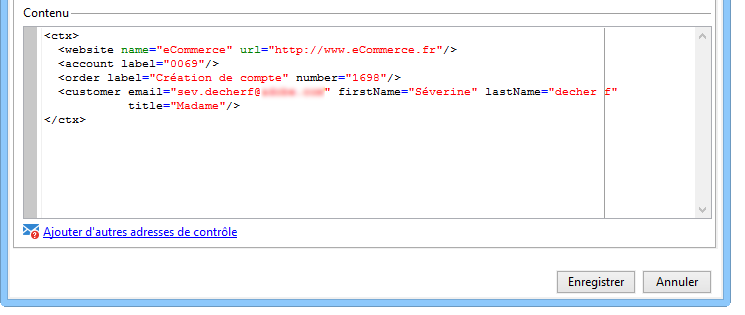

# Test des modèles de message transactionnel {#testing-message-templates}

Une fois que votre [modèle de message](../../message-center/using/creating-the-message-template.md) est prêt, suivez les étapes ci-dessous pour le prévisualiser et le tester.

## Gestion des adresses de contrôle dans les messages transactionnels {#managing-seed-addresses-in-transactional-messages}

Une adresse de contrôle est utilisée pour afficher l&#39;aperçu de votre message, envoyer un BAT et tester la personnalisation de votre message avant qu&#39;il ne soit envoyé par email ou SMS. Les adresses de contrôle sont liées à la diffusion et ne peuvent être utilisées d&#39;une diffusion à l&#39;autre.

Pour créer des adresses de contrôle dans un message transactionnel, procédez comme suit :

1. Dans le modèle de message transactionnel, cliquez sur l&#39;onglet **[!UICONTROL Adresses de contrôle]**.

   

1. Attribuez-lui un libellé afin de pouvoir sélectionner l&#39;adresse ultérieurement si nécessaire.

   

1. Entrez l&#39;adresse de contrôle, soit l&#39;email ou le numéro de portable selon le canal de communication de la diffusion.

   

1. Renseignez l&#39;identifiant externe : ce champ optionnel vous permet de renseigner la clé métier (identifiant unique, nom + email, etc.), commune à toutes les applications de votre site web, que vous utilisez pour identifier vos profils. Si ce champ est aussi présent dans la base marketing Adobe Campaign, vous pourrez alors réconcilier un évènement avec un profil en base.

   

1. Insérez des données de test (voir [Données de personnalisation](#personalization-data)).

   

   <!--## Creating several seed addresses {#creating-several-seed-addresses}-->
1. Cliquez sur le lien **[!UICONTROL Ajouter d&#39;autres adresses de contrôle]**, puis sur le bouton **[!UICONTROL Ajouter]**.

   

   <!--1. Follow the configuration steps for a seed address detailed in the [Creating a seed address](#creating-a-seed-address) section.-->
1. Répétez l&#39;opération pour créer le nombre d&#39;adresses voulu.

   

Lorsque les adresses sont créées, vous pouvez dès lors afficher l&#39;aperçu de votre message et sa personnalisation. Voir [Aperçu du message transactionnel](#transactional-message-preview).

## Données de personnalisation {#personalization-data}

Il est possible d&#39;utiliser des données dans le modèle de message pour tester la personnalisation des messages transactionnels. Cette fonctionnalité est utilisée pour générer un aperçu ou envoyer un BAT. Vous pouvez également afficher le rendu du message pour différents fournisseurs d&#39;accès Internet. Pour plus d&#39;informations, consultez la section [Inbox rendering](../../delivery/using/inbox-rendering.md).

Ces données n&#39;ont pour but que de tester vos messages avant leur diffusion effective et ne correspondent pas aux données réelles qui seront traitées. En revanche, la structure XML doit être identique à celle de l&#39;événement qui est stocké dans l&#39;instance d&#39;exécution, comme illustré ci-dessous :

Ces informations permettent de personnaliser le contenu du message à l&#39;aide de balises de personnalisation (voir à ce sujet la section [Création du contenu du message](../../message-center/using/creating-the-message-template.md#creating-message-content)).

1. Sélectionnez le modèle de message transactionnel.

1. Dans le modèle de , cliquez sur l&#39;onglet **[!UICONTROL Adresses de contrôle]**.

1. Dans le contenu de l&#39;événement, entrez les informations de test au format XML.

   

1. Cliquez sur **[!UICONTROL Enregistrer]**.

## Aperçu du message transactionnel {#transactional-message-preview}

Lorsque vous avez créé une ou plusieurs adresses de contrôle, ainsi que le corps du message, vous pouvez afficher l&#39;aperçu de votre message et vérifier la personnalisation de ce dernier.

1. Dans le modèle de message, cliquez sur l&#39;onglet **[!UICONTROL Aperçu]**.

   

1. Sélectionnez **[!UICONTROL Adresse de contrôle]** dans la liste déroulante.

   

1. Sélectionnez l&#39;adresse de contrôle préalablement créée afin d&#39;afficher le message personnalisé.

   

À l&#39;aide des adresses de contrôle, vous pouvez également afficher le rendu du message pour les différents fournisseurs d&#39;accès Internet. Pour plus d&#39;informations, consultez la section [Inbox rendering](../../delivery/using/inbox-rendering.md).

## Envoyer un BAT {#sending-a-proof}

Vous pouvez tester la diffusion du message en envoyant un BAT vers une adresse de contrôle créée précédemment.

L&#39;envoi d&#39;un BAT engage le même processus que pour une [diffusion standard](../../delivery/using/steps-validating-the-delivery.md#sending-a-proof). Toutefois, avec les messages transactionnels, vous devez effectuer au préalable les opérations suivantes :

* Création d&#39;une ou plusieurs [adresses de contrôle](#managing-seed-addresses-in-transactional-messages)[ avec des données de de personnalisation](#personalization-data).
* [Création du contenu du message](../../message-center/using/creating-the-message-template.md#creating-message-content).

Pour effectuer l&#39;envoi :

1. Cliquez sur bouton **[!UICONTROL Envoyer un BAT]** dans la fenêtre de diffusion.
1. Analysez la diffusion.
1. Corrigez les erreurs et validez la diffusion.

   

1. Vérifiez que le message est bien parvenu à l&#39;adresse de contrôle et que son contenu est conforme à ce que vous aviez paramétré.

   

Les BAT sont accessibles au niveau de chaque modèle, depuis l&#39;onglet **[!UICONTROL Suivi.]** Pour plus d&#39;informations à ce sujet, consultez [Envoi d&#39;un BAT](../../delivery/using/steps-validating-the-delivery.md#sending-a-proof).

Votre modèle de message est maintenant prêt à être [publié](../../message-center/using/publishing-message-templates.md).