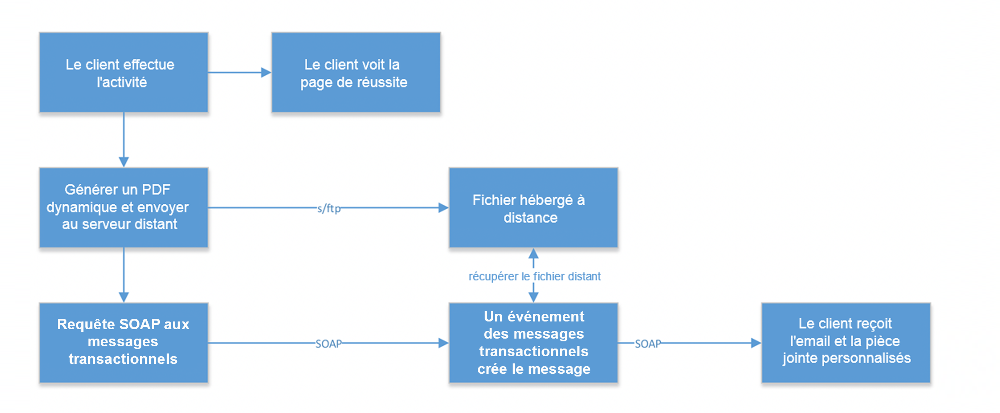
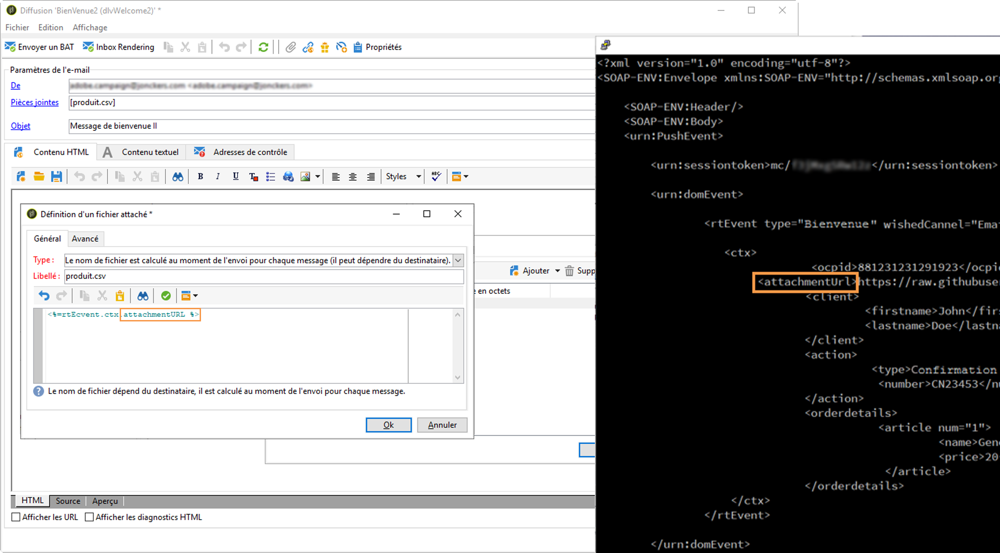

# Cas d&#39;utilisation : envoi d&#39;e-mails transactionnels avec des pièces jointes {#transactional-email-with-attachments}


L&#39;objectif de ce cas pratique est d&#39;ajouter des pièces jointes d&#39;emails à la volée aux envois sortants.

## Principales étapes {#key-steps}

Dans ce scénario, vous allez apprendre à envoyer des emails transactionnels avec des pièces jointes individuelles et/ou personnalisées. Les pièces jointes ne seront pas préchargées sur le serveur de messagerie transactionnelle, mais générées à la volée.

Lorsque vous capturez des interactions ou des détails sur un client, vous devrez peut-être lui renvoyer ces informations à la fin du processus, par exemple dans un fichier PDF joint à un email.

Voici les étapes générales de ce scénario :

1. Le client accède au site web et trouve le produit qu&#39;il souhaite acheter.
1. Il sélectionne le produit et personnalise certaines options.
1. Il termine la transaction.
1. Un email est envoyé au client pour confirmer la transaction. L&#39;envoi de PII dans un email n&#39;étant pas recommandé, un fichier PDF sécurisé est généré et joint à cet email.
1. Le client reçoit l&#39;email et la pièce jointe contenant toutes les données nécessaires.

Dans ce scénario, les pièces jointes ne sont pas créées à l&#39;avance, mais ajoutées à la volée aux emails sortants, avec les avantages suivants :

* Vous pouvez personnaliser le contenu de la pièce jointe.
* Si elle est associée à une transaction (comme dans l&#39;exemple de scénario ci-dessus), elle peut contenir des données dynamiques générées pendant le processus client.
* L&#39;ajout de fichiers PDF optimise la sécurité lorsque vous pouvez les chiffrer et les envoyer via HTTPS.

## Recommendations et mécanismes de sécurisation {#important-notes}

Pour éviter des problèmes de performances, les images incluses dans les e-mails ne doivent pas dépasser 100 Mo. Cette limite, définie par défaut, peut être modifiée à partir de l’option `NmsDelivery_MaxDownloadedImageSize`. Cependant, Adobe recommande vivement d’éviter les images volumineuses dans vos diffusions e-mail.

Adobe recommande également de limiter la taille et le nombre de fichiers joints. Par défaut, vous ne pouvez ajouter qu’un seul fichier en tant que pièce jointe à un e-mail. Ce seuil peut être configuré à partir de l’option `NmsDelivery_MaxRecommendedAttachments`.

En savoir plus dans [la liste des options de Campaign Classic](../../installation/using/configuring-campaign-options.md#delivery).

Avant de mettre en œuvre ce scénario, lisez attentivement les directives suivantes :

* Les instances de messagerie transactionnelle ne doivent pas être utilisées pour stocker, exporter ou charger des fichiers ou des données. Elles ne peuvent être utilisées que pour les données d&#39;événements et les informations s&#39;y rapportant. Elles ne doivent pas être considérées comme un système de stockage de fichiers.
* Comme il n&#39;existe aucun accès direct aux instances de messagerie transactionnelle ou aux serveurs à l&#39;extérieur d&#39;Adobe, il n&#39;y a aucun moyen standard de transférer ces fichiers sur ces serveurs (pas d&#39;accès FTP).
* D&#39;un point de vue contractuel, il n&#39;est pas correct d&#39;utiliser l&#39;espace disque sur l&#39;instance de messagerie transactionnelle pour stocker des fichiers, quels qu&#39;ils soient, même pour les pièces jointes.
* Pour héberger ces fichiers, vous devez utiliser un autre système de disque en ligne. Vous avez besoin d&#39;un accès FTP à ce système et vous devez pouvoir écrire et supprimer des fichiers.

>[!NOTE]
>
>Pour éviter tout problème de performances, il est recommandé de ne pas inclure plusieurs pièces jointes par email. Le seuil recommandé peut être configuré à partir de la [liste des options de Campaign Classic](../../installation/using/configuring-campaign-options.md#delivery).

## Mise en œuvre {#implementation}

Le diagramme suivant montre les différentes étapes pour mettre en œuvre ce scénario :



Pour ajouter à la volée une pièce jointe à un message transactionnel, procédez comme suit :

1. Commencez par créer votre pièce jointe. Voir à ce propos [cette section](../../delivery/using/attaching-files.md#attach-a-personalized-file).

   Vous pouvez ainsi joindre les fichiers à un email, même s&#39;ils ne sont pas hébergés sur l&#39;instance d&#39;exécution.

1. Vous pouvez envoyer des emails via un déclencheur de message SOAP. Un appel SOAP contient un paramètre d&#39;URL (attachmentURL).

   Pour plus d&#39;informations sur les requêtes SOAP, voir la section [Description des événements](../../message-center/using/event-description.md).

1. Lors de la conception de votre email, cliquez sur **[!UICONTROL Pièce jointe]**.

1. Dans l&#39;écran **[!UICONTROL Définition d&#39;un fichier attaché]**, saisissez le paramètre de pièce jointe SOAP :

   ```
   <%= rtEvent.ctx.attachmentUrl %>
   ```

1. Lorsque le message est traité, le système extrait le fichier de l&#39;emplacement distant (serveur tiers) et le joint au message.

   Comme ce paramètre peut être une variable, il doit accepter la variable d&#39;URL distante entièrement formée de votre fichier, envoyée via l&#39;appel SOAP.

   
