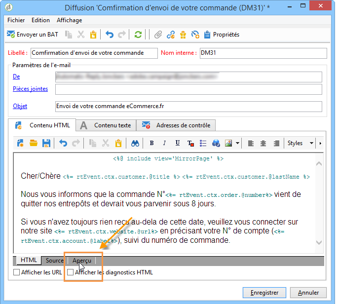
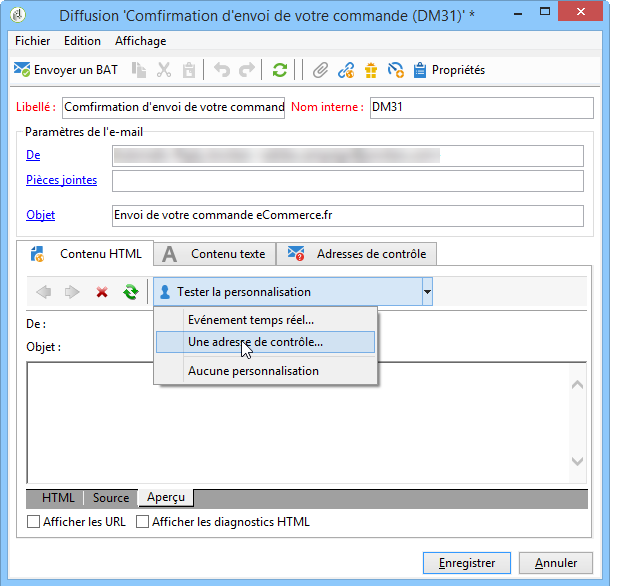
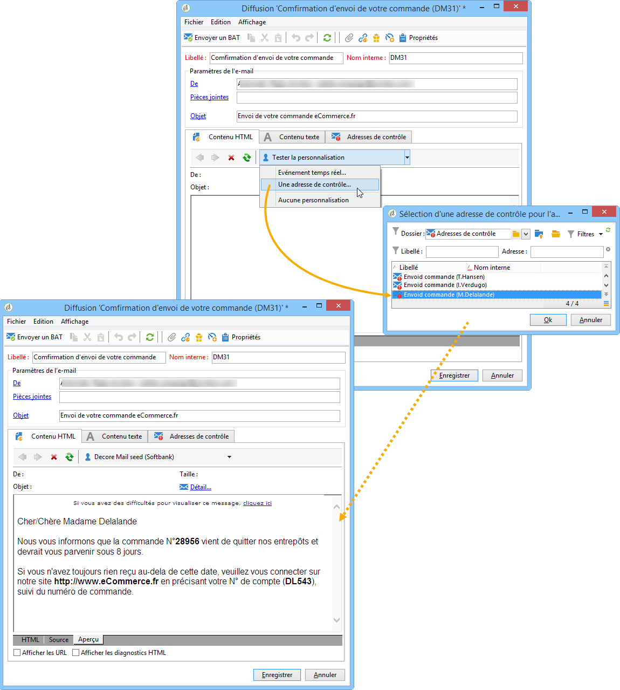

# Aperçu du message transactionnel{#transactional-message-preview}

Lorsque vous avez créé une ou plusieurs adresses de contrôle, ainsi que le corps du message, vous pouvez afficher l&#39;aperçu de votre message et vérifier la personnalisation de ce dernier.

1. Dans le modèle de message, cliquez sur l&#39;onglet **[!UICONTROL Aperçu]**.

   

1. Sélectionnez **[!UICONTROL Adresse de contrôle]** dans la liste déroulante.

   

1. Sélectionnez l&#39;adresse de contrôle préalablement créée afin d&#39;afficher le message personnalisé.

   
