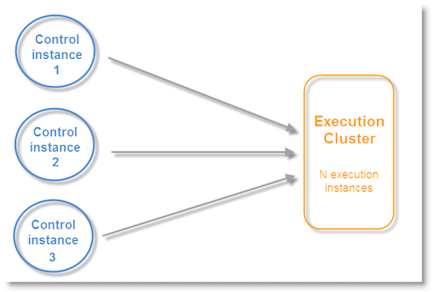

# Architecture des messages transactionnels{#transactional-messaging-architecture}

## A propos des instances d&#39;exécution et de pilotage {#about-execution-and-control-instances}

Dans Adobe Campaign, les fonctionnalités des messages transactionnels (appelées également Message Center) ont été conçues pour supporter les montées en charge et assurer un service en continu 24 h/24 et 7 j/7. Elles sont constituées de plusieurs instances :

* une instance de pilotage dans laquelle les modèles de messages sont créés,
* une ou plusieurs instances d&#39;exécution qui assurent la réception des événements et l&#39;envoi des messages.

Pour utiliser ces fonctionnalités, les utilisateurs d&#39;Adobe Campaign se connectent à l&#39;instance de pilotage afin de créer les modèles de messages transactionnels, générer l&#39;aperçu du message grâce à une adresse de contrôle, afficher des rapports et suivre les instances d&#39;exécution.

Les instances d&#39;exécution reçoivent les événements, les associent aux modèles de message transactionnel et envoient un message personnalisé pour chaque destinataire.


## Support de plusieurs instances de pilotage {#supporting-several-control-instances}

>[!CAUTION]
>
>Le partage d’une grappe d’exécution avec plusieurs instances de contrôle est uniquement pris en charge pour les environnements sur site.

Il est possible de mutualiser un cluster d&#39;exécution entre différentes instances de pilotage. Par exemple, si vous gérez plusieurs enseignes spécialisées, vous pouvez configurer une instance de pilotage par marque et toutes les relier au même cluster d&#39;exécution.



>[!NOTE]
>
>Pour plus d’informations sur la configuration requise, voir [Utilisation de plusieurs instances](../../message-center/using/creating-a-shared-connection.md#using-several-control-instances)de contrôle.

## Installation des instances {#installing-instances}

L&#39;installation des packages des messages transactionnels requiert de nombreuses précautions. Adobe recommande de travailler sur un environnement de test avant une mise en production. Il faut aussi posséder une licence Adobe Campaign compatible. Contactez votre chargé de compte Adobe pour plus d&#39;informations.

>[!CAUTION]
>
>L&#39;instance de contrôle et la ou les instances d&#39;exécution doivent être installées sur des machines différentes. Elles ne peuvent pas partager la même instance Campaign.

Si vous devez utiliser plusieurs canaux, vous devez installer et configurer les packages associés avant d’installer les packages de messages transactionnels. Reportez-vous à [Ajout d’un canal](#adding-a-delivery-channel)de distribution.

* Pour installer l&#39;instance de pilotage sur votre machine, sélectionnez le module **[!UICONTROL Pilotage des messages transactionnels]**.

   

* Pour installer l&#39;instance d&#39;exécution sur votre machine, sélectionnez le module **[!UICONTROL Exécution des messages transactionnels]**.

   

## Ajout d&#39;un canal de diffusion {#adding-a-delivery-channel}

L&#39;ajout d&#39;un canal de diffusion (Canal mobile, Mobile App Channel, etc.) doit être impérativement effectué avant l&#39;installation du package des messages transactionnels. Si vous avez démarré un projet des messages transactionnels sur le canal email, puis que vous décidez, au cours du projet, d&#39;ajouter un nouveau canal, vous devez suivre ces étapes :

1. Installez le canal dont vous avez besoin, par exemple le **Canal mobile**, à l&#39;aide de l&#39;assistant d&#39;import de package (**[!UICONTROL Outils > Avancé > Import de package... > Package Adobe Campaign]** ).
1. Effectuez une importation de fichier ( **[!UICONTROL Outils > Avancé > Importer un package... > Fichier]** ), puis sélectionnez le fichier ****`[Your language]`**datakitnmspackagemessageCenter.xml** .
1. Dans la partie **[!UICONTROL Contenu XML des données à importer]**, conservez uniquement le modèle de diffusion correspondant au canal ajouté. Par exemple, si vous avez ajouté le **Canal mobile**, conservez uniquement l&#39;élément **entities** correspondant au modèle **[!UICONTROL Message transactionnel mobile]** (smsTriggerMessage). Si vous avez ajouté le canal **Mobile App Channel**, conservez uniquement les modèles **Message transactionnel iOS** (iosTriggerMessage) et **Message transactionnel Android** (androidTriggerMessage).

   

## Messages transactionnels et Inbound Interaction {#transactional-messages-and-inbound-interaction}

Couplés au module Inbound Interaction, les messages transactionnels permettent d&#39;insérer dans le message une offre marketing dédiée au destinataire.

>[!NOTE]
>
>Le module Interaction est présenté dans le guide [Interaction](../../interaction/using/interaction-and-offer-management.md).

Pour utiliser les messages transactionnels avec Interaction, vous devez effectuer les paramétrages suivants :

* Installez le package **Interaction** sur l&#39;instance de pilotage et configurez votre catalogue d&#39;offres.

   >[!CAUTION]
   >
   >Ne répliquez pas les offres sur les instances d&#39;exécution.

* L&#39;évènement doit contenir un identifiant lié au destinataire afin de pouvoir personnaliser les offres. C&#39;est l&#39;attribut **@externalId** qui doit contenir la valeur de cet identifiant. **Interaction** est configuré par défaut pour identifier le destinataire sur la clé primaire :

   ```
   <rtEvent type="order_confirmation" email="john.doe@adobe.com" externalId="1242"> 
   ```

   Vous pouvez configurer **Interaction** pour que l&#39;identification s&#39;effectue sur le champ de votre choix, par exemple l&#39;adresse email :

   ```
   <rtEvent type="order_confirmation" email="john.doe@adobe.com" externalId="john.doe@yahoo.com"> 
   ```

Concevez vos modèles de diffusion de la même façon que pour une campagne email :

* Ajoutez l&#39;offre dans votre modèle de message transactionnel.
* Visualisez l&#39;aperçu, envoyez un BAT et publiez le modèle.

Vous devez également activer le mode unitaire sur vos emplacements d&#39;offres. Voir à ce sujet [cette section](../../interaction/using/creating-offer-spaces.md).

## Messages transactionnels et notifications push {#transactional-messaging-and-push-notifications}

Couplés au module Mobile App Channel, les messages transactionnels permettent d&#39;émettre des messages transactionnels au travers des notifications push sur des applications mobiles.

>[!NOTE]
>
>Mobile App Channel est présenté dans [cette section](../../delivery/using/about-mobile-app-channel.md).

Pour utiliser les modules des messages transactionnels avec Mobile App Channel, vous devez effectuer les paramétrages suivants :

1. Installez le package **Mobile App Channel** sur les instances de pilotage et d&#39;exécution.
1. Répliquez le service Adobe Campaign de type **Application mobile** ainsi que les applications mobiles qu&#39;il contient sur les instances d&#39;exécution.

L&#39;évènement doit contenir les éléments suivants :

* L&#39;identifiant de l&#39;appareil mobile (**registrationId** pour Android et **deviceToken** pour iOS). Cet identifiant représente &quot;l&#39;adresse&quot; à laquelle la notification sera envoyée.
* La définition du lien vers l&#39;application mobile ou clé d&#39;intégration (**uuid**) permettant de récupérer les informations de connexion spécifiques à l&#39;application.
* Le canal sur lequel la notification sera envoyée (**wishedChannel**) : 41 pour iOS et 42 pour Android
* Toutes les données utiles à la personnalisation

Voici un exemple de traitement d&#39;un événement contenant ces informations :

```
<SOAP-ENV:Envelope xmlns:xsd="http://www.w3.org/2001/XMLSchema" xmlns:xsi="http://www.w3.org/2001/XMLSchema-instance" xmlns:SOAP-ENV="http://schemas.xmlsoap.org/soap/envelope/">
   <SOAP-ENV:Body>
     <urn:PushEvent>
         <urn:sessiontoken>mc/</urn:sessiontoken>
         <urn:domEvent>

              <rtEvent wishedChannel="41" type="DELIVERY" registrationToken="2cefnefzef758398493srefzefkzq483974">
                <mobileApp _operation=”none” uuid="com.adobe.NeoMiles"/>
                <ctx>
                    <deliveryTime>1:30 PM</deliveryTime>
                    <url>http://www.adobe.com</url>
                </ctx>
              </rtEvent>

         </urn:domEvent>
     </urn:PushEvent>           
   </SOAP-ENV:Body>
</SOAP-ENV:Envelope>
```

>[!NOTE]
>
>La conception des modèles de messages reste la même.

## Messages transactionnels et LINE {#transactional-messaging-and-line}

Lorsqu&#39;ils sont combinés avec le canal LINE, les messages transactionnels permettent d&#39;envoyer des messages en temps réel sur l&#39;application LINE installée sur les appareils mobiles des clients. Ils sont utilisés pour envoyer le message de bienvenue lorsqu&#39;un utilisateur LINE ajoute la page de la marque.

Pour utiliser le module des messages transactionnels avec LINE, les éléments suivants sont nécessaires pour la configuration de votre instance **marketing** et de votre instance d&#39;**exécution** :

* Installez le package **[!UICONTROL LINE Connect]** sur les deux instances.
* Installez le package **[!UICONTROL Transactional message control]** sur l&#39;instance marketing et le package **[!UICONTROL Transactional message execution]** sur l&#39;instance d&#39;exécution.
* Créez un **compte externe** et un **service** LINE sur les deux instances avec des noms identiques pour les synchroniser. Pour plus d&#39;informations sur la création d&#39;un compte externe et d&#39;un service LINE, consultez cette [page](../../delivery/using/line-channel.md#creating-a-line-account-and-an-external-account-).

Depuis l&#39;**[!UICONTROL Explorateur]**, dans **[!UICONTROL Plateforme]** > **[!UICONTROL Compte externe]**, vous devez ensuite configurer les différents comptes externes sur les deux instances :

1. Créez un compte externe **[!UICONTROL Base externe]** dans l&#39;instance d&#39;**exécution** avec la configuration suivante :

   

   * **[!UICONTROL Libellé]** et **[!UICONTROL Nom interne]** : attribuez un nom à votre compte externe.
   * **[!UICONTROL Type]** : sélectionnez **[!UICONTROL Base externe]** .
   * La case **[!UICONTROL Activé]** doit être cochée.
   Dans la catégorie **[!UICONTROL Connexion]** :

   * **[!UICONTROL Type]** : sélectionnez votre serveur de base de données, par exemple PostgresSQL.
   * **[!UICONTROL Serveur]** : saisissez l&#39;URL du serveur de base de données.
   * **[!UICONTROL Compte]** : saisissez le compte de la base de données.

      >[!NOTE]
      >
      >L&#39;utilisateur de la base de données doit avoir des droits de lecture sur les tables suivantes pour la connexion FDA : XtkOption, NmsVisitor, NmsVisitorSub, NmsService, NmsBroadLogRtEvent, NmsBroadLogBatchEvent, NmsTrackingLogRtEvent, NmsTrackingLogBatchEvent, NmsRtEvent, NmsBatchEvent, NmsBroadLogMsg, NmsTrackingUrl, NmsDelivery, NmsWebTrackingLogXtkFolder.

   * **[!UICONTROL Mot de passe]** : saisissez le mot de passe du compte de la base de données.
   * **[!UICONTROL Base de données]** : saisissez le nom de la base de données de l&#39;instance d&#39;exécution.
   * La case **[!UICONTROL Cible d&#39;un compte Relais HTTP vers base distante]** doit être cochée.


1. Créez un compte **[!UICONTROL Base de données externe]** dans l&#39;instance **marketing** avec la configuration ci-dessous.

   

   * **[!UICONTROL Libellé]** et **[!UICONTROL Nom interne]** : attribuez un nom à votre compte externe.
   * **[!UICONTROL Type]** : sélectionnez **[!UICONTROL Base externe]** .
   * La case Activé doit être cochée.
   Dans la catégorie **[!UICONTROL Connexion]** :

   * **[!UICONTROL Type]** : sélectionnez **[!UICONTROL Relais HTTP vers base distante]** .
   * **[!UICONTROL Serveur]** : saisissez l&#39;URL du serveur Campaign de l&#39;instance d&#39;exécution.
   * **[!UICONTROL Compte]** : saisissez le compte utilisé pour accéder à l&#39;instance d&#39;exécution.
   * **[!UICONTROL Mot de passe]** : saisissez le mot de passe du compte utilisé pour accéder à l&#39;instance d&#39;exécution.
   * **[!UICONTROL Data Source]** : saisissez la syntaxe suivante **[!UICONTROL nms:extAccount:ID pour le compte de base de données externe dans l&#39;instance d&#39;exécution]** .


1. Créez un compte externe **[!UICONTROL Instance d&#39;exécution]** dans votre instance **marketing** à l&#39;aide de la configuration suivante pour créer le workflow de synchronisation des données :

   

   * **[!UICONTROL Libellé]** et **[!UICONTROL Nom interne]** : attribuez un nom à votre compte externe.
   * **[!UICONTROL Type]** : sélectionnez **[!UICONTROL Instance d&#39;exécution]** .
   * La case Activé doit être cochée.
   Dans la catégorie **[!UICONTROL Connexion]** :

   * **[!UICONTROL URL]** : saisissez l&#39;URL de l&#39;instance d&#39;exécution.
   * **[!UICONTROL Compte]** : saisissez le compte utilisé pour accéder à l&#39;instance d&#39;exécution.
   * **[!UICONTROL Mot de passe]** : saisissez le mot de passe du compte utilisé pour accéder à l&#39;instance d&#39;exécution.
   Dans la catégorie **[!UICONTROL Méthode de connexion au compte]** :

   * **[!UICONTROL Méthode]** : sélectionnez **[!UICONTROL Federated Data Access (FDA)]** .
   * **[!UICONTROL Compte FDA]** : sélectionnez votre compte FDA dans la liste déroulante.
   * Cliquez sur le bouton **[!UICONTROL Créer le workflow d&#39;archivage]**.
   * Cliquez sur le bouton **[!UICONTROL Créer le workflow de synchronisation des données]** pour créer le workflow de synchronisation des données LINE.


1. Vous pouvez maintenant commencer à créer des messages transactionnels. Pour plus d&#39;informations, consultez cette [page](../../message-center/using/introduction.md).
