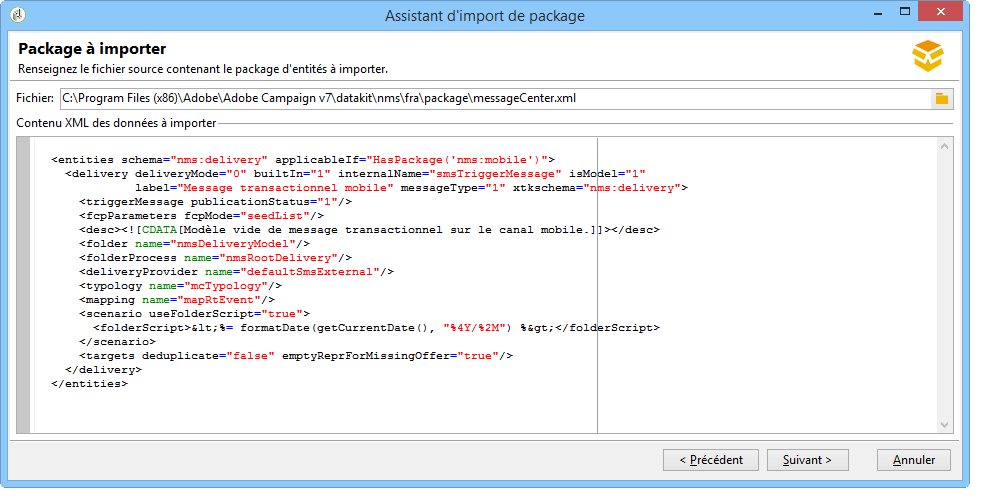

# Architecture des messages transactionnels {#transactional-messaging-architecture}


Les messages transactionnels reposent sur une architecture spécifique, composée de plusieurs instances :

* une **instance de pilotage** dans laquelle les modèles de messages sont créés ;

* une ou plusieurs **instances d&#39;exécution** qui assurent la réception des événements et l&#39;envoi des messages.


| Instance de pilotage | Instance d&#39;exécution |
|--- |--- |
| Les utilisateurs d&#39;Adobe Campaign se connectent à l&#39;instance de pilotage pour : <ul><li>Créer des modèles de messages transactionnels</li><li>Générer l&#39;aperçu du message à l&#39;aide d&#39;une liste d&#39;adresses de contrôle</li><li>Afficher les rapports</li><li>Surveiller les instances d&#39;exécution</li></ul> | Les instances d&#39;exécution sont là pour : <ul><li>Recevoir des événements</li><li>Les lier à des modèles de messages transactionnels</li><li>Envoyer un message personnalisé à chaque destinataire</li></ul> |

## Installation des instances {#installing-instances}

L&#39;installation des packages des messages transactionnels requiert de nombreuses précautions. Adobe recommande de travailler sur un environnement de test avant une mise en production. Il faut aussi posséder une licence Adobe Campaign compatible. Contactez votre chargé de compte Adobe pour plus d&#39;informations.

>[!IMPORTANT]
>
>L&#39;instance de contrôle et la ou les instances d&#39;exécution doivent être installées sur des machines différentes. Elles ne peuvent pas partager la même instance Campaign.

Si vous devez utiliser plusieurs canaux, vous devez installer et configurer les packages associés avant l&#39;installation des packages des messages transactionnels. Pour plus d&#39;informations, consultez la section [Ajouter un canal de diffusion](#adding-a-delivery-channel).

## Instance de pilotage {#control-instance}

Pour installer l&#39;instance de pilotage sur votre machine, sélectionnez le package **[!UICONTROL Contrôle des messages transactionnels]** via le menu **[!UICONTROL Outils]** > **[!UICONTROL Avancé]** > **[!UICONTROL Import de package]**. Pour plus d&#39;informations, voir la section [Installer des packages standard Campaign Classic](../../installation/using/installing-campaign-standard-packages.md).


Les étapes détaillées pour configurer l&#39;instance de pilotage sont présentées dans [cette section](../../message-center/using/configuring-instances.md#control-instance).

### Support de plusieurs instances de pilotage {#supporting-several-control-instances}

>[!IMPORTANT]
>
>Le partage d&#39;un cluster d&#39;exécution avec plusieurs instances de pilotage est uniquement pris en charge pour les environnements on-premise.

Il est possible de mutualiser un cluster d&#39;exécution entre différentes instances de pilotage. Par exemple, si vous gérez plusieurs enseignes spécialisées, vous pouvez configurer une instance de pilotage par marque et toutes les relier au même cluster d&#39;exécution.


>[!NOTE]
>
>Pour plus d&#39;informations sur la configuration requise, voir [Utilisation de plusieurs instances de pilotage](../../message-center/using/configuring-instances.md#using-several-control-instances).

## Instance d&#39;exécution {#execution-instance}

Pour installer une instance d&#39;exécution sur votre machine, sélectionnez le package **[!UICONTROL Exécution de messages transactionnels]** via le menu **[!UICONTROL Outils]** > **[!UICONTROL Avancé]** > **[!UICONTROL Import de package]**. Pour plus d&#39;informations, voir la section [Installer des packages standard Campaign Classic](../../installation/using/installing-campaign-standard-packages.md).


Les étapes détaillées pour configurer une instance d&#39;exécution sont présentées dans [cette section](../../message-center/using/configuring-instances.md#execution-instance).

## Canaux de diffusion disponibles

Le canal email est disponible par défaut. Pour diffuser vos messages transactionnels sur plusieurs canaux, vous pouvez ajouter d&#39;autres canaux (canal mobile, canal des applications mobiles, etc.).

>[!IMPORTANT]
>
>L&#39;ajout d&#39;un canal de diffusion (canal mobile, canal des applications mobiles, etc.) doit être réalisé avant d&#39;installer le package Message transactionnel.

### Ajout d&#39;un canal de diffusion {#adding-a-delivery-channel}

Adobe vous recommande de **toujours ajouter le package de canal de diffusion avant d&#39;installer le package Message transactionnel**.

Cependant, si vous avez démarré un projet de message transactionnel sur le canal email, puis que vous décidez au cours du projet d&#39;ajouter un nouveau canal, vous pouvez suivre les étapes ci-dessous.

>[!NOTE]
>
>Cette procédure s&#39;applique uniquement aux clients utilisant un serveur Windows NLServer installé sur le même ordinateur que celui sur lequel ils travaillent.

1. Installez le canal dont vous avez besoin, par exemple le **Canal mobile**, à l’aide de l’assistant d’import de package (**[!UICONTROL Outils > Avancé > Import de package... > Package Adobe Campaign]**).
1. Effectuez un import de fichier (**[!UICONTROL Outils > Avancé > Importer un package... > Fichier]**), puis sélectionnez le fichier **datakitnms **`[Your language]`**packagemessageCenter.xml**.
1. Dans la partie **[!UICONTROL Contenu XML des données à importer]**, conservez uniquement le modèle de diffusion correspondant au canal ajouté. Par exemple, si vous avez ajouté le **Canal mobile**, conservez uniquement l&#39;élément **entities** correspondant au modèle **[!UICONTROL Message transactionnel mobile]** (smsTriggerMessage). Si vous avez ajouté le **Canal des applications mobiles**, conservez uniquement les modèles **Message transactionnel iOS** (iosTriggerMessage) et **Message transactionnel Android** (androidTriggerMessage).

   

<!--## Transactional messages and inbound Interaction {#transactional-messages-and-inbound-interaction}

When combined with the Inbound Interaction module, transactional messaging enables you to insert a marketing offer dedicated to the recipient into the message.

>[!NOTE]
>
>The Interaction module is detailed in [Interaction](../../interaction/using/interaction-and-offer-management.md).

To use transactional messaging with Interaction, you need to apply the following configurations:

* Install the **Interaction** package onto the control instance and configure your offer catalog.

  >[!IMPORTANT]
  >
  >Do not replicate the offers onto the execution instances.

* The event must include an identifier linked to the recipients, for personalizing offers. The **@externalId** attribute must contain the value of this identifier. **Interaction** is configured by default to identify the recipient of the primary key:

  ```
  <rtEvent type="order_confirmation" email="john.doe@adobe.com" externalId="1242"> 
  ```

  You can configure **Interaction** so that identification takes place in the field of your choice, for example on the email address:

  ```
  <rtEvent type="order_confirmation" email="john.doe@adobe.com" externalId="john.doe@yahoo.com"> 
  ```

Create your delivery templates the way you would for an email campaign:

* Add the offer to your transactional message template.
* Check the preview, send a proof and publish the template.

You also have to enable the unitary mode on your offer spaces. For more on this, refer to [this section](../../interaction/using/creating-offer-spaces.md).-->

### Notifications push transactionnelles {#transactional-messaging-and-push-notifications}

Couplés au module Canal des applications mobiles, les messages transactionnels permettent d’émettre des messages transactionnels au travers des notifications push sur des appareils mobiles.

>[!NOTE]
>
>Le canal des applications mobiles est présenté dans [cette section](../../delivery/using/about-mobile-app-channel.md).

Pour utiliser les modules des messages transactionnels avec le canal des applications mobiles, vous devez effectuer les paramétrages suivants :

1. Installez le package **Canal des applications mobiles** sur les instances de pilotage et d&#39;exécution.
1. Répliquez le service Adobe Campaign de type **Application mobile** ainsi que les applications mobiles qu&#39;il contient sur les instances d&#39;exécution.

L&#39;évènement doit contenir les éléments suivants :

* L&#39;identifiant de l&#39;appareil mobile (**registrationId** pour Android et **deviceToken** pour iOS). Cet identifiant représente &quot;l&#39;adresse&quot; à laquelle la notification sera envoyée.
* La définition du lien vers l&#39;application mobile ou clé d&#39;intégration (**uuid**) permettant de récupérer les informations de connexion spécifiques à l&#39;application.
* Le canal sur lequel la notification sera envoyée (**wishedChannel**) : 41 pour iOS et 42 pour Android
* Toutes les données utiles à la personnalisation

Voici un exemple de traitement d&#39;un événement contenant ces informations :

```
<SOAP-ENV:Envelope xmlns:xsd="http://www.w3.org/2001/XMLSchema" xmlns:xsi="http://www.w3.org/2001/XMLSchema-instance" xmlns:SOAP-ENV="http://schemas.xmlsoap.org/soap/envelope/">
   <SOAP-ENV:Body>
     <urn:PushEvent>
         <urn:sessiontoken>mc/</urn:sessiontoken>
         <urn:domEvent>

              <rtEvent wishedChannel="41" type="DELIVERY" registrationToken="2cefnefzef758398493srefzefkzq483974">
                <mobileApp _operation="none" uuid="com.adobe.NeoMiles"/>
                <ctx>
                    <deliveryTime>1:30 PM</deliveryTime>
                    <url>http://www.adobe.com</url>
                </ctx>
              </rtEvent>

         </urn:domEvent>
     </urn:PushEvent>           
   </SOAP-ENV:Body>
</SOAP-ENV:Envelope>
```

>[!NOTE]
>
>La conception des modèles de messages reste la même.

### Messages transactionnels et LINE {#transactional-messaging-and-line}

Lorsqu&#39;ils sont combinés avec le canal LINE, les messages transactionnels permettent d&#39;envoyer des messages en temps réel sur l&#39;application LINE installée sur les appareils mobiles des clients. Ils sont utilisés pour envoyer le message de bienvenue lorsqu&#39;un utilisateur LINE ajoute la page de la marque.

Pour utiliser le module des messages transactionnels avec LINE, les éléments suivants sont nécessaires pour la configuration de votre instance **marketing** et de votre instance d&#39;**exécution** :

* Installez le package **[!UICONTROL LINE Connect]** sur les deux instances.
* Installez le package **[!UICONTROL Transactional message control]** sur l&#39;instance marketing et le package **[!UICONTROL Transactional message execution]** sur l&#39;instance d&#39;exécution.
* Créez un **compte externe** et **service** LINE sur les deux instances avec des noms identiques pour les synchroniser. Pour plus d&#39;informations sur la création d&#39;un compte externe et d&#39;un service LINE, consultez [cette section](../../delivery/using/line-channel.md#setting-up-line-channel).

Depuis l&#39;**[!UICONTROL Explorateur]**, dans **[!UICONTROL Plateforme]** > **[!UICONTROL Compte externe]**, vous devez ensuite configurer les différents comptes externes sur les deux instances :

1. Créez un compte externe **[!UICONTROL Base externe]** dans l&#39;instance d&#39;**exécution** avec la configuration suivante :

   

   * **[!UICONTROL Libellé]** et **[!UICONTROL Nom interne]** : attribuez un nom à votre compte externe.
   * **[!UICONTROL Type]** : sélectionnez **[!UICONTROL Base externe]** .
   * La case **[!UICONTROL Activé]** doit être cochée.

   Dans la catégorie **[!UICONTROL Connexion]** :

   * **[!UICONTROL Type]** : sélectionnez votre serveur de base de données, par exemple PostgresSQL.
   * **[!UICONTROL Serveur]** : saisissez l&#39;URL du serveur de base de données.
   * **[!UICONTROL Compte]** : saisissez le compte de la base de données.

     >[!NOTE]
     >
     >L&#39;utilisateur de la base de données doit avoir des droits de lecture sur les tables suivantes pour la connexion FDA : XtkOption, NmsVisitor, NmsVisitorSub, NmsService, NmsBroadLogRtEvent, NmsBroadLogBatchEvent, NmsTrackingLogRtEvent, NmsTrackingLogBatchEvent, NmsRtEvent, NmsBatchEvent, NmsBroadLogMsg, NmsTrackingUrl, NmsDelivery, NmsWebTrackingLogXtkFolder.

   * **[!UICONTROL Mot de passe]** : saisissez le mot de passe du compte de la base de données.
   * **[!UICONTROL Base de données]** : saisissez le nom de la base de données de l&#39;instance d&#39;exécution.
   * La case **[!UICONTROL Cible d&#39;un compte Relais HTTP vers base distante]** doit être cochée.

1. Créez un compte **[!UICONTROL Base de données externe]** dans l&#39;instance **marketing** avec la configuration ci-dessous.

   

   * **[!UICONTROL Libellé]** et **[!UICONTROL Nom interne]** : attribuez un nom à votre compte externe.
   * **[!UICONTROL Type]** : sélectionnez **[!UICONTROL Base externe]** .
   * La case Activé doit être cochée.

   Dans la catégorie **[!UICONTROL Connexion]** :

   * **[!UICONTROL Type]** : sélectionnez **[!UICONTROL Relais HTTP vers base distante]** .
   * **[!UICONTROL Serveur]** : saisissez l&#39;URL du serveur Campaign de l&#39;instance d&#39;exécution.
   * **[!UICONTROL Compte]** : saisissez le compte utilisé pour accéder à l&#39;instance d&#39;exécution.
   * **[!UICONTROL Mot de passe]** : saisissez le mot de passe du compte utilisé pour accéder à l&#39;instance d&#39;exécution.
   * **[!UICONTROL Source de données]** : saisissez la syntaxe suivante **`nms:extAccount:ID`** de votre compte de base de données externe dans l&#39;instance d&#39;exécution.

1. Créez un compte externe **[!UICONTROL Instance d&#39;exécution]** dans votre instance **marketing** à l&#39;aide de la configuration suivante pour créer le workflow de synchronisation des données :

   

   * **[!UICONTROL Libellé]** et **[!UICONTROL Nom interne]** : attribuez un nom à votre compte externe.
   * **[!UICONTROL Type]** : sélectionnez **[!UICONTROL Instance d&#39;exécution]** .
   * La case Activé doit être cochée.

   Dans la catégorie **[!UICONTROL Connexion]** :

   * **[!UICONTROL URL]** : saisissez l&#39;URL de l&#39;instance d&#39;exécution.
   * **[!UICONTROL Compte]** : saisissez le compte utilisé pour accéder à l&#39;instance d&#39;exécution.
   * **[!UICONTROL Mot de passe]** : saisissez le mot de passe du compte utilisé pour accéder à l&#39;instance d&#39;exécution.

   Dans la catégorie **[!UICONTROL Méthode de connexion au compte]** :

   * **[!UICONTROL Méthode]** : sélectionnez **[!UICONTROL Federated Data Access (FDA)]** .
   * **[!UICONTROL Compte FDA]** : sélectionnez votre compte FDA dans la liste déroulante.
   * Cliquez sur le bouton **[!UICONTROL Créer le workflow d&#39;archivage]**.
   * Cliquez sur le bouton **[!UICONTROL Créer le workflow de synchronisation des données]** pour créer le workflow de synchronisation des données LINE.

1. Vous pouvez maintenant [créer des messages transactionnels](../../message-center/using/creating-the-message-template.md).
