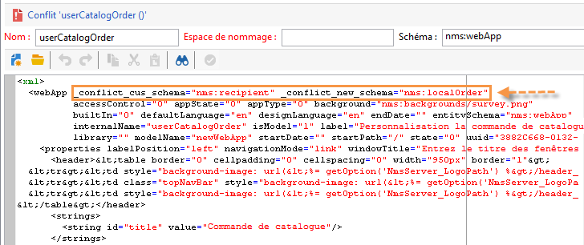
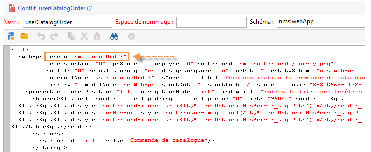
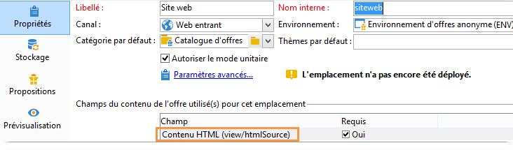
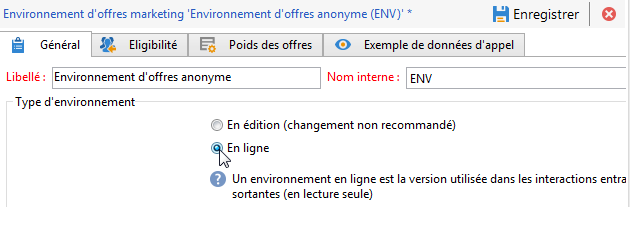
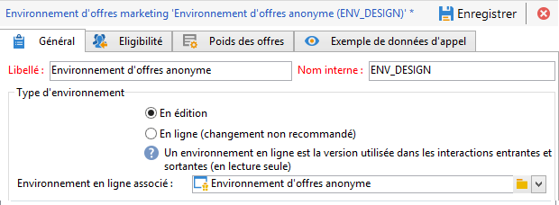
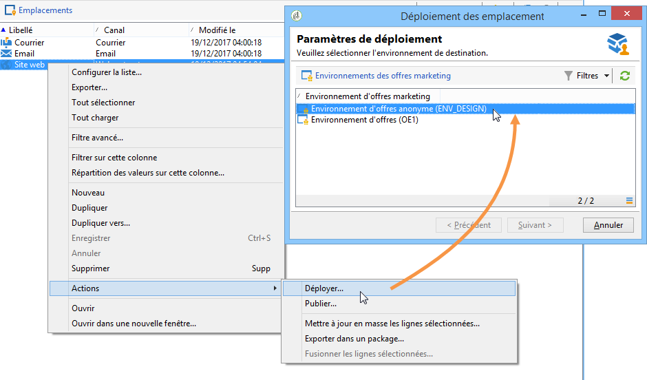
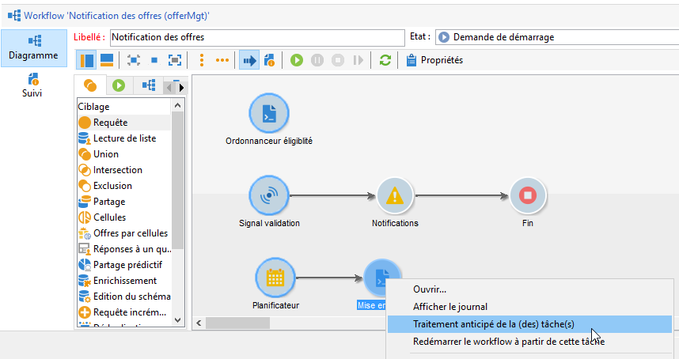
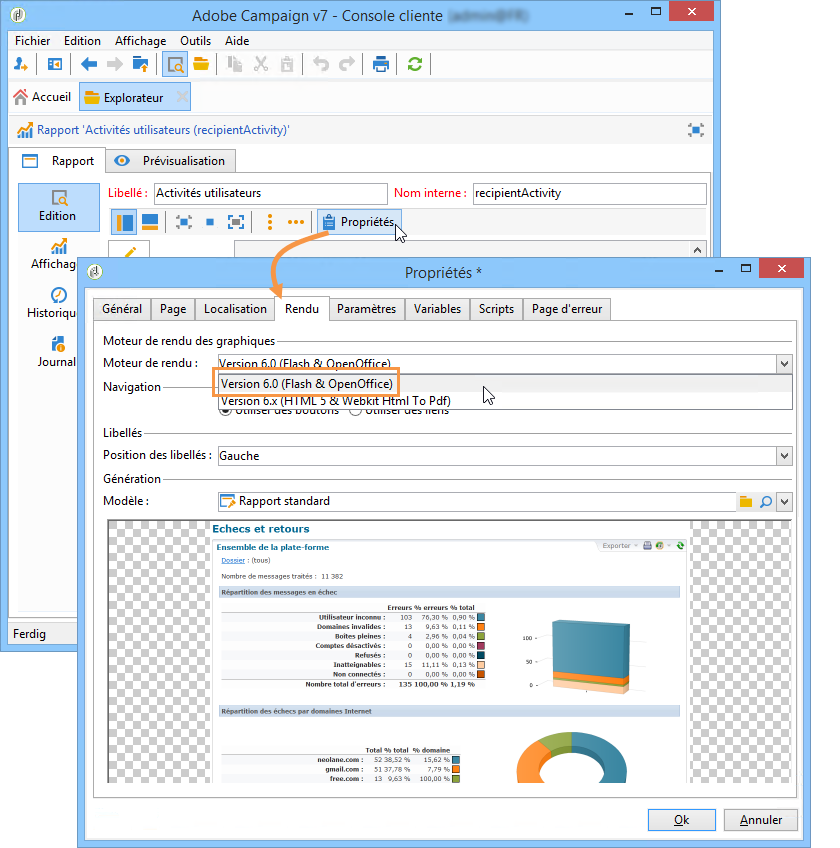

# Paramétrages généraux{#general-configurations}


Cette section décrit les paramétrages à effectuer dans Adobe Campaign v7 lors de la migration depuis une v5.11 ou une v6.02.

En complément :

* Si vous migrez depuis une v5.11, vous devez également effectuer la configuration présentée en détail dans [cette section](../../migration/using/configuring-your-platform.md#specific-configurations-in-v5-11).
* Si vous migrez depuis une v6.02, vous devez également effectuer la configuration présentée en détail dans [cette section](../../migration/using/configuring-your-platform.md#specific-configurations-in-v6-02).

## Fuseaux horaires {#time-zones}

### Mode multi timezone {#multi-time-zone-mode}

Le mode &quot;multi timezone&quot; n&#39;était disponible, en v6.02, que pour les moteurs de base de données PostgreSQL. Il est à présent proposé quelle que soit la version de votre moteur de base. Nous vous recommandons fortement de transformer votre base en base &quot;multi timezone&quot;.

Pour utiliser le mode TIMESTAMP WITH TIMEZONE, vous devez également ajouter l&#39;option **‑usetimestamptz:1** dans la ligne de commande du postupgrade.

>[!IMPORTANT]
>
>En cas d&#39;utilisation du paramètre **-usetimestamptz:1** avec un moteur de base non compatible, votre base de données sera corrompue et il vous sera alors nécessaire de restaurer une sauvegarde de votre base de données et de ré-exécuter la commande ci-dessous.

>[!NOTE]
>
>Il est possible de modifier le fuseau horaire après la migration via la console (noeud **[!UICONTROL Administration > Plateforme > Options > WdbcTimeZone]**).
>
>Pour plus d&#39;informations sur la gestion des fuseaux horaires, consultez [cette section](../../installation/using/time-zone-management.md).

### Oracle {#oracle}

Si vous obtenez l&#39;erreur **ORA 01805** lors du postupgrade, cela signifie qu&#39;il existe une désynchronisation des fichiers de fuseaux horaires Oracle entre le serveur applicatif et le serveur de base. La procédure de resynchronisation est la suivante :

1. Pour identifier le fichier de fuseau horaire utilisé, exécutez la commande suivante :

   ```
   select * from v$timezone_file
   ```

   Les fichiers de fuseau horaire sont en général situés dans le dossier **ORACLE_HOME/oracore/zoneinfo/**.

1. Assurez-vous que les fichiers de fuseau horaire sont bien les mêmes sur les deux serveurs.

Pour plus d&#39;informations, consultez le site : [https://docs.oracle.com/cd/E11882_01/server.112/e10729/ch4datetime.htm#NLSPG004](https://docs.oracle.com/cd/E11882_01/server.112/e10729/ch4datetime.htm#NLSPG004)

Une différence de fuseau horaire entre le client et le serveur peut également entraîner des retards. C&#39;est pourquoi nous recommandons d&#39;utiliser la même version de la bibliothèque Oracle du côté client et du côté serveur. Les deux fuseaux horaires doivent être identiques.

Pour vérifier si les deux côtés sont sur les mêmes fuseaux horaires :

1. Vérifiez la version du fichier de fuseau horaire du côté client en exécutant la commande suivante :

   ```
   genezi -v
   ```

   genezi est un binaire qui se trouve dans le référentiel **$ORACLE_HOME/bin**.

1. Vérifiez la version du fichier de fuseau horaire du côté serveur en exécutant la commande suivante :

   ```
   select * from v$timezone_file
   ```

1. Pour modifier le fichier de fuseau horaire du côté client, utilisez la variable d&#39;environnement **ORA_TZFILE**.

## Sécurité {#security}

### Zones de sécurité {#security-zones}

>[!IMPORTANT]
>
>Pour des raisons de sécurité, la plateforme Adobe Campaign n&#39;est plus accessible par défaut : vous devez configurer les zones de sécurité, et pour cela collecter les adresses IP des utilisateurs.

Adobe Campaign v7 implique le concept de **zones de sécurité**. Chaque utilisateur doit être associé à une zone pour se connecter à une instance et l&#39;adresse IP de l&#39;utilisateur doit faire partie des adresses ou des plages d&#39;adresses définies dans la zone de sécurité. Le paramétrage des zones de sécurité peut être effectué dans le fichier de configuration du serveur Adobe Campaign. L&#39;association d&#39;un utilisateur à une zone de sécurité doit être définie dans la console (**[!UICONTROL Administration > Gestion des accès > Opérateurs]**).

**Avant la migration**, vous devez définir, avec l&#39;aide de votre administrateur réseau, les zones de sécurité qu&#39;il faudra activer après la migration.

**Après le postupgrade** (avant le redémarrage du serveur), vous devez configurer les zones de sécurité.

La configuration des zones de sécurité est présentée dans [cette section](../../installation/using/security-zones.md).

### Mots de passe des opérateurs {#user-passwords}

Dans v7, la connexion de l&#39;opérateur **interne** et **administrateur** doit être sécurisée par un mot de passe. Nous vous recommandons vivement d&#39;affecter des mots de passe à ces comptes et à tous les comptes d&#39;opérateurs **avant la migration**. Si vous n&#39;avez pas spécifié de mot de passe pour la connexion **interne**, vous ne pourrez pas vous connecter. Pour attribuer un mot de passe à la connexion **interne**, saisissez la commande suivante :

```
nlserver config -internalpassword
```

>[!IMPORTANT]
>
>Le mot de passe **interne** doit être identique pour tous les serveurs de tracking. Pour plus d&#39;informations, consultez [cette section](../../installation/using/configuring-campaign-server.md#internal-identifier) et [cette section](../../platform/using/access-management.md).

### Nouveautés v7 {#new-features-in-v7}

* Les utilisateurs n&#39;ayant aucun droit ne peuvent plus se connecter à Adobe Campaign. Il est nécessaire de leur ajouter manuellement un droit, en créant par exemple un droit nommé **connect**.

  Les utilisateurs impactés par cette modification sont identifiés et listés lors du postupgrade.

* Le tracking ne fonctionne plus si le mot de passe est vide. Le cas échéant, un message d&#39;erreur vous en informe et vous invite à le reconfigurer.
* Les mots de passe utilisateur ne sont plus stockés dans le schéma **xtk:sessionInfo**.
* Les autorisations d’administration sont désormais nécessaires pour utiliser les fonctions **`xtk:builder:EvaluateJavaScript`** et **`xtk:builder:EvaluateJavaScriptTemplate`**.

Certains schémas d&#39;usine ont été modifiés et ne sont désormais accessibles en écriture, par défaut, que par les opérateur possédant le droit **admin** :

* ncm:publishing
* nl:monitoring
* nms:calendar
* xtk:builder
* xtk:connections
* xtk:dbInit
* xtk:entityBackupNew
* xtk:entityBackupOriginal
* xtk:entityOriginal
* xtk:form
* xtk:funcList
* xtk:fusion
* xtk:image
* xtk:javascript
* xtk:jssp
* xtk:jst
* xtk:navtree
* xtk:operatorGroup
* xtk:package
* xtk:queryDef
* xtk:resourceMenu
* xtk:rights
* xtk:schema
* xtk:scriptContext
* xtk:specFile
* xtk:sql
* xtk:sqlSchema
* xtk:srcSchema
* xtk:strings
* xtk:xslt

### Paramètre sessiontoken {#sessiontoken-parameter}

Dans la version 5, le paramètre **sessiontoken** fonctionnait à la fois côté client (liste des écrans de type d&#39;aperçu, éditeur de lien, etc.) et côté serveur (applications web, rapports, jsp, jssp, etc.). Dans v7, il ne fonctionne que côté serveur. Si vous souhaitez revenir aux fonctionnalités complète telles que dans la version 5, vous devez modifier les liens à l&#39;aide de ce paramètre et les transmettre via la page de connexion :

Exemple de lien :

```
/view/recipientOverview?__sessiontoken=<trusted login>
```

Nouveau lien utilisant la page de connexion :

```
/nl/jsp/logon.jsp?login=<trusted login>&action=submit&target=/view/recipientOverview
```

>[!IMPORTANT]
>
>Si vous utilisez un opérateur associé à un masque IP de confiance, vérifiez que celui-ci dispose des droits minimum et qu&#39;il est dans une zone de sécurité en mode **sessionTokenOnly**.

### Fonctions SQL {#sql-functions}

Les appels de fonctions SQL inconnues ne sont plus naturellement transmis au serveur. Toutes les fonctions SQL doivent à présent être ajoutées dans le schéma **xtk:funcList** (voir à ce sujet [cette section](../../configuration/using/adding-additional-sql-functions.md)). Dans le cadre d&#39;une migration, une option est ajoutée lors du postupgrade permettant de conserver la compatibilité avec d&#39;anciennes fonctions SQL non déclarées. Si vous souhaitez continuer à utiliser ces fonctions, vérifiez que l&#39;option **XtkPassUnknownSQLFunctionsToRDBMS** est bien définie au niveau du nœud **[!UICONTROL Administration > Plateforme > Options]**.

>[!IMPORTANT]
>
>L&#39;utilisation de cette option est hautement déconseillée en raison des risques de sécurité qu&#39;elle introduit.

### JSSP {#jssp}

Si vous souhaitez autoriser l&#39;accès à certaines pages via le protocole HTTP (et non HTTPS), par exemple vos applications web, indépendamment de la configuration réalisée dans les zones de sécurité, vous devez spécifier le paramètre **httpAllowed=&quot;true&quot;** dans la règle de relais correspondante.

Si vous utilisez des JSSP anonymes, vous devez ajouter le paramètre **httpAllowed=&quot;true&quot;** dans une règle de relais pour votre JSSP (fichier **[!UICONTROL serverConf.xml]**) :

Par exemple :

```
<url IPMask="" deny="" hostMask="" httpAllowed="true" relayHost="true" relayPath="true"
           status="blacklist" targetUrl="https://localhost:8080" timeout="" urlPath="*/cus/myPublicPage.jssp"/>
```

## Syntaxe {#syntax}

### JavaScript {#javascript}

Adobe Campaign v7 intègre un interpréteur JavaScript plus récent. Toutefois, cette mise à jour peut entraîner le mauvais fonctionnement de certains scripts. Comme le moteur précédent était plus permissif, certaines syntaxes fonctionneraient, ce qui n&#39;est plus le cas avec la nouvelle version du moteur.

Le **[!UICONTROL myObject.La syntaxe @attribute]** n&#39;est désormais valide que pour les objets XML. Cette syntaxe peut être utilisée pour personnaliser les diffusions et la gestion de contenu. Si vous avez utilisé ce type de syntaxe sur un objet non XML, les fonctions de personnalisation ne fonctionneront plus.

Pour tous les autres types d&#39;objet, la syntaxe est désormais **[!UICONTROL myObject`[`&quot;attribute&quot;`]`]**. Par exemple, un objet non XML qui utilisait la syntaxe suivante : **[!UICONTROL employee.@sn]**, doit maintenant utiliser la syntaxe suivante : **[!UICONTROL employee`[`&quot;sn&quot;`]`]**.

* Ancienne syntaxe :

  ```
  employee.@sn
  ```

* Nouvelle syntaxe :

  ```
  employee["sn"]
  ```

A présent, pour modifier une valeur dans un objet XML, il faut d&#39;abord mettre à jour la valeur avant d&#39;ajouter le noeud XML :

* Ancien code Javascript :

  ```
  var cellStyle = node.style.copy();
  this.styles.appendChild(cellStyle);
  cellStyle.@width = column.@width;
  ```

* Nouveau code Javascript :

  ```
  var cellStyle = node.style.copy();
  cellStyle.@width = column.@width;
  this.styles.appendChild(cellStyle);
  ```

Il n&#39;est plus possible d&#39;utiliser un attribut XML comme clé d&#39;un tableau.

* Ancienne syntaxe :

  ```
  if(serverForm.activities[ctx.activityHistory.activity[0].@name].type !="end")
  ```

* Nouvelle syntaxe :

  ```
  if(serverForm.activities[String(ctx.activityHistory.activity[0].@name)].type !="end"
  ```

### SQLData {#sqldata}

Afin de renforcer la sécurité des instances, une nouvelle syntaxe a été introduite dans Adobe Campaign v7 pour remplacer la syntaxe basée sur SQLData. Si vous utilisez ces éléments de code avec cette syntaxe, vous devez les modifier. Les principaux éléments concernés sont les suivants :

* Le filtrage par sous-requêtes : la nouvelle syntaxe est basée sur l&#39;élément `<subQuery>` pour définir une sous-requête
* Les agrégats : la nouvelle syntaxe est &quot;fonction agrégat(collection)&quot;
* Le filtrage par jointure : la nouvelle syntaxe est `[schemaName:alias:xPath]`

Le schéma queryDef (xtk:queryDef) a été modifié :

* un nouvel élément `<subQuery>` est disponible pour remplacer le SELECT inclus dans du SQLData
* deux nouvelles valeurs &quot;IN&quot; et &quot;NOT IN&quot; sont introduites pour l&#39;attribut @setOperator
* un nouvel élément `<where>`, enfant de l&#39;élément `<node>` : ceci permet de faire des « sous-sélections » dans SELECT

Lorsqu&#39;un attribut de type &quot;@expr&quot; est utilisé, le SQLData peut être présent. Une recherche peut être effectuée sur les termes suivants : &quot;SQLData&quot;, &quot;aliasSqlTable&quot;, &quot;sql&quot;.

Les instances d&#39;Adobe Campaign v7 sont sécurisées par défaut. La sécurisation intervient au niveau des définitions de zones de sécurité dans le fichier **[!UICONTROL serverConf.xml]** : l&#39;attribut **allowSQLInjection** gère la sécurisation de la syntaxe SQL.

En cas d&#39;erreur SQLData lors de l&#39;exécution du postupgrade, vous devez modifier cet attribut afin d&#39;autoriser temporairement l&#39;utilisation des syntaxes basées sur le SQLData, le temps de réécrire le code. Pour cela, l&#39;option suivante doit être modifiée dans le fichier **serverConf.xml** :

```
allowSQLInjection="true"
```

Relancez alors le postupgrade avec la commande suivante :

```
nlserver config -postupgrade -instance:<instance_name> -force
```

Vous devrez ensuite configurer les zones de sécurité (voir [Sécurité](#security)) puis réactiver la sécurisation en modifiant l&#39;option :

```
allowSQLInjection="false"
```

Vous trouverez ci-dessous des exemples comparatifs entre l&#39;ancienne et la nouvelle syntaxe.

**Le filtrage par sous-requêtes**

* Ancienne syntaxe :

  ```
  <condition expr="@id NOT IN ([SQLDATA[SELECT iOperatorId FROM XtkOperatorGroup WHERE iGroupId = $(../@owner-id)]])" enabledIf="$(/ignored/@ownerType)=1"/>
  ```

* Nouvelle syntaxe :

  ```
  <condition setOperator="NOT IN" expr="@id" enabledIf="$(/ignored/@ownerType)=1">
    <subQuery schema="xtk:operatorGroup">
       <select>
         <node expr="[@operator-id]" />
       </select>
       <where>
         <condition expr="[@group-id]=$long(../@owner-id)"/>
       </where>
     </subQuery>
  </condition>
  ```

* Ancienne syntaxe :

  ```
  <queryFilter name="dupEmail" label="Emails duplicated in the folder" schema="nms:recipient">
      <where>
        <condition sql="sEmail in (select sEmail from nmsRecipient where iFolderId=$(folderId) group by sEmail having count(sEmail)>1)" internalId="1"/>
      </where>
      <folder _operation="none" name="nmsSegment"/>
    </queryFilter>
  ```

* Nouvelle syntaxe :

  ```
  <queryFilter name="dupEmail" label=" Emails duplicated in the folder " schema="nms:recipient">
      <where>
        <condition expr="@email" setOperator="IN" internalId="1">
          <subQuery schema="nms:recipient">
            <select><node expr="@email"/></select>
            <where><condition expr="[@folder-id]=$(folderId)"/></where>
            <groupBy><node expr="@email"/></groupBy>
            <having><condition expr="count(@email)>1"/></having>
          </subQuery>
        </condition>
      </where>
      <folder _operation="none" name="nmsSegment"/>
    </queryFilter>
  ```

**L&#39;agrégat**

fonction agrégat(collection)

* Ancienne syntaxe :

  ```
  <node sql="(select count(*) from NmsNewsgroup WHERE O0.iOperationId=iOperationId)" alias="@nbMessages"/>
  ```

* Nouvelle syntaxe :

  ```
  <node expr="count([newsgroup/@id])" alias="../@nbMessages"/>
  ```

  >[!NOTE]
  >
  >Les jointures sont faites automatiquement pour les fonctions d&#39;agrégat. Il n&#39;est plus nécessaire de préciser la condition WHERE O0.iOperationId=iOperationId
  >
  >Il n&#39;est plus possible d&#39;utiliser la fonction « count(&#42;) ». Vous devez utiliser « countall() ».

* Ancienne syntaxe :

  ```
  <node sql="(select Sum(iToDeliver) from NmsDelivery WHERE O0.iOperationId=iOperationId AND iSandboxMode=0 AND iState>=45)" alias="@nbMessages"/>
  ```

* Nouvelle syntaxe :

  ```
  <node expr="Sum([delivery-linkedDelivery/properties/@toDeliver])" alias= "../@sumToDeliver">
                    <where><condition expr="[validation/@sandboxMode]=0 AND @state>=45" /></where></node>
  ```

**Les filtrages par jointures**

`[schemaName:alias:xPath]`

L&#39;alias est facultatif

* Ancienne syntaxe :

  ```
  <condition expr={"[" + joinPart.destination.nodePath + "] = [SQLDATA[W." + joinPart.source.SQLName + "]]"}
                                           aliasSqlTable={nodeSchemaRoot.SQLTable + " W"}/>
  ```

* Nouvelle syntaxe :

  ```
  <condition expr={"[" + joinPart.destination.nodePath + "] = [" + nodeSchema.id + ":" + joinPart.source.nodePath + "]]"}/>
  ```

**Astuces**

Dans un élément `<subQuery>`, pour référencer un champ ‘field&#39; de l&#39;élément `<queryDef>` principal, la syntaxe suivante doit être employée : `[../@field]`

Exemple:

```
<queryDef operation="select" schema="xtk:jobLog" startPath="/" xtkschema="xtk:queryDef">
  <select>
    <node expr="[job/@pid]" alias="@pid"/>
    <node expr="@id" ordered="true"/>
    <node expr="@logType"/>
  </select>
  <where>
    <condition expr="[@job-id]=99"/>
    <condition expr="@logType" setOperator="IN">
      <subQuery schema="xtk:jobLog">
        <select><node expr="@logType"/></select>
        <where><condition expr="[@job-id]=[../job/@id]"/></where>
        <groupBy><node expr="@logType"/></groupBy>
        <having><condition expr="count(@logType)>1"/></having>
      </subQuery>
    </condition>
  </where>
</queryDef>
```

## Conflits {#conflicts}

La migration étant effectuée au travers d&#39;un postupgrade, des conflits peuvent apparaître au niveau des rapports, formulaires ou applications web. Ces conflits peuvent être résolus manuellement depuis la console.

Lors de la synchronisation des ressources, la commande **postupgrade** permet de détecter si la synchronisation génère des erreurs ou des avertissements.

### Consulter le résultat de la synchronisation {#view-the-synchronization-result}

Le résultat de la synchronisation peut être consulté de deux manières :

* Depuis l&#39;invite de commandes, les erreurs sont matérialisées par un triple chevron **>>>** et la synchronisation s&#39;interrompt immédiatement. Les avertissements sont signalés par un double chevron **>>** et doivent être résolus lorsque le processus de synchronisation est terminé. A la fin du postupgrade, un résumé est affiché dans l&#39;invite de commande. Par exemple :

  ```
  2013-04-09 07:48:39.749Z        00002E7A          1     info    log     =========Summary of the update==========
  2013-04-09 07:48:39.749Z        00002E7A          1     info    log     test instance, 6 warning(s) and 0 error(s) during the update.
  2013-04-09 07:48:39.749Z        00002E7A          1     warning log     The document with identifier 'mobileAppDeliveryFeedback' and type 'xtk:report' is in conflict with the new version.
  2013-04-09 07:48:39.749Z        00002E7A          1     warning log     The document with identifier 'opensByUserAgent' and type 'xtk:report' is in conflict with the new version.
  2013-04-09 07:48:39.750Z        00002E7A          1     warning log     The document with identifier 'deliveryValidation' and type 'nms:webApp' is in conflict with the new version.
  2013-04-09 07:48:39.750Z        00002E7A          1     warning log     Document of identifier 'nms:includeView' and type 'xtk:srcSchema' updated in the database and found in the file system. You will have to merge the two versions manually.
  ```

  Si l&#39;avertissement concerne un conflit de ressources, il requiert l&#39;intervention de l&#39;utilisateur pour être résolu.

* Le **post-upgrade_`<server version number>`_time du fichier postupgrade`>`.log** contient le résultat de la synchronisation. Il est disponible par défaut dans le répertoire suivant : Répertoire **installation directory/var/`<instance>`postupgrade**. Les erreurs et les avertissements sont indiqués par les attributs **error** et **warning**.

### Résoudre un conflit {#resolve-a-conflict}

La résolution des conflits est réservé à des utilisateurs avancés et bénéficiant des droits &#39;Administrateur&#39;.

Pour résoudre un conflit, procédez de la manière suivante :

1. Dans l&#39;arborescence d&#39;Adobe Campaign, positionnez-vous dans **[!UICONTROL Administration > Paramétrage > Gestion des packages > Edition des conflits]**.
1. Sélectionnez le conflit que vous souhaitez résoudre dans la liste.

Il existe trois possibilités de résoudre un conflit :

* **[!UICONTROL Déclarer comme résolu]** : requiert une intervention de l&#39;utilisateur au préalable.
* **[!UICONTROL Accepter la nouvelle version]** : recommandé si les ressources livrées avec Adobe Campaign n&#39;ont pas été modifiées par l&#39;utilisateur.
* **[!UICONTROL Conserver la version actuelle]** : a pour conséquence de refuser la mise à jour de la version.

  >[!IMPORTANT]
  >
  >Si vous sélectionnez ce mode de résolution, vous risquez de perdre des correctifs inclus dans la nouvelle version. Cette option est fortement déconseillée et réservée à des utilisateurs experts.

Si vous choisissez de résoudre le conflit manuellement, procédez comme suit :

1. Dans la section inférieure de la fenêtre, recherchez **`_conflict_ string`** pour localiser les entités avec des conflits. L&#39;entité installée avec la nouvelle version contient le **nouvel** argument. L&#39;entité qui correspond à la version précédente contient l&#39;argument **cus**.

   

1. Supprimez la version que vous ne souhaitez pas conserver. Supprimez l&#39;entité **`_conflict_argument_ string`** que vous conservez.

   

1. Positionnez-vous sur le conflit que vous venez de résoudre. Cliquez sur l&#39;icône **[!UICONTROL Actions]** et sélectionnez **[!UICONTROL Déclarer comme résolu]**.
1. Enregistrez vos modifications : le conflit est désormais résolu.

## Tomcat {#tomcat}

Le serveur Tomcat intégré dans Adobe Campaign v7 a changé de version. Son dossier d&#39;installation (tomcat-6) a donc également changé (tomcat 7). Après la mise à niveau, vérifiez que les chemins d&#39;accès sont bien liés au dossier mis à jour (dans le fichier **[!UICONTROL serverConf.xml]**).

```
$(XTK_INSTALL_DIR)/tomcat-8/bin/bootstrap.jar 
$(XTK_INSTALL_DIR)/tomcat-8/bin/tomcat-juli.jar
$(XTK_INSTALL_DIR)/tomcat-8/lib/tomcat-util.jar
$(XTK_INSTALL_DIR)/tomcat-8/lib/tomcat-api.jar
$(XTK_INSTALL_DIR)/tomcat-8/lib/servlet-api.jar
$(XTK_INSTALL_DIR)/tomcat-8/lib/jsp-api.jar
$(XTK_INSTALL_DIR)/tomcat-8/lib/el-api.jar
```

## Interaction {#interaction}

### Conditions préalables requises {#prerequisites}

**Avant le postupgrade**, vous devez supprimer toutes les références aux schémas 6.02 qui n&#39;existent plus en v7 :

* nms:emailOfferView
* nms:webOfferView
* nms:callCenterOfferView
* nms:mobileOfferView
* nms:paperOfferView

### Contenu des offres {#offer-content}

Dans v7, le contenu de l&#39;offre a été déplacé. Dans la version 6.02, le contenu se trouvait dans chaque schéma de représentation (**nms:emailOfferView**). Dans v7, le contenu se trouve désormais dans le schéma d&#39;offre. Après la mise à niveau, le contenu ne sera donc plus visible dans l&#39;interface. Après la mise à niveau, vous devez recréer le contenu de l&#39;offre ou développer un script qui déplace automatiquement le contenu du schéma de représentation vers le schéma d&#39;offre.

>[!IMPORTANT]
>
>Si certaines diffusions utilisant des offres étaient paramétrées pour être envoyées après la migration, vous devez supprimer et recréer toutes ces diffusions en v7. Si vous n&#39;avez pas la possibilité de le faire, un mode &quot;compatibilité&quot; est proposé. Ce mode est fortement déconseillé, car vous ne bénéficierez pas de toutes les nouvelles fonctionnalités d&#39;Interaction v7. C&#39;est un mode transitoire permettant de terminer les campagnes en cours avant d&#39;effectuer la véritable migration 6.1. Veuillez nous contacter si vous souhaitez obtenir plus d&#39;informations sur ce mode.

Un exemple de script de déplacement (**interactionTo610_full_XX.js**) est disponible dans le dossier **Migration** du répertoire d&#39;installation d&#39;Adobe Campaign v7. Ce fichier présente un exemple de script pour un client utilisant une seule représentation email par offre (les champs **[!UICONTROL htmlSource]** et **[!UICONTROL textSource]**). Le contenu qui était dans la table **NmsEmailOfferView** est déplacé vers la table des offres.

>[!NOTE]
>
>L&#39;utilisation de ce script ne permet pas de bénéficier des fonctionnalités &quot;gestion de contenu&quot; et &quot;fonctions de rendu&quot;. Pour bénéficier de ces fonctionnalités, vous devez repenser le catalogue d&#39;offres, en particulier le contenu des offres et la configuration des emplacements.

```
loadLibrary("/nl/core/shared/nl.js");

NL.require("/nl/core/shared/xtk.js");

// 1. Restore old emailOfferView schema
logInfo("Restoring old emailOfferView schema");
var oldOfferViewSchemas = <entities schema="xtk:srcSchema"/>;

oldOfferViewSchemas.appendChild(
  <srcSchema img="nms:offerView.png"
             label="Email offer representations"
             labelSingular="Email offer representation"
             name="emailOfferView" namespace="nlmig"
             genAccessors="false" implements="xtk:persist">
    <element name="emailOfferView" template="nms:offerView" sqltable="NmsEmailOfferView">
      <element name="offer" revLabel="Email representation" revIntegrity="owncopy"/>
      <element   name="htmlSource"      type="html" label="HTML content"  xml="true"/>
      <element   name="textSource"      type="CDATA" label="Text content" xml="true"/>
      <element   name="htmlSource_jst"  type="CDATA" label="HTML script"  desc="HTML content calculation script."  xml="true" advanced="true"/>
      <element   name="textSource_jst"  type="CDATA" label="Text script" desc="Text content calculation script." xml="true" advanced="true"/>
    </element>
  </srcSchema>);

var oldOfferViewsPkg = <builder><package buildNumber="*">{oldOfferViewSchemas}</package></builder>;
xtk.builder.InstallPackage(oldOfferViewsPkg);

// 2. Migrate data from old emailOfferView table to nms:offer
logInfo("Moving data from old EmailOfferView table to NmsOffer");
var OFFER_STATUS_VALIDATED = 3;

var queryDef = xtk.queryDef.create(
  <queryDef operation="select" schema="nlmig:emailOfferView">
    <select>
      <node expr="[@offer-id]"/>
      <node expr="[@space-id]"/>
      <node expr="htmlSource_jst"/>
      <node expr="textSource_jst"/>
    </select>
  </queryDef>);
var res = queryDef.ExecuteQuery();

var processedOffers = {};
for each( var emailOfferView in res.emailOfferView )
{
  if( processedOffers[String(emailOfferView.@["offer-id"])] != undefined )
  {
    logWarning("Found 2 or more eff fffffmail representations for offer " + String(emailOfferView.@["offer-id"]) + ". Only keep the first one here.");
    continue;
  }
  xtk.session.Write(
    <offer id={emailOfferView.@["offer-id"]} status={OFFER_STATUS_VALIDATED} xtkschema="nms:offer">
      <view>
        {emailOfferView.mdSource_jst}
        {emailOfferView.textSource_jst}
      </view>
    </offer>
  );
  processedOffers[String(emailOfferView.@["offer-id"])] = 1;
}

// 3. Get rid of emailOfferView schema now that data has been moved.
logInfo("Deleting EmailOfferView schema");
xtk.session.Write(<srcSchema xtkschema="xtk:srcSchema" name="emailOfferView" namespace="nlmig" _operation="delete"/>);

logInfo("Done");
```

### Configuration et tests {#tests-and-configuration}

Voici la procédure à suivre après avoir déplacé le contenu des offres si vous disposez d&#39;un seul environnement. Prenons comme exemple un environnement &quot;ENV&quot;.

1. Dans tous les emplacements de l&#39;environnement &quot;ENV&quot;, mettez à jour la liste des champs utilisés. Par exemple, pour un emplacement qui utilise uniquement le champ **[!UICONTROL htmlSource]**, vous devez ajouter le champ **[!UICONTROL view/htmlSource]**.

   

1. Dans le champ **[!UICONTROL Type d&#39;environnement]** de l&#39;onglet **[!UICONTROL Général]** de l&#39;environnement, sélectionnez **[!UICONTROL En ligne]**.

   

1. Créez un environnement d&#39;édition (&quot;ENV_DESIGN&quot;, par exemple), et reliez-le à l&#39;environnement en ligne ENV.

   

1. Déployez tous les emplacements de l&#39;environnement &quot;ENV&quot; (clic droit > **[!UICONTROL Actions > Déployer]**), et sélectionnez l&#39;environnement &quot;ENV_DESIGN&quot;.

   

1. Faites de même pour toutes les offres de l&#39;environnement &quot;ENV&quot;.
1. Activez toutes les offres de l&#39;environnement &quot;ENV_DESIGN&quot; sur les canaux correspondants.
1. Testez la mise en production d’une offre. Si vous ne rencontrez pas d’erreurs, exécutez les tâches en attente sur la dernière tâche du workflow **[!UICONTROL Notification des offres]** (offerMgt) pour mettre en production toutes les offres.

   

1. Effectuez des tests complets.

   >[!NOTE]
   >
   >Les noms des catégories et des offres en ligne sont modifiés lors de leur mise en ligne. Sur le canal entrant, mettez à jour toutes les références aux offres et catégories.

## Rapports  {#reports}

### Rapports standards {#standard-reports}

Tous les rapports standards utilisent à présent le moteur de rendu v6.x. Si vous aviez ajouté du code javascript dans ces rapports, certains éléments peuvent ne plus fonctionner. En effet, l&#39;ancien code javascript n&#39;est pas compatible avec le moteur de rendu v6.x. Vous devez donc vérifier le code javascript et éventuellement l&#39;adapter. Vous devez tester tous les rapports, en particulier la fonction d&#39;export.

### Rapports personnalisés {#personalized-reports}

<!--If you want to have the blue banner from v7 (allowing you access to the tabs), you must republish reports. If you encounter problems, you can force the v6.0 rendering engine. To do this, go to **[!UICONTROL Properties]** within the report, click **[!UICONTROL Rendering]** and choose the **[!UICONTROL Version 6.0 (Flash & OpenOffice)]** rendering engine.


-->
Si vous souhaitez bénéficier des nouvelles fonctionnalités de rapport, vous devez republier les rapports. Dans ce cas, vérifiez tous vos scripts et modifiez-les si nécessaire. En ce qui concerne l&#39;export au format PDF, si vous avez ajouté un script spécifique pour Open Office, il ne fonctionnera plus avec le nouveau moteur d&#39;export PDF (PhantomJS).

## Des applications web {#web-applications}

Il existe deux familles d&#39;applications web :

* les applications web identifiées (vues d&#39;ensemble, formulaires de validation, développements internes de type extranet),
* les applications web anonymes (formulaires web ou questionnaires).

### Applications web identifiées {#identified-web-applications}

Tout comme pour les rapports ([en savoir plus](#reports)), si vous avez ajouté JavaScript, vous devez vérifier et vous adapter si nécessaire. Si vous souhaitez bénéficier de la bannière bleue v7 (qui contient les onglets bleus), vous devez republier l’application web.

Les méthodes de connexion aux applications Web ont changé dans v7. Si vous rencontrez des problèmes de connexion dans les applications Web identifiées, vous devez activer temporairement les options **allowUserPassword** et **sessionTokenOnly** dans le fichier **serverConf.xml**. Après la mise à niveau, modifiez les valeurs des options suivantes :

```
allowUserPassword="true"
```

```
sessionTokenOnly="true"
```

Relancez alors le postupgrade avec la commande suivante :

```
nlserver config -postupgrade -instance:<instance_name> -force
```

Testez vos applications web en moteur de rendu v6.x, puis publiez-les. Désactivez ensuite ces deux options.

```
allowUserPassword="false"
```

```
sessionTokenOnly="false"
```

### Applications web anonymes {#anonymous-web-applications}

Si vous rencontrez le moindre problème, republiez l’application web.
