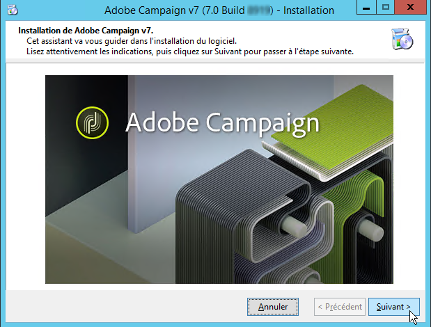
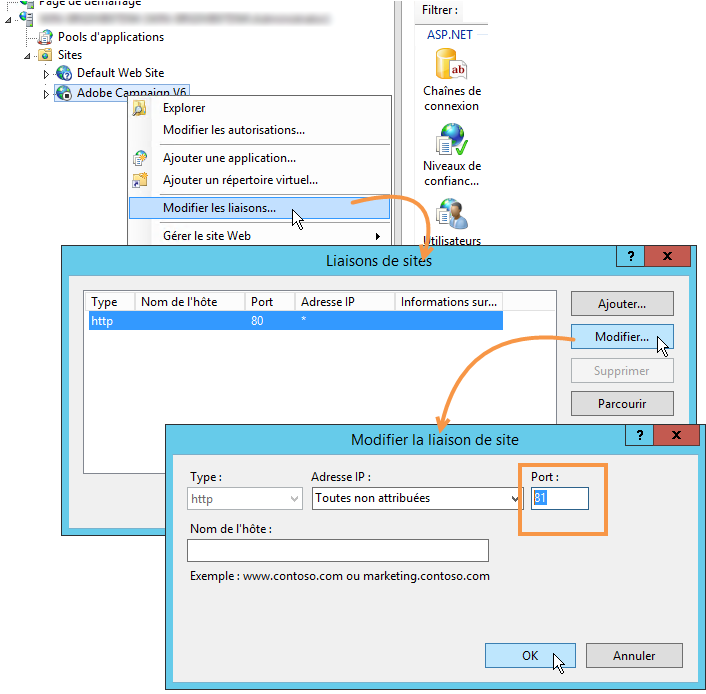
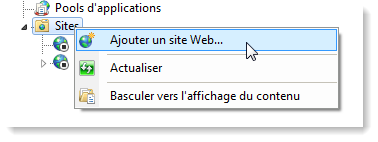
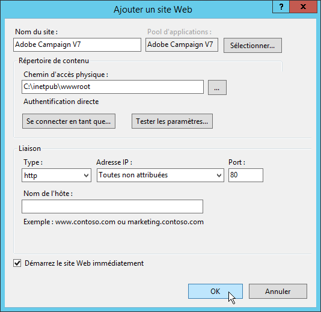
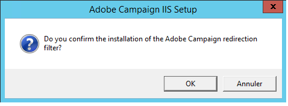
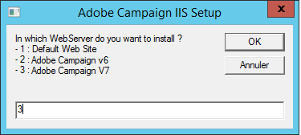
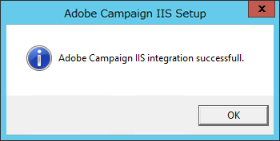
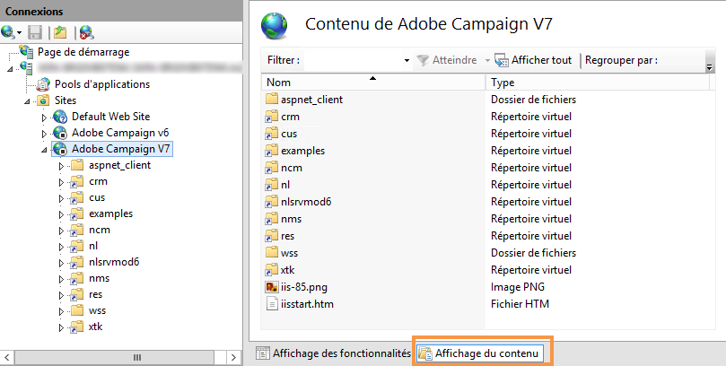
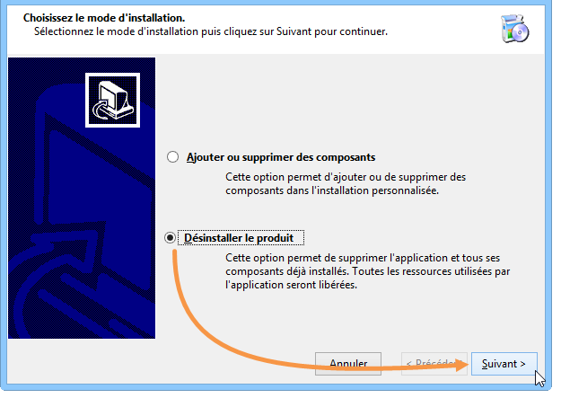

# Migration d’une plateforme Microsoft Windows vers Campaign v7{#migrating-in-windows-for-adobe-campaign}


Pour un environnement Microsoft Windows, les étapes de migration sont les suivantes :

1. Arrêtez tous les services - [En savoir plus](#service-stop).
1. Sauvegardez votre base de données - [En savoir plus](#back-up-the-database).
1. Effectuez la migration de la plateforme - [En savoir plus](#deploying-adobe-campaign-v7).
1. Effectuez la migration du serveur de redirection (IIS) - [En savoir plus](#migrating-the-redirection-server--iis-).
1. Redémarrez le service - [En savoir plus](#re-starting-the-services).
1. Supprimez et nettoyez la version précédente d’Adobe Campaign - [En savoir plus](#deleting-and-cleansing-adobe-campaign-previous-version).

## Arrêt des services {#service-stop}

Arrêtez d&#39;abord tous les processus accédant à la base de données, sur toutes les machines concernées.

1. Les serveurs utilisant le module de redirection (service **webmdl**) doivent être arrêtés. Pour IIS, exécutez la commande suivante :

   ```
   iisreset /stop
   ```

1. Le module **mta** et ses modules enfants (**mtachild**) doivent être arrêtés correctement à l&#39;aide des commandes :

   ```
   nlserver stop mta@<instance name>
   nlserver stop mtachild@<instance name>
   ```

1. Arrêtez les services Adobe Campaign sur tous les serveurs. Connectez-vous en tant qu&#39;administrateur et exécutez la commande :

   ```
   net stop nlserver6
   ```

<!--

   If you are migrating from v5.11, run the following command:

   ```
   net stop nlserver5
   ```

-->

1. Sur chaque serveur, vérifiez que les services Adobe Campaign ont bien été arrêtés. Connectez-vous en tant qu&#39;administrateur et exécutez la commande :

   ```
   tasklist /FI "IMAGENAME eq nlserver*"
   ```

   La liste des processus actifs ainsi que leur identifiant (PID) correspondant apparaît.

   ```
   Image Name                     PID Session Name        Session#    Mem Usage
   ========================= ======== ================ =========== ============
   nlserver.exe                  3192 Console                    1     13,108 K
   ```

1. Si un ou plusieurs processus Adobe Campaign sont encore actifs ou bloqués au bout de quelques minutes, forcez leur arrêt. Connectez-vous en tant qu&#39;administrateur et exécutez la commande :

   ```
   taskkill /IM nlserver* /T
   ```

1. Si certains processus sont toujours actifs au bout de quelques minutes, vous pouvez forcer leur fermeture à l&#39;aide de la commande :

   ```
   taskkill /F /IM nlserver* /T
   ```

## Sauvegarde de votre base de données Campaign {#back-up-the-database}

La procédure de sauvegarde d’Adobe Campaign 6.1 est décrite ci-après.

<!--

### For Adobe Campaign v5.11 {#migrating-from-adobe-campaign-v5-11}

1. Make a backup of the Adobe Campaign database.
1. Make a backup of the **Neolane v5** directory using the following command:

   ```
   ren "Neolane v5" "Neolane v5.back"
   ```

   >[!IMPORTANT]
   >
   >As a precaution, we recommend that you zip the **Neolane v5.back** folder and save it elsewhere in a safe location other than the server.

1. In the windows service management console, disable the automatic startup of the 5.11 application server service. You can also use the following command:

   ```
   sc config nlserver5 start= disabled
   ```

1. Edit the **config-`<instance name>`.xml** (in the **Neolane v5. back** folder) to prevent the **mta**, **wfserver**, **stat**, etc. services from starting automatically. For instance, replace **autoStart** with **_autoStart**.

   ```
   <?xml version='1.0'?>
   <serverconf>
     <shared>
       <dataStore hosts="myServer*" lang="en_US">
         <dataSource name="default">
           <dbcnx encrypted="1" login="myLogin" password="myPassword"  provider="postgresql" server="myServer"/>
         </dataSource>
       </dataStore>
     </shared>
   
     <mta _autoStart="true" statServerAddress="myStatServer"/>
     <stat _autoStart="true"/>
     <wfserver _autoStart="true"/>
     <inMail _autoStart="true"/>
     <sms _autoStart="false"/>
   </serverconf>
   ```

-->

<!--
### For Adobe Campaign v6.02 {#migrating-from-adobe-campaign-v6-02}

1. Make a backup of the Adobe Campaign database.
1. Make a backup of the **Neolane v6** directory using the following command:

   ```
   ren "Neolane v6" "Neolane v6.back"
   ```

   >[!IMPORTANT]
   >
   >As a precaution, we recommend that you zip the **Neolane v6.back** folder and save it elsewhere in a safe location other than the server.

1. In the Windows service manager, deactivate the 6.02 application server automatic startup. You can also use the following command:

   ```
   sc config nlserver6 start= disabled
   ```

1. Edit the **config-`<instance name>`.xml** (in the **Neolane v6. back** folder) to prevent the **mta**, **wfserver**, **stat**, etc. services from starting automatically. For instance, replace **autoStart** with **_autoStart**.

   ```
   <?xml version='1.0'?>
   <serverconf>
     <shared>
       <dataStore hosts="myServer*" lang="en_US">
         <dataSource name="default">
           <dbcnx encrypted="1" login="myLogin" password="myPassword" provider="postgresql" server="myServer"/>
         </dataSource>
       </dataStore>
     </shared>
   
     <mta _autoStart="true" statServerAddress="myStatServer"/>
     <stat _autoStart="true"/>
     <wfserver _autoStart="true"/>
     <inMail _autoStart="true"/>
     <sms _autoStart="false"/>
   </serverconf>
   ```

-->

1. Sauvegardez la base de données Adobe Campaign.
1. Sauvegardez le répertoire **Adobe Campaign v6**, à l&#39;aide de la commande suivante :

   ```
   ren "Adobe Campaign v6" "Adobe Campaign v6.back"
   ```

   >[!IMPORTANT]
   >
   >Par mesure de précaution, nous vous recommandons vivement de zipper le dossier **Adobe Campaign v6.back**, et de le conserver à un autre emplacement que le serveur, sur un support sécurisé.

1. Dans la console de gestion des services Windows, désactivez le démarrage automatique du service Serveur Applicatif 6.11. Vous pouvez également utiliser la commande suivante :

   ```
   sc config nlserver6 start= disabled
   ```

## Déploiement d’Adobe Campaign v7 {#deploying-adobe-campaign-v7}

Le déploiement d&#39;Adobe Campaign se déroule en deux parties :

* L&#39;installation du build v7 : cette opération doit être effectuée sur chaque serveur.
* Le postupgrade : cette commande doit être lancée sur chaque instance.

Les étapes de déploiement d&#39;Adobe Campaign sont les suivantes :

1. Installez le build le plus récent d&#39;Adobe Campaign v7 en exécutant le fichier d&#39;installation **setup.exe**. Pour plus d&#39;informations sur l&#39;installation du serveur Adobe Campaign sous Windows, voir [cette section](../../installation/using/installing-the-server.md).

   

   >[!NOTE]
   >
   >Par défaut, Adobe Campaign v7 est installé dans le répertoire **C:\Program Files\Adobe\Adobe Campaign v7**.

1. Pour mettre à disposition le programme d&#39;installation de la console cliente, copiez le fichier **setup-client-7.0.XXXX.exe** dans le répertoire d&#39;installation d&#39;Adobe Campaign : **C:\Program Files\Adobe\Adobe Campaign v7\datakit\nl\eng\jsp**.

   >[!NOTE]
   >
   >Pour plus d&#39;informations sur l&#39;installation d&#39;Adobe Campaign sous Windows, consultez [cette section](../../installation/using/installing-the-server.md).

1. Préparez l&#39;instance à sa première utilisation à l&#39;aide des commandes suivantes :

   ```
   net start nlserver6-v7
   net stop nlserver6-v7
   ```

   >[!NOTE]
   >
   >Ces commandes permettent de créer le système de fichiers interne d&#39;Adobe Campaign v7 : répertoire **conf** (avec les fichiers **config-default.xml** et **serverConf.xml**), répertoire **var**, etc.

1. Copiez et collez (écrasez) les fichiers de paramétrage et sous-dossiers de chaque instance via le fichier de sauvegarde **Neolane v5.back**, **Neolane v6.back** ou **Adobe Campaign v6.back** (selon la version à partir de laquelle vous migrez, voir [cette section](#back-up-the-database-and-the-current-installation)).
1. En fonction de la version à partir de laquelle vous migrez, exécutez les commandes suivantes :

   ```
   copy "Neolane v5.back"/conf/config-<instance name>.xml "Adobe Campaign v7"/conf/
   copy "Neolane v5.back"/customers/* "Adobe Campaign v7"/customers/
   copy "Neolane v5.back"/var/* "Adobe Campaign v7"/var/
   ```

   ```
   copy "Neolane v6.back"/conf/config-<instance name>.xml "Adobe Campaign v7"/conf/
   copy "Neolane v6.back"/customers/* "Adobe Campaign v7"/customers/
   copy "Neolane v6.back"/var/* "Adobe Campaign v7"/var/
   ```

   ```
   copy "Adobe Campaign v6.back"/conf/config-<instance name>.xml "Adobe Campaign v7"/conf/
   copy "Adobe Campaign v6.back"/customers/* "Adobe Campaign v7"/customers/
   copy "Adobe Campaign v6.back"/var/* "Adobe Campaign v7"/var/
   ```

   >[!IMPORTANT]
   >
   >Pour la première des commandes ci-dessous, ne copiez pas le fichier **config-default.xml**.

1. Dans les fichiers **serverConf.xml** et **config-default.xml** d&#39;Adobe Campaign v7, appliquez les paramétrages spécifiques dont vous disposiez dans la version précédente d&#39;Adobe Campaign. Pour le fichier **serverConf.xml**, utilisez le fichier **Neolane v5/conf/serverConf.xml.diff**, **Neolane v6/conf/serverConf.xml.diff** ou **Adobe Campaign v6/conf/serverConf.xml.diff**.

   >[!NOTE]
   >
   >Lors du report des paramétrages de la version précédente d&#39;Adobe Campaign vers Adobe Campaign v7, assurez-vous que les chemins vers les répertoires physiques pointent bien vers Adobe Campaign v7 (et pas Neolane v5, Neolane v6 ni Adobe Campaign v6).

1. Rechargez la configuration d&#39;Adobe Campaign v7 à l&#39;aide de la commande suivante :

   ```
   nlserver config -reload
   ```

1. Démarrez le processus de postupgrade à l&#39;aide de la commande suivante :

   ```
   nlserver config -postupgrade -instance:<instance name>
   ```

>[!IMPORTANT]
>
>Ne redémarrez pas les services Adobe Campaign à ce stade. Des modifications doivent préalablement être effectuées sur IIS.

## Migration du serveur de redirection {#migrating-the-redirection-server--iis-}

À ce stade, le serveur IIS doit être arrêté. Pour plus d&#39;informations, consultez la section [Arrêt des services](#service-stop).

1. Ouvrez la console **Internet Information Services (IIS) Manager**.
1. Modifiez les liaisons (ports d&#39;écoute) du site utilisé pour la version précédente d&#39;Adobe Campaign :

   * Cliquez avec le bouton droit sur le site utilisé pour la version précédente d&#39;Adobe Campaign et sélectionnez **[!UICONTROL Modifier les liaisons]**.
   * Pour chaque type de port d&#39;écoute (**[!UICONTROL http]** et/ou **[!UICONTROL https]**), sélectionnez la ligne correspondante et cliquez sur **[!UICONTROL Modifier]**.
   * Saisissez un autre port que celui qui est renseigné. Par défaut, le port d&#39;écoute est 80 pour le http et 443 pour le https. Vérifiez que le nouveau port est disponible.

     

     >[!NOTE]
     >
     >Si votre serveur IIS embarque plusieurs sites web pour Adobe Campaign configurés de manière avancée (port commun et adresses IP différentes), veuillez vous rapprocher de votre administrateur.

1. Créez un nouveau site web pour Adobe Campaign v7 :

   * Cliquez avec le bouton droit sur le dossier **[!UICONTROL Sites]** et sélectionnez **[!UICONTROL Ajouter un site Web]**.

     

   * Renseignez le nom du site, par exemple **Adobe Campaign v7**.
   * Le chemin d&#39;accès au répertoire de base du site Web n&#39;est pas utilisé, mais le champ **[!UICONTROL Chemin d&#39;accès physique]** doit être obligatoirement renseigné. Saisissez par exemple le chemin physique par défaut de IIS : **C:\inetpub\wwwroot**.
   * Cliquez sur le bouton **[!UICONTROL Se connecter en tant que]**, et vérifiez que l&#39;option **[!UICONTROL Utilisateur de l&#39;application]** est sélectionnée.
   * Dans les champs **[!UICONTROL adresse IP]** et **[!UICONTROL Port]**, vous pouvez laisser les valeurs par défaut. Si vous souhaitez utiliser d&#39;autres valeurs, vérifiez que l&#39;adresse IP et/ou le port sont disponibles.
   * Cochez la case **[!UICONTROL Démarrage immédiat du site Web]**.

     

1. Exécutez le script **iis_neolane_setup.vbs** permettant de configurer automatiquement le paramétrage des ressources utilisées par le serveur Adobe Campaign sur le répertoire virtuel créé précédemment.

   * Ce fichier se trouve dans le répertoire **`[Adobe Campaign v7]`\conf**, où **`[Adobe Campaign v7]`** est le chemin d&#39;accès au répertoire d&#39;installation d&#39;Adobe Campaign. La commande d&#39;exécution du script est la suivante (pour les administrateurs) :

     ```
     cd C:\Program Files (x86)\Adobe Campaign\Adobe Campaign v7\conf
     cscript iis_neolane_setup.vbs
     ```

   * Cliquez sur **[!UICONTROL OK]** pour confirmer l&#39;exécution du script.

     

   * Saisissez le numéro du site Web que vous avez créé précédemment pour Adobe Campaign v7 et cliquez sur **[!UICONTROL OK]**.

     

   * Un message de confirmation doit s&#39;afficher :

     

   * Dans l&#39;onglet **[!UICONTROL Affichage du contenu]**, vérifiez que la configuration du site Web est bien paramétrée avec les ressources Adobe Campaign :

     

     >[!NOTE]
     >
     >Si l&#39;arborescence n&#39;est pas affichée, redémarrez le Gestionnaire de service Internet (IIS).
     >
     >Les étapes suivantes de configuration de IIS sont décrites dans [cette section](../../installation/using/integration-into-a-web-server-for-windows.md#configuring-the-iis-web-server).

<!--
## Security zones {#security-zones}

If you are migrating from v6.02 or earlier, you must configure your security zones before starting services. [Learn more](../../migration/using/general-configurations.md#security)
-->

## Redémarrage des services {#re-starting-the-services}

Sur chacun des serveurs suivants, démarrez IIS puis les services Adobe Campaign :

1. Serveur de tracking/redirection.
1. Serveur de mid-sourcing.
1. Serveur marketing.

Avant de passer à l’étape suivante, testez complètement la nouvelle installation, vérifiez qu’aucune régression n’a lieu et assurez-vous que tout fonctionne.

## Supprimer la version précédente {#deleting-and-cleansing-adobe-campaign-previous-version}

La procédure de suppression d’Adobe Campaign 6.1 est décrite ci-après.

<!--

### For Adobe Campaign v5 {#adobe-campaign-v5}

Before you delete and cleanse the Adobe Campaign v5 installation, you must apply the following recommendations:

* Get the functional teams to run a full check of the new installation.
* Only uninstall Adobe Campaign v5 once you are certain that no rollback is necessary.

1. In IIS, delete the **Neolane v5** website, then the **Neolane v5** application pool. 
1. Rename the **Neolane v5.back** folder as **Neolane v5**.
1. Uninstall Adobe Campaign v5 using the Add/remove components wizard. 

   

1. Delete the **nlserver5** Windows service using the following command:

   ```
   sc delete nlserver5
   ```

1. Re-start the server.

### For Adobe Campaign v6.02 {#adobe-campaign-v6-02}

Before you delete and cleanse the Adobe Campaign v6.02 installation, you must apply the following recommendations:

* Get the functional teams to run a full check of the new installation.
* Only uninstall Adobe Campaign v6.02 once you are certain that no rollback is necessary.

1. In IIS, delete the **Neolane v6** website, then the **Neolane v6** application pool. 
1. Rename the **Neolane v6.back** folder as **Neolane v6**.
1. Uninstall Adobe Campaign v6.02 using the Add/remove components wizard. 

   

1. Re-start the server.

-->

Avant de supprimer et nettoyer l&#39;installation d&#39;Adobe Campaign v6, il est impératif de suivre les recommandations ci-dessous :

* Effectuez une validation complète de la nouvelle installation par les équipes fonctionnelles.
* Ne procédez à la désinstallation d&#39;Adobe Campaign v6 qu&#39;une fois que vous êtes certain qu&#39;un retour arrière n&#39;est pas nécessaire.

1. Dans IIS, supprimez le site web **Adobe Campaign v6** puis le pool d&#39;applications **Adobe Campaign v6**.
1. Renommez le dossier **Adobe Campaign v6.back** en **Adobe Campaign v6**.
1. Désinstallez Adobe Campaign v6 à l&#39;aide de l&#39;assistant d&#39;ajout/suppression de programme.

   

1. Redémarrez le serveur.
