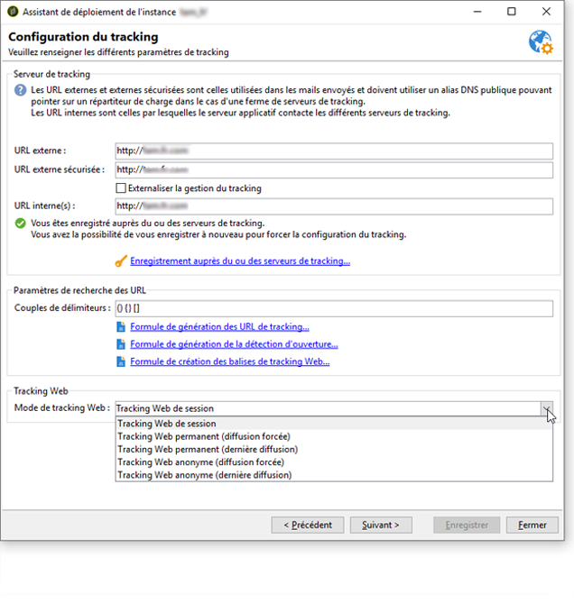

# Paramétrages spécifiques v5.11{#specific-configurations-in-v5-11}


Cette section décrit le paramétrage supplémentaire à effectuer lorsque vous migrez depuis une v5.11. Vous devez également effectuer le paramétrage décrit dans la section [Paramétrages généraux](../../migration/using/general-configurations.md).

## Des applications web {#web-applications}

L&#39;avertissement suivant apparaît systématiquement lors de la migration :

```
The webApp ids have been modified during the migration process. Please make sure to check your scripts/css for broken compatibility (any client side javascript or css dealing directly with another element through its id is impacted). See file 'c:\svn\602\nl\build\ncs\var\upgrade/postupgrade/webAppsMigration_*************.txt' for details about the references that were automatically updated, if any.
```

Certains composants des applications web, par exemple les différents champs d&#39;un formulaire, possèdent des identifiants. Ces identifiants (attributs @id), utilisés dans le code XML des applications web, ne sont plus générés de la même manière. Ils ne sont pas visibles dans l&#39;interface et vous ne devez normalement pas les utiliser. Cependant, dans certains cas, il se peut que ces identifiants aient été utilisés en paramétrage pour personnaliser l&#39;apparence des applications web, par exemple via une feuille de style ou du code JavaScript.

Lors de la migration, vous devez **impérativement** vérifier le fichier de logs dont le chemin est indiqué dans l&#39;avertissement :

* **Le fichier n&#39;est pas vide :** celui-ci contient des avertissements correspondant à des incohérences qui existaient avant la migration, et qui existent donc toujours. Il peut s&#39;agir par exemple de code JavaScript dans une application web référençant un identifiant qui n&#39;existe pas. Chaque erreur doit être vérifiée et corrigée.
* **Le fichier est vide :** cela signifie qu&#39;Adobe Campaign n&#39;a détecté aucun problème.

Que le fichier soit vide ou non, vous devez vérifier que ces identifiants ne sont pas utilisés en paramétrage à d&#39;autres endroits, et le cas échéant adapter ce paramétrage.

## Workflows {#workflows}

Le nom du répertoire d&#39;installation d&#39;Adobe Campaign ayant changé, il se peut que certains workflows ne fonctionnent pas après la migration. En effet, si un workflow fait référence au répertoire nl5 dans l&#39;une ses activités, celui-ci sera en erreur. Cette référence doit être remplacée par **build**. Une requête SQL peut être exécutée pour identifier ces workflows (par exemple, PostgreSQL) :

```
SELECT   iWorkflowId, sInternalName, sLabel 
FROM XtkWorkflow 
WHERE mData LIKE '%nl5%';
```

## Ergonomie {#user-friendliness}

La page d&#39;accueil Adobe Campaign v5.11 n&#39;est plus disponible.

Quoique ce mode de fonctionnement ne soit pas recommandé, il existe des solutions si vous souhaitez conserver des interfaces spécifiques développées sous Adobe Campaign v5.11. Pour plus d&#39;informations, contactez-nous.

## MySQL {#mysql}

>[!IMPORTANT]
>
>MySQL est uniquement supporté en v7 comme moteur de la base principale dans le cas de migrations depuis une version 6.02 ou 5.11 utilisant ce moteur.

MySQL ne gère pas les fuseaux horaires par défaut. Pour activer la gestion des fuseaux horaires, exécutez la commande suivante :

```
mysql_tzinfo_to_sql /usr/share/zoneinfo | mysql -u root mysql
```

>[!NOTE]
>
>Pour plus d’informations, voir la page [ https://dev.mysql.com/doc/refman/8.0/en/time-zone-support.html](https://dev.mysql.com/doc/refman/8.0/en/time-zone-support.html).

Si des modifications de structure de base ont été effectuées, par exemple lors du paramétrage (création d&#39;index spécifiques, création de vues SQL, etc.), certaines précautions doivent être prises lors de la migration. En effet, certaines modifications peuvent générer des incompatibilités avec la procédure de migration. Par exemple, la création de vues SQL contenant des champs de type **Timestamp** n&#39;est pas compatible avec l&#39;option **usetimestamptz**. Nous vous conseillons donc de suivre les recommandations ci-dessous :

1. Avant la migration, effectuez une sauvegarde de la base.
1. Supprimez les modifications SQL.
1. Effectuez le postupgrade conformément à la procédure présentée dans la section [Prérequis pour la migration vers Adobe Campaign 7](../../migration/using/prerequisites-for-migration-to-adobe-campaign-7.md).
   >[!NOTE]
   >
   >Vous devez impérativement suivre les étapes de migration présentées dans la section [Prérequis pour la migration vers Adobe Campaign 7](../../migration/using/prerequisites-for-migration-to-adobe-campaign-7.md).
1. Réintégrez les modifications SQL.

Dans cet exemple, une vue **NmcTrackingLogMessages** a été créée et celle-ci contient un champ **Timestamp** nommé **tslog**. Dans ce cas, la procédure de migration échoue et le message d&#39;erreur suivant apparaît :

```
2011-10-04 11:57:51.804Z B67B28C0 1 info log Updating table 'NmcTrackingLogMessages'
2011-10-04 11:57:51.804Z B67B28C0 1 error log PostgreSQL error: ERROR: cannot alter type of a column used by a view or rule\nDETAIL: rule _RETURN on view nmctrackinglogmessagesview depends on column "tslog"\n (iRc=-2006)
2011-10-04 11:57:51.804Z B67B28C0 1 error log SQL order 'ALTER TABLE NmcTrackingLogMessages ALTER COLUMN tsLog TYPE TIMESTAMPTZ' was not executed. (iRc=-2006)
```

Pour garantir le bon fonctionnement du postupgrade, vous devez impérativement supprimer la vue avant la migration, puis la recréer après la migration, en l&#39;adaptant au mode TIMESTAMP WITH TIMEZONE.

## Tracking {#tracking}

La formule de tracking a été modifiée. Lors de la migration, l’ancienne formule (v5) est remplacée par la nouvelle (v7). Si vous utilisez une formule personnalisée dans Adobe Campaign v5, cette configuration doit être adaptée dans Adobe Campaign v7 (options **NmsTracking_ClickFormula** et **NmsTracking_OpenFormula**).

La gestion du tracking web a également été modifiée. Une fois la migration vers la version v7 effectuée, vous devez démarrer l’assistant de déploiement pour terminer la configuration du tracking web.



Trois modes sont disponibles :

* **Tracking Web de session** : Si le package **[!UICONTROL Leads]** n&#39;est pas installé, cette option est sélectionnée par défaut. Cette option est la plus avantageuse en termes de performances et permet de limiter la taille des logs de tracking.
* **Tracking Web permanent**
* **Tracking Web anonyme** : Si le package **[!UICONTROL Leads]** est installé, cette option est sélectionnée par défaut. Cette option est la plus contraignante en termes de performances. Comme pour l&#39;option Tracking Web permanent, la colonne **sSourceId** doit être indexée (dans la table de tracking et la table **CrmIncomingLead**).

>[!NOTE]
>
>Pour plus d&#39;informations sur ces trois modes, consultez [cette section](../../configuration/using/about-web-tracking.md).

## L&#39;arborescence Adobe Campaign v7 {#campaign-vseven-tree-structure}

Lors de la migration, l&#39;arborescence est automatiquement réorganisée selon les nouvelles normes de la v7. Les nouveaux dossiers sont ajoutés, les dossiers obsolètes supprimés et le contenu de ces derniers placés dans le dossier &quot;To move&quot;. Tous les éléments de ce dossier doivent être vérifiés après la migration, et pour chacun, le consultant doit décider s&#39;il souhaite le conserver ou le supprimer. Il doit ensuite replacer au bon endroit les éléments à conserver.

Une option a été ajoutée permettant de désactiver la migration automatique de l&#39;arborescence. Celle-ci devient donc manuelle. Les dossiers obsolètes ne sont pas supprimés et les nouveaux dossiers ne sont pas ajoutés. Cette option n&#39;est à utiliser que dans le cas où l&#39;arborescence d&#39;usine v5 a subi un nombre de modifications trop important. L&#39;option est à ajouter dans la console, avant la migration, au niveau du noeud **[!UICONTROL Administration > Options]** :

* Nom interne : NlMigration_KeepFolderStructure
* Type de données : Entier
* Valeur (texte) : 1

Si vous utilisez cette option, vous devrez, après la migration, supprimer les dossiers obsolètes, ajouter les nouveaux dossiers et effectuer toutes les vérifications nécessaires.

**Liste des nouveaux dossiers** :

Les dossiers à ajouter après la migration sont les suivants :

| Nom interne | Libellé | Condition |
|---|---|---|
| nmsAutoObjects | Objets créés automatiquement | - |
| nmsCampaignAdmin | Gestion de campagne | - |
| nmsCampaignMgt | Gestion de campagne | - |
| nmsCampaignRes | Gestion de campagne | - |
| nmsModels | Modèles | - |
| nmsOnlineRes | On-line | - |
| nmsProduction | Production | - |
| nmsProfilProcess | Traitements | - |
| xtkDashboard | Tableaux de bord | - |
| xtkPlatformAdmin | Plate-forme | - |
| nmsLocalOrgUnit | Entités organisationnelles | - |
| nmsMRM | MRM | MRM installé |
| nmsOperations | Opérations | Campaign installé |

**Liste des dossiers obsolètes** :

Les dossiers obsolètes, à supprimer après la migration, sont les suivants :

>[!NOTE]
>
>Tout le contenu des dossiers obsolètes doit être vérifié, et pour chaque élément, le consultant doit décider s&#39;il souhaite le conserver ou le supprimer. Il doit ensuite replacer au bon endroit les éléments à conserver.

| Nom interne | Libellé | Condition |
|---|---|---|
| nmsAdministration | Administration  | - |
| nmsDeliveryMgt | Exécution de campagne | - |
| ncmContent | Gestion de contenu | Content Manager installé |
| ncmForm | Formulaires de saisie | Content Manager installé |
| ncmImage | Images | Content Manager installé |
| ncmJavascript | Codes JavaScript | Content Manager installé |
| ncmJst | Templates JavaScript | Content Manager installé |
| ncmParameters | Configuration  | Content Manager installé |
| ncmSrcSchema | Schémas de données | Content Manager installé |
| ncmStylesheet | Feuilles de style XSL | Content Manager installé |
| nmsAdminPlan | Administration  | Campaign installé |
| nmsResourcePlan | Ressources | Campaign installé |
| nmsResourcesModels | Modèles | Campaign installé |
| nmsRootPlan | Gestion de campagne | Campaign installé |
| nmsOperator | Opérateurs marketing | MRM installé |
