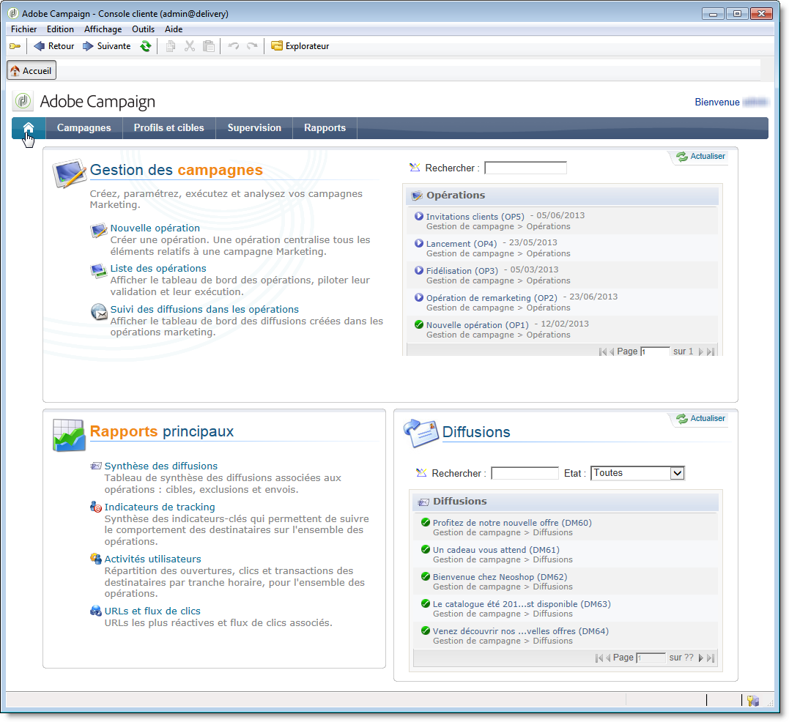
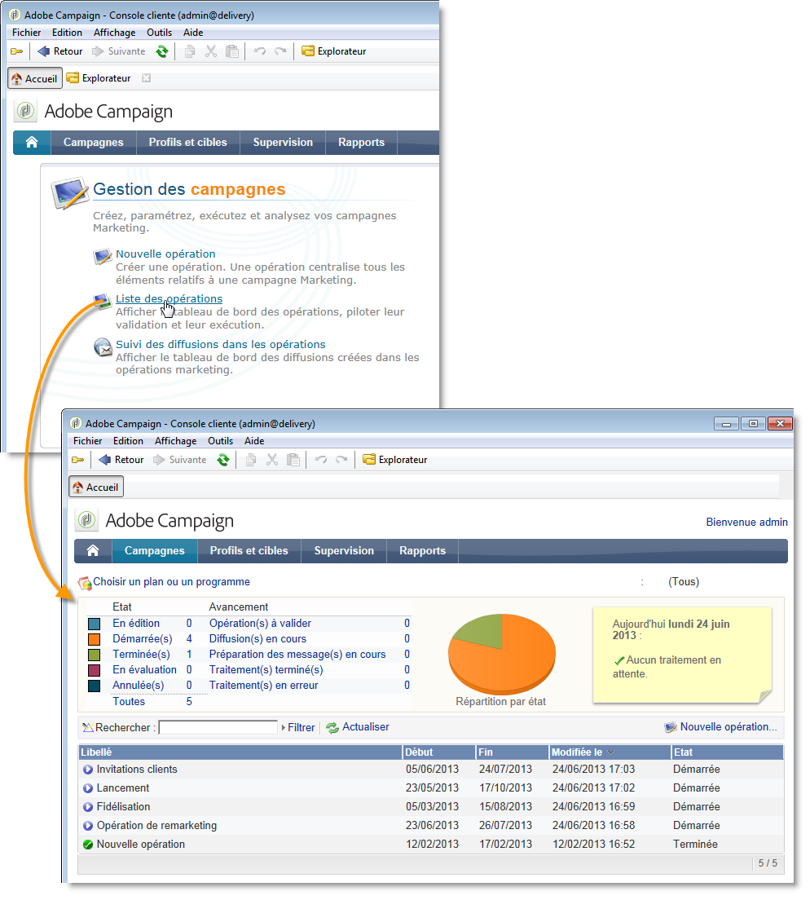

# Paramétrages spécifiques v6.02{#specific-configurations-in-v6-02}


La section suivante décrit le paramétrage supplémentaire à effectuer lorsque vous migrez depuis une v6.02. Vous devez également effectuer le paramétrage décrit dans la section [Paramétrages généraux](../../migration/using/general-configurations.md).

## Des applications web {#web-applications}

Si vous migrez depuis une v6.02, des logs d&#39;erreur peuvent apparaître concernant des applications web de type vues d&#39;ensemble (overview). Exemples de messages d&#39;erreur :

```
[PU-0006] Entity of type : 'xtk:entityBackupNew' and Id 'nms:webApp|taskOverview', expression '[SQLDATA[' was found : '...)) or (@id IN ([SQLDATA[select 
[PU-0006] Entity of type : 'xtk:formDictionary' and Id 'nms:webApp|lastTasks', expression '[SQLDATA[' was found : '...)) or (@id IN ([SQLDATA[select 
[PU-0006] Entity of type : 'nms:webApp' and Id 'taskOverview', expression '[SQLDATA[' was found : '...@owner-id] IN ([SQLDATA[select iGroupid...'. (iRc=-1)
```

Ces applications web utilisaient du SQLData et ne sont plus compatibles avec la v7, en raison du renforcement de la sécurité. Ces erreurs entraineront un échec de migration.

Si vous n&#39;utilisiez pas ces applications web, exécutez le script de nettoyage suivant et relancez le postupgrade :

```
Nlserver javascript -instance:[instance_name] -file [installation_path]/datakit/xtk/fra/js/removeOldWebApp.js
```

Si vous aviez modifié ces applications web et souhaitez continuer à les utiliser en v7, vous devez activer l&#39;option **allowSQLInjection** dans vos différentes zones de sécurité et relancer le postupgrade. Consultez la section [SQLData](../../migration/using/general-configurations.md#sqldata) pour en savoir plus.

## Ergonomie : page d’accueil et navigation {#user-friendliness--home-page-and-navigation}

>[!IMPORTANT]
>
>Si vous souhaitez continuer à utiliser des applications web v6.02 de type Vues d&#39;ensemble, vous devez activer l&#39;option **allowSQLInjection** dans vos différentes zones de sécurité avant le postupgrade. Voir à ce sujet la section [Applications Web](#web-applications).

Après une migration depuis la version v6.02, la page d&#39;accueil d&#39;Adobe Campaign v6.02 n&#39;est plus affichée, mais reste accessible et compatible avec Adobe Campaign v7.

Pour continuer à utiliser la page d&#39;accueil v6.02, vous devez installer un package de &quot;compatibilité&quot; après la migration.

Pour cela, importez le package de compatibilité :

Cliquez sur le menu **[!UICONTROL Outils > Avancé > Import de package]** et choisissez le package **campaignMigration.xml** dans le dossier **`\nl\datakit\nms\[Your language]\package\optional`**.

Pour permettre l&#39;accès aux interfaces de type Applications web v6.02, l&#39;option **sessionTokenOnly** des paramètres du serveur doit être activée, dans le fichier **serverConf.xml** :

```
sessionTokenOnly="true"
```

Cette option altère les niveaux de sécurité pour assurer la compatibilité des interfaces.

Une fois le package installé, la page d&#39;accueil d&#39;Adobe Campaign v7 est remplacée par votre ancienne page d&#39;accueil v6.02, complétée des paramètres généraux de la v7 (bandeau bleu de navigation).



Tous les liens de cette page d&#39;accueil pointent vers les écrans v7, à l&#39;exception des listes (**[!UICONTROL liste des opérations]**, **[!UICONTROL tracking des diffusions dans les opérations]**, etc.) qui renvoient à la présentation v6.02 (applications Web).



Si vous souhaitez ajouter une autre vue d&#39;ensemble paramétrée en v6.02, vous devez l&#39;ajouter sur la page d&#39;accueil à partir des tableaux de bord (**[!UICONTROL Administration > Gestion des accès > Tableaux de bord]**).

>[!NOTE]
>
>N&#39;oubliez pas de déconnecter puis reconnecter la console pour que les modifications soient prises en compte.

## Message Center {#message-center}

Après une migration d&#39;une instance de pilotage Message Center, vous devez republier les modèles de messages transactionnels pour que ceux-ci fonctionnent.

Dans la v7, les noms des modèles de messages transactionnels sur les instances d&#39;exécution ont changé. Ils sont précédés du nom de l&#39;opérateur qui correspond à l&#39;instance de pilotage sur laquelle ils sont créés, par exemple **control1_template1_rt** (où **control1** est le nom de l&#39;opérateur). Si vous disposez d&#39;un volume important de modèles, nous vous recommandons de supprimer les anciens sur les instances de pilotage.
