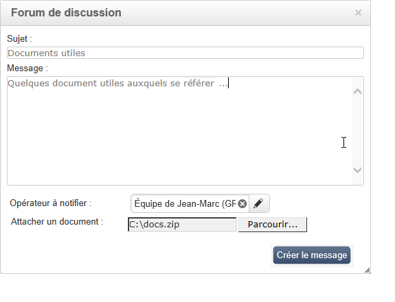
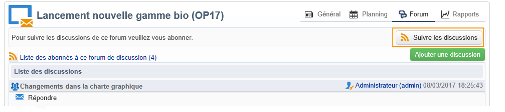
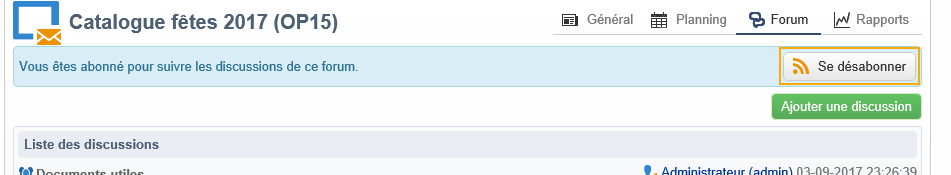

# Forums de discussion{#discussion-forums}

Les opérateurs Adobe Campaign peuvent échanger des informations via les forums de discussion. Les éléments suivants ont chacun leur propre forum : plans, programmes, opérations, ressources, simulations, stocks. Chaque opérateur a également un forum personnel. Toutes les discussions sont publiques, même celles sur les forums personnels des opérateurs.

Les opérateurs/opératrices peuvent s’abonner à des forums afin de recevoir un e-mail de notification à chaque message posté dans ceux-ci.

## Accéder à un forum {#accessing-a-forum}

Pour accéder au forum d&#39;une opération, d&#39;un opérateur, etc., dans le tableau de bord de celui-ci, cliquez sur le lien **[!UICONTROL Forum]** en haut à droite. Ce lien indique entre parenthèses le nombre total de messages dans le forum, toutes discussions confondues.

## Utiliser un forum {#using-a-forum}

Dans un forum, les messages et leurs réponses sont classés par ordre chronologique inversé (du plus récent au plus ancien).

Pour afficher le contenu d&#39;un message, cliquez sur son en-tête.

**Commencer une nouvelle discussion**

Pour commencer une nouvelle discussion, cliquez sur le bouton **[!UICONTROL Ajouter une discussion]** en haut à droite. La boîte **[!UICONTROL Forum de discussion]** apparaît (voir ci-dessous).

**Poster un message dans une discussion existante**

Pour poster un message dans une discussion existante, ouvrez le message auquel vous voulez répondre, puis cliquez sur le lien **[!UICONTROL Répondre]** en haut à gauche de celui-ci. La boîte **[!UICONTROL Forum de discussion]** apparaît (voir ci-dessous).

Lorsque vous répondez à un message, la personne ayant posté le message auquel vous répondez recevra un email de notification.

**Rédiger un message**

Dans la boîte **[!UICONTROL Forum de discussion]** :

1. Saisissez votre texte dans la zone **[!UICONTROL Message]** et, le cas échéant, un titre pour la discussion dans le champ **[!UICONTROL Sujet]**.

   

1. Si besoin :

   * Si vous voulez faire participer à la discussion une personne non abonnée au forum, utilisez le champ **[!UICONTROL Opérateur à notifier]**. L&#39;opérateur recevra un email de notification pour ce message précis (il ne deviendra pas abonné au forum). Pour notifier plusieurs opérateurs, sélectionnez un groupe d&#39;opérateurs.
   * Pour inclure une pièce jointe dans le message, cliquez sur **[!UICONTROL Parcourir]**. La pièce jointe sera également incluse dans l&#39;email de notification. Vous ne pouvez attacher qu&#39;un fichier à la fois : pour attacher plusieurs fichiers au message, utilisez un fichier compressé.

1. Cliquez sur **[!UICONTROL Créer le message]** pour poster le message dans le forum.

>[!NOTE]
>
>Une fois un message publié dans le forum, il ne peut plus être modifié ni supprimé.

## Poster un message dans le forum personnel d&#39;un opérateur {#posting-to-the-personal-forum-of-an-operator}

Vous pouvez poster un message dans le forum d&#39;un opérateur si par exemple votre message ne relève pas d&#39;une opération particulière mais que vous voulez conservez une trace de votre communication dans Adobe Campaign. Les forums personnels des opérateurs sont publics et tous les opérateurs pourront lire vos messages. L&#39;opérateur reçoit un email à chaque message posté dans son forum personnel.

Pour accéder au forum d&#39;un opérateur :

* Si vous disposez des droits nécessaires pour accéder au noeud **[!UICONTROL Administration > Gestion des accès > Opérateurs]** de l&#39;explorateur, ouvrez le tableau de bord de l&#39;opérateur désiré puis cliquez sur le lien **[!UICONTROL Forum]** en haut à droite.
* Dans le cas contraire, recherchez le nom de l’opérateur dans Adobe Campaign (via un message posté dans le forum par cet opérateur, une tâche qui lui est affectée) et cliquez dessus pour accéder à son tableau de bord. Vous pouvez également demander à votre administrateur de créer une vue du dossier de l’opérateur.

## S&#39;abonner à un forum {#subscribing-to-a-forum}

Vous pouvez vous abonner à un forum afin d&#39;en suivre les discussions. Une fois abonné, vous recevrez par email une notification pour chaque message posté dans le forum, dans toutes les discussions (cet email inclura le corps du message et l&#39;éventuelle pièce jointe). Vous pourrez répondre au message directement en cliquant dans le corps de l&#39;email, puis en vous connectant à l&#39;interface Web d&#39;Adobe Campaign. Lorsque vous vous abonnez à un forum, cette information est visible par tous.

* Pour vous abonner à un forum, cliquez sur le bouton **[!UICONTROL Suivre les discussions]** dans le bandeau au-dessus de la liste des messages, à droite.

   

   Le bandeau devient bleu et indique que vous êtes abonné au forum.

* Pour vous désabonner d&#39;un forum, cliquez sur le bouton **[!UICONTROL Se désabonner]** dans le bandeau.

   

* Dans votre tableau de bord personnel, vous pouvez voir la liste des forums auxquels vous êtes abonné afin de pouvoir accéder à ceux-ci plus rapidement. Cliquez sur le lien **[!UICONTROL Abonnements aux forums de discussion]** pour afficher la liste, puis cliquez sur le nom de l&#39;élément désiré pour accéder à son forum.

   

   Pour plus d&#39;informations sur le tableau de bord personnel d&#39;un opérateur, consultez [cette section](../../platform/using/access-management-operators.md).

* Pour voir qui est abonné à un forum, cliquez sur le lien **[!UICONTROL Liste des abonnés à ce forum de discussion]** au-dessus de la liste des messages.

   

## Vérifier l&#39;envoi des notifications {#checking-notification-delivery}

Si des opérateurs abonnés à un forum ne reçoivent pas les notifications attendues :

* Vérifiez que les opérateurs ont bien une adresse email renseignée dans leur profil.
* Allez dans le noeud **[!UICONTROL Administration > Exploitation > Workflows techniques > Processus de campagne]** et vérifiez que le workflow **[!UICONTROL Traitements dans les forums de discussion]** est démarré et n&#39;est pas en échec.
* Consultez les logs de diffusion :

   * Depuis la page d&#39;accueil d&#39;Adobe Campaign, allez à **[!UICONTROL Campagnes > Navigation > Diffusions]**, puis ouvrez la diffusion **[!UICONTROL Notification des forums de discussion]**.
   * Dans l&#39;explorateur, allez à **[!UICONTROL Administration > Exploitation > Objets créés automatiquement > Diffusions techniques > Notifications de workflow]**, puis cliquez sur **[!UICONTROL Notification des forums de discussion]**.
   Dans la boîte **[!UICONTROL Notification des forums de discussion]**, les logs de diffusion se trouvent dans l&#39;onglet **[!UICONTROL Édition > Diffusion]**. Consultez également les onglets **[!UICONTROL Tracking > Journal]** et **[!UICONTROL Causes d&#39;exclusion]**.
