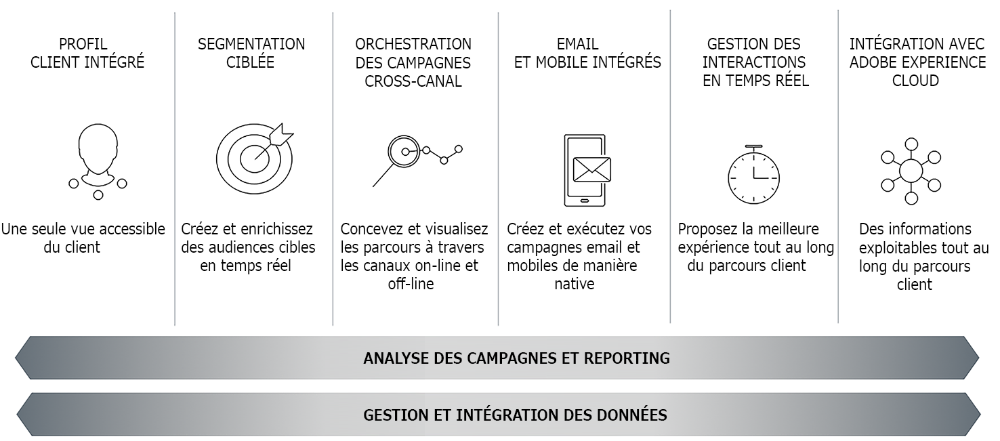

# Prise en main de Campaign Classic{#about-adobe-campaign-classic}

Pour favoriser l’engagement des clients et offrir des expériences attrayantes, les marques doivent créer des parcours client cohérents à tous les points de contact. Les spécialistes marketing peuvent désormais concevoir, planifier, exécuter, gérer et optimiser des campagnes marketing cross-canal qui offrent un retour sur investissement élevé et fidélisent les clients.

Adobe Campaign permet d&#39;orchestrer les différentes étapes nécessaires à la réalisation d&#39;opérations de marketing conversationnel. Adobe Campaign dispose de capacités innovantes de modélisation, de rationalisation et d&#39;automatisation des processus du marketing et de la communication client.

>[!AVAILABILITY]
>
>* Les ressources d’aide de cette collection s’appliquent à Campaign Classic v7 dans son [dernier build](../../rn/using/latest-release.md). Un badge spécifique est disponible lorsqu&#39;une section s&#39;applique également à Campaign v8.
>
>* La documentation d’Adobe Campaign v8 est disponible [ici](https://experienceleague.adobe.com/docs/campaign/campaign-v8/campaign-home.html?lang=fr).

 [Découvrez les fonctionnalités principales en vidéo](#video)

## Fonctionnalités principales {#key-capabilities}

Adobe Campaign offre une plateforme pour concevoir des expériences client cross-canal et propose un environnement pour l&#39;orchestration visuelle de campagnes, la gestion d&#39;interactions en temps réel et l&#39;exécution cross-canal.

Le cycle d&#39;une campagne marketing avec Adobe Campaign illustre les principales fonctionnalités du produit :

### Profil client intégré {#integrated-customer-profile}

Les profils (clients, prospects, abonnés aux newsletters, etc.) sont centralisés dans la base de données d&#39;Adobe Campaign. De multiples mécanismes d&#39;acquisition de profils et de constitution de cette base sont possibles : collecte en ligne via des formulaires web, imports manuels ou automatisés de fichiers texte, réplication avec bases de données ou autre système d&#39;information de l&#39;entreprise. Adobe Campaign vous permet d&#39;intégrer des données d&#39;historique marketing, des informations d&#39;achat, des préférences, des données CRM et des données d&#39;informations d&#39;identification personnelles pertinentes dans une vue consolidée afin d&#39;effectuer une analyse et de prendre des mesures.

Dans Adobe Campaign, les destinataires sont les profils par défaut ciblés pour l&#39;envoi des diffusions (emails, SMS, etc.). Grâce aux données de destinataires stockées dans la base de données, vous pourrez filtrer la cible qui recevra toute diffusion donnée et ajouter les données de personnalisation à votre contenu de diffusion. Il existe d&#39;autres types de profils dans la base de données qui sont conçus pour d&#39;autres utilisations. Par exemple, les profils d’adresses de contrôle sont destinés à tester vos diffusions avant leur envoi à la cible finale.

Les notions de base de la gestion des profils sont expliquées dans la section [À propos des profils](../../platform/using/about-profiles.md).

### Segmentation ciblée {#targeted-segmentation}

Adobe Campaign dispose de fonctionnalités de segmentation et de ciblage puissantes et conviviales qui vous permettent de créer des offres très ciblées et différenciées. La fonctionnalité d&#39;analyse descriptive vous permet d&#39;analyser les informations en amont et en aval de vos campagnes marketing, ainsi que la gestion des filtres et [éditeur de requêtes graphique](../../platform/using/about-queries-in-campaign.md) permet de filtrer la population de vos abonnés et d&#39;échantillonner ou créer des groupes cibles selon un nombre illimité de critères. Les fonctions d&#39;analyse et de ciblage sont décrites dans [cette page](../../reporting/using/about-descriptive-analysis.md) et dans la section [Création de filtres](../../platform/using/creating-filters.md).

La fonctionnalité avancée de Data Management étend les fonctionnalités de traitement des données. Elle simplifie et optimise le processus de ciblage en incluant des données qui ne sont pas modélisées dans le datamart. Cette fonctionnalité est présentée dans la section [cette page](../../workflow/using/targeting-data.md#data-management).

### Orchestration de campagnes cross-canal {#cross-channel-campaign-orchestration}

Adobe Campaign vous permet de concevoir et orchestrer des campagnes ciblées et personnalisées sur plusieurs canaux : email, courrier, SMS, notification push. Une seule interface vous fournit toutes les fonctions nécessaires pour planifier, orchestrer, configurer, personnaliser, automatiser, exécuter et mesurer toutes vos campagnes et communications. Pour plus d&#39;informations sur la planification et l&#39;exécution des opérations, voir [cette page](../../campaign/using/setting-up-marketing-campaigns.md).

### Personnalisation et interaction en temps réel {#personalization-and-real-time-interaction}

Retenez l’attention de vos clients et améliorez vos taux de réponse grâce à une personnalisation avancée du contenu et des en-têtes des messages en fonction des profils et des préférences de vos clients. La gestion et la personnalisation du contenu des messages sont présentées dans la section [cette page](../../delivery/using/about-personalization.md). La gestion collaborative des circuits de contenu, de notification et de validation est présentée dans la section [cette section](../../mrm/using/about-marketing-resource-management.md).

### Analyse et reporting {#analysis-and-reporting}

Adobe Campaign vous permet de suivre et comprendre les comportements de vos clients en enrichissant progressivement leurs données et profil. Grâce aux outils de reporting et d&#39;analyse, vous capitalisez sur chaque nouvelle campagne, bénéficiez d&#39;un meilleur ciblage de vos actions marketing, et optimisez leur impact ainsi que leur retour sur investissement. Voir [cette page](../../reporting/using/delivery-reports.md) pour plus d’informations.

### Intégrations avec Adobe Experience Cloud {#adobe-experience-cloud-integrations}

Vous pouvez combiner les fonctionnalités de diffusion et de gestion de campagnes avancées d’Adobe Campaign avec un ensemble de solutions conçues pour vous aider à personnaliser l’expérience de vos utilisateurs : Adobe Experience Manager, Adobe Analytics, Adobe Target ou les déclencheurs Adobe Experience Cloud, par exemple. Vous pouvez également intégrer Adobe IMS et vous connecter à Campaign avec votre Adobe ID. Pour plus d’informations sur les intégrations inter-solutions et d’authentification, voir [cette section](../../integrations/using/about-adobe-id.md).

## Fonctions principales et composants additionnels {#core-capabilities-and-add-ons}

Adobe Campaign propose un ensemble de fonctionnalités pour vous aider à mettre en oeuvre et optimiser les fonctionnalités de marketing conversationnel selon vos besoins et votre architecture. Certaines d’entre elles sont des fonctionnalités principales, tandis que d’autres dépendent de l’installation d’un package et de votre configuration. Une description détaillée du produit est disponible ici : [Description du produit Adobe Campaign](https://helpx.adobe.com/fr/legal/product-descriptions/adobe-campaign-managed-cloud-services.html){target="_blank"}.

Les fonctions ci-dessous sont disponibles. Selon votre contrat de licence, certaines de ces fonctions peuvent ne pas être disponibles dans votre instance.

* [Canaux](../../delivery/using/steps-about-delivery-creation-steps.md) : concevez et envoyez des diffusions sur divers canaux (email, SMS, Line, Applications mobiles, courrier).
* [Campaign](../../campaign/using/designing-marketing-campaigns.md) : orchestrez des campagnes cross-canal.
* [MRM](../../mrm/using/about-marketing-resource-management.md) : gérez les ressources marketing et les budgets.
* [Interaction](../../interaction/using/interaction-and-offer-management.md) : gérez les offres avec Campaign.
* [Message Center](../../message-center/using/about-transactional-messaging.md) : envoyez des messages transactionnels par email, par SMS ou sur une application mobile.
* [Marketing des médias sociaux (Social Marketing)](../../social/using/about-social-marketing.md) : communiquez sur les médias sociaux : Facebook, X (anciennement Twitter).
* [Workflow/Data Management](../../workflow/using/about-workflows.md) : automatisez les processus et gérez les données à l&#39;aide de workflows.
* [Applications web](../../web/using/about-web-applications.md) : créez des pages web et des formulaires.
* [Survey Manager](../../surveys/using/about-surveys.md) : créez des questionnaires et des enquêtes en ligne.
* [Content Manager](../../delivery/using/about-content-management.md) : gérez le contenu des emails.
* [Distributed Marketing](../../distributed/using/about-distributed-marketing.md) : coordonnez des campagnes pour des agences centrales/locales.
* [Response Manager](../../response/using/about-response-manager.md) : gérez les réponses des clients.
* [Connecteurs](../../platform/using/about-connectors.md) : utilisez les connecteurs afin de communiquer avec les moteurs de base de données et les solutions externes.
* [Services web](../../configuration/using/about-web-services.md) : utilisez Campaign par le biais des API/Services web.
* [Reporting](../../reporting/using/about-adobe-campaign-reporting-tools.md) : accédez à des rapports intégrés, analysez les données et créez vos propres rapports.

## Tutoriel vidéo {#video}

Cette vidéo présente les principales fonctionnalités de Campaign Classic.

>[!VIDEO](https://video.tv.adobe.com/v/35129?quality=12)

D’autres vidéos pratiques sur Campaign Classic sont disponibles [ici](https://experienceleague.adobe.com/docs/campaign-classic-learn/tutorials/overview.html?lang=fr).
