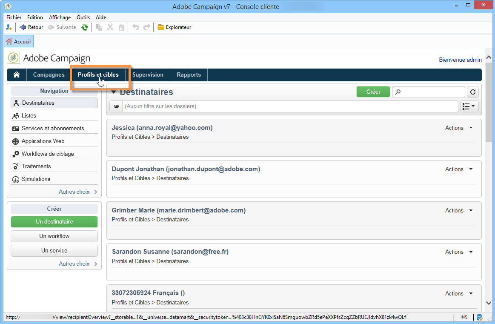
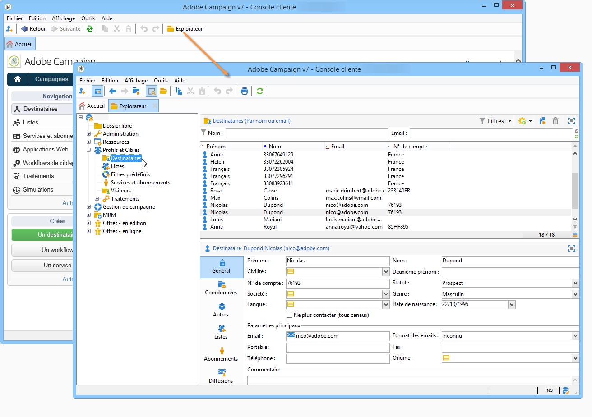

# Prise en main des profils{#about-profiles}

Les profils sont centralisés dans la base de données Adobe Campaign. Il existe de nombreux mécanismes permettant d’acquérir des profils et créer cette base de données : collecte en ligne par le biais de formulaires Web, importation manuelle ou automatique de fichiers texte, réplication avec des bases de données d’entreprises ou d’autres systèmes d’information. Adobe Campaign vous permet d’intégrer des données d’historique marketing, des informations d’achat, des préférences, des données CRM et des données d’informations personnelles pertinentes dans une vue consolidée afin d’effectuer une analyse et de prendre des mesures.

Un « **Profil** » désigne un enregistrement d’informations (par exemple : un enregistrement dans la table nmsRecipient ou une table externe contenant un identifiant de cookie, un identifiant client, un identifiant mobile ou d’autres informations relatives à un canal particulier) représentant un client final, un prospect ou un lead.

Dans Adobe Campaign, les destinataires sont les profils par défaut ciblés pour l’envoi de diffusions (emails, SMS, etc.). Les données de destinataire stockées dans la base de données permettent de filtrer la cible qui recevra une diffusion donnée et d’ajouter des données de personnalisation dans le contenu de votre diffusion. D&#39;autres types de profils existent dans la base de données. Ils sont conçus pour différents usages. Par exemple, les profils de contrôle servent à tester vos diffusions avant leur envoi vers la cible finale.

 [Comprendre le concept des profils en vidéo](#create-profiles-video)

## Types de profils {#profile-types}

Adobe Campaign vous permet de gérer des profils dans toutes les étapes de leur cycle de vie : création, import, ciblage, tracking des actions, mise à jour, etc.

Un profil correspond à une entrée dans la base de données. Il contient toutes les informations nécessaires au ciblage, à la qualification et au tracking des individus.

Les profils peuvent être identifiés selon leur espace de stockage. Ainsi, un profil peut correspondre à : un destinataire, un visiteur, un opérateur, un abonné, un prospect, etc.

## Profils de destinataires {#recipient-profiles}

Les destinataires des diffusions sont stockés dans la base de données sous forme de profils regroupant les informations qui leur sont attachées : nom, prénom, coordonnées, abonnements, diffusions, etc. Lorsque vous créez des campagnes, vous pouvez définir la cible des diffusions à partir d&#39;une sélection parmi les profils présents dans la base, selon des critères simples ou avancés.

Vous pouvez également créer des campagnes destinées à des destinataires dont les profils ne sont pas stockés dans la base de données, mais dans des fichiers. Il s’agit de diffusions dites « externes ». Pour plus d&#39;informations sur ce type de diffusions, consultez [cette page](../../delivery/using/steps-defining-the-target-population.md#selecting-external-recipients).

Les principales méthodes pour créer des profils de destinataires sont les suivantes :

* saisie directe dans les écrans de l&#39;interface graphique,
* import de fichiers de destinataires,
* collecte en ligne, via des formulaires web.

>[!NOTE]
>
>L’import de fichiers et de formulaires web est présenté dans la section [Imports et exports génériques](../../platform/using/get-started-data-import-export.md).

## Profils et cibles {#profiles-and-targets}

Le lien **[!UICONTROL Profils et cibles]** permet d’afficher les destinataires stockés dans la base de données Adobe Campaign. Vous pouvez créer un nouveau destinataire, en modifier un existant et accéder à son profil. Pour plus d’informations, consultez [cette page](../../platform/using/editing-a-profile.md).

Il permet également d&#39;accéder :

* listes - [En savoir plus](../../platform/using/creating-and-managing-lists.md)
* services d’inscriptions - [En savoir plus](../../delivery/using/managing-subscriptions.md)
* applications Web - [En savoir plus](../../web/using/about-web-applications.md)
* importations et exportations (traitements) - [En savoir plus](../../platform/using/about-generic-imports-exports.md)
* workflows de ciblage - [En savoir plus](../../workflow/using/building-a-workflow.md#implementation-steps-)

La page des destinataires permet d&#39;effectuer les opérations courantes sur les profils : édition, mise à jour, ajout, suppression, tri.

Pour des manipulations de profils plus avancées, il est nécessaire d&#39;éditer l&#39;arborescence Adobe Campaign pour accéder à des fonctionnalités avancées. Pour cela, cliquez sur le lien **[!UICONTROL Explorateur]** depuis la page d&#39;accueil d&#39;Adobe Campaign.

Par défaut, les destinataires sont stockés dans le nœud **[!UICONTROL Profils et cibles > Destinataires]** de l&#39;arborescence. Vous pouvez créer des destinataires depuis cette vue, ainsi que :

* trier et filtrer les profils de la base de données - [En savoir plus](../../platform/using/filtering-options.md)
* déplacer, copier ou enlever des profils de la base de données - [En savoir plus](../../platform/using/managing-profiles.md)
* mettre à jour un profil - [En savoir plus](../../platform/using/updating-data.md)
* exporter des destinataires - [En savoir plus](../../platform/using/exporting-and-importing-profiles.md)
* créer des groupes de destinataires - [En savoir plus](../../platform/using/creating-and-managing-lists.md)

Pour accéder aux fonctionnalités avancées et aux paramétrages, vous devez cliquer sur l’icône **[!UICONTROL Explorateur]**.

La mise en page générale de l’explorateur Adobe Campaign est présentée sur [cette page](../../platform/using/adobe-campaign-explorer.md).

>[!NOTE]
>
>Vous pouvez également afficher une vue avancée de cette liste à partir de l’arborescence Adobe Campaign, en cliquant sur le lien **[!UICONTROL Profils et cibles > Destinataires]**. L’affichage de cette liste peut être paramétré selon vos besoins. Vous pouvez ajouter ou supprimer des colonnes, définir leur ordre, trier les données, etc. La configuration de l’affichage des listes est décrite sur [cette page](../../platform/using/adobe-campaign-ui-lists.md).
>
>Vous pouvez également définir des vues de destinataires. Pour plus d’informations sur cette fonctionnalité, consultez [cette section](../../platform/using/access-management-folders.md).

## Profils actifs {#active-profiles}

Un profil actif est un profil avec lequel le client ou la cliente a tenté de communiquer au cours des 12 derniers mois via n’importe quel canal.

Conformément à votre contrat, chacune de vos instances Campaign est configurée avec un nombre spécifique de profils actifs comptabilisés à des fins de facturation. Consultez votre dernier contrat pour connaître le nombre de profils actifs achetés. En savoir plus dans la [description du produit Adobe Campaign](https://helpx.adobe.com/fr/legal/product-descriptions/adobe-campaign-managed-cloud-services.html){target="_blank"}.

Vous pouvez surveiller le nombre de profils actifs utilisés sur votre instance directement à partir du panneau de contrôle de Campaign. Pour plus d’informations à ce sujet, consultez la [documentation du Panneau de contrôle Campaign](https://experienceleague.adobe.com/docs/control-panel/using/performance-monitoring/active-profiles-monitoring.html?lang=fr){target="_blank"}.

Les limitations et mécanismes de sécurisation suivants s’appliquent :

* Un profil qui a été ciblé par plusieurs diffusions n’est comptabilisé qu’une seule fois.
* Les profils ciblés dans le cadre du marketing social sur X (anciennement Twitter) ou Facebook ne sont pas pris en compte comme profils actifs.
* Le nombre de profils actifs est disponible pour les **instances marketing** uniquement. Il n&#39;est pas disponible pour les instances d&#39;exécution, c&#39;est-à-dire les instances MID (mid-sourcing) et RT (Message Center / messagerie en temps réel).
* Le comptage est basé sur la clé primaire de la personne destinataire. Par conséquent, si un profil est présent dans deux tableaux de personnes destinataires différents, il peut être compté deux fois comme profil actif.

## Tutoriel vidéo {#create-profiles-video}

Découvrez comment accéder aux données de profil, trier et filtrer les profils et créer et gérer manuellement des profils.

Cette vidéo explique également la conformité d’Adobe Campaign Classic au RGPD.

>[!VIDEO](https://video.tv.adobe.com/v/3424578?quality=12&captions=fre_fr)

D’autres vidéos pratiques sur Campaign Classic sont disponibles [ici](https://experienceleague.adobe.com/docs/campaign-classic-learn/tutorials/overview.html?lang=fr).

**Voir aussi**

* [Gestion de la confidentialité dans Campaign](https://helpx.adobe.com/fr/campaign/kb/acc-privacy.html)

* [Création de requêtes et de données de segment dans des workflows](../../workflow/using/targeting-data.md)

* [Sélectionner un mapping de ciblage](../../delivery/using/steps-defining-the-target-population.md#select-a-target-mapping)
