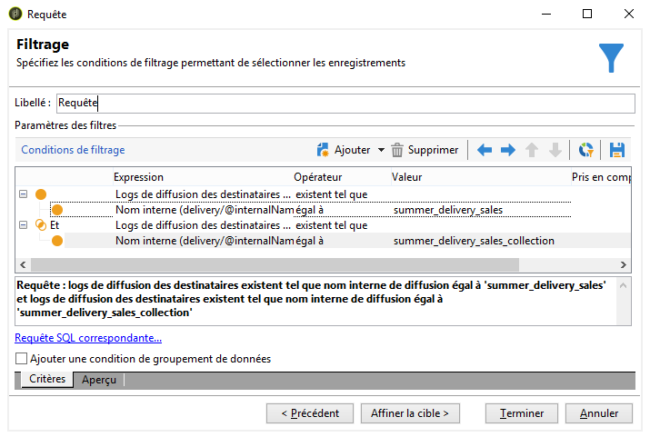

# Prise en main des requêtes{#about-queries-in-campaign}

L&#39;outil de requêtage est présent à de nombreux niveaux de la plateforme Adobe Campaign : pour créer une population cible, segmenter les clients, extraire et filtrer des logs de tracking, construire des filtres, etc.

Le requêteur Adobe Campaign permet d&#39;interroger une base de données simplement grâce à un assistant dédié : le requêteur générique. Il est accessible depuis le menu **[!UICONTROL Outils > Requêteur générique...]**. Il permet d&#39;extraire des informations stockées dans une base de données, les organiser, les regrouper, les trier, etc. Par exemple, l&#39;utilisateur peut récupérer les destinataires ayant cliqué plus de &#39;n&#39; fois dans le lien d&#39;une newsletter et sur une période donnée. Il pourra organiser la collecte, le tri et l&#39;affichage des résultats selon ses besoins.

Cet outil regroupe toutes les possibilités de requêtage d&#39;Adobe Campaign. Par exemple, il permet la création et la sauvegarde des filtres de restriction. Ainsi, un filtre utilisateur créé dans le Requêteur générique est réutilisable dans la boîte de Requête d&#39;un workflow de ciblage, etc.

Les requêtes sont réalisées soit avec les champs disponibles de la table sélectionnée, soit à l&#39;aide d&#39;une formule.

[Cliquez ici](../../workflow/using/query.md) pour découvrir le requêteur de Campaign.

