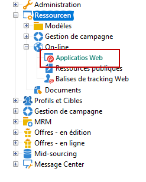

# Gestion de l’accès aux dossiers{#folder-access-management}

Chaque dossier de l’arborescence de navigation de l’Explorateur dispose de droits d’accès en lecture, en écriture et en suppression associés. Pour accéder à un fichier, un opérateur ou un groupe d’opérateurs doit avoir au moins un accès en lecture.

## Les dossiers et les vues {#folders-and-views}

### Qu’est-ce qu’un dossier ? {#about-folders}

Les dossiers sont des nœuds dans l’arborescence Adobe Campaign. Ces nœuds sont créés à partir du bouton droit de la souris dans l’arborescence, via le menu **[!UICONTROL Ajouter un dossier]**. Par défaut, le premier menu permet d’ajouter le dossier correspondant au contexte en cours.

Vous pouvez personnaliser l’arborescence de navigation de l’Explorateur. Découvrez les étapes et les bonnes pratiques de configuration [dans cette section](adobe-campaign-workspace.md).

### Qu’est-ce qu’une vue ? {#about-views}

En outre, vous pouvez créer des vues afin de restreindre l&#39;accès aux données et d&#39;organiser le contenu de l&#39;arborescence pour l&#39;adapter à vos besoins. Vous pourrez ensuite attribuer des droits sur les vues.

Une vue est un dossier affichant des enregistrements stockés physiquement dans un ou plusieurs autres dossiers du même type. Par exemple, si vous créez un dossier Campagne qui est une vue, il affichera par défaut toutes les campagnes présentes dans la base, quelle que soit leur origine. Ces données peuvent ensuite être filtrées.

Lorsque vous transformez un dossier en vue, l&#39;ensemble des données correspondant au type de dossier présentes dans la base sont affichées dans la vue, quel que soit leur dossier d&#39;enregistrement. Vous pouvez ensuite les filtrer pour restreindre la liste des données affichées.

>[!IMPORTANT]
>
>Les vues regroupent des données et permettent d&#39;y accéder. Toutefois, elles ne sont pas physiquement stockées dans le dossier de la vue. L&#39;opérateur doit avoir les droits correspondants à l&#39;action visée dans le ou les dossiers d&#39;origine des données (lecture au minimum).
>
>Pour donner accès à une vue sans donner accès à son dossier d&#39;origine, il suffit de ne pas donner de droit en lecture sur le noeud parent du dossier source.

Pour distinguer les vues et les dossiers, le nom de chaque vue s’affiche dans une couleur différente (cyan foncé).

### Ajouter des dossiers et créer des vues {#adding-folders-and-creating-views}

Dans l&#39;exemple ci-dessous, nous allons créer des dossiers afin d&#39;afficher des données spécifiques :

1. Créez un nouveau dossier de type **[!UICONTROL Diffusions]** et nommez-le **Diffusions France**.
1. Cliquez avec le bouton droit sur ce dossier et choisissez **[!UICONTROL Propriétés...]**.

   

1. Depuis l&#39;onglet **[!UICONTROL Restriction]**, sélectionnez l&#39;option **[!UICONTROL Ce dossier est une vue]** : toutes les diffusions de la base y seront alors affichées.

   

1. Définissez les critères de filtrage des diffusions à partir du requêteur proposé dans la section centrale de la fenêtre : les campagnes affichées seront alors celles qui correspondent au filtre défini.

   >[!NOTE]
   >
   >Le requêteur est présenté dans [cette section](../../platform/using/about-queries-in-campaign.md).

   Avec les conditions de filtrage suivantes :

Les diffusions suivantes seront affichées dans la vue :

>[!NOTE]
>
>Lors de la gestion des événements de [messagerie transactionnelle](../../message-center/using/about-transactional-messaging.md), les dossiers **[!UICONTROL Événements temps réel]** ou **[!UICONTROL Événements batch]** ne doivent pas être définis comme des vues sur les instances d&#39;exécution, car cela pourrait entraîner des problèmes de droit d&#39;accès. Pour plus d&#39;informations sur la collecte d&#39;événements, voir [cette section](../../message-center/using/about-event-processing.md#event-collection).

## Autorisations sur un dossier

### Modifier les autorisations sur un dossier {#edit-permissions-on-a-folder}

Pour modifier les autorisations sur un dossier spécifique de l&#39;arborescence, suivez les étapes ci-dessous :

1. Cliquez avec le bouton droit sur le dossier et sélectionnez **[!UICONTROL Propriétés...]**.

   

1. Cliquez sur l&#39;onglet **[!UICONTROL Sécurité]** pour visualiser les autorisations sur ce dossier.

   

### Modifier les autorisations {#modify-permissions}

Pour modifier les autorisations, vous pouvez :

* **Remplacer un groupe ou un opérateur**. Pour cela, cliquez sur un des groupes (ou opérateurs) ayant des droits sur ce dossier et sélectionnez un nouveau groupe (ou un nouvel opérateur) depuis la liste déroulante :

   

* **Autoriser un groupe ou un opérateur**. Pour cela, cliquez sur le bouton **[!UICONTROL Ajouter]** et sélectionnez le groupe ou l&#39;opérateur auquel vous souhaitez attribuer des autorisations sur ce dossier.
* **Interdire un groupe ou un opérateur**. Pour cela, cliquez sur le bouton **[!UICONTROL Supprimer]** et sélectionnez le groupe ou l&#39;opérateur auquel vous souhaitez retirer toute autorisation sur ce dossier.
* **Sélectionner les droits attribués à un groupe ou un opérateur**. Pour cela, cliquez sur le groupe ou l&#39;opérateur visé : cochez les droits d&#39;accès que vous voulez lui attribuer et décochez les autres.

   

### Propager les autorisations {#propagate-permissions}

Vous pouvez propager les autorisations et les droits d&#39;accès. Pour cela, sélectionnez l&#39;option **[!UICONTROL Propager]** dans les propriétés du dossier.

Les autorisations définies dans cette fenêtre seront alors appliquées à l&#39;ensemble des sous-dossiers du nœud courant. Vous pourrez ensuite surcharger ces autorisations pour chacun des sous-dossiers.

>[!NOTE]
>
>Lorsque vous désélectionnez cette option pour un dossier, elle ne l&#39;est pas automatiquement pour ses sous-dossiers. Vous devez la désélectionner explicitement pour chacun des sous-dossiers.

### Accorder l&#39;accès à tous les opérateurs {#grant-access-to-all-operators}

Dans l&#39;onglet **[!UICONTROL Sécurité]**, si l&#39;option **[!UICONTROL Dossier système]** est cochée, tous les opérateurs auront accès aux données qu&#39;il contient, quels que soient leurs droits. Si elle n&#39;est pas cochée, alors il faut ajouter explicitement l&#39;opérateur (ou son groupe) dans la liste des autorisations pour qu&#39;il puisse y accéder.

