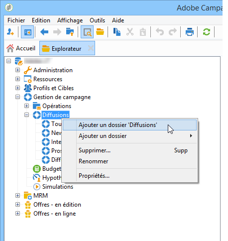

# Gestion de l’accès aux dossiers{#folder-access-management}

Chaque dossier de l’arborescence de navigation de l’Explorateur dispose de droits d’accès en lecture, en écriture et en suppression associés. Pour accéder à un fichier, un opérateur ou un groupe d’opérateurs doit avoir au moins un accès en lecture.

>[!NOTE]
>
>Pour en savoir plus sur les autorisations appliquées aux dossiers, consultez la [documentation de Campaign v8](https://experienceleague.adobe.com/fr/docs/campaign/campaign-v8/admin/permissions/folder-permissions){target=_blank}.

## Les dossiers et les vues {#folders-and-views}

### Qu’est-ce qu’un dossier ? {#about-folders}

Les dossiers sont des nœuds dans l’arborescence Adobe Campaign. Ces nœuds sont créés à partir du bouton droit de la souris dans l’arborescence, via le menu **[!UICONTROL Ajouter un nouveau dossier]**. Par défaut, le premier menu permet d’ajouter le dossier correspondant au contexte en cours.

Vous pouvez personnaliser l’arborescence de navigation de l’Explorateur. Découvrez les étapes et les bonnes pratiques de configuration [dans cette section](adobe-campaign-workspace.md).

### Qu’est-ce qu’une vue ? {#about-views}

En outre, vous pouvez créer des vues afin de restreindre l&#39;accès aux données et d&#39;organiser le contenu de l&#39;arborescence pour l&#39;adapter à vos besoins. Vous pourrez ensuite attribuer des droits sur les vues.

Une vue est un dossier affichant des enregistrements stockés physiquement dans un ou plusieurs autres dossiers du même type. Par exemple, si vous créez un dossier Campagne qui est une vue, il affichera par défaut toutes les campagnes présentes dans la base, quelle que soit leur origine. Ces données peuvent ensuite être filtrées.

Lorsque vous transformez un dossier en vue, l&#39;ensemble des données correspondant au type de dossier présentes dans la base sont affichées dans la vue, quel que soit leur dossier d&#39;enregistrement. Vous pouvez ensuite les filtrer pour restreindre la liste des données affichées.

>[!IMPORTANT]
>
>Les vues regroupent des données et permettent d&#39;y accéder. Toutefois, elles ne sont pas physiquement stockées dans le dossier de la vue. L&#39;opérateur doit avoir les droits correspondants à l&#39;action visée dans le ou les dossiers d&#39;origine des données (lecture au minimum).
>
>Pour donner accès à une vue sans donner accès à son dossier d&#39;origine, il suffit de ne pas donner de droit en lecture sur le noeud parent du dossier source.

Pour distinguer les vues et les dossiers, le nom de chaque vue s’affiche dans une couleur différente (cyan foncé).

### Ajouter des dossiers et créer des vues {#adding-folders-and-creating-views}

>[!IMPORTANT]
>
>Les dossiers prêts à l’emploi ne doivent pas être marqués comme des vues.

Dans l&#39;exemple ci-dessous, nous allons créer des dossiers afin d&#39;afficher des données spécifiques :

1. Créez un nouveau dossier de type **[!UICONTROL Diffusions]** et nommez-le **Diffusions France**.
1. Cliquez avec le bouton droit sur ce dossier et choisissez **[!UICONTROL Propriétés...]**.

   

1. Depuis l’onglet **[!UICONTROL Restriction]**, sélectionnez l’option **[!UICONTROL Ce dossier est une vue]** : toutes les diffusions de la base de données y seront alors affichées.

   

1. Définissez les critères de filtrage des diffusions à partir du requêteur proposé dans la section centrale de la fenêtre : les campagnes affichées seront alors celles qui correspondent au filtre défini.

   >[!NOTE]
   >
   >Le requêteur est présenté dans [cette section](../../platform/using/about-queries-in-campaign.md).

   Avec les conditions de filtrage suivantes :

Les diffusions suivantes seront affichées dans la vue :

>[!NOTE]
>
>Lors de la gestion des événements de [messagerie transactionnelle](../../message-center/using/about-transactional-messaging.md), les dossiers **[!UICONTROL Événements temps réel]** ou **[!UICONTROL Événements batch]** ne doivent pas être définis comme des vues sur les instances d&#39;exécution, car cela pourrait entraîner des problèmes de droit d&#39;accès. Pour plus d&#39;informations sur la collecte d&#39;événements, voir [cette section](../../message-center/using/about-event-processing.md#event-collection).

<!--
## Permissions on a folder

### Edit permissions on a folder {#edit-permissions-on-a-folder}

To edit permissions on a specific folder of the tree, follow the steps below:

1. Right-click on the folder and select **[!UICONTROL Properties...]**.

   

1. Click the **[!UICONTROL Security]** tab to view authorizations on this folder.

   

### Modify permissions {#modify-permissions}

To modify permissions, you can:

* **Replace a group or an operator**. To do this, click one of the groups (or operators) with rights to the folder, and select a new group (or a new operator) from the drop-down list:

  

* **Authorize a group or an operator**. To do this, click the **[!UICONTROL Add]** button and select the group or operator to which you want to assign authorizations for this folder.
* **Forbid a group or an operator**. To do this, click **[!UICONTROL Delete]** and select the group or operator from which you want to remove authorization for this folder.
* **Select the rights assigned to a group or an operator**. To do this, click the group or operator concerned, then select the access rights you want to grant and deselect the others.

  

### Propagate permissions {#propagate-permissions}

You can propagate authorizations and access rights. To do this, select the **[!UICONTROL Propagate]** option in the folder properties.

The authorizations defined in this window will then be applied to all the sub-folders of the current node. You can then overload these authorizations for each of the sub-folders.

>[!NOTE]
>
>Clearing this option for a folder does not automatically clear it for the sub-folders. You must clear it explicitly for each of the sub-folders.

### Grant access to all operators {#grant-access-to-all-operators}

In the **[!UICONTROL Security]** tab, if the **[!UICONTROL System folder]** option is selected, all operators will have access to this data, regardless of their rights. If this option is cleared, you must explicitly add the operator (or their group) to the list of authorizations in order for them to have access.

-->