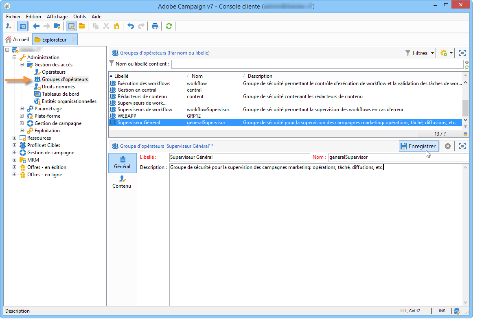
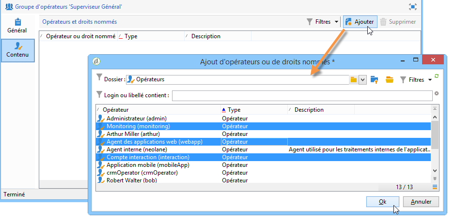

# Créer et gérer des groupes d’opérateurs et d’opératrices {#operator-groups}

>[!NOTE]
>
>Ces procédures s’appliquent uniquement aux opérateurs qui se connectent à Campaign avec l’**authentification native héritée**. À compter de Campaign Classic v7.3.1, tous les opérateurs doivent utiliser [Adobe Identity Management System (IMS)](https://helpx.adobe.com/fr/enterprise/using/identity.html){target="_blank"} pour se connecter à Campaign. [En savoir plus](../../technotes/using/migrate-users-to-ims.md)
>
>Lors de la connexion à Campaign avec votre Adobe ID, la section suivante ne s&#39;applique plus. Découvrez comment configurer des autorisations avec Adobe IMS dans la [documentation de Campaign v8](https://experienceleague.adobe.com/docs/campaign/campaign-v8/admin/permissions/gs-permissions.html?lang=fr){target="_blank"}.

Les groupes d’opérateurs sont créés à partir du nœud **[!UICONTROL Administration > Gestion des accès > Groupes d’opérateurs]** de l’arborescence.

## Création d’un groupe d’opérateurs {#creating-a-new-operator-group}

Pour créer un nouveau groupe d&#39;opérateurs, les étapes sont les suivantes :

1. Cliquez sur le bouton **[!UICONTROL Nouveau]** situé au-dessus de la liste des groupes ou cliquez avec le bouton droit dans la liste et choisissez **[!UICONTROL Nouveau]**.
1. Dans la section inférieure de la fenêtre, depuis l&#39;onglet **[!UICONTROL Général]**, saisissez le nom et une description pour ce groupe dans les champs correspondants.

   

1. Cliquez sur l&#39;onglet **[!UICONTROL Contenu]** pour définir les autorisations accordées à ce groupe.
1. Cliquez sur le bouton **[!UICONTROL Ajouter]** pour sélectionner un droit nommé ou un opérateur à associer au groupe.
1. Cliquez sur la liste déroulante ou sur le dossier situés à droite du champ **[!UICONTROL Dossier]** pour localiser et afficher les droits nommés ou les opérateurs à associer à ce groupe.
1. Sélectionnez les droits ou opérateurs à ajouter et cliquez sur **[!UICONTROL OK]** pour valider.

   

   Répétez éventuellement cette opération pour ajouter d&#39;autres droits ou opérateurs.

1. Cliquez sur le bouton **[!UICONTROL Enregistrer]** pour ajouter le groupe à la liste.

## Les groupes par défaut {#default-groups}

Les groupes d&#39;opérateurs par défaut sont les suivants :

1. **[!UICONTROL Administrateur]**

   Les opérateurs de ce groupe ont un accès complet à l&#39;instance. Les administrateurs sont les utilisateurs pouvant accéder aux parties les plus techniques de l&#39;interface. Ils ont le rôle **[!UICONTROL Administration]** et s’assurent que la plateforme est entièrement configurée.

   Ce groupe contient les droits nommés suivants :

   * **[!UICONTROL ADMINISTRATION]** : droit pour exécuter, créer, éditer et supprimer tout objet tel que workflow, diffusion, script, etc.

1. **[!UICONTROL Chargés de diffusion]**

   Les opérateurs de ce groupe sont chargés de la gestion des diffusions : il permet l&#39;accès aux ressources principales nécessaires à la création et la préparation des diffusions (typologies de campagnes, mappings de diffusions, modèles par défaut, blocs de personnalisation, etc.).

   Ce groupe contient les droits nommés suivants :

   * **[!UICONTROL PRÉPARER DES DIFFUSIONS]** : droit pour créer, éditer et lancer l&#39;analyse des diffusions,
   * **[!UICONTROL DÉMARRER DES DIFFUSIONS]** : droit pour valider les diffusions préalablement analysées.

1. **[!UICONTROL Chargés d&#39;opération]**

   Les opérateurs et opératrices de ce groupe peuvent gérer les campagnes marketing : il permet d’accéder aux objets relatifs aux opérations (plans, programmes, workflows, budgets, etc.) dans le cadre de **[!UICONTROL Campaign]** (module Adobe Campaign optionnel).

   Ce groupe contient les droits nommés suivants :

   * **[!UICONTROL INSERTION DES DOSSIERS DOSSIERS]** : dans l’arborescence d’Adobe Campaign (sous réserve d’un accès en écriture sur les branches concernées),
   * **[!UICONTROL WORKFLOW]** : droit pour utiliser les workflows.

   >[!NOTE]
   >
   >Ce groupe ne permet pas aux opérateurs de démarrer les diffusions.

1. **[!UICONTROL Rédacteurs de contenu]**

   Les opérateurs de ce groupe peuvent accéder aux dossiers Contenus, dans le cadre de la **[!UICONTROL Gestion de Contenu]** (module optionnel d&#39;Adobe Campaign). Ce groupe n&#39;accorde pas de droit supplémentaire.

1. **[!UICONTROL Consultation des rapports]**

   Ce groupe est réservé aux opérateurs et opératrices externes afin d’activer les icônes Rapport, Planning et Forum dans le tableau de bord des opérations pour un opérateur ou une opératrice spécifique.

1. **[!UICONTROL Exécution des workflows]**

   Ce groupe permet d&#39;attribuer aux opérateurs le droit de gérer les workflows indépendants des opérations.

1. **[!UICONTROL Superviseurs de workflow]**

   Les opérateurs de ce groupe sont notifiés par emails des alertes relatives aux workflows des opérations.

1. Gestion en local / Gestion en central

   Ces groupes permettent l&#39;utilisation du **[!UICONTROL Marketing distribué]** (module optionnel d&#39;Adobe Campaign).

1. **[!UICONTROL Chargés d’offres]**

   Les opérateurs de ce groupe peuvent créer et gérer des offres. Pour plus d’informations à ce sujet, consultez [cette page](../../interaction/using/operator-profiles.md).
Ce groupe contient les droits nommés suivants :

   * **[!UICONTROL INSERTION DES DOSSIERS]** : dans l’arborescence d’Adobe Campaign (sous réserve d’un accès en écriture sur les branches concernées),
   * **[!UICONTROL ÉDITION DES DOSSIERS]** : droit de modifier les propriétés du dossier telles que le nom interne, le libellé, l’image associée, l’ordre des sous-dossiers, etc.
