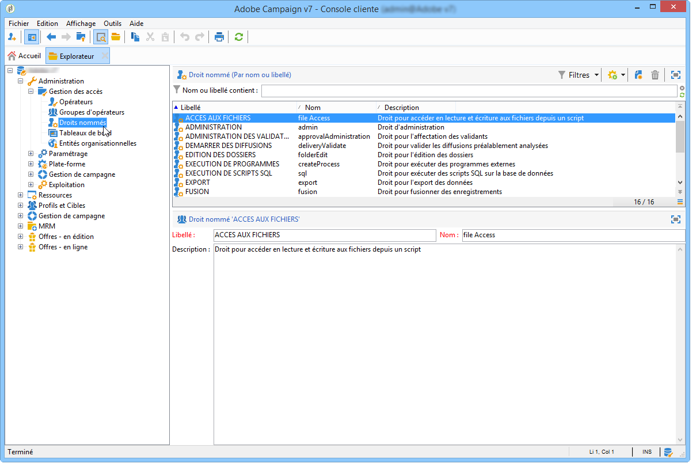

# Utilisation des droits nommés pour la configuration des autorisations{#named-rights}

Par défaut, Adobe Campaign propose un ensemble de droits nommés qui permettent de définir les autorisations attribuées aux opérateurs et groupes d&#39;opérateurs. Ces droits peuvent être édités depuis le noeud **[!UICONTROL Administration > Gestion des accès > Droits nommés]** de l&#39;arborescence.

Ces droits sont les suivants :

* **[!UICONTROL ADMINISTRATION]** : les opérateurs disposant du droit **[!UICONTROL ADMINISTRATION]** ont un accès total à l’instance. Les administrateurs peuvent exécuter/créer/éditer/supprimer tout objet tel que workflow, diffusion, script, etc.

* **[!UICONTROL ADMINISTRATION DES VALIDATIONS]** : vous pouvez définir plusieurs étapes de validation dans les workflows et les diffusions pour vous assurer que l’état actuel a été validé par un opérateur ou un groupe affecté. Les utilisateurs disposant du droit **[!UICONTROL ADMINISTRATION DES VALIDATIONS]** peuvent définir les étapes de validation et affecter un opérateur ou un groupe d’opérateurs chargé de valider ces étapes.

* **[!UICONTROL CENTRAL]** : droit de gestion en central (Marketing distribué).

* **[!UICONTROL SUPPRESSION DES DOSSIERS]** : droit de supprimer des dossiers. Avec ce droit, les utilisateurs sont autorisés à supprimer des dossiers dans la vue de l’explorateur.

* **[!UICONTROL ÉDITION DES DOSSIERS]** : droit de modifier les propriétés du dossier telles que le nom interne, le libellé, l’image associée, l’ordre des sous-dossiers, etc.

* **[!UICONTROL EXPORT]** : les utilisateurs peuvent exporter des données depuis leurs instances Adobe Campaign vers un fichier du serveur ou de l’ordinateur local à l’aide de l’activité de workflow **[!UICONTROL EXPORT]**.

* **[!UICONTROL ACCÈS AUX FICHIERS]** : droit d’accès aux fichiers en lecture et écriture via un script pouvant être écrit dans l’activité de workflow **[!UICONTROL JavaScript]** pour lire/écrire des fichiers sur un serveur.

* **[!UICONTROL IMPORT GÉNÉRIQUE]** : droit d’import générique de données. **[!UICONTROL IMPORT]** permet d’importer des données dans n’importe quelle autre table, tandis que le droit **[!UICONTROL IMPORT DE DESTINATAIRES]** ne permet d’effectuer un import que dans la table des destinataires.

* **[!UICONTROL INSERTION DES DOSSIERS]** : droit d’insérer des dossiers. Les utilisateurs disposant du droit **[!UICONTROL INSERTION DES DOSSIERS]** peuvent créer des dossiers dans l’arborescence de dossiers à l’aide de la vue de l’explorateur.

* **[!UICONTROL LOCAL]** : droit de gestion en local (Marketing distribué).

* **[!UICONTROL FUSION]** : droit de fusionner les enregistrements sélectionnés en un seul. S’il existe des doublons de destinataires, le droit **[!UICONTROL FUSION]** permet de les sélectionner et de les fusionner dans un destinataire principal.

* **[!UICONTROL PRÉPARER DES DIFFUSIONS]** : droit de créer, éditer et enregistrer une diffusion. Les utilisateurs disposant du droit **[!UICONTROL PRÉPARER DES DIFFUSIONS]** peuvent également lancer le processus d’analyse de diffusion.

* **[!UICONTROL DROIT RELATIF AUX DONNÉES PERSONNELLES]** : droit de collecter et de supprimer des informations personnelles. Voir à ce propos [cette page](https://helpx.adobe.com/fr/campaign/kb/acc-privacy.html).

* **[!UICONTROL EXÉCUTION DE PROGRAMMES]** : droit d’exécuter des commandes dans divers langages de programmation.

* **[!UICONTROL IMPORT DE DESTINATAIRES]** : droit d’importer des destinataires. Les utilisateurs disposant du droit **[!UICONTROL IMPORT DE DESTINATAIRES]** peuvent importer un fichier local dans la table des destinataires.

* **[!UICONTROL EXÉCUTION DE SCRIPTS SQL]** : droit d’exécuter des commandes SQL sur la base de données.

* **[!UICONTROL DÉMARRER DES DIFFUSIONS]** : droit de valider les diffusions préalablement analysées. Une fois l’analyse de diffusion terminée, la diffusion s’interrompt pour différentes étapes de validation et doit être approuvée pour reprendre. Les utilisateurs disposant du droit **[!UICONTROL DÉMARRER DES DIFFUSIONS]** sont autorisés à valider des diffusions.

* **[!UICONTROL UTILISER L’ACTIVITÉ DE GESTION DES DONNÉES SQL]** : droit d’écriture de vos propres scripts SQL, à l’aide de l’activité Gestion des données SQL, dans le but de créer et de remplir des tables de travail. Reportez-vous à la documentation de [Campaign v8](https://experienceleague.adobe.com/docs/campaign/automation/workflows/wf-activities/action-activities/sql-data-management.html){target="_blank"}.

* **[!UICONTROL WORKFLOW]** : droit d’exécuter des workflows. Sans ce droit, les utilisateurs ne peuvent pas démarrer, arrêter ou redémarrer des workflows.

* **[!UICONTROL WEBAPP]** : droit d’utilisation des applications web.

>[!NOTE]
>
>Cette liste peut varier en fonction des composants additionnels installés sur la plateforme.

## Matrice des droits d’accès {#access-rights-matrix}

Les groupes par défaut et les droits nommés permettent aux opérateurs d&#39;accéder à certains dossiers de l&#39;arborescence, et accordent des autorisations en lecture, écriture et suppression.

La matrice des droits d&#39;accès Adobe Campaign est disponible [ici](/help/platform/using/assets/access-rights-matrix.pdf).

