# Création et gestion d’opérateurs {#operators}

>[!CAUTION]
>
>Ces procédures ne s’appliquent qu’aux opérateurs et opératrices qui se connectent à Campaign via l’**authentification native héritée**. À compter de Campaign Classic v7.3.1, l’ensemble des opérateurs et opératrices doivent utiliser le [système de gestion des identités Adobe (IMS)](https://helpx.adobe.com/fr/enterprise/using/identity.html){target="_blank"} pour se connecter à Campaign. [En savoir plus](../../technotes/using/migrate-users-to-ims.md)
>
>Si vous vous connectez à Campaign avec votre Adobe ID, la section suivante ne s’applique plus. Découvrez comment configurer des autorisations avec Adobe IMS dans la [documentation de Campaign v8](https://experienceleague.adobe.com/docs/campaign/campaign-v8/admin/permissions/gs-permissions.html?lang=fr){target="_blank"}.

## Commencer avec les opérateurs et les opératrices Campaign {#about-operators}

>[!NOTE]
>
>Ces procédures ne s’appliquent qu’aux opérateurs et aux opératrices qui se connectent à Campaign via une authentification native. Pour l’authentification Adobe IMS, consultez [cette documentation](https://helpx.adobe.com/fr/enterprise/using/manage-users-individually.html#_blank).

Un opérateur est un utilisateur Adobe Campaign qui possède des autorisations pour se connecter et effectuer des actions.

Les opérateurs sont stockés par défaut dans le nœud **[!UICONTROL Administration > Gestion des accès > Opérateurs]**.

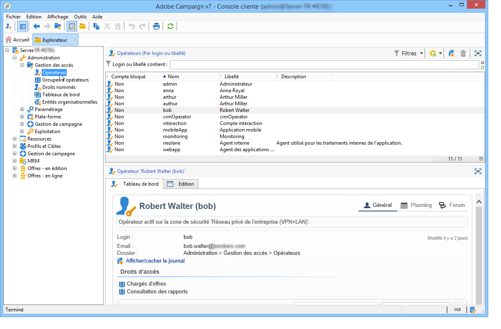

Les opérateurs peuvent être créés manuellement ou mappés dans un annuaire LDAP existant.

Vous trouverez la procédure complète de création d&#39;un opérateur sur [cette page](#creating-an-operator).

Pour plus d&#39;informations sur l&#39;intégration d&#39;Adobe Campaign avec LDAP, consultez [cette page](../../installation/using/connecting-through-ldap.md).

>[!IMPORTANT]
>
>Un opérateur doit être associé à une zone de sécurité pour se connecter à une instance. Pour plus d&#39;informations sur les zones de sécurité dans Adobe Campaign, consultez [cette page](../../installation/using/security-zones.md).

Les utilisateurs peuvent également se connecter directement à Adobe Campaign via leur Adobe ID. Pour en savoir plus à ce sujet, consultez cette [page](../../integrations/using/about-adobe-id.md).

## Création d’un opérateur {#creating-an-operator}

Pour créer un opérateur et accorder des autorisations, procédez comme suit :

1. Cliquez sur le bouton **[!UICONTROL Nouveau]** situé au-dessus de la liste des opérateurs et indiquez les détails de ce nouvel opérateur.

   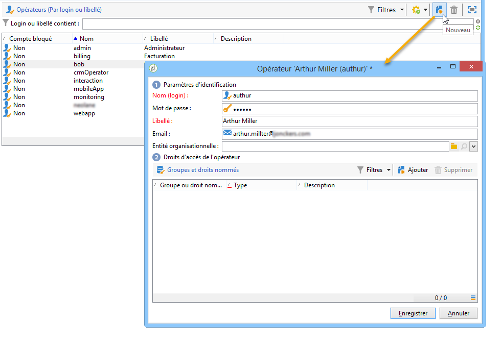

1. Spécifiez les **[!UICONTROL Paramètres d’identification]** de l&#39;utilisateur ou de l’utilisatrice : identifiant, mot de passe et nom. Le nom d’utilisateur et le mot de passe seront utilisés par l’opérateur ou l’opératrice pour se connecter à Adobe Campaign. Une fois connecté, l&#39;utilisateur peut changer son mot de passe depuis le menu **[!UICONTROL Outils > Changement de mot de passe]**. L&#39;email de l&#39;opérateur est essentiel, car il lui permet de recevoir des notifications, par exemple lors du traitement des validations.

   Cette section permet également d&#39;associer l&#39;opérateur à une entité organisationnelle. Pour en savoir plus, consultez la [documentation de Campaign v8](https://experienceleague.adobe.com/docs/campaign/automation/distributed-marketing/about-distributed-marketing.html?lang=fr){target="_blank"}.

1. Sélectionnez les autorisations accordées à l&#39;opérateur dans la section **[!UICONTROL Droits d&#39;accès de l&#39;opérateur]**.

   Pour attribuer des permissions à l&#39;opérateur, cliquez sur le bouton **[!UICONTROL Ajouter]** situé au-dessus de la liste des droits puis sélectionnez un groupe d&#39;opérateurs dans la liste des groupes disponibles :

   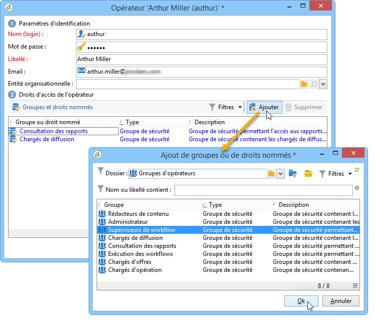

   Vous pouvez également sélectionner un ou plusieurs droits nommés (voir la section [Droits nommés](#named-rights)). Pour ce faire, cliquez sur la flèche à droite du champ **[!UICONTROL Dossier]**, puis sélectionnez **[!UICONTROL Droits nommés]**:

   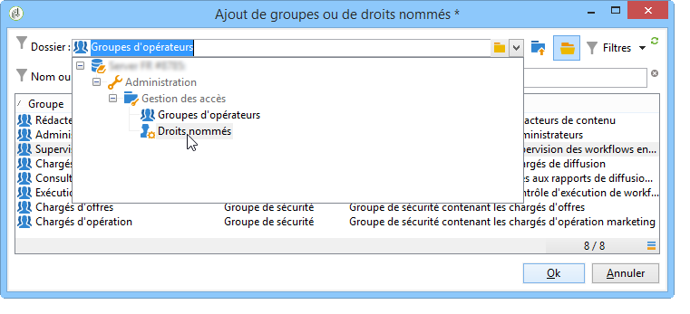

   Choisissez les groupes et/ou les droits nommés à attribuer et cliquez sur **[!UICONTROL OK]** pour valider.

1. Cliquez sur **[!UICONTROL OK]** pour créer l&#39;opérateur : son profil est alors ajouté à la liste des opérateurs existants.

   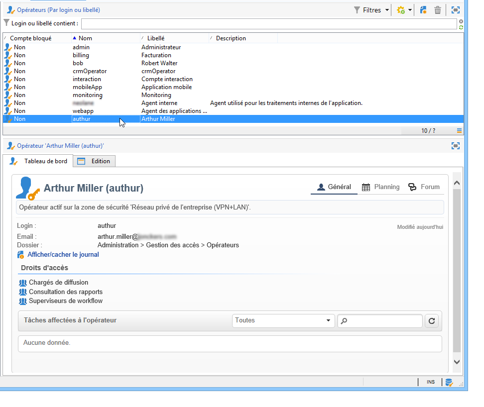

>[!NOTE]
>
>Vous pouvez organiser les opérateurs selon vos besoins en créant des dossiers d&#39;opérateurs. Pour cela, cliquez avec le bouton droit de la souris sur le dossier des opérateurs et sélectionnez **[!UICONTROL Ajouter un dossier &#39;Opérateurs&#39;]**.

Une fois le profil de l&#39;opérateur créé, vous pouvez compléter ou mettre à jour ses informations. Pour cela, cliquez sur l&#39;onglet **[!UICONTROL Edition]**.

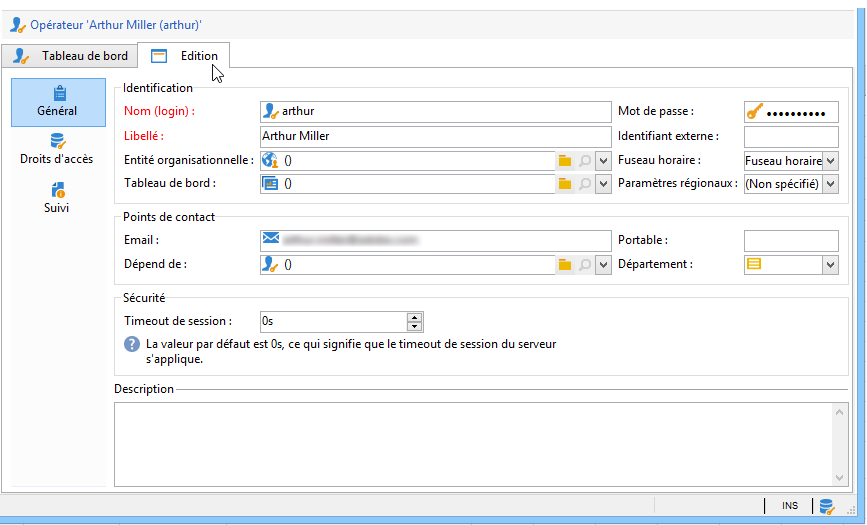

>[!NOTE]
>
>Le champ **[!UICONTROL Timeout de session]** permet d&#39;ajuster le délai avant l&#39;expiration de la session FDA. Voir à ce sujet la section [À propos de Federated Data Access](../../installation/using/about-fda.md).

## Définition du fuseau horaire de l’opérateur {#time-zone-of-the-operator}

Dans l’onglet **[!UICONTROL Général]**, vous pouvez sélectionner le fuseau horaire de l’opérateur. Par défaut, les opérateurs travaillent dans le fuseau horaire du serveur. Il est toutefois possible de sélectionner un autre fuseau horaire parmi ceux proposés dans la liste déroulante.

Les paramétrages relatifs aux fuseaux horaires sont décrits sur [cette page](../../installation/using/time-zone-management.md).

>[!NOTE]
>
>Le travail collaboratif dans différents fuseaux horaires nécessite le stockage des dates en UTC. Les dates sont converties dans le fuseau horaire adéquat dans les contextes suivants : affichage d&#39;une date dans le fuseau horaire de l&#39;utilisateur, import et export de fichiers, planification de l&#39;envoi d&#39;un email et activités planifiées dans un workflow (planificateur, attente, contrainte horaire, etc.).
>
>Les contraintes et recommandations relatives à ces contextes sont présentées dans les sections correspondantes de la documentation d&#39;Adobe Campaign.

En outre, la liste déroulante **[!UICONTROL Paramètres régionaux]** vous permet de sélectionner le format d&#39;affichage des dates et des nombres.

## Ajout d’autorisations {#access-rights-options}

Dans l&#39;onglet **[!UICONTROL Droits d&#39;accès]**, vous pouvez mettre à jour les groupes et droits nommés associés à l&#39;opérateur.

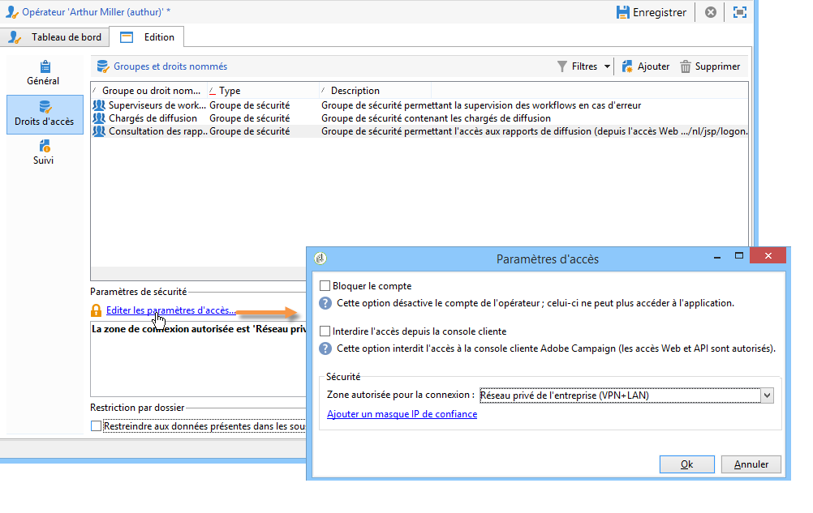

Le lien **[!UICONTROL Editer les paramètres d&#39;accès...]** permet d&#39;accéder aux options suivantes :

* L&#39;option **[!UICONTROL Désactiver le compte]** permet de désactiver le compte de l’opérateur : celui-ci ne peut plus accéder à Adobe Campaign.

  >[!NOTE]
  >
  >Même si son compte est désactivé, l’opérateur peut toujours recevoir des alertes ou des notifications de la part de Campaign. Pour arrêter l’envoi de notifications Campaign à cet opérateur, Adobe vous recommande de supprimer l’adresse e-mail de son profil.

* L&#39;option **[!UICONTROL Interdire l&#39;accès depuis la console cliente]** permet de restreindre l&#39;utilisation d&#39;Adobe Campaign à un [accès web](../../platform/using/adobe-campaign-workspace.md#console-and-web-access) ou par le biais d&#39;API : l&#39;accès à la console cliente Adobe Campaign n&#39;est plus disponible.
* Vous pouvez associer une zone de sécurité à l&#39;opérateur. Pour plus d’informations, consultez [cette page](../../installation/using/security-zones.md).
* Vous pouvez également définir un masque IP de confiance à partir du lien correspondant.

  L&#39;opérateur pourra se connecter à Adobe Campaign sans saisir son mot de passe si son adresse IP est dans cette liste.

  Vous pouvez également définir dans ce champ une plage d&#39;adresses IP qui seront autorisées à se connecter sans mot de passe, comme dans l&#39;exemple suivant :

  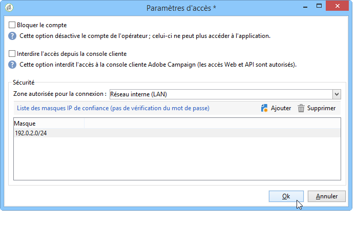

  >[!NOTE]
  >
  >Afin de préserver la sécurité de l&#39;accès à votre plateforme, cette option doit être utilisée avec précaution.

* L&#39;option **[!UICONTROL Restreindre aux données présentes dans les sous-dossiers de]** permet de limiter les droits attribués à l&#39;opérateur à un dossier. Seuls les sous-dossiers du noeud spécifié dans cette option seront visibles par l&#39;utilisateur :

  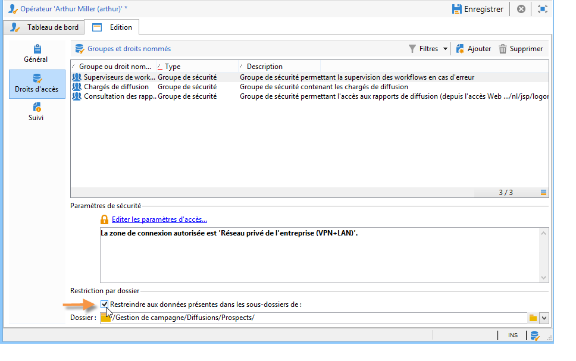

  >[!IMPORTANT]
  >
  >Il s’agit d’une restriction très stricte qui doit être utilisée avec précaution. Un opérateur connecté avec ce type de droits ne peut visualiser QUE le contenu du dossier spécifié et n’a accès à aucun autre nœud de l’arborescence via l’explorateur. Toutefois, selon les fonctionnalités auxquelles cet opérateur a accès (par exemple : workflows), l’utilisateur peut afficher les données généralement stockées dans des nœuds qui ne sont pas accessibles.

### Vérification des paramètres {#check-settings}

L&#39;onglet **[!UICONTROL Suivi]** permet de visualiser des informations relatives à l&#39;opérateur. Les différents onglets sont alimentés automatiquement en fonction des paramètres définis et des champs d&#39;intervention de l&#39;opérateur.

Vous pouvez accéder à :

* La liste des droits sur dossiers associés à l&#39;opérateur.

  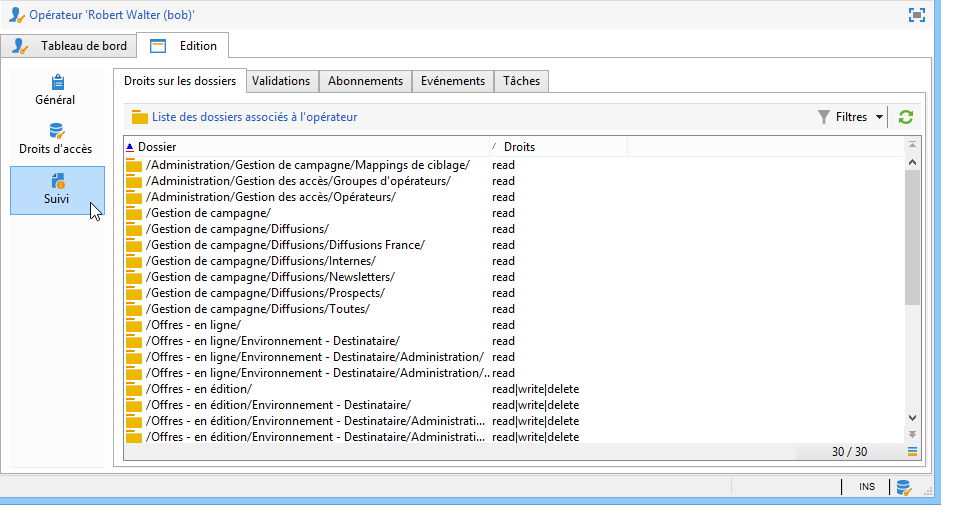

  >[!NOTE]
  >
  >Voir à ce sujet la section [Gestion de l&#39;accès aux dossiers](#folder-access-management).

* Le log des validations de l&#39;opérateur.

  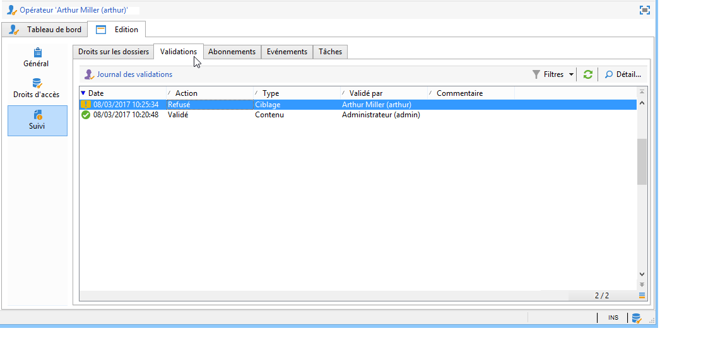

* La liste des forums de discussion auxquels il est abonné.
* Les événements de son calendrier.
* La liste des tâches qui lui sont affectées.

## Les opérateurs par défaut {#default-operators}

Adobe Campaign utilise des opérateurs techniques dont les profils sont paramétrés par défaut : Administrateur (&#39;admin&#39;), Facturation (&#39;billing&#39;), Monitoring, Agent des applications web (&#39;webapp&#39;), etc. Certains dépendent des applications et options installées sur la plateforme : par exemple, les opérateurs &#39;central&#39; et &#39;local&#39; ne sont présents que lorsque l&#39;option Marketing Distribué est installée.

>[!IMPORTANT]
>
>Ces opérateurs techniques sont par défaut notifiés lorsque des alertes ou des messages d&#39;information sont envoyés par la plateforme. Il est vivement recommandé de leur associer un email de contact.
>
>Pour assurer le bon fonctionnement des applications Web, nous vous recommandons également de ne pas définir de paramètres régionaux spécifiques à l&#39;opérateur &#39;webapp&#39;.

Par défaut, l&#39;opérateur technique &#39;webapp&#39; bénéficie du droit nommé ADMINISTRATION, ce qui risque de créer des failles de sécurité. Pour remédier à ce problème, il est recommandé de lui ôter ce droit. Pour cela :

1. Depuis le noeud **[!UICONTROL Administration > Gestion des accès > Droits nommés]**, cliquez sur **[!UICONTROL Nouveau]** pour créer un droit que vous nommerez par exemple WEBAPP.

   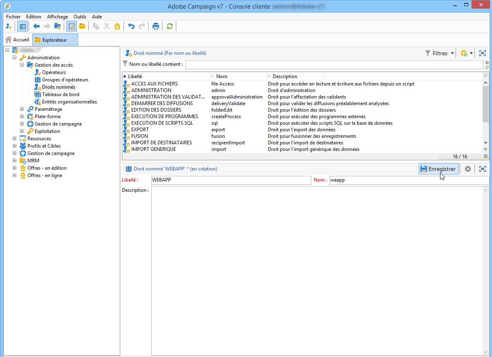

   Les droits nommés sont présentés dans la section [Droits nommés](#named-rights).

1. Depuis le noeud **[!UICONTROL Administration > Gestion des accès > Opérateurs]**, sélectionnez l&#39;opérateur Agent des applications web (&#39;webapp&#39;).

   Cliquez sur l&#39;onglet **[!UICONTROL Edition]**, puis sur l&#39;onglet **[!UICONTROL Droits d&#39;accès]** et supprimez le droit nommé ADMINISTRATION de la liste.

   

   Cliquez sur le bouton **[!UICONTROL Ajouter]** et sélectionnez le droit WEBAPP que vous venez de créer, puis enregistrez vos modifications.

   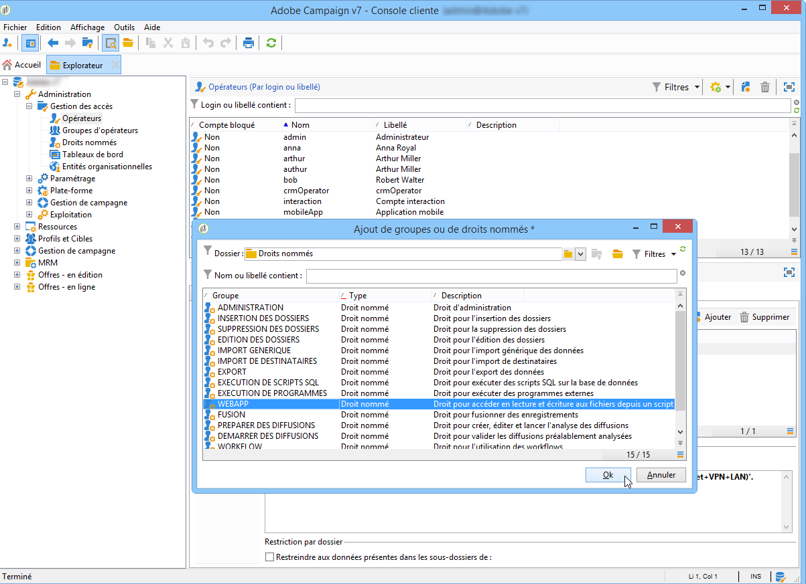

1. Attribuez à l&#39;opérateur &#39;webapp&#39; des propriétés d&#39;accès en lecture et en écriture sur les dossiers le concernant, soit principalement les dossiers &#39;Destinataires&#39;.

   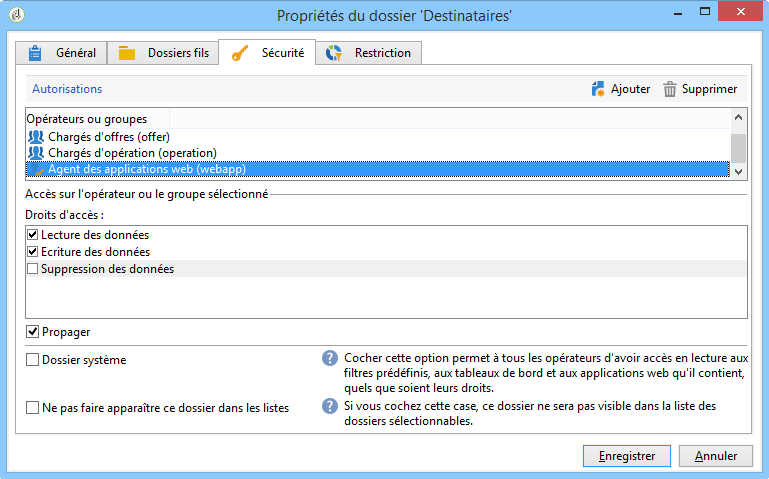

   La modification des droits sur des dossiers de l&#39;arborescence est présentée dans la section [Gestion de l&#39;accès aux dossiers](#folder-access-management).

>[!NOTE]
>
>Pour plus d&#39;informations sur les recommandations en matière de sécurité, consultez la [Liste de contrôle relative à la configuration de la sécurité dans Adobe Campaign](https://helpx.adobe.com/fr/campaign/kb/acc-security.html).