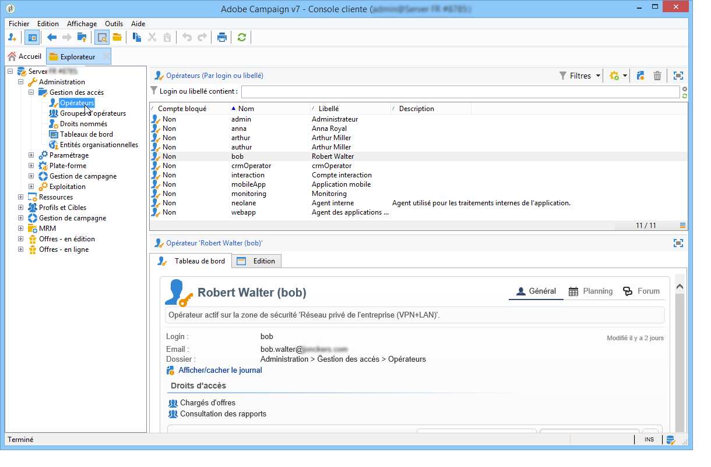
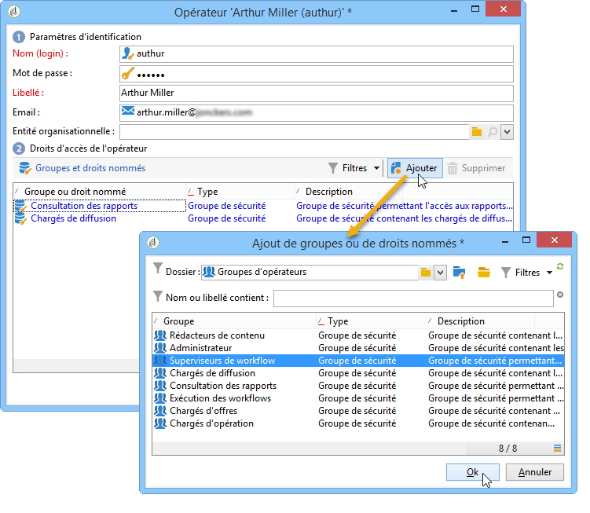
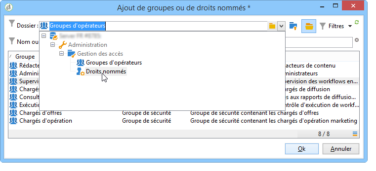
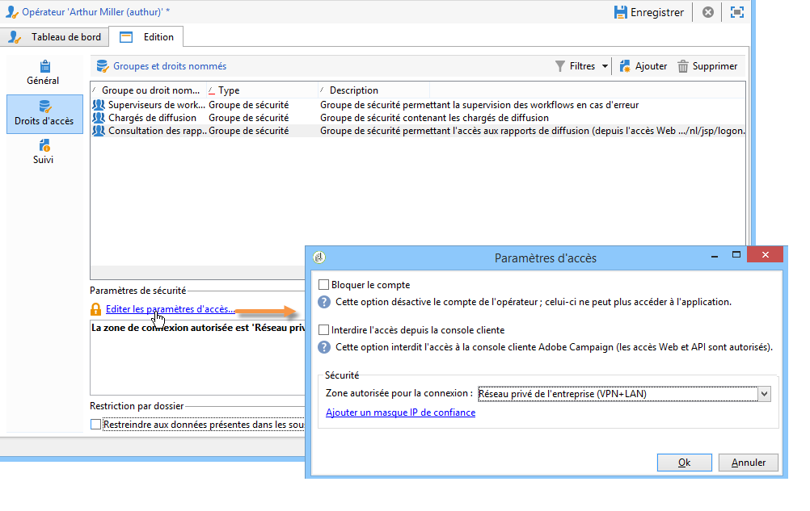
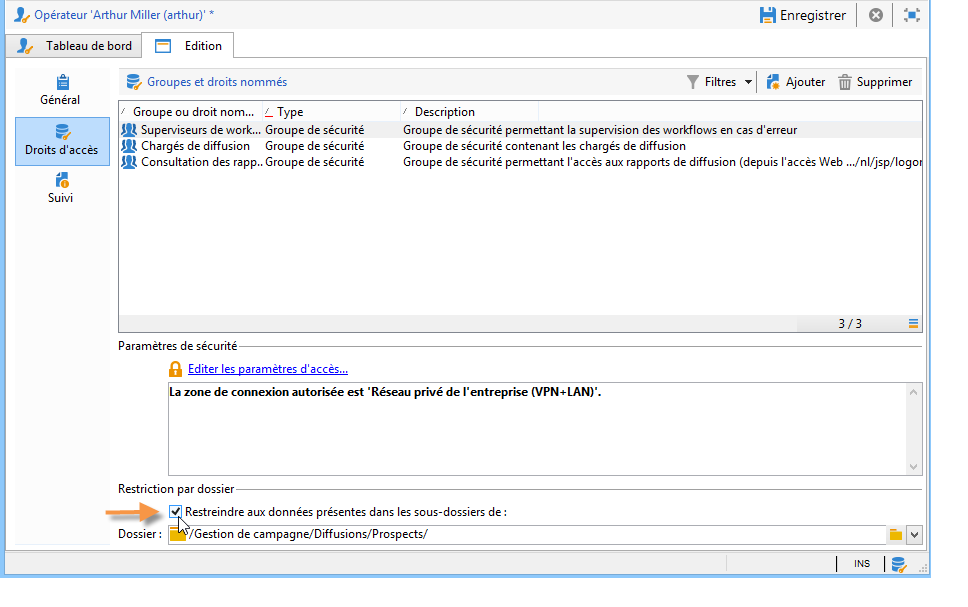
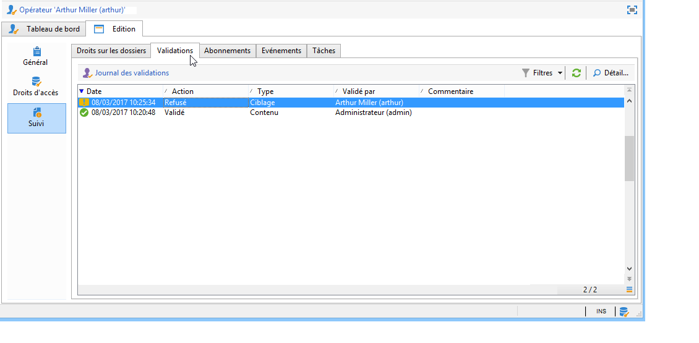
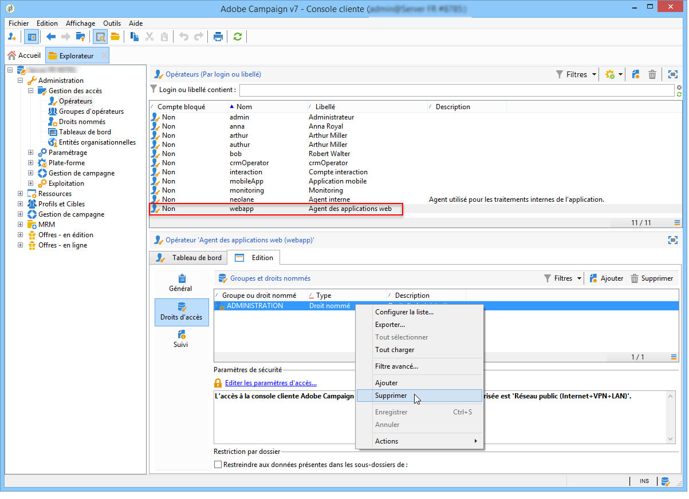
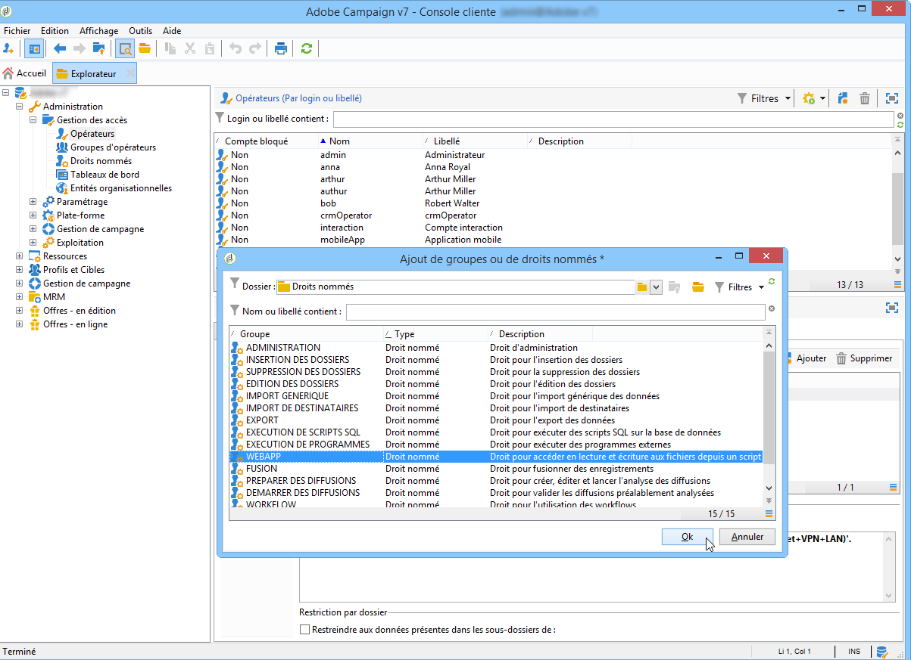
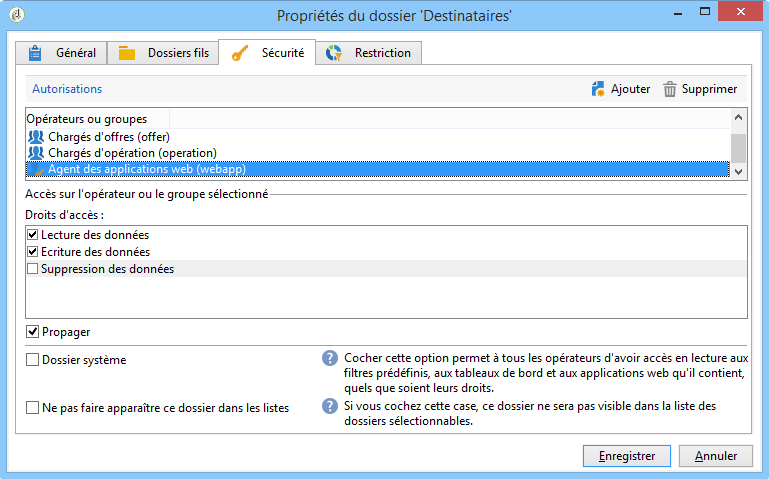
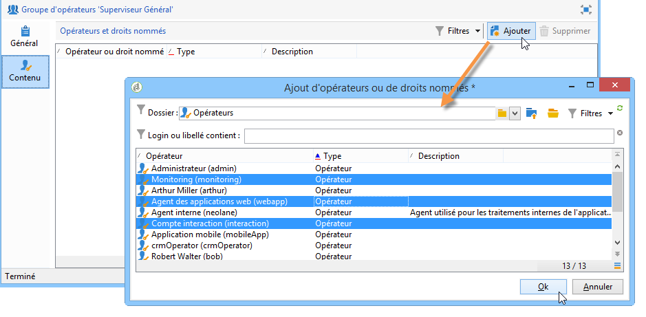

# Gestion des accès{#access-management}

## A propos des permissions {#about-permissions}

Adobe Campaign vous permet de définir et gérer les permissions attribuées aux différents opérateurs. Les permissions sont un ensemble de droits et restrictions qui autorisent ou interdisent :

* l&#39;accès à certaines fonctionnalités (via les droits nommés),
* l&#39;accès à certains enregistrements,
* la création, modification et/ou suppression des enregistrements (actions, contacts, campagnes, groupes, etc.).

Les permissions s&#39;appliquent à des profils d&#39;opérateurs ou à des groupes d&#39;opérateurs.

Elles sont complétées par des paramètres de sécurité liés au mode de connexion de l&#39;opérateur à Adobe Campaign. Voir à ce sujet [cette page](../../installation/using/configuring-campaign-server.md#defining-security-zones).

Vous pouvez accorder deux types de permissions à un utilisateur :

* Vous pouvez définir des groupes d’opérateurs auxquels vous attribuez des droits, puis les associer à un ou plusieurs groupes. Vous pouvez ainsi réutiliser les droits et rendre les profils d’opérateur plus cohérents. Il facilite également la gestion et la maintenance des profils. La création et la gestion des groupes sont présentées dans les groupes [Opérateurs](#operator-groups).
* Vous pouvez attribuer des droits nommés directement aux utilisateurs, dans certains cas pour surcharger les droits alloués via des groupes. Ces droits sont présentés dans Droits nommés.

>[!NOTE]
>
>Avant de commencer à définir les permissions, Adobe vous recommande de lire la [Liste de contrôle relative à la configuration de la sécurité](https://docs.campaign.adobe.com/doc/AC/getting_started/EN/security.html).

## Opérateurs {#operators}

### A propos des opérateurs {#about-operators}

Un opérateur est un utilisateur Adobe Campaign qui possède des permissions pour se connecter et effectuer des actions.

Les opérateurs sont stockés par défaut dans le nœud **[!UICONTROL Administration > Gestion des accès > Opérateurs]**.

Les opérateurs peuvent être créés manuellement ou mappés dans un annuaire LDAP existant.

Vous trouverez la procédure complète de création d&#39;un opérateur sur [cette page](#creating-an-operator).

Pour plus d&#39;informations sur l&#39;intégration d&#39;Adobe Campaign avec LDAP, consultez [cette page](../../installation/using/connecting-through-ldap.md).

>[!CAUTION]
>
>Un opérateur doit être associé à une zone de sécurité pour se connecter à une instance. Pour plus d&#39;informations sur les zones de sécurité dans Adobe Campaign, consultez [cette page](../../installation/using/configuring-campaign-server.md#defining-security-zones).

Les utilisateurs peuvent également se connecter directement à Adobe Campaign via leur Adobe ID. Voir à ce sujet [cette page](../../integrations/using/about-adobe-id.md).

### Créer un opérateur {#creating-an-operator}

Pour créer un opérateur et accorder des permissions, procédez comme suit :

1. Cliquez sur le bouton **[!UICONTROL Nouveau]** situé au-dessus de la liste des opérateurs et indiquez les détails de ce nouvel opérateur.

   

1. Indiquez les **[!UICONTROL Paramètres d&#39;identification]** de l&#39;utilisateur : son login, son mot de passe et son nom. Le login et le mot de passe permettront à l&#39;opérateur de se connecter à Adobe Campaign. Une fois connecté, l&#39;utilisateur peut changer son mot de passe depuis le menu **[!UICONTROL Outils > Changement de mot de passe]**. L&#39;email de l&#39;opérateur est essentiel, car il lui permet de recevoir des notifications, par exemple lors du traitement des validations.

   Cette section permet également d&#39;associer l&#39;opérateur à une entité organisationnelle. Voir à ce propos [cette page](../../campaign/using/about-distributed-marketing.md).

1. Sélectionnez les permissions accordées à l&#39;opérateur dans la section **[!UICONTROL Droits d&#39;accès de l&#39;opérateur]**.

   Pour attribuer des permissions à l&#39;opérateur, cliquez sur le bouton **[!UICONTROL Ajouter]** situé au-dessus de la liste des droits puis sélectionnez un groupe d&#39;opérateurs dans la liste des groupes disponibles :

   

   Vous pouvez également sélectionner un ou plusieurs droits nommés (voir Droits nommés). Pour ce faire, cliquez sur la flèche à droite du champ **[!UICONTROL Dossier]** , puis sélectionnez Droits **** nommés :

   

   Choisissez les groupes et/ou les droits nommés à attribuer et cliquez sur **[!UICONTROL OK]** pour valider.

1. Cliquez sur **[!UICONTROL OK]** pour créer l&#39;opérateur : son profil est alors ajouté à la liste des opérateurs existants.

   

>[!NOTE]
>
>Vous pouvez organiser les opérateurs selon vos besoins en créant des dossiers d&#39;opérateurs. Pour cela, cliquez avec le bouton droit de la souris sur le dossier des opérateurs et sélectionnez **[!UICONTROL Ajouter un dossier &#39;Opérateurs&#39;]**.

Une fois le profil de l&#39;opérateur créé, vous pouvez compléter ou mettre à jour ses informations. Pour cela, cliquez sur l&#39;onglet **[!UICONTROL Edition]**.

>[!NOTE]
>
>Le champ **[!UICONTROL Session timeout]** permet d’ajuster le délai avant l’expiration de la session de la FDA. Pour plus d’informations, reportez-vous à la section [A propos de l’accès](../../platform/using/about-fda.md)aux données fédérées.

### Fuseau horaire de l&#39;opérateur {#time-zone-of-the-operator}

Dans l’onglet **[!UICONTROL Général]**, vous pouvez sélectionner le fuseau horaire de l’opérateur. Par défaut, les opérateurs travaillent dans le fuseau horaire du serveur. Il est toutefois possible de sélectionner un autre fuseau horaire parmi ceux proposés dans la liste déroulante.

Les paramétrages relatifs aux fuseaux horaires sont décrits sur [cette page](../../installation/using/time-zone-management.md).

>[!NOTE]
>
>Le travail collaboratif dans différents fuseaux horaires nécessite le stockage des dates en UTC. Les dates sont converties dans le fuseau horaire adéquat dans les contextes suivants : affichage d&#39;une date dans le fuseau horaire de l&#39;utilisateur, import et export de fichiers, planification de l&#39;envoi d&#39;un email et activités planifiées dans un workflow (planificateur, attente, contrainte horaire, etc.).
>
>Les contraintes et recommandations relatives à ces contextes sont présentées dans les sections correspondantes de la documentation d&#39;Adobe Campaign.

En outre, la liste déroulante **[!UICONTROL Paramètres régionaux]** vous permet de sélectionner le format d&#39;affichage des dates et des nombres.

### Options de droits d&#39;accès {#access-rights-options}

Dans l&#39;onglet **[!UICONTROL Droits d&#39;accès]**, vous pouvez mettre à jour les groupes et droits nommés associés à l&#39;opérateur.

Le lien **[!UICONTROL Editer les paramètres d&#39;accès...]** permet d&#39;accéder aux options suivantes :

* L&#39;option **[!UICONTROL Bloquer le compte]** permet de désactiver le compte de l&#39;opérateur : celui-ci ne peut plus accéder à Adobe Campaign.
* L&#39;option **[!UICONTROL Interdire l&#39;accès depuis la console cliente]** permet de restreindre l&#39;utilisation d&#39;Adobe Campaign à un [accès web](../../platform/using/adobe-campaign-workspace.md#console-and-web-access) ou par le biais d&#39;API : l&#39;accès à la console cliente Adobe Campaign n&#39;est plus disponible.
* Vous pouvez associer une zone de sécurité à l&#39;opérateur. Voir à ce propos [cette page](../../installation/using/configuring-campaign-server.md#defining-security-zones).
* Vous pouvez également définir un masque IP de confiance à partir du lien correspondant.

   L&#39;opérateur pourra se connecter à Adobe Campaign sans saisir son mot de passe si son adresse IP est dans cette liste.

   Vous pouvez également définir dans ce champ une plage d&#39;adresses IP qui seront autorisées à se connecter sans mot de passe, comme dans l&#39;exemple suivant :

   

   >[!NOTE]
   >
   >Afin de préserver la sécurité de l&#39;accès à votre plateforme, cette option doit être utilisée avec précaution.

* L&#39;option **[!UICONTROL Restreindre aux données présentes dans les sous-dossiers de]** permet de limiter les droits attribués à l&#39;opérateur à un dossier. Seuls les sous-dossiers du noeud spécifié dans cette option seront visibles par l&#39;utilisateur :

   

   >[!CAUTION]
   >
   >Cette restriction est uniquement visuelle et doit être utilisée avec précaution. L&#39;opérateur connecté avec ce type de droits ne voit QUE le contenu du dossier spécifié et ne peut accéder à aucun autre noeud de l&#39;arborescence via l&#39;explorateur. Toutefois, en fonction des fonctionnalités auxquelles il a accès (par exemple : les workflows), il peut afficher les données normalement contenues dans des noeuds qu&#39;il ne peut pas visualiser.

### Dossiers, validation et tâches d&#39;un opérateur {#folders--approval-and-tasks-of-an-operator}

L&#39;onglet **[!UICONTROL Suivi]** permet de visualiser des informations relatives à l&#39;opérateur. Les différents onglets sont alimentés automatiquement en fonction des paramètres définis et des champs d&#39;intervention de l&#39;opérateur.

Vous pouvez accéder à :

* La liste des droits sur dossiers associés à l&#39;opérateur.

   

   >[!NOTE]
   >
   >Pour plus d’informations, reportez-vous à la section Gestion [des accès aux](#folder-access-management)dossiers.

* Le journal des validations de l&#39;opérateur.

   

* La liste des forums de discussion auxquels il est abonné.
* Les événements de son calendrier.
* La liste des tâches qui lui sont affectées.

### Les opérateurs par défaut {#default-operators}

Adobe Campaign utilise des opérateurs techniques dont les profils sont paramétrés par défaut : Administrateur (&#39;admin&#39;), Facturation (&#39;billing&#39;), Monitoring, Agent des applications web (&#39;webapp&#39;), etc. Certains dépendent des applications et options installées sur la plateforme : par exemple, les opérateurs &#39;central&#39; et &#39;local&#39; ne sont présents que lorsque l&#39;option Marketing Distribué est installée.

>[!CAUTION]
>
>Ces opérateurs techniques sont par défaut notifiés lorsque des alertes ou des messages d&#39;information sont envoyés par la plateforme. Il est vivement recommandé de leur associer un email de contact.
>
>Pour assurer le bon fonctionnement des applications Web, nous vous recommandons également de ne pas définir de paramètres régionaux spécifiques à l&#39;opérateur &#39;webapp&#39;.

Par défaut, l&#39;opérateur technique &#39;webapp&#39; bénéficie du droit nommé ADMINISTRATION, ce qui risque de créer des failles de sécurité. Pour remédier à ce problème, il est recommandé de lui ôter ce droit. Pour cela :

1. Depuis le noeud **[!UICONTROL Administration > Gestion des accès > Droits nommés]**, cliquez sur **[!UICONTROL Nouveau]** pour créer un droit que vous nommerez par exemple WEBAPP.

   

   Named rights are detailed in the [Named rights](#named-rights) section.

1. Depuis le noeud **[!UICONTROL Administration > Gestion des accès > Opérateurs]**, sélectionnez l&#39;opérateur Agent des applications web (&#39;webapp&#39;).

   Cliquez sur l&#39;onglet **[!UICONTROL Edition]**, puis sur l&#39;onglet **[!UICONTROL Droits d&#39;accès]** et supprimez le droit nommé ADMINISTRATION de la liste.

   

   Cliquez sur le bouton **[!UICONTROL Ajouter]** et sélectionnez le droit WEBAPP que vous venez de créer, puis enregistrez vos modifications.

   

1. Attribuez à l&#39;opérateur &#39;webapp&#39; des propriétés d&#39;accès en lecture et en écriture sur les dossiers le concernant, soit principalement les dossiers &#39;Destinataires&#39;.

   

   Modifying rights on tree folders is detailed in the [Folder access management](#folder-access-management) section.

>[!NOTE]
>
>Pour plus d&#39;informations sur les recommandations en matière de sécurité, consultez la [Liste de contrôle relative à la configuration de la sécurité dans Adobe Campaign](https://docs.campaign.adobe.com/doc/AC/getting_started/EN/security.html).

## Les groupes d&#39;opérateurs {#operator-groups}

Les groupes d&#39;opérateurs sont créés depuis le noeud **[!UICONTROL Administration > Gestion des accès > Groupes d&#39;opérateurs]** de l&#39;arborescence.

### Créer un nouveau groupe d&#39;opérateurs {#creating-a-new-operator-group}

Pour créer un nouveau groupe d&#39;opérateurs, les étapes sont les suivantes :

1. Cliquez sur le bouton **[!UICONTROL Nouveau]** situé au-dessus de la liste des groupes ou cliquez avec le bouton droit dans la liste et choisissez **[!UICONTROL Nouveau]**.
1. Dans la section inférieure de la fenêtre, depuis l&#39;onglet **[!UICONTROL Général]**, saisissez le nom et une description pour ce groupe dans les champs correspondants.

   

1. Cliquez sur l&#39;onglet **[!UICONTROL Contenu]** pour définir les autorisations accordées à ce groupe.
1. Cliquez sur le bouton **[!UICONTROL Ajouter]** pour sélectionner un droit nommé ou un opérateur à associer au groupe.
1. Cliquez sur la liste déroulante ou sur le dossier situés à droite du champ **[!UICONTROL Dossier]** pour localiser et afficher les droits nommés ou les opérateurs à associer à ce groupe.
1. Sélectionnez les droits ou opérateurs à ajouter et cliquez sur **[!UICONTROL OK]** pour valider.

   

   Répétez éventuellement cette opération pour ajouter d&#39;autres droits ou opérateurs.

1. Cliquez sur le bouton **[!UICONTROL Enregistrer]** pour ajouter le groupe à la liste.

### Les groupes par défaut {#default-groups}

Les groupes d&#39;opérateurs par défaut sont les suivants :

1. Chargés de diffusion

   Les opérateurs de ce groupe sont chargés de la gestion des diffusions : il permet l&#39;accès aux ressources principales nécessaires à la création et la préparation des diffusions (typologies de campagnes, mappings de diffusions, modèles par défaut, blocs de personnalisation, etc.).

   Ce groupe contient les droits nommés suivants :

   * PREPARER DES DIFFUSIONS : droit pour créer, éditer et lancer l&#39;analyse des diffusions,
   * DEMARRER DES DIFFUSIONS : droit pour valider les diffusions préalablement analysées.

1. Chargés d&#39;opération

   Les opérateurs de ce groupe peuvent gérer les campagnes marketing : il permet d&#39;accéder aux objets relatifs aux opérations (plans, programmes, workflows, budgets, etc.).

   Ce groupe contient les droits nommés suivants :

   * INSERTION DES DOSSIERS : droit pour insérer des dossiers dans l&#39;arborescence d&#39;Adobe Campaign (sous réserve d&#39;un accès en écriture sur les branches concernées),
   * WORKFLOW : droit pour utiliser les workflows.
   >[!NOTE]
   >
   >Ce groupe ne permet pas aux opérateurs de démarrer les diffusions.

1. Rédacteurs de contenu

   Les opérateurs de ce groupe peuvent accéder aux dossiers Contenus, dans le cadre de la **Gestion de Contenu** (module optionnel d&#39;Adobe Campaign). Ce groupe n&#39;accorde pas de droit supplémentaire.

1. Consultation des rapports

   Ce groupe est réservé aux opérateurs externes afin d&#39;accéder aux rapports de diffusions depuis un accès Web.

1. Exécution des workflows

   Ce groupe permet d&#39;attribuer aux opérateurs le droit de gérer les workflows indépendants des opérations.

1. Superviseurs de workflow

   Les opérateurs de ce groupe sont notifiés par emails des alertes relatives aux workflows des opérations.

1. Gestion en local / Gestion en central

   Ces groupes permettent l&#39;utilisation du **Marketing distribué** (module optionnel d&#39;Adobe Campaign).

## Droits nommés {#named-rights}

Par défaut, Adobe Campaign propose un ensemble de droits nommés qui permettent de définir les autorisations attribuées aux opérateurs et groupes d&#39;opérateurs. Ces droits peuvent être édités depuis le noeud **[!UICONTROL Administration > Gestion des accès > Droits nommés]** de l&#39;arborescence.

Ces droits sont les suivants :

* ADMINISTRATION : Droit générique d&#39;administration appliqué à tous les dossiers de la console.
* ADMINISTRATION DES VALIDATIONS : Droit pour l&#39;affectation des validants.
* CENTRAL : Droit pour la gestion en central (Marketing Distribué).
* SUPPRESSION DES DOSSIERS : Droit pour la suppression des dossiers.
* EDITION DES DOSSIERS : Droit pour modifier les propriétés des dossiers : nom, libellé, image associée, etc.
* EXPORT : Droit pour l&#39;export des données.
* ACCES AUX FICHIERS : Droit pour accéder en lecture et écriture aux fichiers depuis un script.
* IMPORT GENERIQUE : Droit pour l&#39;import générique de données.
* INSERTION DES DOSSIERS : Droit pour l&#39;insertion des dossiers.
* LOCAL : Droit pour la gestion en local (Marketing Distribué).
* FUSION : Droit pour fusionner des enregistrements.
* PREPARER DES DIFFUSIONS : Droit pour créer, éditer et lancer l&#39;analyse des diffusions.
* DONNÉES DE CONFIDENTIALITÉ DROITE : Droit de collecter et de supprimer des données de confidentialité. Pour plus d’informations à ce propos, consultez [cette page](https://helpx.adobe.com/campaign/kb/acc-privacy.html).
* EXECUTION DE PROGRAMMES : Droit pour exécuter des programmes externes.
* IMPORT DE DESTINATAIRES : Droit pour l&#39;import de destinataires.
* EXECUTION DE SCRIPTS SQL : Droit pour exécuter des scripts SQL sur la base de données.
* DEMARRER DES DIFFUSIONS : Droit pour valider les diffusions préalablement analysées.
* USE SQL DATA MANAGEMENT ACTIVITY : Droit pour l&#39;écriture de vos propres scripts SQL à l&#39;aide de l&#39;activité Gestion des données SQL, afin de créer et de remplir des tables de travail (voir [cette section](../../workflow/using/sql-data-management.md)).
* WORKFLOW : Droit pour l&#39;utilisation des workflows.
* WEBAPP : Droit pour l&#39;utilisation des applications web.

>[!NOTE]
>
>Cette liste peut varier en fonction des composants additionnels installés sur la plate-forme.

## Matrice des droits d&#39;accès {#access-rights-matrix}

Les groupes par défaut et les droits nommés permettent aux opérateurs d&#39;accéder à certains dossiers de l&#39;arborescence, et accordent des permissions en lecture, écriture et suppression.

La matrice des droits d&#39;accès Adobe Campaign est disponible [ici](/help/platform/using/assets/accessrights.pdf).

## Gestion de l&#39;accès aux dossiers {#folder-access-management}

A chaque dossier de l&#39;arborescence sont attachées des propriétés d&#39;accès en lecture, écriture et suppression. Pour accéder à un dossier, un opérateur ou un groupe d&#39;opérateurs doit se voir attribuer au minimum un droit en lecture sur celui-ci.

### Editer les permissions sur un dossier {#edit-permissions-on-a-folder}

Pour éditer les permissions sur un dossier spécifique de l&#39;arborescence, suivez les étapes ci-dessous :

1. Cliquez avec le bouton droit sur le dossier et sélectionnez **[!UICONTROL Propriétés...]**.

   

1. Cliquez sur l&#39;onglet **[!UICONTROL Sécurité]** pour visualiser les autorisations sur ce dossier.

   

### Modifier les permissions {#modify-permissions}

Pour modifier les permissions, vous pouvez :

* **Remplacer un groupe ou un opérateur**. Pour cela, cliquez sur un des groupes (ou opérateurs) ayant des droits sur ce dossier et sélectionnez un nouveau groupe (ou un nouvel opérateur) depuis la liste déroulante :

   

* **Autoriser un groupe ou un opérateur**. Pour cela, cliquez sur le bouton **[!UICONTROL Ajouter]** et sélectionnez le groupe ou l&#39;opérateur auquel vous souhaitez attribuer des autorisations sur ce dossier.
* **Interdire un groupe ou un opérateur**. Pour cela, cliquez sur le bouton **[!UICONTROL Supprimer]** et sélectionnez le groupe ou l&#39;opérateur auquel vous souhaitez retirer toute autorisation sur ce dossier.
* **Sélectionner les droits attribués à un groupe ou un opérateur**. Pour cela, cliquez sur le groupe ou l&#39;opérateur visé : cochez les droits d&#39;accès que vous voulez lui attribuer et décochez les autres.

   

### Propager les permissions {#propagate-permissions}

Vous pouvez propager les autorisations et les droits d&#39;accès. Pour cela, sélectionnez l&#39;option **[!UICONTROL Propager]** dans les propriétés du dossier.

Les autorisations définies dans cette fenêtre seront alors appliquées à l&#39;ensemble des sous-dossiers du nœud courant. Vous pourrez ensuite surcharger ces autorisations pour chacun des sous-dossiers.

>[!NOTE]
>
>Lorsque vous désélectionnez cette option pour un dossier, elle ne l&#39;est pas automatiquement pour ses sous-dossiers. Vous devez la désélectionner explicitement pour chacun des sous-dossiers.

### Accorder l&#39;accès à tous les opérateurs {#grant-access-to-all-operators}

Dans l&#39;onglet **[!UICONTROL Sécurité]**, si l&#39;option **[!UICONTROL Dossier système]** est cochée, tous les opérateurs auront accès aux données qu&#39;il contient, quels que soient leurs droits. Si elle n&#39;est pas cochée, alors il faut ajouter explicitement l&#39;opérateur (ou son groupe) dans la liste des autorisations pour qu&#39;il puisse y accéder.

## Les dossiers et les vues {#folders-and-views}

### A propos des dossiers et des vues {#about-folders-and-views}

Les dossiers sont des nœuds dans l&#39;arborescence Adobe Campaign. Ces nœuds sont créés à partir du bouton droit de la souris dans l&#39;arborescence, via le menu **[!UICONTROL Ajouter un dossier]**. Vous pouvez ensuite sélectionner le type de dossier à créer. Par défaut, le premier menu propose d&#39;ajouter le dossier correspondant au contexte courant.

Vous pouvez accorder des autorisations à ces dossiers comme à tous les autres dossiers de l’arborescence. Voir Gestion des [accès aux](#folder-access-management)dossiers.

En outre, vous pouvez créer des vues afin de restreindre l&#39;accès aux données et d&#39;organiser le contenu de l&#39;arborescence pour l&#39;adapter à vos besoins. Vous pourrez ensuite attribuer des droits sur les vues.

Une vue est un dossier affichant des enregistrements stockés physiquement dans un ou plusieurs autres dossiers du même type. Par exemple, si vous créez un dossier Campagne qui est une vue, il affichera par défaut toutes les campagnes présentes dans la base, quelle que soit leur origine. Ces données peuvent ensuite être filtrées.

Lorsque vous transformez un dossier en vue, l&#39;ensemble des données correspondant au type de dossier présentes dans la base sont affichées dans la vue, quel que soit leur dossier d&#39;enregistrement. Vous pouvez ensuite les filtrer pour restreindre la liste des données affichées.

>[!CAUTION]
>
>Les vues regroupent des données et permettent d&#39;y accéder. Toutefois, elles ne sont pas physiquement stockées dans le dossier de la vue. L&#39;opérateur doit avoir les droits correspondants à l&#39;action visée dans le ou les dossiers d&#39;origine des données (lecture au minimum).
>
>Pour donner accès à une vue sans donner accès à son dossier d&#39;origine, il suffit de ne pas donner de droit en lecture sur le noeud parent du dossier source.

### Ajouter des dossiers et créer des vues {#adding-folders-and-creating-views}

Dans l&#39;exemple ci-dessous, nous allons créer des dossiers afin d&#39;afficher des données spécifiques :

1. Créez un nouveau dossier de type **[!UICONTROL Diffusions]** et nommez-le **Diffusions France**.
1. Cliquez avec le bouton droit sur ce dossier et choisissez **[!UICONTROL Propriétés...]**.

   

1. Depuis l&#39;onglet **[!UICONTROL Restriction]**, sélectionnez l&#39;option **[!UICONTROL Ce dossier est une vue]** : toutes les diffusions de la base y seront alors affichées.

   

1. Définissez les critères de filtrage des diffusions à partir de l&#39;éditeur de requêtes proposé dans la section centrale de la fenêtre : les campagnes affichées seront alors celles qui correspondent au filtre défini.

   >[!NOTE]
   >
   >L&#39;éditeur de requêtes est présenté dans [cette section](../../platform/using/about-queries-in-campaign.md).

   Avec les conditions de filtrage suivantes :

Les diffusions suivantes seront affichées dans la vue :

