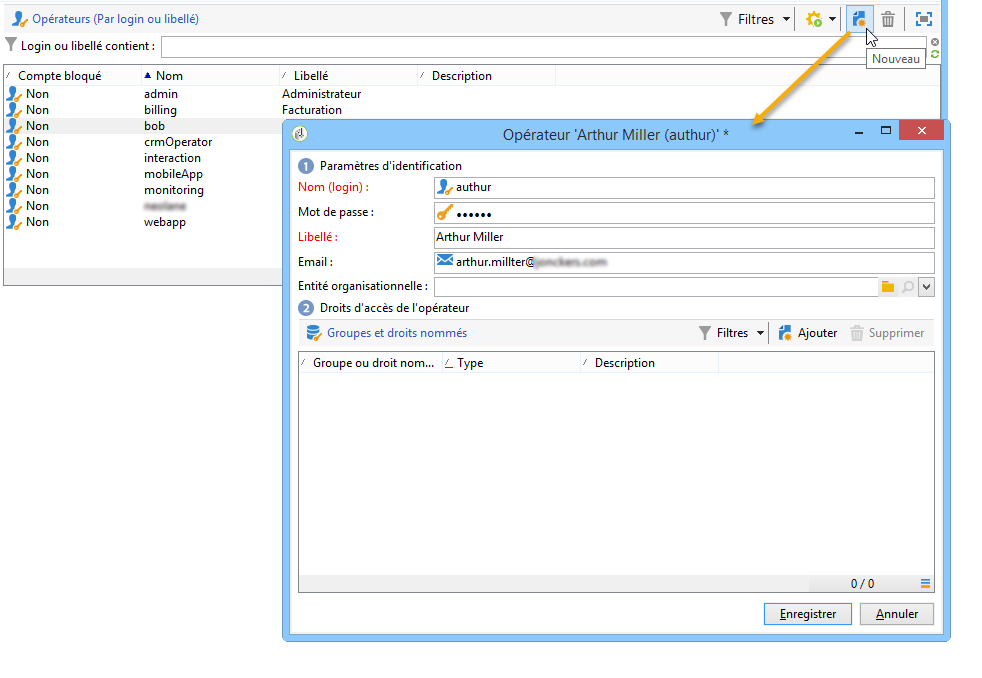
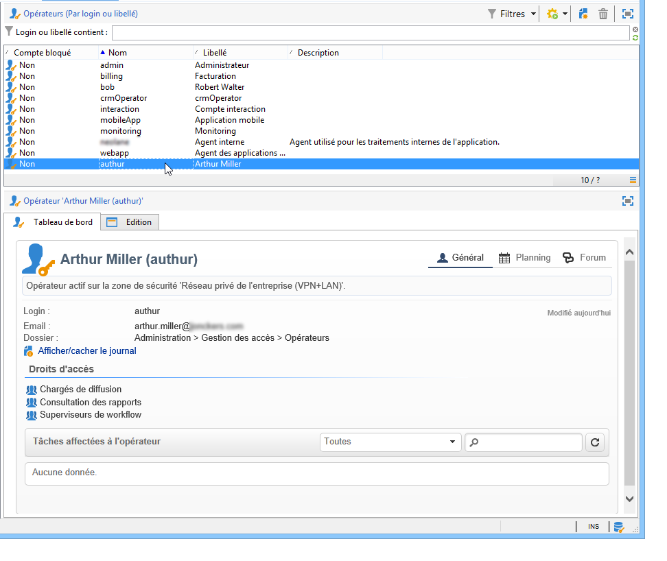
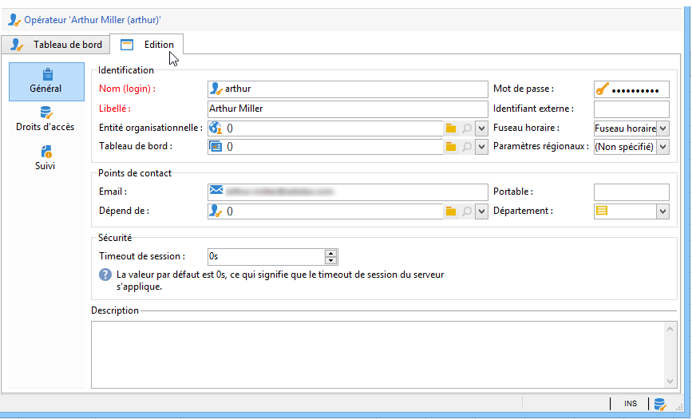
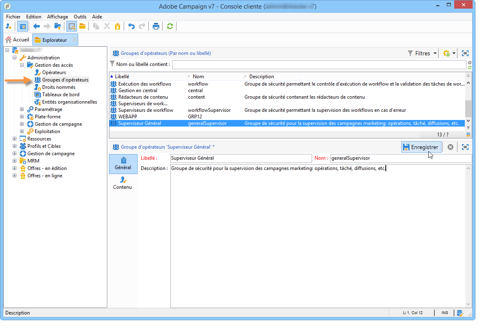
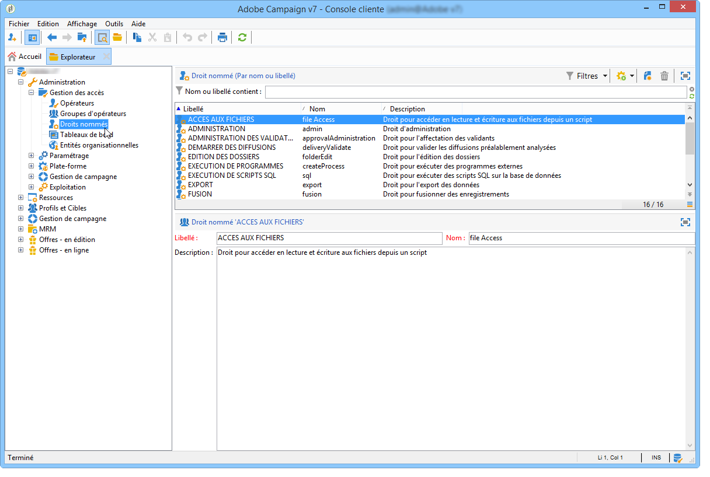
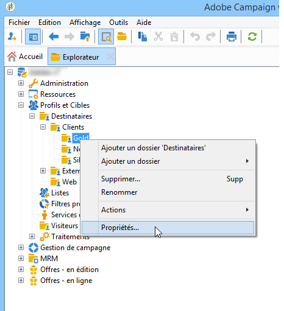
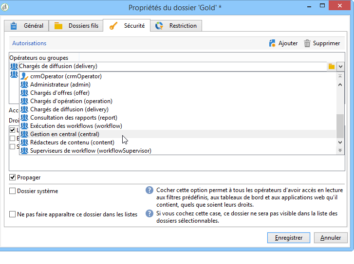
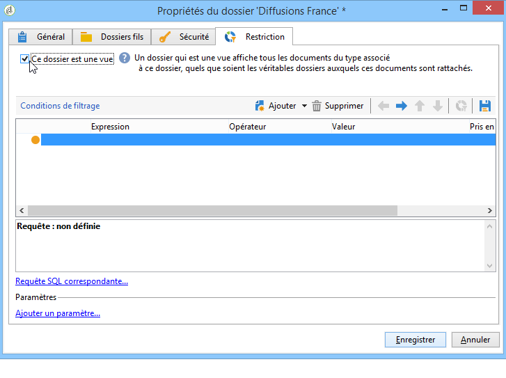

# Gestion des accès{#access-management}

## A propos des permissions {#about-permissions}

Adobe Campaign vous permet de définir et gérer les permissions attribuées aux différents opérateurs. Les permissions sont un ensemble de droits et restrictions qui autorisent ou interdisent :

* l&#39;accès à certaines fonctionnalités (via les droits nommés),
* l&#39;accès à certains enregistrements,
* la création, modification et/ou suppression des enregistrements (actions, contacts, campagnes, groupes, etc.).

Les permissions s&#39;appliquent à des profils d&#39;opérateurs ou à des groupes d&#39;opérateurs.

Elles sont complétées par des paramètres de sécurité liés au mode de connexion de l&#39;opérateur à Adobe Campaign. Voir à ce sujet [cette page](../../installation/using/configuring-campaign-server.md#defining-security-zones).

Vous pouvez accorder deux types de permissions à un utilisateur :

* Vous pouvez définir des  auxquelles vous attribuez des droits, puis associer les opérateurs à un ou plusieurs groupes. Cela vous permet de réutiliser les droits et de rendre les opérateurs  plus cohérents. Il facilite également la gestion et la maintenance des . La création et la gestion des groupes sont présentées dans les groupes [Opérateurs](#operator-groups).
* Vous pouvez attribuer directement des  aux utilisateurs, dans certains cas pour surcharger les droits alloués via des groupes. Ces droits sont présentés en  .

>[!NOTE]
>
>Avant de commencer à définir les permissions, Adobe vous recommande de lire la [Liste de contrôle relative à la configuration de la sécurité](https://docs.campaign.adobe.com/doc/AC/getting_started/EN/security.html).

## Opérateurs {#operators}

### A propos des opérateurs {#about-operators}

Un opérateur est un utilisateur Adobe Campaign qui possède des permissions pour se connecter et effectuer des actions.

Par défaut, les opérateurs sont stockés dans le **[!UICONTROL Administration > Access management > Operators]** noeud.

Les opérateurs peuvent être créés manuellement ou mappés dans un annuaire LDAP existant.

Vous trouverez la procédure complète de création d&#39;un opérateur sur [cette page](#creating-an-operator).

Pour plus d&#39;informations sur l&#39;intégration d&#39;Adobe Campaign avec LDAP, consultez [cette page](../../installation/using/connecting-through-ldap.md).

>[!CAUTION]
>
>Un opérateur doit être associé à une zone de sécurité pour se connecter à une instance. Pour plus d&#39;informations sur les zones de sécurité dans Adobe Campaign, consultez [cette page](../../installation/using/configuring-campaign-server.md#defining-security-zones).

Les utilisateurs peuvent également se connecter directement à Adobe Campaign via leur Adobe ID. Voir à ce sujet [cette page](../../integrations/using/about-adobe-id.md).

### Créer un opérateur {#creating-an-operator}

Pour créer un opérateur et accorder des permissions, procédez comme suit :

1. Click the **[!UICONTROL New]** button located above the list of operators, and enter the details of the new operator.

   

1. Indiquez le nom **[!UICONTROL Identification parameters]** de l’utilisateur : son identifiant, son mot de passe et son nom. L&#39;opérateur utilisera le nom de connexion et le mot de passe pour se connecter à  Adobe Campaign. Une fois connecté, l’utilisateur peut modifier son mot de passe par le **[!UICONTROL Tools > Change password]** menu. Le courrier électronique de l’opérateur est essentiel car il permet à l’opérateur de recevoir des notifications, par exemple lors du traitement des approbations.

   Cette section permet également d&#39;associer l&#39;opérateur à une entité organisationnelle. Voir à ce propos [cette page](../../campaign/using/about-distributed-marketing.md).

1. Select the permissions granted to the operator in the **[!UICONTROL Operator access rights]** section.

   To assign rights to the operator, click the **[!UICONTROL Add]** button located above the list of rights, then select a group of operators from the list of available groups:

   

   Vous pouvez également sélectionner un ou plusieurs  de (reportez-vous à la section ). Pour ce faire, cliquez sur la flèche à droite du **[!UICONTROL Folder]** champ, puis sélectionnez **[!UICONTROL Named rights]**:

   

   Choisissez les groupes et/ou les droits nommés à attribuer et cliquez sur **[!UICONTROL OK]** pour valider.

1. Cliquez sur **[!UICONTROL Ok]** pour créer l&#39;opérateur : son profil est alors ajouté à la liste des opérateurs existants.

   

>[!NOTE]
>
>You can organize the operators according to your requirements by creating new operator folders. To do this, right-click the operator folder and select **[!UICONTROL Add an 'Operators' folder]**.

Une fois le  de l’opérateur créé, vous pouvez ajouter ou mettre à jour leurs informations. Pour cela, cliquez sur l&#39;onglet **[!UICONTROL Edit]**.

>[!NOTE]
>
>Le **[!UICONTROL Session timeout]** champ vous permet d’ajuster le délai avant le délai d’expiration de la session  du. Pour plus d’informations, reportez-vous à la section [À propos des Federated Data Access](../../platform/using/about-fda.md).

### Fuseau horaire de l&#39;opérateur {#time-zone-of-the-operator}

Dans l’ **[!UICONTROL General]** onglet, vous pouvez sélectionner le fuseau horaire de l’opérateur. Par défaut, les opérateurs fonctionnent dans le fuseau horaire du serveur. Il est toutefois possible de sélectionner un autre fuseau horaire à l’aide du  déroulant.

Les paramétrages relatifs aux fuseaux horaires sont décrits sur [cette page](../../installation/using/time-zone-management.md).

>[!NOTE]
>
>Le travail collaboratif dans différents fuseaux horaires nécessite le stockage des dates en UTC. Les dates sont converties dans le fuseau horaire adéquat dans les contextes suivants : affichage d&#39;une date dans le fuseau horaire de l&#39;utilisateur, import et export de fichiers, planification de l&#39;envoi d&#39;un email et activités planifiées dans un workflow (planificateur, attente, contrainte horaire, etc.).
>
>Les contraintes et recommandations relatives à ces contextes sont présentées dans les sections correspondantes de la documentation d&#39;Adobe Campaign.

In addition, the **[!UICONTROL Regional settings]** drop-down list lets you select the format to display dates and numbers.

### Options de droits d&#39;accès {#access-rights-options}

Use the **[!UICONTROL Access rights]** tab to update the groups and named rights linked to the operator.

The **[!UICONTROL Edit the access parameters...]** link lets you access the following options:

* The **[!UICONTROL Disable account]** option lets you disable the operator&#39;s account: he will no longer access Adobe Campaign.
* The **[!UICONTROL Forbid access from the rich client]** option lets you restrict the use of Adobe Campaign to [Web access](../../platform/using/adobe-campaign-workspace.md#console-and-web-access) or through APIs: access to the Adobe Campaign client console is no longer available.
* Vous pouvez associer une zone de sécurité à l&#39;opérateur. Voir à ce propos [cette page](../../installation/using/configuring-campaign-server.md#defining-security-zones).
* Vous pouvez également définir un masque IP de confiance à partir du lien correspondant.

   L&#39;opérateur pourra se connecter à Adobe Campaign sans saisir son mot de passe si son adresse IP est dans cette liste.

   Vous pouvez également définir dans ce champ une plage d&#39;adresses IP qui seront autorisées à se connecter sans mot de passe, comme dans l&#39;exemple suivant :

   

   >[!NOTE]
   >
   >Afin de préserver la sécurité de l&#39;accès à votre plateforme, cette option doit être utilisée avec précaution.

* Cette **[!UICONTROL Restrict to information found in sub-folders of:]** option vous permet de limiter les droits attribués à l’opérateur d’un dossier. Seuls les sous-dossiers du noeud spécifié dans cette option seront visibles par l’utilisateur :

   

   >[!CAUTION]
   >
   >Cette restriction est uniquement visuelle et doit être utilisée avec précaution. L&#39;opérateur connecté avec ce type de droits ne voit QUE le contenu du dossier spécifié et ne peut accéder à aucun autre noeud de l&#39;arborescence via l&#39;explorateur. Toutefois, en fonction des fonctionnalités auxquelles il a accès (par exemple : les workflows), il peut afficher les données normalement contenues dans des noeuds qu&#39;il ne peut pas visualiser.

### Dossiers, validation et tâches d&#39;un opérateur {#folders--approval-and-tasks-of-an-operator}

L’ **[!UICONTROL Audit]** onglet vous permet de  des informations relatives à l’opérateur. Les différents onglets sont ajoutés automatiquement en fonction des paramètres définis dans la zone d’intervention de l’opérateur.

Vous pouvez accéder à :

* La liste des droits sur dossiers associés à l&#39;opérateur.

   

   >[!NOTE]
   >
   >Pour plus d’informations, reportez-vous à la section Gestion [des accès aux](#folder-access-management)dossiers.

* Le journal des validations de l&#39;opérateur.

   

* La liste des forums de discussion auxquels il est abonné.
* Les événements de son calendrier.
* La liste des tâches qui lui sont affectées.

### Les opérateurs par défaut {#default-operators}

Adobe Campaign utilise des opérateurs techniques dont les profils sont paramétrés par défaut : Administrateur (&#39;admin&#39;), Facturation (&#39;billing&#39;), Monitoring, Agent des applications web (&#39;webapp&#39;), etc. Certains dépendent des applications et options installées sur la plateforme : par exemple, les opérateurs &#39;central&#39; et &#39;local&#39; ne sont présents que lorsque l&#39;option Marketing Distribué est installée.

>[!CAUTION]
>
>Ces opérateurs techniques sont par défaut notifiés lorsque des alertes ou des messages d&#39;information sont envoyés par la plateforme. Il est vivement recommandé de leur associer un email de contact.
>
>Pour assurer le bon fonctionnement des applications Web, nous vous recommandons également de ne pas définir de paramètres régionaux spécifiques à l&#39;opérateur &#39;webapp&#39;.

Par défaut, l&#39;opérateur technique &#39;webapp&#39; bénéficie du droit nommé ADMINISTRATION, ce qui risque de créer des failles de sécurité. Pour remédier à ce problème, il est recommandé de lui ôter ce droit. Pour cela :

1. Dans le **[!UICONTROL Administration > Access management > Named rights]** noeud, cliquez **[!UICONTROL New]** pour créer un droit et lui donner un nom WEBAPP.

   

   Named rights are detailed in the [Named rights](#named-rights) section.

1. Dans le **[!UICONTROL Administration > Access management > Operators]** noeud, sélectionnez l’opérateur de l’agent  (&quot;webapp&quot;).

   Select the **[!UICONTROL Edit]** tab, then the **[!UICONTROL Access rights]** tab and delete the ADMINISTRATION named right from the list.

   

   Click **[!UICONTROL Add]** and select the WEBAPP right that you have just created, then save your changes.

   

1. Attribuez à l&#39;opérateur &#39;webapp&#39; des propriétés d&#39;accès en lecture et en écriture sur les dossiers le concernant, soit principalement les dossiers &#39;Destinataires&#39;.

   

   Modifying rights on tree folders is detailed in the [Folder access management](#folder-access-management) section.

>[!NOTE]
>
>Pour plus d&#39;informations sur les recommandations en matière de sécurité, consultez la [Liste de contrôle relative à la configuration de la sécurité dans Adobe Campaign](https://docs.campaign.adobe.com/doc/AC/getting_started/EN/security.html).

## Les groupes d&#39;opérateurs {#operator-groups}

Les groupes d’opérateurs sont créés via le **[!UICONTROL Administration > Access management > Operator groups]** noeud de l’arborescence.

### Créer un nouveau groupe d&#39;opérateurs {#creating-a-new-operator-group}

Pour créer un nouveau groupe d&#39;opérateurs, les étapes sont les suivantes :

1. Click the **[!UICONTROL New]** button to the right of the list of groups or right-click the list and choose **[!UICONTROL New]**.
1. In the section lower window, from the **[!UICONTROL General]** tab, enter the name and a description for this group in the corresponding fields.

   

1. Click the **[!UICONTROL Content]** tab to define authorizations for this group.
1. Click the **[!UICONTROL Add]** button to select an appointed right or an operator to associate to the group.
1. Click the drop-down list or on the folder to the right of the **[!UICONTROL Folder]** field to locate the appointed rights or operators to associate to this group.
1. Sélectionnez les droits ou opérateurs à ajouter et cliquez sur **[!UICONTROL OK]** pour valider.

   

   Répétez éventuellement cette opération pour ajouter d&#39;autres droits ou opérateurs.

1. Click the **[!UICONTROL Save]** button to add the group to the list.

### Les groupes par défaut {#default-groups}

Les groupes d&#39;opérateurs par défaut sont les suivants :

1. Chargés de diffusion

   Les opérateurs de ce groupe sont chargés de la gestion des diffusions : il permet l&#39;accès aux ressources principales nécessaires à la création et la préparation des diffusions (typologies de campagnes, mappings de diffusions, modèles par défaut, blocs de personnalisation, etc.).

   Ce groupe contient les droits nommés suivants :

   * PREPARER DES DIFFUSIONS : droit pour créer, éditer et lancer l&#39;analyse des diffusions,
   * DEMARRER DES DIFFUSIONS : droit pour valider les diffusions préalablement analysées.

1. Chargés d&#39;opération

   Les opérateurs de ce groupe peuvent gérer les campagnes marketing : il permet d&#39;accéder aux objets relatifs aux opérations (plans, programmes, workflows, budgets, etc.).

   Ce groupe contient les droits nommés suivants :

   * INSERTION DES DOSSIERS : droit pour insérer des dossiers dans l&#39;arborescence d&#39;Adobe Campaign (sous réserve d&#39;un accès en écriture sur les branches concernées),
   * WORKFLOW : droit pour utiliser les workflows.
   >[!NOTE]
   >
   >Ce groupe ne permet pas aux opérateurs de démarrer les diffusions.

1. Rédacteurs de contenu

   Les opérateurs de ce groupe peuvent accéder aux dossiers Contenus, dans le cadre de la **Gestion de Contenu** (module optionnel d&#39;Adobe Campaign). Ce groupe n&#39;accorde pas de droit supplémentaire.

1. Consultation des rapports

   Ce groupe est réservé aux opérateurs externes afin d&#39;accéder aux rapports de diffusions depuis un accès Web.

1. Exécution des workflows

   Ce groupe permet d&#39;attribuer aux opérateurs le droit de gérer les workflows indépendants des opérations.

1. Superviseurs de workflow

   Les opérateurs de ce groupe sont notifiés par emails des alertes relatives aux workflows des opérations.

1. Gestion en local / Gestion en central

   Ces groupes permettent l&#39;utilisation du **Marketing distribué** (module optionnel d&#39;Adobe Campaign).

## Droits nommés {#named-rights}

Par défaut,  Adobe Campaign propose un ensemble de qui vous permet de définir les autorisations attribuées aux opérateurs et aux. Ces droits peuvent être modifiés à partir du **[!UICONTROL Administration > Access management > Named rights]** noeud de l’arborescence.

Ces droits sont les suivants :

* **[!UICONTROL ADMINISTRATION]**: Les opérateurs avec le **[!UICONTROL ADMINISTRATION]** droit ont un accès complet sur l&#39;instance. Les administrateurs peuvent exécuter/créer/modifier/supprimer tout objet tel que le flux de travaux, les , les scripts, etc.

* **[!UICONTROL APPROVAL ADMINISTRATION]**: Vous pouvez définir plusieurs étapes d’approbation dans les  et les  de pour vous assurer que l’état actuel a été approuvé par un opérateur ou un groupe affecté. Les utilisateurs disposant du **[!UICONTROL APPROVAL ADMINISTRATION]** droit peuvent définir les étapes d’approbation et désigner un opérateur ou un groupe d’opérateurs qui doit les approuver.

* **[!UICONTROL CENTRAL]** : Droit pour la gestion en central (Marketing Distribué).

* **[!UICONTROL DELETE FOLDER]**: Droit de supprimer des dossiers. Avec ce droit, les utilisateurs sont autorisés à supprimer des dossiers du de l’explorateur.

* **[!UICONTROL EDIT FOLDERS]**: Droit de modifier les propriétés du dossier telles que le nom interne, le libellé, l’image associée, l’ordre des sous-dossiers, etc.

* **[!UICONTROL EXPORT]**: Les utilisateurs peuvent exporter des données de leurs instances Adobe Campaign  dans un fichier sur le serveur ou l’ordinateur local à l’aide du de  de flux de travail. **[!UICONTROL EXPORT]**

* **[!UICONTROL FILES ACCESS]**: Droit d&#39;accès en lecture et écriture pour les fichiers via un script qui peut être écrit dans le **[!UICONTROL JavaScript]** flux de travail  le à lire/écrire des fichiers sur un serveur.

* **[!UICONTROL IMPORT]**: Droit pour l’importation de données génériques. **[!UICONTROL IMPORT]** vous permet d’importer des données dans n’importe quel autre tableau, alors que le **[!UICONTROL RECIPIENT IMPORT]** droit permet d’importer uniquement dans le tableau du.

* **[!UICONTROL INSERT FOLDERS]**: Droit d’insérer des dossiers. Les utilisateurs disposant du **[!UICONTROL INSERT FOLDERS]** droit peuvent créer de nouveaux dossiers dans l’arborescence des dossiers dans les  de l’explorateur.

* **[!UICONTROL LOCAL]** : Droit pour la gestion en local (Marketing Distribué).

* **[!UICONTROL MERGE]**: Droit de fusionner les enregistrements sélectionnés en un seul. Si des existent comme , le **[!UICONTROL MERGE]** droit permet à l’utilisateur de sélectionner le  et de le fusionner dans un principal.

* **[!UICONTROL PREPARE DELIVERIES]**: Droit de créer, modifier et enregistrer un  de. Les utilisateurs disposant du **[!UICONTROL PREPARE DELIVERIES]** droit peuvent également le processus de  de l&#39; le processus del&#39;.

* **[!UICONTROL PRIVACY DATA RIGHT]**: Droit de collecter et de supprimer des données de confidentialité. Pour plus d’informations à ce propos, consultez [cette page](https://helpx.adobe.com/campaign/kb/acc-privacy.html).

* **[!UICONTROL PROGRAM EXECUTION]**: Droit d&#39;exécuter des commandes dans divers langages de programmation.

* **[!UICONTROL RECIPIENT IMPORT]**: Droit d&#39;importer des. Les utilisateurs disposant du **[!UICONTROL RECIPIENT IMPORT]** droit d’accès peuvent importer un fichier local dans un tableau.

* **[!UICONTROL SQL SCRIPT EXECUTION]** Droit d&#39;exécuter toute commande SQL directement sur la base de données.

* **[!UICONTROL START DELIVERIES]**: Droit d’approuver les  précédemment analysées. Une fois la   de la terminée, le s’interrompt à diverses étapes d’approbation et doit être approuvé pour reprendre. Les utilisateurs disposant du **[!UICONTROL START DELIVERIES]** droit sont autorisés à approuver les  de.

* **[!UICONTROL USE SQL DATA MANAGEMENT ACTIVITY]** : Droit pour l&#39;écriture de vos propres scripts SQL à l&#39;aide de l&#39;activité Gestion des données SQL, afin de créer et de remplir des tables de travail (voir [cette section](../../workflow/using/sql-data-management.md)).

* **[!UICONTROL WORKFLOW]**: Droit d&#39;exécuter . Sans ce droit, les utilisateurs ne peuvent pas , arrêter ou redémarrer le .

* **[!UICONTROL WEBAPP]** : Droit pour l&#39;utilisation des applications web.

>[!NOTE]
>
>Cette liste peut varier en fonction des composants additionnels installés sur la plate-forme.

## Matrice des droits d&#39;accès {#access-rights-matrix}

Les groupes par défaut et les droits nommés permettent aux opérateurs d&#39;accéder à certains dossiers de l&#39;arborescence, et accordent des permissions en lecture, écriture et suppression.

La matrice des droits d&#39;accès Adobe Campaign est disponible [ici](/help/platform/using/assets/accessrights.pdf).

## Gestion de l&#39;accès aux dossiers {#folder-access-management}

A chaque dossier de l&#39;arborescence sont attachées des propriétés d&#39;accès en lecture, écriture et suppression. Pour accéder à un dossier, un opérateur ou un groupe d&#39;opérateurs doit se voir attribuer au minimum un droit en lecture sur celui-ci.

### Editer les permissions sur un dossier {#edit-permissions-on-a-folder}

Pour éditer les permissions sur un dossier spécifique de l&#39;arborescence, suivez les étapes ci-dessous :

1. Right-click on the folder and select **[!UICONTROL Properties...]**.

   

1. Click the **[!UICONTROL Security]** tab to view authorizations on this folder.

   

### Modifier les permissions {#modify-permissions}

Pour modifier les permissions, vous pouvez :

* **Remplacer un groupe ou un opérateur**. Pour cela, cliquez sur un des groupes (ou opérateurs) ayant des droits sur ce dossier et sélectionnez un nouveau groupe (ou un nouvel opérateur) depuis la liste déroulante :

   

* **Autorisez un groupe ou un opérateur**. To do this, click the **[!UICONTROL Add]** button and select the group or operator to which you want to assign authorizations for this folder.
* **Interdit à un groupe ou à un opérateur**. Pour ce faire, cliquez sur **[!UICONTROL Delete]** et sélectionnez le groupe ou l’opérateur à partir duquel vous souhaitez supprimer l’autorisation pour ce dossier.
* **Sélectionner les droits attribués à un groupe ou un opérateur**. Pour cela, cliquez sur le groupe ou l&#39;opérateur visé : cochez les droits d&#39;accès que vous voulez lui attribuer et décochez les autres.

   

### Propager les permissions {#propagate-permissions}

Vous pouvez propager des autorisations et des droits d’accès. Pour ce faire, sélectionnez l’ **[!UICONTROL Propagate]** option dans les propriétés du dossier.

Les autorisations définies dans cette fenêtre seront alors appliquées à l&#39;ensemble des sous-dossiers du nœud courant. Vous pourrez ensuite surcharger ces autorisations pour chacun des sous-dossiers.

>[!NOTE]
>
>Lorsque vous désélectionnez cette option pour un dossier, elle ne l&#39;est pas automatiquement pour ses sous-dossiers. Vous devez la désélectionner explicitement pour chacun des sous-dossiers.

### Accorder l&#39;accès à tous les opérateurs {#grant-access-to-all-operators}

Dans l’ **[!UICONTROL Security]** onglet, si l’ **[!UICONTROL System folder]** option est sélectionnée, tous les opérateurs auront accès à ces données, quels que soient leurs droits. Si cette option est désactivée, vous devez ajouter explicitement l’opérateur (ou leur groupe) au des autorisations pour qu’ils puissent y accéder.

## Les dossiers et les vues {#folders-and-views}

### A propos des dossiers et des vues {#about-folders-and-views}

Les dossiers sont des noeuds dans  Adobe Campaign arborescence. Ces noeuds sont créés en cliquant avec le bouton droit de la souris sur l’arborescence, via le **[!UICONTROL Add new folder]** menu. Par défaut, le premier menu vous permet d’ajouter le dossier correspondant au contexte actuel.

Vous pouvez accorder des autorisations à ces dossiers comme à tous les autres dossiers de l’arborescence. Voir Gestion des [accès aux](#folder-access-management)dossiers.

En outre, vous pouvez créer des vues afin de restreindre l&#39;accès aux données et d&#39;organiser le contenu de l&#39;arborescence pour l&#39;adapter à vos besoins. Vous pourrez ensuite attribuer des droits sur les vues.

Une vue est un dossier affichant des enregistrements stockés physiquement dans un ou plusieurs autres dossiers du même type. Par exemple, si vous créez un dossier Campagne qui est une vue, il affichera par défaut toutes les campagnes présentes dans la base, quelle que soit leur origine. Ces données peuvent ensuite être filtrées.

Lorsque vous transformez un dossier en vue, l&#39;ensemble des données correspondant au type de dossier présentes dans la base sont affichées dans la vue, quel que soit leur dossier d&#39;enregistrement. Vous pouvez ensuite les filtrer pour restreindre la liste des données affichées.

>[!CAUTION]
>
>Les vues regroupent des données et permettent d&#39;y accéder. Toutefois, elles ne sont pas physiquement stockées dans le dossier de la vue. L&#39;opérateur doit avoir les droits correspondants à l&#39;action visée dans le ou les dossiers d&#39;origine des données (lecture au minimum).
>
>Pour donner accès à une vue sans donner accès à son dossier d&#39;origine, il suffit de ne pas donner de droit en lecture sur le noeud parent du dossier source.

### Ajouter des dossiers et créer des vues {#adding-folders-and-creating-views}

Dans l&#39;exemple ci-dessous, nous allons créer des dossiers afin d&#39;afficher des données spécifiques :

1. Create a new **[!UICONTROL Deliveries]** type folder, and name it **Deliveries France**.
1. Right-click this folder and select **[!UICONTROL Properties...]**.

   

1. Dans l’ **[!UICONTROL Restriction]** onglet, sélectionnez **[!UICONTROL This folder is a view]**. Tous les  de la base de données s’affichent alors.

   

1. Définissez les critères de filtrage des diffusions à partir de l&#39;éditeur de requêtes proposé dans la section centrale de la fenêtre : les campagnes affichées seront alors celles qui correspondent au filtre défini.

   >[!NOTE]
   >
   >L&#39;éditeur de requêtes est présenté dans [cette section](../../platform/using/about-queries-in-campaign.md).

   Avec les conditions de filtrage suivantes :

Les diffusions suivantes seront affichées dans la vue :

