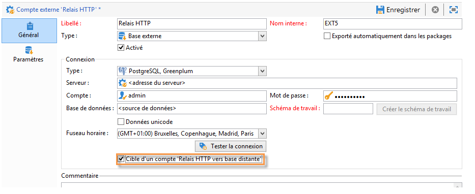

# Accès à une base de données externe{#accessing-an-external-database}

## A propos de Federated Data Access {#about-federated-data-access}

Adobe Campaign propose l&#39;option **Federated Data Access** (FDA) afin d&#39;exploiter des informations stockées dans une ou plusieurs bases de données externes : vous pouvez accéder à des données externes sans modifier la structure des données d&#39;Adobe Campaign.

>[!CAUTION]
>
>Le module **Federated Data Access** (FDA) est optionnel. Vérifiez votre contrat de licence Adobe Campaign.
>  
>De plus, l&#39;accès à une base externe via le FDA est uniqument possible pour les installations de type on-premise ou hybride.

### Principe de fonctionnement {#operating-principle}

L&#39;option FDA permet de collecter les données depuis des sources SQL et de détecter automatiquement la structure des tables ciblées.

Afin de pouvoir utiliser cette fonctionnalité, vous devez :

1. posséder une base de données externe compatible avec le module FDA d&#39;Adobe Campaign. La liste des systèmes de base de données et des versions compatibles est détaillée dans la [matrice de compatibilité](https://helpx.adobe.com/campaign/kb/compatibility-matrix.html). Les utilisateurs doivent également posséder les [permissions nécessaires](#remote-database-access-rights) dans Adobe Campaign et sur la base de données externe.
1. [installer les pilotes](#specific-configurations-by-database-type) qui correspondent à votre base de données sur le serveur marketing Adobe Campaign.
1. [créer et paramétrer un compte externe](#connecting-to-the-database) permettant d&#39;établir la connexion entre Adobe Campaign et la base externe. Pour plus d&#39;informations sur les comptes externes disponibles, consultez cette [page](../../platform/using/external-accounts.md).
1. [créer le schéma de lecture](#creating-the-data-schema) de la base externe dans Adobe Campaign. Cela permet à Adobe Campaign de reconnaître la structure des données de la base externe.
1. éventuellement, [créer un mapping de ciblage](#defining-data-mapping) à partir du schéma créé précédemment, dans le cas où les destinataires de vos diffusions sont issus de la base externe. Ce cas présente certaines limitations, notamment au niveau de la personnalisation des diffusions.

Une fois que le schéma de lecture des données est créé, les données peuvent être exploitées dans les workflows d’Adobe Campaign. Voir à ce sujet [cette section](../../workflow/using/executing-a-workflow.md#architecture).

### Bonnes pratiques et recommendations {#best-practices-and-recommendations}

L&#39;option FDA est conçue pour manipuler les données de bases externes en mode batch dans des workflows. L&#39;utilisation du FDA dans un autre contexte, par exemple pour des opérations unitaires, doit être réalisée avec précaution (Personnalisation, Interaction, diffusions en temps réel, etc.).

Avant de commencer à exploiter votre base externe, effectuez des tests de performance afin de détecter d&#39;éventuels problèmes et d&#39;optimiser l&#39;utilisation de l&#39;option.

Evitez autant que possible les opérations nécéssitant d&#39;utiliser à la fois la base Adobe Campaign et la base externe. Pour cela, vous pouvez :

* exporter les données de la base Adobe Campaign vers la base externe et effectuer les opérations uniquement depuis la base externe avant de réimporter les résultats dans Adobe Campaign.
* collecter les données de la base externe dans Adobe Campaign et effectuer les opérations localement.

Si vous souhaitez effectuer de la personnalisation dans vos diffusions à l&#39;aide des données de la base externe, collectez les données à utiliser dans un workflow afin de les rendre disponibles dans une table temporaire. Utilisez alors les données de la table temporaire pour personnaliser votre diffusion.

### Limitations {#limitations}

L&#39;option FDA est assujetie aux limitations du système de la base de données externe que vous utilisez.

Pour des raisons de performance, il est déconseillé d&#39;utiliser cette fonctionnalité afin de réaliser des opérations unitaires (personnalisation de diffusions, module Interaction, temps réel).

## Configurations spécifiques par type de base de données {#specific-configurations-by-database-type}

En fonction des bases de données externes auxquelles vous souhaitez pouvoir accéder depuis Adobe Campaign, certains paramétrages spécifiques sont nécessaires. Ces paramétrages concernent essentiellement l&#39;installation de pilotes et la déclarations de variables d&#39;environnement propres à chaque SGBDR sur le serveur Adobe Campaign.

En règle générale, il est nécessaire d&#39;installer la couche cliente correspondant à la base externe utilisée sur le serveur Adobe Campaign.

>[!NOTE]
>
>Les versions compatibles sont répertoriées dans la [Matrice de compatibilité Campaign](https://helpx.adobe.com/campaign/kb/compatibility-matrix.html#FederatedDataAccessFDA) .

### Configurer l’accès à Hadoop {#configure-access-to-hadoop}

La connexion à une base de données externe Hadoop en FDA requiert les paramétrages suivants sur le serveur Adobe Campaign.

#### Pour Windows {#for-windows}

1. Installez les pilotes ODBC et [Azure HD Insight](https://www.microsoft.com/en-us/download/details.aspx?id=40886) pour Windows.
1. Créez le nom de la source de données en exécutant l&#39;outil ODBC DataSource Administrator. Il vous est fourni un exemple de nom de source de données système pour Hive que vous pouvez modifier.

   ```
   Description: vorac (or any name you like)
   Host: vorac.azurehdinsight.net
   Port: 443
   Database: sm_tst611 (or your database name)
   Mechanism: Azure HDInsight Service
   User/Password: admin/<your password here>
   ```

1. Créez le compte externe Hadoop, comme indiqué dans la section [Création d’une connexion](#creating-a-shared-connection) partagée.

#### Pour Linux {#for-linux}

1. Installez unixodbc pour Linux.

   ```
   apt-get install unixodbc
   ```

1. Téléchargez et installez les pilotes ODBC pour Apache Hive depuis HortonWorks : [https://www.hortonworks.com/downloads/](https://www.hortonworks.com/downloads/).

   ```
   dpkg -i hive-odbc-native_2.1.10.1014-2_amd64.deb
   ```

1. Vérifiez l’emplacement des fichiers ODBC.

   ```
   root@campadpac71:/tmp# odbcinst -j
   unixODBC 2.3.1
   DRIVERS............: /etc/odbcinst.ini
   SYSTEM DATA SOURCES: /etc/odbc.ini
   FILE DATA SOURCES..: /etc/ODBCDataSources
   USER DATA SOURCES..: /root/.odbc.ini
   SQLULEN Size.......: 8
   SQLLEN Size........: 8
   SQLSETPOSIROW Size.: 8
   ```

1. Créez le nom de la source de données et éditez le fichier odbc.ini. Puis, créez un nom de source de données pour votre connexion Hive.

   Voici un exemple pour HDInsight destiné à configurer une connexion appelée &quot;viral&quot; :

   ```
   [ODBC Data Sources]
   vorac 
   
   [vorac]
   Driver=/usr/lib/hive/lib/native/Linux-amd64-64/libhortonworkshiveodbc64.so
   HOST=vorac.azurehdinsight.net
   PORT=443
   Schema=sm_tst611
   HiveServerType=2
   AuthMech=6
   UID=admin
   PWD=<your password here>
   HTTPPath=
   UseNativeQuery=1
   ```

   >[!NOTE]
   >
   >Le paramètre **UseNativeQuery** est ici très important. Campaign est basé sur Hive et ne fonctionnera pas correctement si le paramètre UseNativeQuery n&#39;est pas défini. En règle générale, le pilote ou Hive SQL Connector réécrit les requêtes et modifie l&#39;ordre des colonnes.

   La configuration de l&#39;authentification dépend de la configuration de Hive/Hadoop. Par exemple, pour HDInsight, utilisez AuthMech=6 pour l&#39;authentification par utilisateur/mot de passe, comme décrit [ici](http://www.simba.com/products/Spark/doc/ODBC_InstallGuide/unix/content/odbc/hi/configuring/authenticating/azuresvc.htm).

1. Exportez les variables.

   ```
   export ODBCINI=/etc/myodbc.ini
   export ODBCSYSINI=/etc/myodbcinst.ini
   ```

1. Configurez les pilotes Hortonworks via /usr/lib/hive/lib/native/Linux-amd64-64/hortonworks.hiveodbc.ini.

   Vous devez utiliser UTF-16 pour vous connecter à Campaign et unix-odbc (libodbcinst).

   ```
   [Driver]
   
   DriverManagerEncoding=UTF-16
   ErrorMessagesPath=/usr/lib/hive/lib/native/hiveodbc/ErrorMessages/
   LogLevel=0
   LogPath=/tmp/hive
   SwapFilePath=/tmp
   
   ODBCInstLib=libodbcinst.so
   ```

1. Vous pouvez maintenant tester votre connexion en utilisant isql.

   ```
   isql vorac
   isql vorac -v
   ```

1. Créez le compte externe Hadoop, comme indiqué dans la section [Création d’une connexion](#creating-a-shared-connection) partagée.

### Configurer l’accès à MySQL {#configure-access-to-mysql}

Pour plus d&#39;informations sur le paramétrage de votre base de données MySQL , consultez cet [article](https://helpx.adobe.com/campaign/kb/campaign_fda_mysql.html).

### Configurer l’accès à Netezza {#configure-access-to-netezza}

La connexion à une base de données externe Netezza en FDA requiert les paramétrages additionnels ci-dessous sur le serveur Adobe Campaign :

1. Installez les pilotes ODBC pour Netezza, en fonction du système d&#39;exploitation que vous utilisez :

   * **nz-linuxclient-v7.2.0.0.tar.gz pour Linux. Sélectionnez le dossier correspondant à votre système d&#39;exploitation (linux ou linux64) et lancez la commande unpack. Vous pouvez laisser l&#39;installation s&#39;effectuer dans le répertoire par défaut proposé : &quot;/usr/local/nz&quot;.**
   * **nz-winclient-v7.2.0.0.zip pour Windows. Décompressez le fichier et lancez le script exécutable correspondant à votre système d&#39;exploitation : nzodbcsetup.exe ou nzodbcsetup64.exe. Suivez les indications de l&#39;assistant pour finaliser l&#39;installation des pilotes.**

1. Configure the ODBC driver. The configuration can be carried out in the standard files: **/etc/odbc.ini** for general parameters and **/etc/odbcinst.ini** for declaring drivers.

   * **/etc/odbc.ini**

      ```
      [ODBC]
      InstallDir=/etc/
      ```

      &quot;InstallDir&quot; correspond à l’emplacement du fichier odbcinst.ini.

   * **/etc/odbcinst.ini**

      ```
      [ODBC Drivers]
      NetezzaSQL = Installed
      
      [NetezzaSQL]
      Driver           = /usr/local/nz/lib/libnzsqlodbc3.so
      Setup            = /usr/local/nz/lib/libnzsqlodbc3.so
      APILevel         = 1
      ConnectFunctions = YYN
      Description      = Netezza ODBC driver
      DriverODBCVer    = 03.51
      DebugLogging     = false
      LogPath          = /tmp
      UnicodeTranslationOption = utf8
      CharacterTranslationOption = all
      PreFetch         = 256
      Socket           = 16384
      ```

1. Définissez les variables d’environnement du serveur Adobe Campaign :

   * **LD_LIBRARY_PATH**: /usr/local/nz/lib et /usr/local/nz/lib64. &quot;/usr/local/nz&quot; correspond au référentiel d&#39;installation proposé par défaut lors de l&#39;installation des pilotes. Vous devez spécifier ici le référentiel que vous avez sélectionné pour l’installation.
   * **ODBCINI**: emplacement du fichier odbc.ini (par exemple, /etc/odbc.ini).
   * **NZ_ODBC_INI_PATH**: emplacement du fichier odbc.ini. Netezza nécessite également cette seconde variable pour utiliser le fichier odbc.ini.

1. Créez le compte externe Netezza, comme indiqué dans la section [Création d&#39;une connexion](#creating-a-shared-connection) partagée.

>[!NOTE]
>
>Les opérations sur les schémas comportant des clés primaires générées automatiquement ne sont pas prises en charge.
>
>The table will be using the **Organize on** clause on the first index defined in the schema. As this clause is limited to 1 to 4 columns with Netezza, this index cannot contain more than 4 columns.

### Configurer l’accès à Oracle {#configure-access-to-oracle}

La connexion à une base de données externe Oracle en FDA requiert les paramétrages additionnels ci-dessous sur le serveur Adobe Campaign.

#### Pour Linux {#for-linux-1}

1. Installez le client complet Oracle correspondant à votre version d&#39;Oracle.
1. Add your TNS definitions to your installation. To do this, specify them in a **tnsnames.ora** file in the /etc/oracle repository. If this repository does not exist, create it.

   Créez alors une nouvelle variable d&#39;environnement TNS_ADMIN : export TNS_ADMIN=/etc/oracle et redémarrez la machine.

1. Integrate Oracle into your Adobe Campaign server (nlserver). To do this, check that the **customer.sh** file is present in the &quot;nl6&quot; folder of the Adobe Campaign server tree structure and that it includes the links to the Oracle libraries.

   Par exemple pour un client 11.2 :

   ```
   export ORACLE_HOME=/usr/lib/oracle/11.2
   export TNS_ADMIN=/etc/oracle
   export LD_LIBRARY_PATH=$ORACLE_HOME/client64/lib:$LD_LIBRARY_PATH
   ```

   >[!NOTE]
   >
   >Ces valeurs (notamment ORACLE_HOME), dépendent de vos répertoires d&#39;installation. Vérifiez bien votre arborescence avant de référencer ces valeurs.

1. Installez les librairies nécessaires à Oracle :

   * **libclntsh.so**

      ```
      cd /usr/lib/oracle/<version>/client<architecture>/lib
      ln -s libclntsh.so.<version> libclntsh.so
      ```

   * **libaio1**

      ```
      aptitude install libaio1
      or
      yum install libaio1
      ```

#### Pour Windows {#for-windows-1}

1. Installez le client Oracle.
1. In the C:Oracle folder, create a **tnsnames.ora** file containing your TNS definition.

   Ajoutez une variable d’environnement TNS_ADMIN avec C:Oracle comme valeur et redémarrez l’ordinateur.

### Configurer l’accès à Sybase IQ {#configure-access-to-sybase-iq}

La connexion à une base de données externe Sybase IQ en FDA requiert les paramétrages additionnels ci-dessous sur le serveur Adobe Campaign :

1. Vérifiez que le package unixodbc se trouve sur le serveur.
1. Installez **iq_odbc**. Une erreur peut se produire à la fin de l&#39;installation. Celle-ci peut être ignorée.
1. Installez **iq_client_common**. Une erreur Java peut se produire à la fin de l&#39;installation. Celle-ci peut être ignorée.
1. Configurez le pilote ODBC. La configuration peut être réalisée dans les fichiers standard : /etc/odbc.ini pour les paramètres généraux et /etc/odbcinst.ini pour la déclaration des pilotes :

   * **/etc/odbc.ini** (remplacez des valeurs telles que `<server_alias>` des caractères par vos propres) :

      ```
      [ODBC Data Sources]
      <server_alias>=libdbodbc.so
      
      [<server_alias>]
      Driver=/opt/sybase/IQ-16_0/lib64/libdbodbc16.so
      Description=<description>
      Username=<username>
      Password=<password>
      ServerName=<server_name>
      CommLinks=tcpip(host=<host>)
      ```

   * **/etc/odbcinst.ini**

      ```
      [ODBC DRIVERS]
      SAP SybaseIQ=Installed
      
      [SAP SybaseIQ]
      Driver=/opt/sybase/IQ-16_0/lib64/libdbodbc16.so
      ```

1. Ajoutez le chemin d&#39;accès de la nouvelle bibliothèque libodbc16.so dans la variable LD_LIBRARY_PATH. Pour ce faire :

   * Si vous utilisez un fichier customer.sh pour déclarer le chemin d&#39;accès : ajoutez le chemin d&#39;accès /opt/sybase/IQ-16_0/lib64 pour la variable LD_LIBRARY_PATH.
   * Sinon, utilisez une commande Unix.

1. Créez un compte externe FDA, comme décrit dans la section [Création d&#39;une connexion](#creating-a-shared-connection) partagée. Pour Sybase IQ, le nom du serveur correspond à la connexion ODBC (`<server_alias>`) définie à l’étape 5. Ce n&#39;est pas nécessairement le nom du serveur lui-même.

>[!NOTE]
>
>Pour Windows, vous devez installer le client Sybase IQ sur le serveur Adobe Campaign et créer une connexion ODBC. Veillez à créer une source de données système lorsque le serveur Adobe Campaign (nlserver) s&#39;exécute en tant que service sous Windows.

### Configurer l’accès à Teradata {#configure-access-to-teradata}

La connexion à une base de données externe Teradata en FDA requiert certains paramétrages additionnels sur le serveur Adobe Campaign. Pour plus d’informations sur le paramétrage de votre base de données Teradata, consultez cet [article](https://helpx.adobe.com/campaign/kb/campaign_fda_teradata.html).

1. Installez le [pilote ODBC pour Teradata](http://downloads.teradata.com/download/connectivity/odbc-driver/linux).

   Il est constitué de trois packages pouvant être installés sur Red Hat (ou CentOS)/Suse dans l&#39;ordre suivant :

   * TeraGSS
   * tdicu1510 (installez-le via setup_wrapper.sh)
   * tdodbc1510 (installez-le à l’aide de setup_wrapper.sh)

1. Configure the ODBC driver. The configuration can be carried out in the standard files: **/etc/odbc.ini** for general parameters and /etc/odbcinst.ini for declaring drivers:

   * **/etc/odbc.ini**

      ```
      [ODBC]
      InstallDir=/etc/
      ```

      &quot;InstallDir&quot; corresponds to the location of the **odbcinst.ini** file.

   * **/etc/odbcinst.ini**

      ```
      [ODBC DRIVERS]
      teradata=Installed
      
      [teradata]
      Driver=/opt/teradata/client/15.10/lib64/tdata.so
      APILevel=CORE
      ConnectFunctions=YYY
      DriverODBCVer=3.51
      SQLLevel=1
      ```

1. Définissez les variables d’environnement du serveur Adobe Campaign :

   * **LD_LIBRARY_PATH**: /opt/teradata/client/15.10/lib64 et /opt/teradata/client/15.10/odbc_64/lib.
   * **ODBCINI**: emplacement du fichier odbc.ini (par exemple, /etc/odbc.ini).
   * **NLSPATH**: emplacement du fichier opermsgs.cat (/opt/teradata/client/15.10/msg/opermsgs.cat)

### Configurer l’accès à SAP HANA {#configure-access-to-sap-hana}

La connexion à une base de données externe SAP HANA en FDA requiert certains paramétrages additionnels sur le serveur Adobe Campaign :

1. Installez les pilotes ODBC pour SAP HANA, en fonction du système d&#39;exploitation que vous utilisez :

   * **hdb_client_linux.tgz pour Linux. Une fois le fichier décompressé, lancez la commande hdbinst et suivez les instructions pour terminer l&#39;installation des pilotes.**
   * **hdb_client_windows.zip** pour Windows. Décompressez le fichier et démarrez le fichier exécutable : **hdbinst.exe**. Suivez les instructions de l&#39;assistant pour terminer l&#39;installation des pilotes.

1. Configurez le pilote ODBC. La configuration peut être réalisée dans les fichiers standard : /etc/odbc.ini pour les paramètres généraux et /etc/odbcinst.ini pour la déclaration des pilotes.

   * **/etc/odbc.ini**

      ```
      [ODBC]
      InstallDir=/etc/
      
      [HDB]
      Driver=HDBODBC
      servernode=localhost:39013 (this value depend of your server)
      User:SYSTEM
      ```

      &quot;InstallDir&quot; corresponds to the location of the **odbcinst.ini** file.

   * **/etc/odbcinst.ini**

      ```
      [HDBODBC]
      Description = "SmartCloudPT HANA"
      Driver = /usr/sap/hdbclient/libodbcHDB.so
      ```

1. Définissez les variables d’environnement du serveur Adobe Campaign :

   * **** LD_LIBRARY_PATH : doit inclure le lien vers votre client SAP HANA (/usr/sap/hdbclient/[libodbcHDB.so](http://libodbchdb.so/) par défaut).
   * **ODBCINI**: emplacement du fichier odbc.ini (par exemple, /etc/odbc.ini).

1. Créez le compte externe SAP Hana, comme indiqué dans la section [Création d’une connexion](#creating-a-shared-connection) partagée.

## Droits d&#39;accès à la base externe {#remote-database-access-rights}

Tout d&#39;abord, afin qu&#39;un utilisateur puisse effectuer des opérations sur une base externe via FDA, ce dernier doit disposer d&#39;un droit nommé spécifique dans Adobe Campaign.

1. Sélectionnez le **[!UICONTROL Administration > Access Management > Named Rights]** noeud dans l’explorateur Adobe Campaign.
1. Créez un nouveau droit en indiquant le libellé de votre choix.
1. The **[!UICONTROL Name]** field must take the following format **user:base@server**, where :

   * **user** correspond au nom de l&#39;utilisateur sur la base de données externe.
   * **base** correspond au nom de la base de données externe.
   * **server** correspond au nom du serveur de la base de données externe.

      >[!NOTE]
      >
      >La partie **:base** est optionnelle sur Oracle.

1. Save the named right then link it to your chosen user from the **[!UICONTROL Administration > Access Management > Operators]** node of the Adobe Campaign explorer.

Ensuite, pour exploiter les données contenues dans une base externe, l&#39;utilisateur Adobe Campaign doit au minimum avoir les droits en &#39;Ecriture&#39; sur cette base, afin de permettre la création des tables de travail. Ces tables sont automatiquement supprimées par Adobe Campaign.

En règle générale, les droits d&#39;accès suivants sont nécessaires :

* **CONNECT** : connexion à la base distante,
* **READ Data** : accès en lecture aux tables contenant les données du client,
* **READ &#39;MetaData&#39;** : accès aux catalogues de données du serveur afin d&#39;obtenir la structure des tables,
* **LOAD** : chargement en masse dans des tables de travail (opération nécessaire lorsque l&#39;on travaille sur des collections et des jointures),
* **CREATE/DROP** pour **TABLE/INDEX/PROCEDURE/FUNCTION**,
* **EXPLAIN** (recommandé) : pour le suivi des performances en cas de problème,
* **WRITE Data** (selon le scénario d&#39;intégration).

>[!NOTE]
>
>L&#39;administrateur de la base de données doit faire correspondre ces droits avec les droits spécifiques à chaque moteur de base de données. Pour plus d&#39;informations, consultez les [Droits spécifiques par SGBDR](https://docs.campaign.adobe.com/doc/AC6.1/en/technicalResources/technicalResources.html) (document en anglais).

## Connexion à la base de données {#connecting-to-the-database}

Pour permettre la connexion à la base de données externe, vous devez indiquer les paramètres de connexion, c&#39;est-à-dire la source de données visée et le nom de la table dont les données doivent être chargées.

>[!CAUTION]
>
>L’utilisateur d’Adobe Campaign a besoin de droits spécifiques pour la base de données externe et le serveur d’applications Adobe Campaign afin de traiter les données d’une base de données externe. Pour plus d’informations, reportez-vous à la section Droits [d’accès à la base de données](#remote-database-access-rights) distante.
>
>Pour éviter tout dysfonctionnement, les opérateurs qui accèdent à des données distantes communes doivent évoluer dans des espaces de travail disjoints.

### Créer une connexion partagée {#creating-a-shared-connection}

Pour activer une connexion à une base de données externe partagée, tant que cette connexion est active, la base de données est accessible via Adobe Campaign.

1. La configuration doit être définie au préalable via le **[!UICONTROL Administration > Platform > External accounts]** noeud.
1. Cliquez sur le **[!UICONTROL New]** bouton et sélectionnez le **[!UICONTROL External database]** type.
1. Define the **[!UICONTROL Connection]** parameters of the external database.

   For connections to an **ODBC** type database the **[!UICONTROL Server]** field must contain the name of the ODBC data source and not the server name. En outre, certaines configurations supplémentaires peuvent être nécessaires selon les bases de données utilisées. Reportez-vous à la section Configurations [spécifiques par type](#specific-configurations-by-database-type) de base de données.

1. Once the parameters are entered, click the **[!UICONTROL Test the connection]** button to approve them.

   

1. If necessary, uncheck the **[!UICONTROL Enabled]** option to disable access to this database without deleting its configuration.
1. Pour autoriser Adobe Campaign à accéder à cette base de données, vous devez déployer les fonctions SQL. Cliquez sur l’ **[!UICONTROL Parameters]** onglet puis sur le **[!UICONTROL Deploy functions]** bouton.

   

You can define specific work tablespaces for the tables and for the index in the **[!UICONTROL Parameters]** tab.

### Créer une connexion avec authentification Windows {#creating-a-connection-with-windows-authentication}

Vous pouvez également vous connecter en FDA en utilisant l&#39;authentification Windows. Pour cela :

* Assurez-vous que le service Adobe Campaign est exécuté par un compte Windows différent du compte de système local.
* Assurez-vous que l&#39;opérateur Adobe Campaign dispose des droits suffisants sur le serveur applicatif Adobe Campaign et sur la base de données externe.
* Créez le compte externe correspondant sans spécifier le **[!UICONTROL Account]** et le **[!UICONTROL Password]**. Indiquez uniquement le nom de la base de données.

### Créer une connexion ponctuelle {#creating-a-temporary-connection}

Vous pouvez directement définir une connexion à une base de données externe à partir des activités du processus. Dans ce cas, il sera stocké dans une base de données externe locale, réservée pour être utilisée dans un flux de travaux en cours : il ne sera pas enregistré sur les comptes externes. Ce type de connexion ponctuelle peut être créé sur différentes activités du flux de travaux, en particulier **[!UICONTROL Query]**, le **[!UICONTROL Data loading (RDBMS)]**, l’ **[!UICONTROL Enrichment]** activité ou l’ **[!UICONTROL Split]** activité.

>[!CAUTION]
>
>Ce type de paramétrage n&#39;est pas recommandé mais peut être utilisé ponctuellement pour collecter des données. Toutefois, privilégiez la création d&#39;un compte externe, comme présenté dans la section [Créer une connexion partagée](#creating-a-shared-connection).

Par exemple, dans l&#39;activité de requête, les étapes sont les suivantes pour créer une connexion ponctuelle à une base externe :

1. Cliquez sur le bouton **[!UICONTROL Add data...]** et sélectionnez les **[!UICONTROL External data]** options.
1. Select the **[!UICONTROL Locally defining the data source]** option.

   

1. Sélectionnez le moteur de la base de données cible dans la liste déroulante. Saisissez le nom du server et renseignez les paramètres d&#39;authentification.

   Indiquez également le nom de la base externe.

   

   Cliquez sur le **[!UICONTROL Next]** bouton.

1. Sélectionnez la table où sont stockées les données.

   Vous pouvez saisir le nom de la table directement dans le champ correspondant ou cliquer sur l&#39;icône d&#39;édition pour accéder à la liste des tables de la base de données.

   

1. Cliquez sur le **[!UICONTROL Add]** bouton pour définir un ou plusieurs champs de réconciliation entre les données de base de données externes et les données de la base de données Adobe Campaign. Les **[!UICONTROL Edit expression]** icônes du **[!UICONTROL Remote field]** et **[!UICONTROL Local field]** vous donnent accès à la liste des champs de chacun des tableaux.

   

1. Au besoin, indiquez une condition de filtrage et le mode de tri des données.
1. Select the additional data to be collected in the external database. To do this, double click on the fields(s) that you want to add to display them in the **[!UICONTROL Output columns]**.

   

   Click **[!UICONTROL Finish]** to confirm this configuration.

### Connexion sécurisée {#secure-connection}

Vous pouvez sécuriser l&#39;accès à une base externe lors du paramétrage d&#39;un compte externe FDA.

Pour cela, ajoutez &quot;**:ssl**&quot; à la suite de l&#39;adresse du serveur et du port utilisé. Par exemple : **192.168.0.52:4501:ssl**.

Les données seront ainsi envoyées via le protocole sécurisé SSL.

### Paramétrages additionnels {#additional-configurations}

Au besoin, vous pouvez créer le schéma nécessaire à l&#39;exploitation des données contenues dans une base externe. De même, Adobe Campaign permet de définir un mapping sur les données d&#39;une table externe. Ces paramétrages sont généraux et ne s&#39;appliquent pas exclusivement au contexte des workflows.

>[!NOTE]
>
>Pour plus d&#39;informations sur la création de schémas dans Adobe Campaign et la définition d&#39;un nouveau mapping des données, consultez [cette page](../../configuration/using/about-schema-edition.md).

## Créer le schéma des données {#creating-the-data-schema}

To create a schema on an external database, click the **[!UICONTROL New]** button above the list of data schemas and choose **[!UICONTROL Access external data]**.


Saisissez le nom du schéma et sa description et sélectionnez le compte externe permettant la connexion à la base de données. Vous avez ainsi accès à la liste des tables disponibles dans la base externe. Sélectionnez la table contenant les données à collecter.


Cliquez sur **[!UICONTROL OK]** pour confirmer. Adobe Campaign détecte automatiquement la structure du tableau sélectionné et génère le schéma logique.

>[!NOTE]
>
>Adobe Campaign ne génère pas les liens.

Click **[!UICONTROL Save]** to confirm creation.


Les index sont crées automatiquement lors d&#39;un mapping de table (mapping standard ou FDA).

## Définir le mapping des données {#defining-data-mapping}

Adobe Campaign permet de définir un mapping sur les données d&#39;une table externe.

Pour cela, une fois que le schéma de la table externe a été créé, vous devez créer un nouveau mapping de diffusion afin d&#39;utiliser les données contenues dans cette table en tant que cible des actions de diffusions.

Pour cela, les étapes sont les suivantes :

1. Créez un nouveau mapping de diffusion et sélectionnez la dimension de ciblage, par exemple le schéma que vous venez de créer.

   

1. Indiquez les champs où sont stockées les informations nécessaires à la diffusion (nom, prénom, email, adresse postale, etc.).

   

1. Indiquez les paramètres relatifs au stockage des informations, et notamment le suffixe des schémas d&#39;extension, afin de les identifier facilement.

   

   Vous pouvez choisir de stocker ou non les exclusions (**excludelog**), avec les messages (**broadlog**) ou dans une table distincte.

   Vous pouvez également gérer ou non le tracking pour ce mapping de diffusion (**trackinglog**).

1. Sélectionnez ensuite les extensions qui seront prises en compte. Le type d&#39;extension dépend des paramètres et options de votre plateforme (consultez votre contrat de licence).

   

   Click the **[!UICONTROL Save]** button to launch delivery mapping creation: all linked tables are created automatically based on the selected parameters.

## Options additionnelles {#additional-options}

### Relais HTTP vers une instance distante {#http-relay-to-a-remote-instance}

Vous pouvez accéder à des bases externes configurées dans des instances distantes via le protocole HTTP.

>[!NOTE]
>
>Les types de données SQL ne sont pas tous pris en charge par cette fonction. En revanche, les types de données Blob ne sont pas du tout pris en charge. Il est possible que d’autres types de données ne fonctionnent pas selon la base de données ciblée (l’horodatage sur Microsoft SQL Server, par exemple). Veuillez contacter le support Adobe pour en savoir plus.

Cela permet de faciliter la synchronisation et le transfert des données entre deux instances, mais également de s&#39;affranchir du Tunneling entre une instance et une base de données distante ainsi que de l&#39;installation des couches clientes pour l&#39;accès à cette base de données. L&#39;instance de destination peut être une instance hébergée.

>[!CAUTION]
>
>Cette option est uniquement destinée à faciliter les flux de réplication des données (ETL).
>
>Par exemple, elle permet à une instance hébergée dans le cloud de directement accéder à des données d&#39;une base hébergée &quot;sur site&quot;. Toutefois, elle n&#39;a pas vocation à permettre d&#39;effectuer un ciblage depuis le cloud directement sur une base hébergée &quot;sur site&quot;.

Pour cela, vous devez paramétrer les comptes externes des différentes instances afin que l’instance locale puisse communiquer en HTTP avec l’instance distante :

* Instance locale : sélectionnez le nouveau type de **[!UICONTROL HTTP relay to a remote database]** connexion.

   Dans le cas de transfert de données en bulk load, définissez également la taille du buffer. Sélectionnez l&#39;option de compression des données si vous souhaitez alléger la taille des transferts.

   La syntaxe **[!UICONTROL Data source]** doit être la suivante : &quot;nms:extAccount : `<internal_name_of_the_external_account>`&quot;

   

   >[!NOTE]
   >
   >Nous vous conseillons d&#39;utiliser une connexion HTTPS.

* Instance distante : dans le compte externe de la FDA de la base de données accessible via le relais HTTP, vérifiez la cible d&#39;une **[!UICONTROL 'HTTP relay to a remote database' account option]**.

   

L’exemple suivant illustre le nouveau fonctionnement possible :


>[!CAUTION]
>
>L&#39;accès à la base par défaut de l&#39;instance distante doit également être réalisé via un compte externe.

Ce fonctionnement permet par ailleurs d&#39;éviter que le workflow de nettoyage des bases de données de chaque instance supprime les tables de travail des bases pour lesquelles l&#39;instance sert de relais.

Ainsi, dans l&#39;exemple précédent, le workflow de nettoyage (cleanup) de l&#39;instance distante n&#39;exécuterait aucune action sur la base FDA rouge, qui est utilisée par l&#39;instance locale.

### Création directe des schémas temporaires {#directly-creating-temporary-schemas}

Dans le cadre de la gestion de plusieurs accès à une base de données externe en FDA, une option vous permet de créer directement un schéma de travail depuis le paramétrage d&#39;un compte externe.

>[!NOTE]
>
>Cette option ne fonctionne qu&#39;avec PostgreSQL.


### Optimiser la personnalisation d&#39;un email avec des données externes {#optimizing-email-personalization-with-external-data}

A partir de la version 8740, l’option **[!UICONTROL Prepare the personalization data with a workflow]** est désormais disponible dans l’ **[!UICONTROL Analysis]** onglet des propriétés de diffusion.

Cette option permet, lors de l&#39;analyse de la diffusion, de créer automatiquement et d&#39;exécuter un workflow qui stocke dans une table temporaire toutes les données liées à la cible, notamment les données issues des tables liées en FDA.

En cochant cette option, vous pouvez obtenir des performances nettement améliorées pour réaliser de la personnalisation.

### Cloud Messaging - synchronisation FDA {#cloud-messaging---fda-synchronization}

Lorsque le serveur de Cloud Messaging et le serveur de Marketing n&#39;ont pas été synchronisés pendant une longue période, le volume de broadlogs manquants sur le serveur de Marketing peut être important. Afin d&#39;optimiser l&#39;opération de synchronisation des broadlogs via le FDA, l&#39;option **NmsMidSourcing_LogsPeriodHour** a été ajoutée, permettant de définir une période maximale (exprimée en heures) pour limiter le nombre de broadlogs récupérés à chaque exécution du workflow de synchronisation.

L&#39;option est à ajouter dans la console, au niveau du noeud **[!UICONTROL Administration > Options]**.

>[!CAUTION]
>
>Cette option doit être utilisée **uniquement** dans le cadre d&#39;une opération de synchronisation via le FDA d&#39;un important volume de broadlogs.

>[!NOTE]
>
>L&#39;option n&#39;est prise en compte que s&#39;il existe une date de dernière récupération (option **NmsMidSourcing_LastBroadLog_***).

### Message Center - Accès en lecture sur la table XtkFolder {#message-center---read-access-on-the-xtkfolder-table}

A partir du build 8141 et supérieur, une action manuelle est nécessaire si Message Center utilise le FDA comme mode archive.

Il est indispensable de donner à l&#39;utilisateur associé au compte externe FDA les droits en lecture sur la table XtKFolder.

Par exemple, pour une base de données de type PostgreSQL, la commande est la suivante :

```
GRANT SELECT ON XtkFolder TO DBUSER;
```

Cet utilisateur doit normalement avoir les accès en lecture sur les tables suivantes :

* NmsBroadLogRtEvent
* NmsBroadLogBatchEvent
* NmsTrackingLogRtEvent
* NmsTrackingLogBatchEvent
* NmsRtEvent
* NmsBatchEvent
* NmsBroadLogMsg
* NmsTrackingUrl
* NmsDelivery
* NmsWebTrackingLog

>[!NOTE]
Cette modification supprime le message d&#39;erreur &quot;Permission denied for relation xtkfolder&quot;.

Si le schéma de travail sélectionné dans le compte externe FDA n&#39;est pas le compte d&#39;usine Neolane, alors cette modification des droits d&#39;accès n&#39;est pas nécessaire.

## Utiliser les données d&#39;une base externe dans un workflow {#using-data-from-an-external-database-in-a-workflow}

Dans plusieurs activités des workflows Adobe Campaign, vous pouvez utiliser les données stockées dans une base externe.

### Filtrer sur les données externes {#filtering-on-external-data}

L&#39;activité de requête permet d&#39;ajouter des données externes et de les utiliser dans les paramètres de filtrage définis.

Voir à ce sujet la section [Requête](../../workflow/using/targeting-data.md#selecting-data).

### Construire des sous-ensembles {#creating-sub-sets}

L&#39;activité de partage permet de construire des sous-ensembles. Vous pouvez utiliser des données externes pour définir les critères de filtrage à utiliser.

Voir à ce sujet la section [Partage](../../workflow/using/split.md).

### Charger des données externes {#loading-external-database}

Vous pouvez utiliser les données externes dans l&#39;activité de chargement (SGBD). Cette activité est présentée dans la section [Chargement](../../workflow/using/data-loading--rdbms-.md).

### Ajouter des informations et des liens {#adding-information-and-links}

L&#39;activité d&#39;enrichissement permet d&#39;ajouter des données additionnelles à la table de travail du workflow ainsi que des liens vers une table externe. Elle peut pour cela exploiter les données d&#39;une base de données externe. Cette activité est présentée dans la section [Enrichissement](../../workflow/using/enrichment.md).
