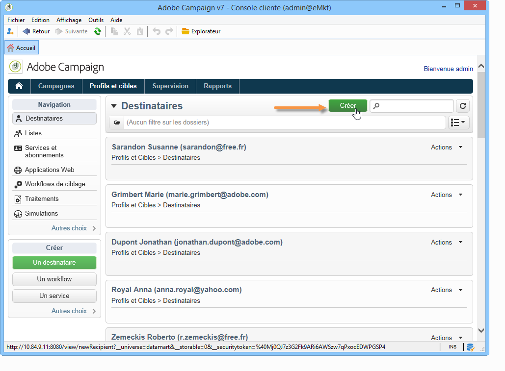

# Ajout de profils{#adding-profiles}

Dans la plupart des cas, les profils sont [importés dans Campaign par le biais d&#39;un workflow](../../platform/using/import-export-workflows.md). Vous pouvez toutefois ajouter un ou plusieurs destinataires directement depuis l&#39;interface, en cliquant sur le bouton **[!UICONTROL Créer]**. Ils seront alors ajoutés à la base de données.

Renseignez les informations de ce profil. Les onglets et les champs à compléter sont décrits dans la section [Editer un profil](../../platform/using/editing-a-profile.md).

Cliquez sur **[!UICONTROL Enregistrer]** pour valider la création du profil. Le profil est alors ajouté à la base de données Adobe Campaign.
