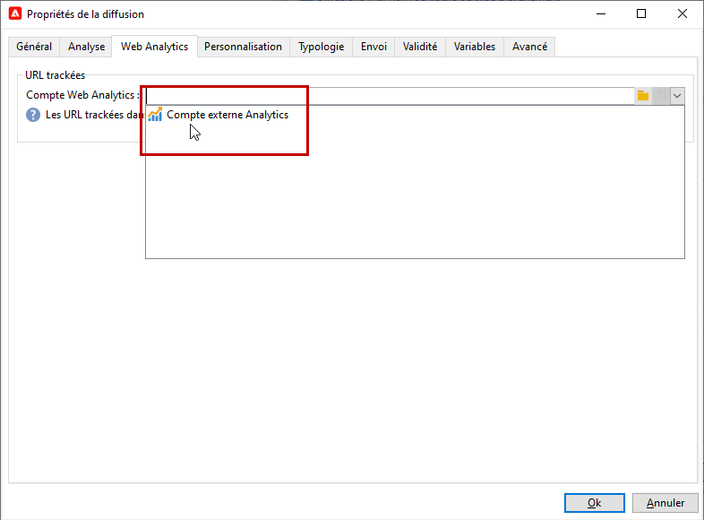

# Connecteur Adobe Analytics{#adobe-analytics-connector}

## À propos de l&#39;intégration du connecteur Adobe Analytics {#about-analytics-connector-integration}

Le connecteur Adobe Analytics permet à Adobe Campaign et Adobe Analytics d’interagir par le biais du package **[!UICONTROL Connecteurs Web Analytics]**. Il transmet des données à Adobe Campaign sous la forme de segments portant sur le comportement des utilisateurs et utilisatrices suite à une campagne. Réciproquement, il envoie des indicateurs et des attributs de campagnes diffusées par Adobe Campaign à Adobe Analytics.

>[!CAUTION]
>
>* Le connecteur Adobe Analytics n&#39;est pas compatible avec les messages transactionnels (Message Center).
>
>* Avant de commencer, assurez-vous que le système Adobe Identity Management (IMS) est implémenté dans Campaign. [En savoir plus dans cette page](../../integrations/using/about-adobe-id.md).

Avec le connecteur Adobe Analytics, Adobe Campaign peut mesurer l&#39;audience Internet (Web Analytics). Grâce à ces intégrations, Adobe Campaign peut récupérer des données sur le comportement des visiteurs pour un ou plusieurs sites à la suite d&#39;une campagne marketing. Après analyse, l&#39;application peut exécuter des campagnes de remarketing avec une vue pour les convertir en acheteurs. Réciproquement, les outils Web Analytics permettent à Adobe Campaign de transférer des indicateurs et des attributs de campagne à ses plateformes.

Les champs d&#39;action de chaque outil sont les suivants :

* Rôle du connecteur Web Analytics :

   1. marque les campagnes lancées avec Adobe Campaign,
   1. enregistre, sous forme de segments, le comportement des destinataires sur le site qu’ils ou elles ont parcouru après avoir cliqué sur la campagne. Les segments portent sur les produits abandonnés (consultés mais non ajoutés au panier ou achetés), les achats ou les abandons de panier.

* Rôle d&#39;Adobe Campaign :

   1. envoie les indicateurs et les attributs de la campagne vers le connecteur qui les transfère vers l&#39;outil de Web Analytics,
   1. récupère et analyse les segments,
   1. déclenche une campagne de remarketing.

## Configurer l&#39;intégration {#setting-up-the-integration}

>[!IMPORTANT]
>
> Pour les implémentations hybrides et on-premise, veillez à suivre les étapes d’approvisionnement décrites dans cette [page](../../platform/using/adobe-analytics-provisioning.md).

Pour installer le connecteur de données, vous devez vous connecter à votre instance Adobe Campaign et réaliser les opérations suivantes :

1. [Configuration des variables de conversion et des événements de succès](#configure-conversion-success)
1. [Configuration de votre compte externe dans Adobe Campaign Classic](#external-account-classic)

<!--
### Create your Report suite in Adobe Analytics {#report-suite-analytics}

To set up the Adobe Analytics/Adobe Campaign Classic integration, you must connect to your [!DNL Adobe Analytics] instance and perform the following operations:

1. From [!DNL Adobe Analytics], select the **[!UICONTROL Admin tab]** then click **[!UICONTROL All admin]**.

   

1. Click **[!UICONTROL Report suites]**.

   

1. From the **[!UICONTROL Report suite manager]** page, click **[!UICONTROL Create new]** then **[!UICONTROL Report suite]**.

   For the detailed procedure on **[!UICONTROL Report suite]** creation, refer to this [section](https://experienceleague.adobe.com/docs/analytics/admin/manage-report-suites/new-report-suite/t-create-a-report-suite.html#prerequisites).

   

1. Select a template. 

1. Configure your new report suite with the following information:

   * **[!UICONTROL Report Suite ID]**
   * **[!UICONTROL Site Title]**
   * **[!UICONTROL Time Zone]**
   * **[!UICONTROL Go Live Date]**
   * **[!UICONTROL Estimated Page Views Per Day]**

   

1. When configured, click **[!UICONTROL Create report suite]**.
-->

### Configuration des variables de conversion et des événements de succès {#configure-conversion-success}

Vous devez configurer vos **[!UICONTROL variables de conversion]** et **[!UICONTROL événements de succès]** comme suit :

1. Sélectionnez la **[!UICONTROL suite de rapports]** que vous souhaitez lier à Adobe Campaign.

1. À partir du bouton **[!UICONTROL Modifier les paramètres]**, sélectionnez **[!UICONTROL Conversion]** > **[!UICONTROL Variables de conversion]**.

   

1. Cliquez sur **[!UICONTROL Ajouter]** pour créer les identifiants nécessaires à la mesure de l’impact de la campagne, c’est-à-dire le nom interne de la campagne (cid) et l’identifiant de la table iNmsBroadlog (bid).

   Pour découvrir comment modifier les **[!UICONTROL variables de conversion]**, consultez cette [section](https://experienceleague.adobe.com/docs/analytics/admin/admin-tools/conversion-variables/t-conversion-variables-admin.html?lang=fr#admin-tools).

   

1. Cliquez sur **[!UICONTROL Enregistrer]** lorsque vous avez terminé.

1. Ensuite, pour créer vos **[!UICONTROL Événements de succès]**, sélectionnez **[!UICONTROL Conversion]** > **[!UICONTROL Événements de succès]** à partir du bouton **[!UICONTROL Modifier les paramètres]**.

   

1. Cliquez sur **[!UICONTROL Ajouter]** pour configurer les **[!UICONTROL événements de succès]** suivants :

   * **[!UICONTROL Ont cliqué]**
   * **[!UICONTROL Ayant ouvert]**
   * **[!UICONTROL Personnes ayant cliqué]**
   * **[!UICONTROL Traités]**
   * **[!UICONTROL Différés]**
   * **[!UICONTROL Envoyés]**
   * **[!UICONTROL Nombre total de rebonds]**
   * **[!UICONTROL Clics uniques]**
   * **[!UICONTROL Ouvertures uniques]**
   * **[!UICONTROL Désabonnement]**

   Pour découvrir comment configurer les **[!UICONTROL événements de succès]**, reportez-vous à cette [section](https://experienceleague.adobe.com/docs/analytics/admin/admin-tools/success-events/t-success-events.html?lang=fr#admin-tools)..

   >[!NOTE]
   >
   > Seuls les **[!UICONTROL événements de succès]** de type numérique sont pris en charge.

   

1. Cliquez sur **[!UICONTROL Enregistrer]** lorsque vous avez terminé.

Après avoir configuré vos **[!UICONTROL variables de conversion]** et **[!UICONTROL événements de succès]**, assurez-vous que les variables sont incluses dans le **[!UICONTROL profil de produit]** créé pour Analytics Connector. Voir à ce propos la section [Création d’un profil de produit Adobe Analytics](../../platform/using/adobe-analytics-provisioning.md#analytics-product-profile).

Vous devrez ensuite configurer les **[!UICONTROL comptes externes]** dans Adobe Campaign Classic.

### Configuration de votre compte externe dans Adobe Campaign Classic {#external-account-classic}

>[!IMPORTANT]
>
> Pour que cette intégration fonctionne, vous devez installer le package **[!UICONTROL Connecteurs Web Analytics]** dans Adobe Campaign.
>
>Pour plus d&#39;informations sur l&#39;installation de packages, consultez [cette page](../../installation/using/installing-campaign-standard-packages.md).

Vous devez maintenant configurer votre compte externe **[!UICONTROL Web Analytics]** dans Adobe Campaign pour activer la synchronisation entre les deux solutions.

Veuillez noter que si l&#39;une de vos **[!UICONTROL suites de rapports]**, **[!UICONTROL variables de conversion]** ou **[!UICONTROL événements de succès]** n&#39;est pas visible lors de la configuration de votre compte externe, cela signifie que vous ne disposez pas d&#39;une autorisation pour ce nouveau composant dans le **[!UICONTROL profil de produit]** associé à l&#39;utilisateur.

Pour plus d’informations, consultez la page [Profils de produit pour Adobe Analytics](https://experienceleague.adobe.com/docs/analytics/admin/admin-console/permissions/product-profile.html?lang=fr#product-profile-admins).

1. Dans l&#39;arborescence Adobe Campaign, accédez au dossier **[!UICONTROL Administration**[!UICONTROL  > ]**Plateforme**[!UICONTROL  > ]**Comptes externes]** et cliquez sur le bouton **[!UICONTROL Nouveau]**.

   

1. Utilisez la liste déroulante pour sélectionner le type **[!UICONTROL Web Analytics]** et **[!UICONTROL Adobe Analytics]** dans la liste déroulante **[!UICONTROL Intégration]**.

   

1. Cliquez sur **[!UICONTROL Configurer]** en regard de la liste déroulante **[!UICONTROL Intégration]**.

1. Dans la fenêtre **[!UICONTROL Configurer l’intégration Analytics]**, mappez votre compte externe à la suite de rapports en fournissant les informations suivantes :

   * **[!UICONTROL E-mail]**
   * **[!UICONTROL Org. IMS]**
   * **[!UICONTROL Société Analytics]**
   * **[!UICONTROL Suite de rapports]**

1. Dans la catégorie **[!UICONTROL eVars]**, mappez les deux **[!UICONTROL variables de conversion]** configurées dans [!DNL Adobe Analytics].

   

1. Dans la catégorie **[!UICONTROL Événements]**, mappez les dix **[!UICONTROL événements de succès]** configurés dans [!DNL Adobe Analytics].

1. Cliquez sur **[!UICONTROL Soumettre]** lorsque vous avez terminé. Adobe Campaign va créer une **[!UICONTROL source de données]**, des **[!UICONTROL mesures calculées]**, des **[!UICONTROL segments de remarketing]** et des **[!UICONTROL classifications]** dans la **[!UICONTROL suite de rapports]** mappée.

   Une fois cette synchronisation entre [!DNL Adobe Analytics] et Adobe Campaign effectuée, vous pouvez fermer la fenêtre.

1. Les paramètres sont visibles dans l&#39;onglet **[!UICONTROL Paramètres des données]** de la fenêtre **[!UICONTROL Configurer l&#39;intégration d&#39;Analytics]**.

   À l&#39;aide du bouton **[!UICONTROL Synchroniser]**, [!DNL Adobe Campaign] synchronise les modifications de nom effectuées dans [!DNL Adobe Analytics]. Si le composant est supprimé dans [!DNL Adobe Analytics], il est barré dans [!DNL Adobe Campaign] ou affiché avec le message **introuvable**.

   

1. Si nécessaire, vous pouvez ajouter ou supprimer des segments de l&#39;onglet **[!UICONTROL Mettre à jour les segments]**.

1. Depuis votre **[!UICONTROL compte externe]**, cliquez sur le lien **[!UICONTROL Enrichir la formule...]** pour modifier la formule de calcul des URL afin de spécifier les informations d&#39;intégration pour l&#39;outil de Web Analytics (soit les identifiants de campagne) et les domaines des sites dont l&#39;activité doit faire l&#39;objet d&#39;un tracking.

   

1. Indiquez le ou les noms de domaine des sites.

   

1. Cliquez sur **[!UICONTROL Suivant]** et vérifiez que les noms de domaines ont bien été enregistrés.

   

1. Au besoin, vous pouvez surcharger la formule de calcul. Pour cela, cochez la case et modifiez la formule directement dans la fenêtre.

   >[!IMPORTANT]
   >
   >Ce type de paramétrage s’adresse à des utilisateurs et utilisatrices experts : toute erreur dans cette formule risque de bloquer les diffusions.

1. L&#39;onglet **[!UICONTROL Avancé]** vous permet de modifier des paramètres plus techniques.

   * **[!UICONTROL Durée de vie]** : permet de définir un délai (en jours) après lequel les événements web récupérés dans Adobe Campaign par les workflows techniques. Par défaut : 180 jours.
   * **[!UICONTROL Persistance]** : permet de définir la période pendant laquelle tout événement web (un achat, par exemple) peut être attribué à une campagne de remarketing. Par défaut : 7 jours.

>[!NOTE]
>
>Si vous utilisez plusieurs outils de mesure d&#39;audience, vous pouvez sélectionner la valeur **[!UICONTROL Autre]** dans la liste déroulante **[!UICONTROL Partenaire]** lors de la création du compte externe. Un seul compte externe peut être référencé dans les propriétés des diffusions : vous devrez donc adapter la formule des URL suivies en ajoutant les paramètres attendus par Adobe ou tout autre outil de mesure utilisé.

### Workflows techniques des processus Web Analytics {#technical-workflows-of-web-analytics-processes}

L&#39;échange des données entre Adobe Campaign et Adobe Analytics est géré par quatre workflows techniques qui s&#39;exécutent en tâche de fond.

Ils sont accessibles dans l&#39;arborescence Adobe Campaign au niveau du dossier **[!UICONTROL Administration]** > **[!UICONTROL Exploitation]** > **[!UICONTROL Workflows techniques]** > **[!UICONTROL Processus Web Analytics]**.

* **[!UICONTROL Récupération des événements web]** : toutes les heures, ce workflow télécharge les segments portant sur le comportement des internautes sur un site donné, les inclut dans la base de données Adobe Campaign et lance le workflow de remarketing.
* **[!UICONTROL Purge des événements]** : ce workflow permet de supprimer de la base tous les événements selon la période paramétrée dans le champ **[!UICONTROL Durée de vie]**. Pour plus d&#39;informations, consultez la section [Configuration de votre compte externe dans Adobe Campaign Classic](#external-account-classic).
* **[!UICONTROL Identification des contacts convertis]** : répertorie les visiteurs du site ayant concrétisé leur achat après une campagne de remarketing. Les données récupérées par ce workflow sont accessibles dans le rapport **[!UICONTROL Efficacité du remarketing]**, voir cette [page](#creating-a-re-marketing-campaign).
* **[!UICONTROL Envoi des indicateurs et des attributs de campagne]** : permet d’envoyer les indicateurs des campagnes depuis Adobe Campaign vers Adobe Experience Cloud via le connecteur Adobe Analytics. Ce workflow est déclenché à 4 heures du matin tous les jours et peut prendre 24 heures pour que les données soient envoyées à Analytics.

   Veuillez noter que ce workflow ne devrait pas être redémarré. Dans le cas contraire, il renverrait toutes les données précédentes, ce qui peut fausser les résultats d&#39;Analytics.

   Les indicateurs concernés sont les suivants :

   * **[!UICONTROL Messages à envoyer]** (@toDeliver)
   * **[!UICONTROL Traités]** (@processed)
   * **[!UICONTROL Succès]** (@success)
   * **[!UICONTROL Nombre total d&#39;ouvertures]** (@totalRecipientOpen)
   * **[!UICONTROL Destinataires ayant ouvert]** (@recipientOpen)
   * **[!UICONTROL Nombre total de destinataires ayant cliqué]** (@totalRecipientClick)
   * **[!UICONTROL Personnes ayant cliqué]** (@personClick)
   * **[!UICONTROL Nombre de clics distincts]** (@recipientClick)
   * **[!UICONTROL Désinscription (opt-out)]** (@optOut)
   * **[!UICONTROL Erreurs]** (@error)

   >[!NOTE]
   >
   >Les données envoyées correspondent au delta basé sur la dernière prise de photo, ce qui peut générer une valeur négative dans les données de mesure.

   Les attributs envoyés sont les suivants :

   * **[!UICONTROL Nom interne]** (@internalName)
   * **[!UICONTROL Libellé]** (@label)
   * **[!UICONTROL Libellé]** (operation/@label) : uniquement si le package **Campaign** est installé
   * **[!UICONTROL Nature]** (operation/@nature) : uniquement si le package **Campaign** est installé
   * **[!UICONTROL Tag 1]** (webAnalytics/@tag1)
   * **[!UICONTROL Tag 2]** (webAnalytics/@tag2)
   * **[!UICONTROL Tag 3]** (webAnalytics/@tag3)
   * **[!UICONTROL Date de contact]** (scheduling/@contactDate)

## Tracking des diffusions dans Adobe Campaign {#tracking-deliveries-in-adobe-campaign}

Afin qu&#39;Adobe Experience Cloud puisse suivre l&#39;activité sur les sites après l&#39;envoi de diffusions par Adobe Campaign, il est nécessaire de référencer le connecteur correspondant dans les propriétés de la diffusion. Pour cela, procédez comme suit :

1. Ouvrez la diffusion de la campagne destinée à être suivie.

   

1. Ouvrez les propriétés de la diffusion.
1. Dans l&#39;onglet **[!UICONTROL Web Analytics]**, sélectionnez le compte externe créé précédemment. Voir [Configuration de votre compte externe dans Adobe Campaign Classic](#external-account-classic).

   

1. Vous pouvez maintenant envoyer votre diffusion et accéder au rapport correspondant dans Adobe Analytics.

## Créer une opération de remarketing {#creating-a-re-marketing-campaign}

Pour préparer votre campagne de remarketing, vous devez créer des modèles de diffusion qui seront ensuite utilisés dans les opérations de type remarketing. Vous devez ensuite paramétrer votre opération de remarketing et lui associer un segment. A chaque segment doit correspondre une opération de remarketing différente.

Les campagnes de remarketing sont automatiquement lancées lorsque Adobe Campaign a récupéré les données analysant le comportement des personnes ciblées par la campagne initiale. En cas d&#39;abandon de panier ou de visualisation de produits sans achat, une diffusion est envoyée aux personnes concernées afin que leur navigation sur le site débouche sur un achat.

Adobe Campaign met à votre disposition des modèles de diffusion personnalisés que vous pouvez utiliser ou dont vous pouvez vous inspirer pour préparer vos campagnes.

1. Dans l&#39;**[!UICONTROL Explorateur]**, accédez au dossier **[!UICONTROL Ressources]** > **[!UICONTROL Modèles]** > **[!UICONTROL Modèles de diffusion]** de l&#39;arborescence Adobe Campaign.

1. Dupliquez le modèle **[!UICONTROL Diffuser par email (remarketing)]** ou les exemples de modèles de remarketing proposés par Adobe Campaign.

   

1. Personnalisez le modèle selon vos besoins, puis enregistrez-le.

1. Créez une opération et sélectionnez le modèle **[!UICONTROL Opération de remarketing]** dans la liste déroulante.

   

1. Cliquez sur le lien **[!UICONTROL Paramétrer...]** pour indiquer le segment et le modèle de diffusion associé à l&#39;opération.

1. Sélectionnez le compte externe paramétré précédemment.

   

1. Sélectionnez le segment concerné.

   

1. Sélectionnez le modèle de diffusion à utiliser pour cette opération de remarketing, puis cliquez sur **[!UICONTROL Terminer]** pour fermer la fenêtre.

   

1. Cliquez sur **[!UICONTROL OK]** pour fermer la fenêtre de l&#39;opération.

Le rapport **[!UICONTROL Efficacité du remarketing]** est accessible depuis la page des rapports globaux. Il permet de visualiser le nombre de contacts convertis (ayant réalisés un achat) par rapport aux abandons de panier suite à la campagne de remarketing d&#39;Adobe Campaign. Le taux de conversion est calculé sur les 7 ou 30 derniers jours ou depuis le début de la synchronisation entre Adobe Campaign et les outils de Web Analytics.

