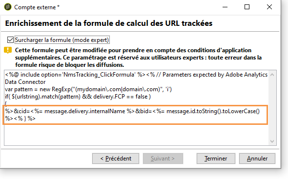
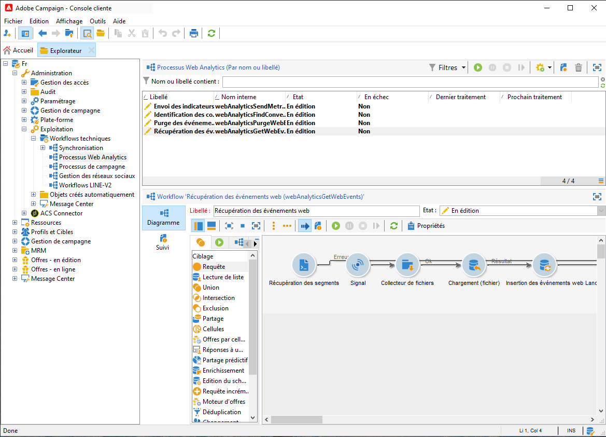
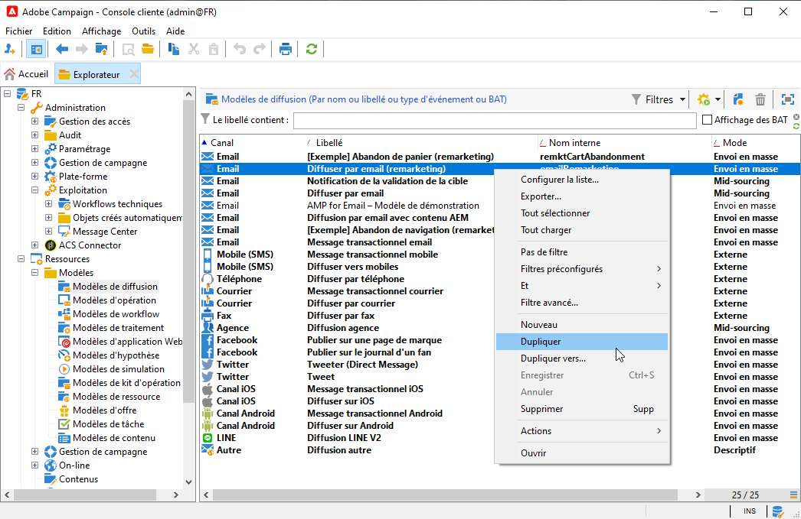
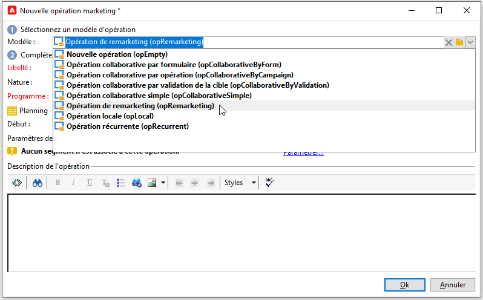

# Adobe Analytics Data Connector{#adobe-analytics-data-connector-legacy}

>[!IMPORTANT]
>
>Adobe Analytics Data Connector est désormais obsolète. Les fonctionnalités obsolètes sont toujours disponibles, mais elles ne seront ni améliorées ni prises en charge. En savoir plus [sur cette page](../../rn/using/deprecated-features.md).

## À propos de l&#39;intégration de Data Connector {#about-data-connector-integration}

>[!IMPORTANT]
>
>Le connecteur de données Adobe Analytics n’est pas compatible avec les messages transactionnels (Message Center).

Le connecteur de données (anciennement appelé Adobe Genesis) permet de faire interagir Adobe Campaign et Adobe Analytics par l’intermédiaire du package **Connecteurs Web Analytics**. Il transmet des données à Adobe Campaign sous forme de segments portant sur le comportement des internautes, suite à une campagne email. Inversement, il envoie les indicateurs et les attributs des campagnes email lancées par Adobe Campaign vers Adobe Analytics - Connecteur de données.

Adobe Campaign dispose d&#39;une fonctionnalité de mesure d&#39;audience sur Internet (Web Analytics) via le connecteur de données. Grâce à ces intégrations, Adobe Campaign est en mesure de récupérer les données concernant le comportement des visiteurs sur un ou plusieurs sites suite à une campagne marketing et, après analyse, de lancer une campagne dite de remarketing pour les convertir en acheteurs. Inversement, les outils de Web analytics permettent à Adobe Campaign de transmettre les indicateurs et les attributs des campagnes vers leur plateforme.

Les champs d&#39;action de chaque outil sont les suivants :

* Rôle du connecteur Web Analytics :

   1. marque les campagnes email lancées avec Adobe Campaign,
   1. enregistre, sous forme de segments, les comportements des destinataires sur le site où ils se sont rendus après avoir cliqué sur les liens contenus dans l&#39;email de la campagne. Les segments portent sur les produits abandonnés (consultés sur le site mais qui ne sont ni mis dans le panier, ni achetés), les achats ou les abandons de panier.

* Rôle d&#39;Adobe Campaign :

   1. envoie les indicateurs et les attributs de la campagne vers le connecteur qui les transfère vers l&#39;outil de Web Analytics,
   1. récupère et analyse les segments,
   1. déclenche une campagne de remarketing.

## Configurer l&#39;intégration {#setting-up-the-integration}

Pour installer le connecteur de données, vous devez vous connecter à votre instance Adobe Campaign et réaliser les opérations suivantes :

* [Etape 1 : paramétrer l&#39;intégration dans Analytics](#step-1--configure-integration-in-analytics)
* [Etape 2 : créer le compte externe dans Campaign](#step-2--create-the-external-account-in-campaign)
* [Étape 3 : synchroniser Adobe Campaign et Adobe Analytics](#step-3--synchronize-adobe-campaign-and-adobe-analytics)

### Etape 1 : paramétrer l&#39;intégration dans Analytics {#step-1--configure-integration-in-analytics}

Les étapes suivantes décrivent le paramétrage du connecteur de données via un assistant.

1. Connectez-vous à Adobe Experience Cloud à l’aide d’un Adobe ID ou d’un Enterprise ID.

   

1. Dans la liste des solutions Experience Cloud, sélectionnez **[!UICONTROL Analytics]**.

   

1. Dans l&#39;onglet **[!UICONTROL Admin]**, sélectionnez **[!UICONTROL Data Connectors]**.

   Pour accéder au menu **[!UICONTROL Data Connectors]**, vous devez disposer des autorisations ci-après pour les outils Analytics. Voir à ce propos [cette page](https://experienceleague.adobe.com/docs/analytics/admin/admin-console/permissions/analytics-tools.html?lang=fr)
   * Intégrations (créer)
   * Intégrations (mettre à jour)
   * Intégrations (supprimer)

   

1. Dans la liste des partenaires, sélectionnez **[!UICONTROL Adobe Campaign Classic]**.

   

1. Dans la boîte de dialogue **[!UICONTROL Ajouter une intégration]**, cliquez sur **[!UICONTROL Activer]**.
1. Cochez la case **[!UICONTROL I accept these terms and conditions]**, sélectionnez la **[!UICONTROL suite de rapports]** associée à cette intégration et saisissez le libellé du connecteur.

   Lorsque vous avez terminé, cliquez sur **[!UICONTROL Créer et configurer cette intégration]**.

   

1. Saisissez l’adresse email qui recevra les notifications de la part du connecteur, puis copiez l’**[!UICONTROL identifiant du compte]** tel qu’il apparaît dans le compte externe Adobe Campaign (voir à ce sujet la section [Etape 2 : créer le compte externe dans Campaign](#step-2--create-the-external-account-in-campaign)).

   

1. Indiquez ensuite les identifiants qui vont permettre de mesurer l&#39;impact de la campagne email, soit le nom interne de la campagne (cid) et l’identifiant de la table iNmsBroadlog (bid). Indiquez également les indicateurs des événements à collecter.
Assurez-vous que les **[!UICONTROL Événements]** sont de type numérique, faute de quoi ils n’apparaîtront pas dans le menu déroulant.

   

1. Si besoin est, définissez des segments personnalisés.

   

1. Dans **[!UICONTROL Data collection]**, choisissez la méthode pour récupérer les données, en l&#39;occurrence les identifiants **[!UICONTROL cid]** et **[!UICONTROL bid]** définis à l&#39;étape 6.

   

1. Sélectionnez les informations à afficher dans le tableau de bord.

   

1. Vérifiez le paramétrage dans la page résumant les étapes précédentes.

   

1. Cliquez sur **[!UICONTROL Activate Now]** pour valider le paramétrage et activer le connecteur.

   

   Le connecteur de données est maintenant paramétré.

### Etape 2 : créer le compte externe dans Campaign {#step-2--create-the-external-account-in-campaign}

L’intégration d’Adobe Campaign aux plateformes d’Analytics se fait par l’intermédiaire d’un connecteur. Pour synchroniser les deux applications, vous devez :

1. Installer le package **Connecteurs Web Analytics** dans Adobe Campaign.
1. Positionnez-vous dans l&#39;arborescence Adobe Campaign au niveau du dossier **[!UICONTROL Administration > Plateforme > Comptes externes]**,
1. Cliquez avec le bouton droit de la souris dans la liste des comptes externes et sélectionnez **[!UICONTROL Nouveau]** dans le menu contextuel (vous pouvez également cliquer sur le bouton **[!UICONTROL Nouveau]** situé au-dessus de la liste des comptes externes).
1. A l&#39;aide de la liste déroulante, sélectionnez le type **[!UICONTROL Web Analytics]**.
1. Choisissez le fournisseur du connecteur, par exemple ici **[!UICONTROL Adobe Analytics - Connecteur de données]**.

   

1. Cliquez sur le lien **[!UICONTROL Enrichir la formule...]** pour modifier la formule de calcul des URL afin de spécifier les informations d&#39;intégration pour l&#39;outil de Web Analytics (soit les identifiants de campagne) et les domaines des sites dont l&#39;activité doit faire l&#39;objet d&#39;un tracking.
1. Indiquez le ou les noms de domaine des sites.

   

1. Cliquez sur **[!UICONTROL Suivant]** et vérifiez que les noms de domaines ont bien été enregistrés.

   

1. Au besoin, vous devez surcharger la formule de calcul. Pour cela, cochez la case et modifiez la formule directement dans la fenêtre.

   

   >[!IMPORTANT]
   >
   >Ce type de paramétrage s&#39;adresse à des utilisateurs experts : toute erreur dans cette formule risque de bloquer l&#39;envoi des emails.

1. L&#39;onglet **[!UICONTROL Avancé]** vous permet de modifier des paramètres plus techniques.

   * **[!UICONTROL Durée de vie]** : permet de définir un délai (en jours) après lequel les événements web récupérés dans Adobe Campaign par les workflows techniques. Par défaut : 180 jours.
   * **[!UICONTROL Persistance]**: permet de définir la période pendant laquelle tous les événements web (un achat par exemple) peuvent être attribués à une opération de remarketing. Par défaut : 7 jours.

>[!NOTE]
>
>Si vous utilisez plusieurs outils de mesure d&#39;audience, vous pouvez sélectionner la valeur **[!UICONTROL Autre]** dans la liste déroulante **[!UICONTROL Partenaire]** lors de la création du compte externe. Un seul compte externe peut être référencé dans les propriétés des diffusions : vous devrez donc adapter la formule des URL suivies en ajoutant les paramètres attendus par Adobe ou tout autre outil de mesure utilisé.

### Étape 3 : synchroniser Adobe Campaign et Adobe Analytics {#step-3--synchronize-adobe-campaign-and-adobe-analytics}

Après avoir créé le compte externe, vous devez synchroniser les deux applications.

1. Accédez au compte externe créé à l&#39;étape précédente.
1. Modifiez le **[!UICONTROL libellé]** du compte si nécessaire.
1. Modifiez le **[!UICONTROL nom interne]** afin qu&#39;il corresponde au **[!UICONTROL nom]** choisi lors de la configuration du connecteur de données.

   

1. Cliquez sur le lien **[!UICONTROL Valider la connexion]**.

   

   Assurez-vous que le **[!UICONTROL nom interne]** correspond bien au **[!UICONTROL nom]** spécifié dans l&#39;assistant de configuration du connecteur de données.

1. Saisissez l&#39;**[!UICONTROL Account ID]** dans l&#39;assistant de configuration du connecteur de données.

   

1. Suivez les étapes du guide d&#39;assistant du connecteur de données, puis revenez vers le compte externe dans Adobe Campaign.
1. Cliquez sur **[!UICONTROL Suivant]** pour que l&#39;échange de données entre Adobe Campaign et Adobe Analytics - connecteur de données soit effectif.

   Une fois la synchronisation terminée, la liste des segments s&#39;affiche.

   

Lorsque la synchronisation des données entre Adobe Campaign et Adobe Analytics - connecteur de données est effective, les trois segments par défaut définis dans l&#39;assistant du connecteur de données sont récupérés par Adobe Campaign et deviennent accessibles depuis l&#39;onglet **[!UICONTROL Segments]** du compte externe d&#39;Adobe Campaign.

Si des segments supplémentaires ont été paramétrés dans l&#39;assistant du connecteur de données, vous pouvez les ajouter dans Adobe Campaign. Pour cela, cliquez sur le lien **[!UICONTROL Mettre à jour la liste des segments...]** et exécutez les étapes de l&#39;assistant du compte externe. Une fois l&#39;opération effectuée, les nouveaux segments s&#39;affichent dans la liste.

### Workflows techniques des processus Web Analytics {#technical-workflows-of-web-analytics-processes}

L&#39;échange des données entre Adobe Campaign et Adobe Analytics - Data Connector est géré par quatre workflows techniques qui s&#39;exécutent en tâche de fond.

Ils sont accessibles dans l&#39;arborescence Adobe Campaign au niveau du dossier **[!UICONTROL Administration > Exploitation > Workflows techniques > Processus Web Analytics]**.

* **[!UICONTROL Récupération des événements web]** : toutes les heures, ce workflow télécharge les segments portant sur le comportement des internautes sur un site donné, les inclut dans la base de données Adobe Campaign et lance le workflow de remarketing.
* **[!UICONTROL Purge des événements]** : ce workflow permet de supprimer de la base tous les événements selon la période paramétrée dans le champ **[!UICONTROL Durée de vie]**. Pour plus d’informations à ce sujet, reportez-vous à la section [Etape 2 : créer le compte externe dans Campaign](#step-2--create-the-external-account-in-campaign).
* **[!UICONTROL Identification des contacts convertis]** : répertorie les visiteurs du site ayant concrétisé leur achat après une campagne de remarketing. Les données récupérées par ce workflow sont accessibles dans le rapport **[!UICONTROL Efficacité du remarketing]**, voir cette [page](#creating-a-re-marketing-campaign).
* **[!UICONTROL Envoi des indicateurs et attributs de campagne]** : permet d’envoyer les indicateurs des campagnes email depuis Adobe Campaign vers Adobe Experience Cloud via Adobe Analytics - Connecteur de données. Ce workflow est déclenché à 4 heures du matin tous les jours et peut prendre 24 heures pour que les données soient envoyées à Analytics.

   Veuillez noter que ce workflow ne devrait pas être redémarré. Dans le cas contraire, il renverrait toutes les données précédentes, ce qui peut fausser les résultats d&#39;Analytics.

   Les indicateurs concernés sont les suivants :

   * **[!UICONTROL Messages à envoyer]** (@toDeliver)
   * **[!UICONTROL Traités]** (@processed)
   * **[!UICONTROL Succès]** (@success)
   * **[!UICONTROL Nombre total d&#39;ouvertures]** (@totalRecipientOpen)
   * **[!UICONTROL Destinataires ayant ouvert]** (@recipientOpen)
   * **[!UICONTROL Nombre total de destinataires ayant cliqué]** (@totalRecipientClick)
   * **[!UICONTROL Personnes ayant cliqué]** (@personClick)
   * **[!UICONTROL Nombre de clics distincts]** (@recipientClick)
   * **[!UICONTROL Désinscription (opt-out)]** (@optOut)
   * **[!UICONTROL Erreurs]** (@error)

   >[!NOTE]
   >
   >Les données envoyées correspondent au delta basé sur la dernière prise de photo, ce qui peut générer une valeur négative dans les données de mesure.

   Les attributs envoyés sont les suivants :

   * **[!UICONTROL Nom interne]** (@internalName)
   * **[!UICONTROL Libellé]** (@label)
   * **[!UICONTROL Libellé]** (operation/@label) : uniquement si le package **Campaign** est installé
   * **[!UICONTROL Nature]** (operation/@nature) : uniquement si le package **Campaign** est installé
   * **[!UICONTROL Tag 1]** (webAnalytics/@tag1)
   * **[!UICONTROL Tag 2]** (webAnalytics/@tag2)
   * **[!UICONTROL Tag 3]** (webAnalytics/@tag3)
   * **[!UICONTROL Date de contact]** (scheduling/@contactDate)

## Tracking des diffusions dans Adobe Campaign {#tracking-deliveries-in-adobe-campaign}

Afin qu&#39;Adobe Experience Cloud puisse suivre l&#39;activité sur les sites après l&#39;envoi de diffusions par Adobe Campaign, il est nécessaire de référencer le connecteur correspondant dans les propriétés de la diffusion. Pour cela, procédez comme suit :

1. Ouvrez la diffusion de la campagne destinée à être suivie.

   

1. Ouvrez les propriétés de la diffusion.
1. Dans l&#39;onglet **[!UICONTROL Web Analytics]**, sélectionnez le compte externe créé précédemment. Pour plus d&#39;informations, consultez la section [Étape 2 : créer le compte externe dans Campaign](#step-2--create-the-external-account-in-campaign).

   

1. Vous pouvez maintenant envoyer votre diffusion et accéder au rapport correspondant dans Adobe Analytics.

## Créer une opération de remarketing {#creating-a-re-marketing-campaign}

Pour préparer votre campagne de remarketing, vous devez créer des modèles de diffusion qui seront ensuite utilisés dans les opérations de type remarketing. Vous devez ensuite paramétrer votre opération de remarketing et lui associer un segment. A chaque segment doit correspondre une opération de remarketing différente.

Les campagnes de remarketing sont automatiquement lancées lorsque Adobe Campaign a récupéré les données analysant le comportement des personnes ciblées par la campagne initiale. En cas d&#39;abandon de panier ou de visualisation de produits sans achat, une diffusion est envoyée aux personnes concernées afin que leur navigation sur le site débouche sur un achat.

Adobe Campaign met à votre disposition des modèles de diffusion personnalisés que vous pouvez utiliser ou dont vous pouvez vous inspirer pour préparer vos campagnes.

1. Dans l&#39;**[!UICONTROL Explorateur]**, accédez au dossier **[!UICONTROL Ressources > Modèles > Modèles de diffusion]** de l&#39;arborescence Adobe Campaign.
1. Dupliquez le modèle **[!UICONTROL Diffuser par email (remarketing)]** ou les exemples de modèles de remarketing proposés par Adobe Campaign.
1. Personnalisez le modèle selon vos besoins, puis enregistrez-le.

   

1. Créez une opération et sélectionnez le modèle **[!UICONTROL Opération de remarketing]** dans la liste déroulante.

   

1. Cliquez sur le lien **[!UICONTROL Paramétrer...]** pour indiquer le segment et le modèle de diffusion associé à l&#39;opération.
1. Sélectionnez le compte externe paramétré précédemment.

   

1. Sélectionnez le segment concerné.

   

1. Sélectionnez le modèle de diffusion à utiliser pour cette opération de remarketing, puis cliquez sur **[!UICONTROL Terminer]** pour fermer la fenêtre.

   

1. Cliquez sur **[!UICONTROL OK]** pour fermer la fenêtre de l&#39;opération.

Le rapport **[!UICONTROL Efficacité du remarketing]** est accessible depuis la page des rapports globaux. Il permet de visualiser le nombre de contacts convertis (ayant réalisés un achat) par rapport aux abandons de panier suite à la campagne de remarketing d&#39;Adobe Campaign. Le taux de conversion est calculé sur les 7 ou 30 derniers jours ou depuis le début de la synchronisation entre Adobe Campaign et les outils de Web Analytics.

